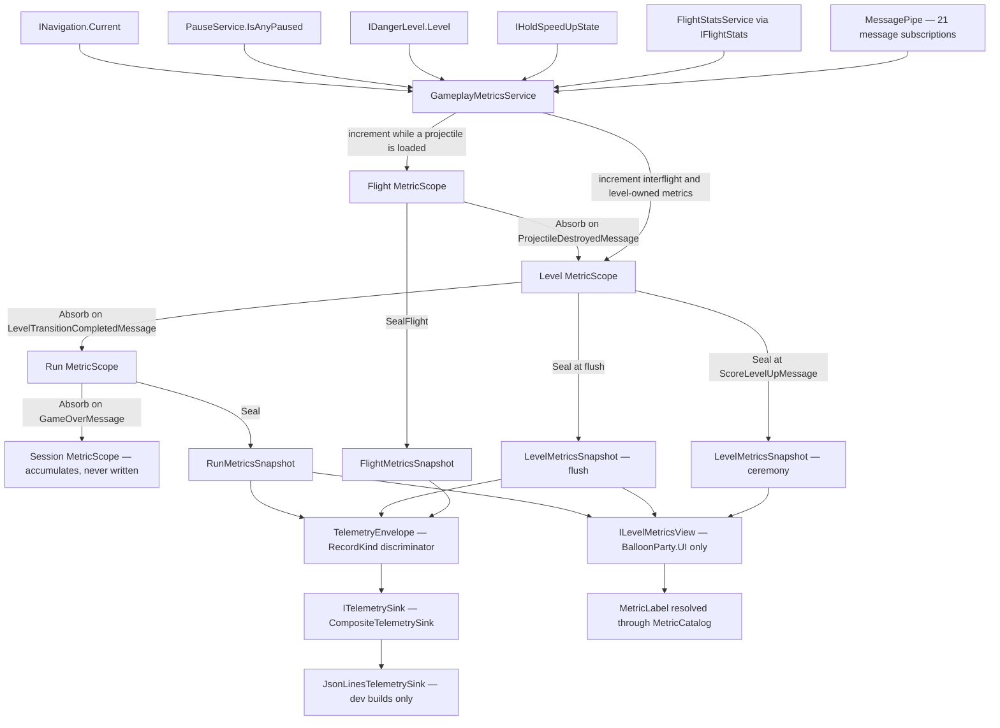
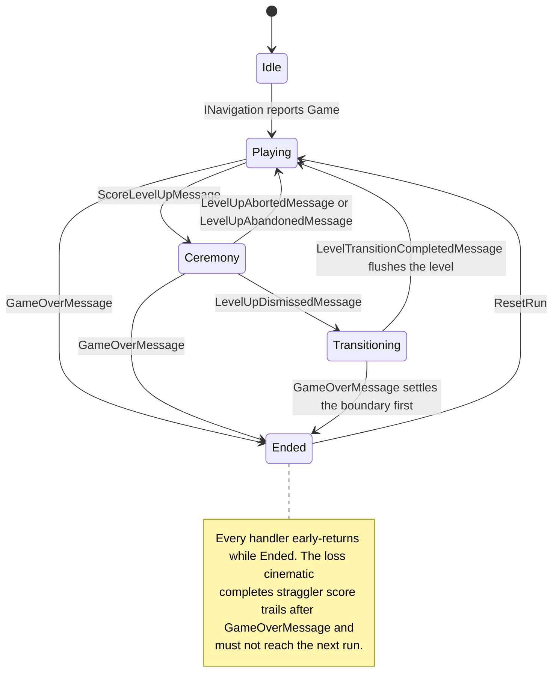

# Telemetry

Gameplay metrics. Counts what happens during play at four nested scopes —
**Session ⊃ Run ⊃ Level ⊃ Flight** — and serves those counts to three consumers: the
level-up and game-over popups, an external analytics export, and balance analysis.

The service never publishes, never modifies gameplay state, and never causes stutters
during action — it only counts. Views read immutable snapshots; they never see a live
accumulator.

> **Everything here is built and in use** — the vocabulary and scopes, the
> envelope/serializer/sink layer, `GameplayMetricsService`, and the catalog-driven metric
> labels in `UI/Telemetry/` that render it. Two sanctioned non-message touches live outside
> this folder: `CheatState.AnyCheatUsed` and `IHoldSpeedUpState` on `HoldSpeedUpController`.
>
> **Not built:** `ConsentGateSink`, `BatchingTelemetrySink` and `HttpAnalyticsSink` — those
> rows below are the target layout, not current code, and are out of scope until a consent
> policy and an analytics provider are chosen. Nothing shipping needs them; the local
> JSON Lines log covers balance work today.
>
> EditMode coverage lives in `Assets/Tests/EditMode/Game/` and `.../UI/`, including the test
> fake `RecordingTelemetrySink` and the shared `GameplayMetricsHarness`.



The picture says in one look what the prose above takes three paragraphs to say: `SC` (the ceremony
snapshot) has no arrow into `Env` — it feeds the popup and nothing else, and is never exported.

## Contents

| File | What it does |
|---|---|
| `MetricId` / `TimerId` / `MetricAxis` / `MetricScopeKind` | The vocabulary — counters, clocks, dimension axes (color, balloon type, item type), and the four nested scope kinds. Append-only once shipped |
| `MetricCatalog` | Static table: metric id → wire name, unit, fold rule (`Sum`/`Max`/`Last`), scope (`Flight`/`Level`/`Run`) and dimension axes. The single browsable list of what the game measures; also owns the dense `AxisSlot` assignment for `(MetricId, MetricAxis)` pairs, and asserts (at static init) that `BalloonType`, `ItemType`, `MetricAxis` are contiguous from zero and that `MetricScopeKind` stays ordered `Flight < Level < Run < Session` |
| `TimerCatalog` | Static table: timer id → wire name, unit. Kept separate from `MetricCatalog` because a timer has no `FoldRule`, `Scope` or `MetricAxis` — `Absorb` never folds timers (see *Every scope runs its own clocks* below) |
| `AxisBucketNaming` | Bucket ↔ name for the three axes, in one place: palette colour names plus a trailing `other`, and the two enums by ordinal. `TelemetryEnvelopeSerializer` needs the forward direction for the wire, `MetricValueResolver` (`UI/Telemetry/`) needs the inverse because a label's binding stores a colour by **name**. Two copies would drift, and the symptom would be a label disagreeing with the exported column |
| `AxisSlot` / `AxisSlotInfo` | A dense index into `MetricSet`'s per-slot axis storage, and the catalog row describing it. One slot per `(MetricId, MetricAxis)` pair — not one array per axis kind — so metrics that share an axis kind (e.g. `Pops` and `Deflects`, both `BalloonType`) never alias the same table |
| `MetricSet` / `IReadOnlyMetricSet` | Dense `int[]` counters plus one `int[]` per declared `AxisSlot`. Allocation-free increments. `IReadOnlyMetricSet` is a read-only *view*, not an immutability guarantee — `MetricScope.Metrics` is the one legitimate place a live view belongs |
| `ISealedMetrics` | The envelope's actual contract: `IReadOnlyMetricSet` plus `this[TimerId]`, implemented only by the two snapshots — never by `MetricSet` — so a reference typed as `ISealedMetrics` really is immutable |
| `MetricScope` / `MetricScopeState` | One scope's metric set and timers, with `Seal()` (immutable snapshot) and `Reset()` (reuse without reallocation). Four instances, built only through `MetricScope.Create`. `Absorb` requires its argument to be exactly one scope below (rejects itself, a sibling, or a non-adjacent scope); `Seal(int, bool)`/`Seal()` each validate the scope they run on |
| `TelemetryStopwatch` | Pure C# timer that owns its injected `Func<float>` clock and folds elapsed time on `Pause()`/`Resume()`/`Elapsed` reads. Deterministic in tests via a fake clock |
| `MetricsSnapshotBase` / `FlightMetricsSnapshot` / `LevelMetricsSnapshot` / `RunMetricsSnapshot` | Sealed immutable read surfaces implementing `ISealedMetrics` — what the popups render and what the sink receives. The shared payload (counters, timers, axis slots, named breakdowns) lives once in the base; `LevelMetricsSnapshot` adds only `LevelIndex`/`Completed`, and `FlightMetricsSnapshot` only `FlightIndex` |
| `ColorCount` / `BalloonTypeCount` / `ItemActivationCount` | The breakdown shapes the snapshots expose (`PopsByColor`, `PointsByColor`, `PopsByBalloonType`, `DeflectsByBalloonType`, `ItemsActivated`) |
| `ILevelMetricsView` | The UI read seam. All three members (ceremony snapshot, last flushed level, run) are `IReadOnlyReactiveProperty` — each is assigned from inside a message handler, so a plain property read from a view's own handler for the same message would return the previous value whenever that view subscribed first. **Only `BalloonParty.UI.*` types may inject it** |
| `GameplayMetricsService` | Entry point (`IStartable`, `IDisposable`, `IRunResettable`). Five-state level machine (Idle/Playing/Ceremony/Transitioning/Ended); routes subscriptions into scopes, takes the two per-level snapshots, hands envelopes to the sink |
| `SessionTelemetryContext` | Session id (per launch, never persisted), schema version, launch timestamp. Registered in `AppLifetimeScope` so it survives scene reloads |
| `TelemetryEnvelope` | One uniform wire record for every scope (`readonly struct`), with a `RecordKind` discriminator and an `ISealedMetrics` payload |
| `TelemetryEnvelopeSerializer` | Reflection-free JSON writer over one reused `StringBuilder`, driven by loops over `MetricCatalog`/`TimerCatalog` (zero-valued counters skipped, timers always emitted, `InvariantCulture` on every numeric/date append) |
| `ITelemetrySink` / `TelemetrySinkBase` | Write seam. The base owns the never-throw guard: `Write`/`FlushAsync` share one latch that permanently no-ops both once either hook throws; `Dispose` is guarded and idempotent independently, so a prior write failure never leaks the sink's resource |
| `CompositeTelemetrySink` | Fans out to an array of leaf sinks; an empty array is the inert "no export configured" state — no `NullTelemetrySink`. Registered unconditionally in `GameScopeRegistration.RegisterTelemetrySinks`, wrapping `{ JsonLinesTelemetrySink }` under the dev guard or an empty array otherwise |
| `ConsentGateSink` / `BatchingTelemetrySink` | *(Not built)* Cross-cutting decorators — one concern each |
| `JsonLinesTelemetrySink` | Dev-only local sink (`#if UNITY_EDITOR \|\| DEVELOPMENT_BUILD`): one JSON object per line, one `StreamWriter` opened in `Start()` and kept for the session, rotating log files in `Application.persistentDataPath/telemetry/` (20 most recent, sorted by file name) |
| `HttpAnalyticsSink` | *(Not built)* Batched export to an external analytics service; gated on choosing a provider |

## Every scope runs its own clocks

A `TimerId` names a clock; each of the four scopes holds its own instance of each one,
measuring its own window. The service drives them together — pausing the gameplay clock
is one loop over the scopes, not one call per scope per timer — so `MetricScope.Absorb`
never folds timers, only counters and axes. Folding would double-count: a Run scope's
`Gameplay` stopwatch has already measured the whole run, so adding each Level's elapsed
on top would double it. An earlier revision specified the fold (`TelemetryStopwatch.Add`
plus a `MetricScope.AbsorbTimers` step inside `Absorb`); it was wrong and has been
removed, not just left unused.

### What each timer means

| Timer | Runs while | Reads as |
|---|---|---|
| `gameplay_seconds` | `Playing` **and** not paused | Thumb-on-screen play. The one to compare levels by |
| `ceremony_seconds` | `Ceremony` | How long the level-up popup was up |
| `wall_seconds` | Any state except `Idle`/`Ended` | The level end to end — gameplay + ceremony + transition |
| `hold_seconds` | Counting **and** hold-to-speed-up engaged | How much of the level was fast-forwarded |

**`ceremony_seconds` is deliberately not pause-gated.** The ceremony *is* a pause —
`LevelUpCinematic` holds `PauseSource.Cinematic` and `LevelUpPopUp` holds
`PauseSource.LevelUp` for its whole duration — so gating it would make it read ~0.
`wall_seconds` is ungated for the same reason: every `PauseSource` today is gameplay- or
ceremony-owned rather than a user interruption, so gating it would collapse it toward
`gameplay_seconds` and the two would stop being different measurements.

So `wall − gameplay − ceremony` is transition time, and `hold / gameplay` is the fraction
of a level that was fast-forwarded — which is what makes a rushed level distinguishable
from a slow one rather than just "shorter".

## Units on the wire

The envelope carries raw numbers; **the unit lives in `MetricCatalog`, not in the JSON**.
One case surprises everybody who reads a record cold: `max_danger_level` is declared
`level_hundredths` because `MetricSet` stores `int`, while `IDangerLevel.Level` is a 0→1
float. A record showing `"max_danger_level": 33` means **0.33 — a third of the way to
death**, not 33 of anything. `MetricValueResolver` already renders it as `33%` for labels;
a human reading the `.jsonl` has to know.

## Reading the log

`JsonLinesTelemetrySink` writes one JSON object per line to
`<Application.persistentDataPath>/telemetry/telemetry_<yyyyMMdd_HHmmss>.jsonl` — one file
per session, flushed after every record, 20 files retained.

**In the editor:** `Tools ▸ BalloonParty ▸ Telemetry ▸ Open Latest Log` (or *Open Log
Folder*, or *Log Path To Console*). On Windows the folder resolves to
`%USERPROFILE%/AppData/LocalLow/<Company>/<Product>/telemetry/`, on macOS to
`~/Library/Application Support/<Company>/<Product>/telemetry/`.

**On Android** `persistentDataPath` is `/storage/emulated/0/Android/data/<package>/files`,
which Android 11+ hides from file managers — use `adb` instead:

```
adb shell ls /sdcard/Android/data/<package>/files/telemetry/
adb pull /sdcard/Android/data/<package>/files/telemetry/ .
```

**On iOS** it is the app's `Library/Application Support`. Xcode ▸ *Window ▸ Devices and
Simulators* ▸ select the app ▸ gear ▸ *Download Container* gives a `.xcappdata` bundle;
the logs are inside under `AppData/Library/Application Support/telemetry/`.

The sink is dev-only (`#if UNITY_EDITOR || DEVELOPMENT_BUILD`), so a device build must be a
**development build** for any of this to exist.

## A record per flight

Every projectile writes a `RecordKind.Flight` envelope when it is destroyed, before its
counters fold into the level — so a level's shots can be read individually rather than only
as level totals.

**The duration comes free.** `OnProjectileLoaded` calls `_flightScopeMetrics.Reset()`, and
`MetricScope.Reset()` zeroes its stopwatches as well as its counters, so by the seal the
Flight scope's own `gameplay_seconds` is exactly `[Loaded, Destroyed)` minus any pause —
the time of flight — and `hold_seconds` is how much of that shot was fast-forwarded. No
metric had to be added for it; the clocks were already running and were being thrown away.

`FlightIndex` counts from 1 within the level and resets when a level opens, so records
order without a timestamp sort and a gap reads as a dropped record rather than a slow
frame.

**This is the highest-volume record kind by an order of magnitude** — one per shot against
one per level. That is fine for the local JSON Lines log it feeds today; it is the first
thing to reconsider if an HTTP sink is ever added, since a batched upload would carry
mostly flight records.

## Two snapshots per level, one record

The level-up popup shows during the ceremony, **before** the level's flush boundary —
straggler score trails are still arriving. So two snapshots are taken: the *ceremony* one
(what the player was shown) and the *flush* one (what was true).

Only the flush snapshot is exported. The ceremony snapshot exists for the popup, is exposed
on `ILevelMetricsView.CeremonyLevel`, and never reaches a sink — the gap between the two is
still recoverable from the single exported record, which carries `points_projected` beside
`points_banked`. A second record per level would double the export for a number already in
the first one.

The popup shows *projected* points to match what `ScoreController` already displays beside
it.

Two rules for whoever binds a view to `CeremonyLevel`:

- **Read it after the popup's gate `await`, never inside a `ScoreLevelUpMessage` handler.**
  `LevelController` publishes that message before it transitions navigation, so the snapshot
  is always in place by the time the gate resolves — but a handler racing the service's own
  is not.
- **`LevelIndex` is the only trustworthy discriminator of stale vs. current.** The cleared
  state is one shared empty snapshot, and `ReactiveProperty<T>` compares by reference, so
  clearing twice in a row (abort, then a run reset) raises only one `OnNext`. A view that
  resets itself on *receiving* the empty snapshot will miss the second clear.

## Where the per-flight numbers come from

Per-flight counts live in `FlightStatsService` (`Game/Flight/`, a **gameplay** service,
not part of this folder). Each count is written by whoever publishes the message it belongs
to, immediately before that publish — `HitPipeline` for pops and deflects, `ProjectileView`
for wall bounces, `ProjectileHitResolver` for pierce discharges. The count is therefore
fixed before any subscriber runs: `CombatSoundRouter` reads it post-increment for its pitch
ramps, metrics folds it at flight seal, and neither depends on subscription order.

The one exception: `CombatSoundRouter._colorPopsThisFlight` **stays private to audio**. It
resets on streak break as well as on load, and counts only pops that use the generic
`BalloonPop` sound — a pitch cursor, not a statistic. Do not "unify" it.

## Pause handling

Subscribes `PauseService.IsAnyPaused` directly (reference-counted and reset-safe) rather
than counting `PausedMessage`/`ResumedMessage` edges, which leak on the loss path.

## Registration

`ITelemetrySink` → `CompositeTelemetrySink` registers unconditionally in
`GameScopeRegistration.RegisterTelemetrySinks`, called from `GameLifetimeScope.Configure`
before `RegisterGameplaySystems` — `GameplayMetricsService` depends on it without caring
whether any leaf sink exists. `GameplayMetricsService` registers **last** in
`RegisterGameplaySystems` so it never sits in front of a gameplay system in the start order.
That is a preference, not a correctness argument, and the service must not depend on it: it
registers last but is written to be order-independent, because gameplay systems re-publish
from inside their own handlers. `LevelController.OnTransitionCompleted` reopens navigation,
which fires a deferred loss, which publishes `GameOverMessage` — nested, before this service
has seen the transition that message follows. `OnGameOver` therefore settles a pending level
boundary itself rather than trusting that it already happened. Its clock is an explicit
`Func<float>` parameter —
`Time.unscaledTime`, the same way `SfxThrottleGate` takes its. `SessionTelemetryContext`
registers in `AppLifetimeScope` so one play session keeps one id across scene reloads.
`FlightStatsService` is registered earlier in `RegisterGameplaySystems` and lives in
`Game/Flight/` — it is a gameplay service, not part of this subsystem.

## What the service does and does not own



The three arrows into `Ended` are the point of the picture — one message, `GameOverMessage`, owns the
terminal transition no matter which state it lands from.

`GameplayMetricsService` is a subscriber and nothing else: ~21 message subscriptions plus
`PauseService.IsAnyPaused`, `INavigation.Current` and `IDangerLevel.Level`, all in one
`CompositeDisposable`.

- **Boundaries.** A level flushes on `LevelTransitionCompletedMessage`, never on
  `LevelUpDismissedMessage` — straggler score trails land between the two and belong to the
  level that just ended. A run flushes on `GameOverMessage`, which alone enters the terminal
  `Ended` state. `LevelUpAbortedMessage` and `LevelUpAbandonedMessage` both return
  `Ceremony → Playing` and are idempotent; `LevelUpAbandonedMessage` is a *nested re-publish*
  from inside both the abort and the game-over handler, so treating it as terminal would
  wedge the gameplay clock on abort and drop every lost run's record.
- **Per-flight counts come from `FlightStatsService`**, folded in at
  `ProjectileDestroyedMessage` — and at `GameOverMessage` if a projectile is still airborne,
  which is the ordinary death: hearts reach zero from a wave mid-flight, and that flight's
  `ProjectileDestroyedMessage` arrives during the loss cinematic, after the terminal state
  drops it. Only the interflight window — `[Destroyed, next Loaded)`, which that service
  zeroes without ever sealing — is counted from the message directly, and it lands on the
  Level scope, which is what R2 asks for.
- **Three ids plus an ordinal.** `RunId` (the chain, held across a retry), `AttemptId` (the
  generation), `AttemptIndex` (0 for the original) and `LevelAttemptOrdinal` (per level
  number, incremented when the level opens). The run's total points are taken from
  `GameOverMessage.FinalScore`, never summed across level records — a retry replays a level.
- **Nothing is persisted.** Scopes live in memory, are snapshotted, handed to the sink and
  reset. A metric someone wants to keep for the player has stopped being telemetry.

Gating is three tiers, not one `#if`: the counting core ships (the popups need it), the
export layer ships inert until consent, and the local file sink plus the cheat read are
compiled out of release.

## Design plan

@ref plan_gameplay_telemetry — pruned to the numbered requirements and risks this folder's
comments cite (R1–R30, RK-1…RK-15), the extraction path, and the two pieces never built.
This README is the first place to look; the plan is the second.
