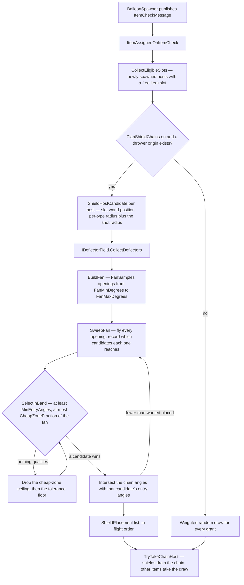
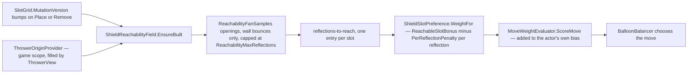

# Item

Items are game-wide collectible effects — Bomb, Laser, Lightning, Paint, Shield, and Snipe. They can appear in different contexts throughout the game: on balloons, in UI previews, in reward screens, or anywhere else an item needs to be displayed or activated. The item system is intentionally **context-independent** — it knows how to display and activate items, but does not know or care what is hosting them.

## Contents

### Display

| File | What it does |
|---|---|
| `IItem` | Base interface — `ItemType Type` |
| `IBalloonItem` | Balloon-hosted activation adapter — `UniTask Activate(ItemActivationContext)`. The context carries the popped balloon, its world position, and the projectile's travel direction at hit time. Handlers are singletons and activations can overlap (AoE items trigger several in one frame; chain/splash effects resolve over time), so all per-activation state lives in locals captured by the activation, never in handler fields |
| `ItemActivationContext` | Readonly struct passed to `Activate` — `Balloon`, `WorldPosition`, `ProjectileDirection`, `DamageContext`. `ItemActivator` builds it from the `ActorHitMessage` (forwarding the hit's `DamageContext`) so handlers can inspect hit flags (e.g. `DirectHit`) and direction-aware items (Paint) can orient their effect |
| `IItemView` | Contract for per-type visual components — `Activate(Color)`, `Deactivate()`, `ApplySortingOrder(int)` |
| `ItemDisplayService` | Plain MonoBehaviour on the host's item container (a serialized reference on `BalloonView` — no DI). `Bind()` bridges the host's reactive properties (`Item`, color name, slot index) to a pooled visual's lifecycle: gets the `ItemVisualView` for `ItemSettings.VisualPrefab` from `PoolManager.GetOrRegister()`, reparents it under itself, recolors immediately when the host's color changes (a **rainbow** host flips PaintBlob-shaded sprites to their radial palette rings via `ItemVisualView.SetRainbow`, matching the flung blobs), re-sorts on slot changes, and exposes the active visual's `ITransformCapture` (the laser's rotating body) to the host |
| `ItemVisualView` | MonoBehaviour on each item visual prefab (PU_Bomb, PU_Laser, etc.) — implements `IItemView` and `IPoolable`; `Activate(color)` shows and colors, `SetColor(color)` recolors without toggling visibility, `Deactivate()` hides. Sorting managed via `ApplySortingOrder(int)` |
| `SimplePoolChannel<ItemVisualView>` | `PoolChannel<ItemVisualView>` — one channel per visual prefab, keyed by prefab name. Managed by `ItemDisplayService` via `PoolManager.GetOrRegister()` |
| `LaserItemRotation` | MonoBehaviour on the laser body child — **stepped** rotation: dwells on a hex-grid-aligned angle for `_stepSeconds`, then eases to the next one over the trailing `TransitionFraction` of the step (`Mathf.SmoothStep` + `Mathf.LerpAngle`), stepping through all 6 hex bearings (`0`, `A`, `180-A`, `180`, `180+A`, `360-A`, derived from `ISlotGridConfig.SlotSeparation`) in order so every transition — including the wrap — moves forward under `Mathf.LerpAngle`'s shortest-path rule (see "Idle laser telegraph" below). Picks a random start step (not a random angle) on `OnEnable` so multiple lasers don't march in lockstep; `CaptureSnapshot()` stops it. Implements `ITransformCapture` so the host can snapshot the rotation at hit time |
| `ITransformCapture` / `TransformSnapshot` | Capture contract for item visuals whose transform matters at hit time — `CaptureSnapshot()` returns position/rotation/scale. `BalloonController` snapshots the hit balloon's capture component and publishes `TransformCapturedMessage` (in `Shared/Messages/`) |
| `ItemEffectPlayer` | Plain C# — plays an item's one-shot activation effect: pulls the `EffectView` for `ItemSettings.ActivationEffectPrefab` from the pool, tints it by the popped balloon's color, returns it on completion. Shared by bomb/laser/shield; chain/splash effects drive their own two-phase setup |
| `BalloonOverlapQuery` | Plain C# — shared physics setup for AoE items (bomb, laser): a balloon-layer `ContactFilter2D` plus `TryResolveBalloon()` that maps a hit collider to a live balloon model, skipping recycled views and the popped balloon itself |

### Assignment

| File | What it does |
|---|---|
| `ItemAssigner` | `IStartable` — subscribes to `ItemCheckMessage`. On the initial board fill (`IsInitialSpawn`) it rolls `InitialItemCountWeights`; on a cadence turn (`TurnCount % ItemCadence == 0`) it rolls `ItemCountWeights`. Each is an `AnimationCurve` weighted distribution (X = item count 0,1,2…, Y = weight) sampled fresh **per turn** via `SampleCount`, so the count is a random draw, not a per-level constant. It then grants that many items across distinct newly-spawned `IHasWriteableItemSlot` balloons (capped by how many are eligible), re-picking a weighted type per grant and tracking the running per-type count so `MaximumAllowed` holds within the batch. Balloons without `IHasWriteableItemSlot` (e.g. `ToughBalloonModel`) or already holding an item are excluded. Cap counting pattern-matches grid actors on the same `IHasItemSlot` capability eligibility uses — counting a concrete model type would silently break the cap. **Shields skip the weighted draw** while `IRunConfig.PlanShieldChains` is on: see *Shield chains* below |

### Activation

| File | What it does |
|---|---|
| `ItemActivator` | `IStartable` + `IDisposable` — subscribes to `ActorHitMessage`; when the hit actor is a balloon carrying an item, finds the matching `IBalloonItem` handler by type, builds an `ItemActivationContext(balloon, worldPosition, projectileDirection, damageContext)` and calls `await Activate(context)`, then publishes `ItemActivatedMessage`. Yields one frame before activation (cancelled on scope teardown) to let all synchronous `ActorHitMessage` subscribers finish first |
| `Bomb/BombItemHandler` | Area explosion — non-alloc `Physics2D.OverlapCircle` via `BalloonOverlapQuery`; dispatches a hit for every balloon in radius via `IHitDispatcher` and publishes a `Shockwave` `NudgeMessage` for survivors. Direct hex neighbors of the bomb always receive **piercing** damage (the blast core guarantees a kill); everything else gets `ItemSettings.Damage`. A **rainbow** host (`RainbowBlast` + `ConvertAfterDelay`): classifies balloons once at detonation by *centre* distance — every balloon within `Radius` is piercing-killed regardless of colour; balloons in the ring beyond it (up to `Radius + RainbowConversionRange`, `0` disables) are collected and **converted to rainbow** at *half the effect duration* (held refs, no re-query). `RainbowEffectScale` scales the activation-effect transform for a bigger-looking blast — visual only, kill radius unchanged. Plays its effect via `ItemEffectPlayer`; stamps `DisturbanceFieldService.Stamp()` on detonation with the `Bomb` profile |
| `Laser/LaserItemHandler` | Cross beam — 4× non-alloc `Physics2D.CircleCast` in rotated directions; reads the captured rotation from `TransformCapturedMessage` (keyed per balloon, consumed once on activation). Passes `ItemSettings.Damage` into each dispatched hit. A **rainbow** holder additionally converts the survivors bordering the beam (`ConvertBorderingNeighbors`): every surviving hex neighbour of a hit balloon (i.e. not itself taken by the beam) is recoloured to rainbow; the beam itself glows iridescent, lerping its wired renderers through the palette's colours (`LaserView.SetCycleColors`, `LaserSettings.ColorCycles`). Plays its effect via `ItemEffectPlayer`; stamps `DisturbanceFieldService.Stamp()` along beam segments with the `Laser` profile |
| `Lightning/LightningItemHandler` | Chain lightning — queries `SlotGrid` for all same-color balloons, sorts by distance nearest-first, spawns the chain effect via `SimplePoolChannel<EffectView>` and configures it through `IChainEffect.PrepareDisplay(positions, settings, onTargetHit)`. Resolves the chain's colour via `IGamePalette` and passes it as the effect tint. Hits are dispatched per jump as the bolt advances (`onTargetHit` callback), each with `ItemSettings.Damage`. A **rainbow** holder instead **converts** a whole colour group to rainbow (never destroys) — the colour chosen by the last loaded projectile (tracked via `ProjectileLoadedMessage`), falling back to the nearest concrete colour on the grid (`SlotGrid.FindNearestColorId`) when that projectile's colour is empty or itself rainbow, so it seeds a combo rather than clearing the board. Per-activation target lists live in locals — a second activation mid-chain must not touch them |
| `Lightning/IChainEffect` | Interface a pooled chain effect implements so the handler can configure it without downcasting to the concrete view |
| `Lightning/ChainLightningGeometry` | `internal static` bolt math — `BuildBoltBuffers` (fractal **midpoint displacement** via `PathHelper.MidpointDisplacement` with configurable `FractalDecay`) and `BuildGlowPath` (smooth **Catmull-Rom path** through per-jump centroids). Shared with the editor preview (single source of truth). Uses `VectorMathExtensions.Centroid`/`BoundingRadius` and `PathHelper.ResampleLinear`/`PrefixSum` |
| `Lightning/ChainLightningView` | `EffectView` subclass implementing `IChainEffect` — multiple `LineRenderer`s + a `SpriteRenderer` glow. `Play()` starts `async UniTaskVoid` that grows forward jump-by-jump then retracts; glow position is interpolated per-frame along the smooth path via `PathHelper.SampleAt`. Glow colour: `SetGlowColors(colors, cycles)` lerps through the colour set `cycles` full loops over the anim's duration (a single colour is static; falls back to `Play`'s `tint`); scaled by serialized `_glowColorIntensity` (0–4; <1 darkens, >1 overdrives for bloom), keeping the sprite's designed alpha. The handler feeds the palette's colours for a rainbow chain (iridescent, via the shared `ColorCycle.Sample`) and the single chain colour otherwise |
| `Shield/ShieldItemHandler` | Shield grant — increments `ShieldsRemaining` on the active projectile (tracked via `ProjectileLoadedMessage`), publishes `ShieldGainedMessage` with the balloon's slot index, and plays its activation effect via `ItemEffectPlayer`. Does not deal damage. A **rainbow** holder additionally applies a `ProjectileBuff` with `ProjectileBuffId.RainbowShield` via `IProjectileBuffs.Apply` (see `Projectile/Buffs/`): the projectile turns iridescent, scores colour-agnostically, and rainbow-converts popped balloons' neighbours — it does not itself make a non-piercing shot plow through tough balloons; the buff ends when the granted shield is consumed on a wall bounce. | N/A — no damage dealt |
| `Snipe/SnipeItemHandler` | Snipe — arms the active projectile as a piercing lance on ANY pop of its host, direct hit or AoE/item damage alike: sets `IsPiercing` so it plows through balloons like a cruise-earned pierce, but **without** entering cruise (`ProjectileView.TryEnterCruise` bars an already-piercing shot), so it never collects cruise-bounce taps. It can still earn *Sweep* taps and speed up that way — taps accrue regardless of pierce state, a wall hit being a wall hit. There is deliberately no `DamageFlags.DirectHit` gate — a bomb/laser/lightning/paint pop of a Snipe-carrying balloon arms the lance exactly like a direct hit (José's ruling: the lance is recoverable off an AoE pop, not only a direct one). Grants a single, **non-stacking** multiplicative `ProjectileBuffId.Speed` buff (multiplier from `SnipeSettings.SpeedBuffMultiplier`) via `IProjectileBuffs.Apply` (see `Projectile/Buffs/`) — the speed never compounds. A pickup landing on an **already-piercing** shot is **banked** instead of applied: two pierces can't overlap, so the whole grant (pierce, speed and rainbow) is saved as a charge on `ProjectileFlightState.BankedPierceCharges` (rainbow hosts bank to `BankedRainbowPierceCharges`, which spend first) and activates at the discharge that spends the running pierce — `ProjectileModelExtensions.SpendPierce` keeps `IsPiercing` armed across that discharge while still ending the cruise that fed it, and the handler's `PierceDischargedMessage` subscription re-applies the grant. Charges accumulate, one spent per discharge, and a shot that dies at the discharge wall loses whatever is left (they re-arm only while it still has shields). Keeping the flag from dipping is load-bearing: `LevelController` releases its level-up hold on the falling edge, so a dip would fire the ceremony mid-flight. A rainbow host additionally arms the shared `RainbowShield` buff (see Shield's row above), captured at grant time so the lance reads iridescent for the rest of the pierce. That grant is applied **unguarded**, unlike the speed buff: `RainbowShield` is a flag (value 0) so duplicate instances can't compound, whereas skipping it when one was already riding left the lance on whatever grant landed first — and a rainbow *Shield* item's is ended by any plain wall bounce (`WallBounceEndCondition`), which clipped the iridescence long before the pierce it belonged to. `AddBuff` dedupes by instance and `RemoveBuff` removes only that instance, so the two coexist and the pierce-tied one keeps `HasBuff` true after the wall-ended one expires (and vice versa, so picking up a rainbow Shield mid-pierce is safe too). Both buffs are ended by `PierceEndedEndCondition`, which fires when the pierce ends. The plow-then-shatter itself is a **shared pierce mechanic** living in `ProjectileHitResolver` (records each plowed tough/unbreakable balloon + its strike position instead of popping it) and `ProjectileMotionResolver` (wall-discharge branch: at the next surviving wall bounce after any tough plow, the pierce ends and `ProjectileHitResolver.DischargePending` pops every recorded tough at its strike position). A shot that dies with toughs still pending flushes them the same way. The discharge publishes a `PierceDischargedMessage` (centre of the plowed line, tough count, rainbow flag) so the discharge feel can play off it. A rainbow lance's discharge also **blooms** a colour conversion of nearby paintable balloons around the shattered line — scaled by how many toughs it ate — via `SnipeDischargeBloom` (subscribes to that message); the toughs themselves are never converted (armor isn't paintable, it's the fuel). With no tough contact the lance just pierces until it runs out of shields. Non-damaging: no shield change |
| `Paint/PaintItemHandler` | Splatoon-style color spread — lays a `PaintTriangle` region out along the projectile's travel direction, circle-packs it with paint-blob VFX flung from the hit point via `ISplashEffect.PrepareDisplay`, and — as each blob lands — recolours every paintable (`IPaintable`) different-colour balloon **within a blob's radius** to the popped balloon's colour. Painting tracks the visible splash coverage (balloons in gaps between blobs are left alone), not grid neighbours; each balloon is bucketed to its nearest covering blob so it paints when that blob arrives. For a **rainbow** holder the flung blobs glow iridescent — each draws scrolling radial rings of the level's palette (the shared global rainbow bands the rainbow balloon uses), via `ISplashEffect.SetRainbow` toggling the PaintBlob shader's `_RainbowEnabled`. Stamps `DisturbanceFieldService.Stamp()` per painted balloon with the `Paint` profile |
| `Paint/PaintTriangle` | Readonly struct — the splash's target region: an isosceles triangle whose median runs along the travel direction (apex at hit + `SpreadOffset`, reaching signed `SpreadLength`, fanning to `SpreadBaseWidth`). `PackBlobs` hex-packs circles of `SpreadBlobRadius` to decide blob count/positions; those blobs' radii also gate which balloons get painted. Shared by the handler and the editor preview |
| `Paint/ISplashEffect` | Interface a pooled splash effect implements so the handler can configure blob flights without downcasting to the concrete view |
| `Paint/PaintSplashView` | `EffectView` subclass — animates `ColorableRenderer` blobs along arc paths; spawns fire-and-forget splash particles via `ParticlePoolChannel` on landing. `PrepareDisplay` takes `ItemSettings` directly. The serialized `_blobRenderers` are seeds; when packed density needs more, the view clones the first seed into a grow-only pool (reused across plays since the view is itself pooled). `ComputeBlobFlight` and `ApplyBlobMaterial` are `internal static` — shared with editor preview (single source of truth for position, scale, and MPB math). Returns `BlobFlightSnapshot` struct. Blobs spin during flight at `PaintBlobSpinSpeed`. `SetRainbow` flips the blobs to radial palette rings via the `_RainbowEnabled` MPB toggle (rainbow holder); the ring colours are the global rainbow bands (`_RainbowBandColor0..3`/`_RainbowBandCount`) set per level, resolved in the shared `Include/RainbowBand.cginc` (also used by the rainbow balloon). Each blob gets a unique `sortingOrder` to prevent transparent sprite flickering. Renderer is found via `GetComponentInChildren<Renderer>()` to support `CompositeColorableRenderer` hierarchies |
| `Paint/PaintBlobRenderer` | MonoBehaviour on each blob child — assigns a random `_TimeOffset` to the PaintBlob shader via `MaterialPropertyBlock` so each blob's animation phase differs. GPU instancing is disabled on `PaintBlob` and `PaintFlyingBlob` materials because `_TimeOffset` is set per-instance via MPB (see `Assets/Shaders/BalloonParty/README.md`) |

### Effects

A config-free, Physics2D-free selection layer (`Effects/`) shared between the live game and the shot
solver (@ref plan_shot_solver_accuracy Phase C), so an item's kill/paint/chain geometry is written
once instead of twice.

| File | What it does |
|---|---|
| `IEffectBoard` | The seam — `Occupants` (an `IReadOnlyList<EffectOccupant>`) plus `TryGetOccupantAt(slot)`. An item core reads only this; it never touches a `SlotGrid`, a view, or Physics2D directly |
| `EffectOccupant` | One board actor as a core sees it — `Handle` (an index into `Occupants`, stable only for one selection pass), `Slot`, `Position` (live/time-evaluated centre), `SlotPosition` (lattice home), `Radius`, `ColorId`, `IsPaintable`, `ResistsPaint`. Deliberately not durability-capable — a core only selects and emits hits; it never mutates |
| `EffectHit` | What a core emits against a selected `Handle` — `Damage`, `PiercingDamage` (always pops, unbreakables included), or `Recolor` (never pops). The caller applies it |
| `ItemEffectParams` | Per-item config-free scalar snapshots (`BombEffectParams`, `LaserEffectParams`, `LightningEffectParams`, `PaintEffectParams`) — mirror only the geometry fields each core needs off `IItemConfiguration`, never the presentation ones |
| `Bomb/BombBlast`, `Laser/LaserCross`, `Lightning/LightningChain`, `Paint/PaintSpread` | The pure per-item selection cores — each mirrors its live handler's own selection exactly (kill radius, cast geometry, same-colour chain walk, triangle/blob bucketing) and runs identically over either `IEffectBoard` adapter |

Two adapters implement `IEffectBoard`: `GridEffectBoard` (`Effects/`) wraps a real `SlotGrid`, reading
positions from `IndexToWorldPosition`/live models rather than view transforms so it stays
EditMode-testable, and `ShotSimEffectBoard` (`Solver/`) wraps the shot solver's own working set. Only
the sim is repointed onto the pure cores today — the live handlers listed above still run their
original `Physics2D`/`SlotGrid` queries; repointing them onto `GridEffectBoard` + the shared cores is
a live behaviour change gated behind PlayMode equivalence tests (`BombActivationPlayModeTests` et al.)
per the plan, so `GridEffectBoard` currently backs only the cross-board mirror-fidelity tests
(`EffectBoardMirrorTests`), not gameplay.

### Range preview (`Preview/`)

The aim-time telegraph (@ref plan_item_range_preview): while the prediction line of sight crosses a
balloon hosting an item, that item's affected area is drawn on the board by ribbon "pens" streaming
out of the host. Borrows the technique from the score-trail formations (`Game/Score/Behaviours/`) —
heads dragging `TrailRenderer` ribbons trace a figure — but these are flat, board-space, and anchored
to a balloon rather than 3D polyhedra flying at a UI bar.

| File | What it does |
|---|---|
| `IItemRangePreview` | The seam — `ItemType Type` plus `BuildShape(in context, shape)`. One implementation per item type, resolved by `Type` exactly as `ItemActivator` resolves `IBalloonItem`, so a new item ships its preview beside its handler with no dispatch table to edit. `BuildShape` is **pure geometry**: it appends points and never touches a renderer, the pool, or `Time` — which is what keeps every figure edit-mode testable and lets one driver animate all of them. An implementation with an existing config-free core for its shape (`PaintTriangle`, `LightningChain`, `BombBlast`, `LaserCross`) must build on it rather than re-derive, or the telegraph drifts from the effect it advertises |
| `ItemPreviewShape` / `ItemPreviewStroke` | The shared vocabulary: a figure is a set of **strokes** (polylines), each a range into one flat point list. A circle is one closed stroke, a plus two open ones, lightning one per arc. Reused across rebuilds (cleared, never reallocated). `AddCircle`/`AddSegment` cover the common cases; a stroke of fewer than two points is discarded rather than recorded, since it has no arc length for a pen to travel |
| `ItemPreviewEntry` | Pure polyline-vs-polyline math — where the aim's own trace first crosses one stroke, as an arc-length offset along that stroke — factored out so it is edit-mode testable without the ticker's pen/pool machinery, mirroring `TraceHitGeometry`. `TryFindEntryOffset` walks the trace segment by segment (not the stroke segment by segment) so "first" means earliest along the shot's own direction of travel, including a closed stroke's wrap leg as a segment; ties within one trace segment are broken by the intersection nearest that segment's own start. Alongside the stroke-side offset it also reports the crossing's own **trace-side** arc offset — the distance from the trace's first point to the crossing, measured along the (possibly bent) trace itself — which is what lets the leading pen's approach follow the trace instead of cutting a straight line to it (see `ItemPreviewTicker` below). Returns `false` (both offsets `0`) when the trace never crosses the stroke at all — `ItemPreviewTicker` treats that as "start this stroke's draw-in at its own beginning, and fall back to a straight-line approach" rather than a failure |
| `ItemPreviewContext` | Readonly struct — the per-crossing inputs (`Origin`, `Slot`, `AimDirection`, `TracePoints`, `HostColorId`, `Viewport`). The services a preview needs are constructor-injected into the preview itself, since they never change between crossings |
| `ItemPreviewViewport` | Plain C#, DI singleton — the one shared owner of "what is visible": the camera-derived world rect, expanded by a margin derived from `IItemPreviewConfig.DashLength`. Both `ItemPreviewTicker` (culling pens) and `LaserRangePreview` (clipping its beam lines) read this single instance, so the two agree on one notion of "visible" instead of drifting apart. `Refresh()` is idempotent per frame (guarded on `Time.frameCount`), so `ItemRangePreviewController` and `ItemPreviewTicker` can both call it before reading without depending on tickable ordering. `IsActive` is false with no main camera yet or a non-orthographic one — cull nothing / clip nothing rather than guessing at maths that don't apply. Also exposes `TryFindExit`, a `WallLimits`-style slab test for clipping a ray to the rect, so any figure can reuse the geometry that defines the bounds |
| `ItemRangePreviewController` | `IStartable`/`ILateTickable`, plain C# — decides which host the aim is sighted on (most central crossing wins, via `TraceHitGeometry`) and drives the one visible figure. Plain C# rather than a component on the balloon, because it needs DI singletons a pooled item visual would have to be hand-threaded, and because only one preview shows at a time — a global arbitration a per-balloon component cannot make. The figure only ever draws while the aim is **settled**: any change to its inputs hides it and restarts `IItemPreviewConfig.SightDelaySeconds` from zero, so `SightDelaySeconds` gates *every* appearance now, not just the first. "Changed" is decided by comparing the figure's actual inputs frame to frame — host slot, origin, aim direction, item spin, and `PredictionTraceProvider.End`'s contact kind/normal (which Shield's stub depends on) — each against the last frame the signature held, past a small jitter epsilon. **Not** `PredictionTraceProvider.Version`: `SetTrace` bumps it unconditionally and `ThrowerController.UpdatePredictionTrace` calls it every Tick while aiming, so it changes every frame regardless of whether the aim moved and cannot serve as a movement signal (the grid walk below is still nominally gated on it, but that gate never actually skips anything while aiming — a separate, known cost this change doesn't attempt to fix). Once a signature has held for the delay, `Show` is called exactly once and not again while it keeps holding — re-calling `Show` is what would reposition a shown figure's pens, so not calling it is what buys the invariant this whole scheme exists for: **a figure's pens never reposition while it is visible**, which is what eliminates the ribbon-streaking repositioning used to cause, by construction rather than by patching it after the fact. A changed signature calls `ItemPreviewTicker.BeginHide()` (the graceful fade, see below) rather than `Hide()`, so the old figure fades rather than cutting; the next `Show` — once the new signature settles — naturally draws itself in again from its strokes' entry points, since `BeginHide` already dropped `_visible`. `SightDelaySeconds == 0` still shows on the same frame a signature first stabilizes, not one frame later. Refreshes `ItemPreviewViewport` at the top of `LateTick`, before building the context that carries it. Tracks the slot of the host the figure was last actually shown for (`_shownSlot`), separately from the signature machinery above, and passes `introduce: true` to `ItemPreviewTicker.Show` only when that slot differs from the one being shown now (a genuinely new host, or the first one) — a re-settle on the SAME host after an aim nudge passes `false`, so the draw-in plays once per host rather than on every re-settle. Cleared whenever the telegraph goes away entirely, so looking away and back at the same item introduces again |
| `ItemPreviewTicker` | `ILateTickable` — drives the pens closed-form off one clock, no tweens or coroutines, mirroring `ShapeFormationTicker`'s zero-allocation constraints. The draw-in is a **cascade**: every pen is confined to its own dash, and dashes reveal one at a time, in a relay, rather than every pen tracing the same shared path at once (see "Why a cascade" below). Once per `Show`, after the arc table is built, `ItemPreviewEntry.TryFindEntryOffset` finds where the aim's own line of sight first crosses each stroke and records it as the stroke's **entry offset** (falling back to 0, the stroke's own start, when the trace never crosses it at all — true of Lightning's later arcs, which the trace only reaches through the chain), and `BuildEntryOffsets` also resolves it to a world point (`_entryPoints`) and, alongside the trace-side offset the helper reports (`_entryTraceOffsets` / `_entryTraceValid`), the arc-length distance the leading pen's approach actually covers (`_approachLengths`) — along the trace, between the host's own position on it (`_hostTraceOffset`, resolved once per `Show`/refit by `BuildTraceBuffers` as the nearest point on the retained trace copy to `_origin`) and the stroke's own entry trace offset, when the helper found a crossing; the straight-line distance to `_entryPoints` otherwise, exactly as before this existed. The entry offset no longer defines a travel destination for every pen — it only does two things now: it **ranks the cascade order** (`ComputeTravelDistance` returns each dash's forward arc distance from the entry — `Mathf.Repeat(slotOffset − entryOffset, strokeLength)` on a **closed** stroke so the ranking always reads as one forward sweep round the shape, or the plain signed difference on an **open** one, which still ranks correctly since a slot's raw position and its distance from the fixed entry differ only by a constant offset; `AssignCascadeRanks` turns that ordering into each pen's `CascadeRank`, smallest first, once per `Show`/refit, never per frame), and it anchors the **leading pen's approach** (`CascadeRank == 0`, the one pen per stroke that ever leaves the host — see below). `BuildCascadeTimings` splits `BloomDuration` into each stroke's own windows once per `Show`/refit: the leading pen's approach gets a share proportional to its length against the stroke's total path (`approachLength` plus every dash's own painted length), and the remainder divides evenly across the stroke's dash count, so pen *k*'s window starts exactly when pen *k* − 1's ends (`_approachDurations` / `_dashDurations`, one pair per stroke). Every stroke reads the identical shared clock — `elapsed = BloomCurve.Evaluate(Clamp01(BloomElapsed / BloomDuration)) * BloomDuration` — against only its own window bounds, which is what makes several strokes (Laser's two lines, Lightning's arcs) cascade **in parallel**: each stroke's relay runs on its own schedule over the same tick, so a two-stroke figure draws both at once rather than taking twice as long. `AdvanceCascade` is the per-pen dispatch: only the stroke's leading pen (`CascadeRank == 0`) ever gets an approach window `[0, approachDuration)` — an **emitting** sweep, via `SampleApproach`, along the retained trace copy between `_hostTraceOffset` and the stroke's entry trace offset (`SampleTrace`, mirroring `SampleStroke` but for an always-open polyline that clamps rather than wraps or ping-pongs), falling back to the previous straight `Lerp` from the host origin to the entry point only when `BuildEntryOffsets` marked this stroke's trace offset unusable. The approach draws — it is not a silent reposition — because the leg is a **continuous** walk along the trace: there is no discontinuity on it to hide, unlike a parked pen's jump into its own dash, so ink flows out of the balloon and along the aim before the dash itself starts forming at the entry point. Following the trace rather than cutting straight to the entry point is what fixed a real bug: a straight lerp cut visibly across a bent aim line (a wall bounce, a deflection) instead of tracing the bend, most visible on Shield, whose entry sits at the far end of the aim line — but it affected every figure whose entry isn't adjacent to the host. The host and entry trace offsets can land in either order (the entry can sit behind the host along the trace); `Mathf.Lerp` between them moves continuously either way, so no special-casing is needed for that. (A near-zero `approachLength`, the entry sitting on the host itself, e.g. Paint's apex or Lightning's first arc, is treated as already arrived rather than divided by, so that stroke's leading pen gets no approach window at all, and starts drawing its own dash at `t = 0`.) Once a pen's own window `[windowStart, windowStart + dashDuration)` opens, it sweeps, still via the shared clock, from its dash's own start (`DashIndex * slotLength`) out to its dash's own end (`+ painted`, the same painted length `AdvanceDash` uses) — this is drawing, not travelling: the pen never leaves its own slot. Before its window opens, a **non-leading** pen is `Parked`: pen-up at its own dash start, awaiting its cascade turn, which `ApplyPenPosition` folds into `!pen.Parked` to keep it dark — it reaches that dash start by a discontinuous jump, so it must stay dark until it starts sweeping. The leading pen is never `Parked`, including through its approach: `!pen.Parked` reads true for it from `BloomElapsed = 0` onward, so it is visible for the whole leg, not just once its own dash starts. The moment a pen's window closes (`localT >= 1`) it becomes `Bloomed` — pinning `Distance` to `painted`, the ping-pong's own peak — and hands off to the existing per-slot dash sweep (`AdvanceDash`) unchanged; the two formulas agree exactly at the handoff, so there is no positional jump at the seam, and `AdvancePen` stops calling `AdvanceCascade` for that pen from then on. **The standing rule this satisfies**: a pen is never emitting at a position it's about to leave discontinuously. The origin-to-entry leg is exempt from that rule rather than an exception to it — it is a continuous sweep along the trace, so there is nothing discontinuous on it to hide, and the leading pen draws it in full. The one position change that IS discontinuous — a parked pen's jump from wherever it is waiting into its own dash the instant its window opens — happens while `Parked` is true and the pen isn't emitting at all; the existing rising edge in `ApplyPenPosition` (`!pen.Parked && …` flips true) clears the ribbon before re-enabling, so that pen's first ink is always at its own dash start, never a chord from wherever it was parked. `Show` distinguishes a new host (every pen restarts its cascade from `BloomElapsed = 0`) from the same host re-fitted (pens keep their bloom progress; only `CascadeRank` and the stroke's windows are recomputed against the reassigned slot) — though with the controller now only calling `Show` once per settled signature (see above), the re-fit path is a dormant fallback rather than one it exercises in normal play. A re-fit also re-derives the per-stroke dash counts, entry offsets and cascade timings, not just the arc table, because a figure can reshape while its host stays put — Laser's hex-stepped rotation is the case that forces this, since its beams' clipped length swings every step even though the host doesn't move. `Hide()` releases every pen to the pool immediately, for teardown; `BeginHide()` is the graceful counterpart the controller calls instead — it stops every pen emitting (`HighlightTrail.SetEmitting(false)`) but leaves them in place, so whatever ribbon they'd already laid fades out on the `TrailRenderer`'s own lifetime rather than the figure cutting out. `LateTick` stops advancing pen positions entirely while fading, so a fading figure hangs where it stopped instead of continuing to sweep. Once the fade has run for the pens' own ribbon lifetime (read off a live pen via `HighlightTrail.EffectiveRibbonSeconds` — the pen prefab's own authored `TrailRenderer.time`, shared by every item now, rather than a duration re-authored on the ticker), the pens are released exactly as `Hide()` would. A `Show` arriving mid-fade cancels it outright rather than letting it run to completion underneath the new figure: it clears the fade flag and, because `BeginHide` already dropped `_visible`, always takes the acquire path — reusing the still-held pens (no pool round-trip) and cascading them in again, which is the intended fade-in and needs no extra machinery. The draw-in is an *introduction*, not a per-`Show` effect: `Show`'s `introduce` parameter (decided by `ItemRangePreviewController`, see above) tells `AcquirePens` whether the pens it hands out should start life mid-cascade or already settled — `Bloomed = true` and `BloomElapsed` past the bloom duration, so `AdvancePen` takes the settled branch on the pen's very first tick and it simply appears in place, the same settled state a pen gets when `RefitPens` grows the figure a new slot. Every figure cascades this way now — there is no longer a per-item opt-out, since the per-item style layer had nothing left to say once the draw-in became universal |
| `HighlightTrail` | The pooled pen view — a head sprite dragging a `TrailRenderer`, positioned entirely from the ticker. `SetEmitting` toggles the head sprite alongside the `TrailRenderer` — the head is part of "is this pen drawing," not decoration independent of it, so a parked pen (pen-up at its dash start) is fully invisible rather than showing a dot with no ribbon behind it; the leading pen's approach is not parked, so it shows both head and ribbon exactly as a drawing pen does. `_head` resolves via a `GetComponentInChildren<SpriteRenderer>(true)` fallback in `Awake` if not serialized, so the existing prefab (whose reference to it was dropped along with the runtime-tint path it used to serve) still works without being re-wired by hand. Deliberately not `UI/Score/FlyingTrail`: that one owns its own DOTween flight, motion-curve table and flight gradients and lives on the UI sorting layer, none of which applies here |
| `IItemPreviewConfig` / `ItemPreviewConfig` | The tuning surface (interface in `Shared/`, SO in `Configuration/`, per the config convention). Shared knobs — dash length/spacing, the pen cap, trace speed, bloom duration/curve, the sight dwell delay. Unassigned on `GameLifetimeScope` it degrades to a default instance, so the telegraph works before anyone authors an asset. No longer carries a cull margin — `ItemPreviewViewport` derives it from `DashLength + DashSpacing` (the stride) instead of it being authored. No longer carries a per-item style layer either: every figure blooms the same way now (see `ItemPreviewTicker` below), so there is nothing left for a per-item override to say. Deliberately carries **no colour** anywhere on it: every figure draws with the pen prefab's own material, so the telegraph reads as one system and there is no runtime tint path to keep in step with it |
| `IShieldPreviewSettings` | Shield's own figure params (its stub length) as a nested block on the config, mirroring how `ItemSettings` nests `Bomb`/`Laser`/`Paint` — a number only one figure reads has no business on the shared config. The pattern to copy when another figure needs its own tuning |
| `IBombPreviewSettings` | Bomb's own figure params (`RadiusOffset`, world units added to `BombSettings.Radius` purely for display, default 0). No `[Min]` on purpose — a negative offset legitimately draws tighter than the true radius. The drawn circle is the blast's *footprint* alone, while `BombBlast` actually catches an occupant whose centre lies within the radius plus that occupant's own radius, so the real catchment is meaningfully larger than the circle at the bare radius — a small positive offset therefore reads *closer* to what the blast actually takes, not further from it |
| `IPaintPreviewSettings` | Paint's own figure params: `Scale`, a display-only multiplier applied to both `PaintSettings.SpreadLength` and `SpreadBaseWidth` (default 1, `[Min(0)]` unlike Bomb's `RadiusOffset` since a negative multiplier would mirror the triangle rather than draw it tighter). Scales about the triangle's own axis midpoint rather than its apex — `PaintRangePreview` shifts the apex it hands to `PaintTriangle.Build` by half the length lost, so the figure shrinks in place instead of sliding toward the host |

| `IHostsSpinningItem` (in `Item/`) | Lets the controller read a Laser's live angle off an `ISlotActorView` without naming `BalloonView`, keeping the dependency pointing Balloon → Item. Hands back `ISpinningItemVisual`, never `ITransformCapture`, whose `CaptureSnapshot` is destructive — a telegraph must not perturb what it telegraphs |

The figures, and what each reuses:

| Item | Figure | Geometry source |
|---|---|---|
| Shield | a stub of the **wall** bounce the aim line ends on | `PredictionTraceEnd`, the contact the trace calculator already solved to stop there. It has no board range, so it shows the *consequence*: where the shot carries on after surviving that hit. Walls only — a shield is spent on a wall and nothing else (`ProjectileMotionResolver.Step` decrements `ShieldsRemaining` on a wall reflection, its `Deflect` never does), so a balloon deflection costs the shot nothing and there is no consequence to advertise |
| Bomb | circle at the blast radius | `BombSettings.Radius`, the same field `BombBlast` selects with — deliberately not `RainbowEffectScale`, which scales only the VFX — plus `IBombPreviewSettings.RadiusOffset`, a display-only nudge on top of it |
| Snipe | line from the host to the wall | `WallLimits.TryFindCrossing` along the aim. Traced fresh rather than copied from the aim polyline past its pierce marker, since that stops at the telegraph's segment budget, not the wall |
| Laser | two crossing lines, each clipped to what's visible | the four `LaserCross` arms share two corridors, so two lines along the rotated right/up axes; each half-arm clipped independently via `ItemPreviewViewport.TryFindExit` rather than drawn the full `RaycastDistance`. Falls back to `WallLimits.TryFindCrossing` when no viewport is available (no camera yet, or a non-orthographic one). The rectangle it replaced drew each beam twice at a negligible (0.13-unit) width and, unclipped, was a 40-unit corridor on a board whose diagonal is under 10 — that overrun was what starved the pen budget |
| Paint | the spread triangle | `PaintTriangle.Build` itself — the same call the handler and the solver make — with `SpreadLength`/`SpreadBaseWidth` scaled by `IPaintPreviewSettings.Scale`, a display-only nudge on top of it, applied about the triangle's own centre so it shrinks in place |
| Lightning | an arc per chain jump | `LightningChain` over a live `GridEffectBoard`, so the chain visits exactly the balloons the effect would, in the same order |

Bomb's circle, Laser's axis lines and Paint's triangle are all the effect's own *footprint*, not its
exact catchment — each core also catches an occupant by its own radius, so a balloon straddling an
edge is still caught. Laser's own footprint is a line rather than a box because `CircleCastRadius` is
negligible (0.065) next to a balloon's radius — drawing it as a 0.13-wide rectangle implied a precision
the number doesn't carry, and the line represents the beam at least as truthfully. The outline reads as
intent; that is the deliberate simplification.

Registered in `GameScopeRegistration.RegisterItemRangePreviews`; the pen prefab and the config asset
are serialized fields on `GameLifetimeScope`. Leaving the prefab unassigned disables the telegraph
rather than failing startup; leaving the config unassigned falls back to working defaults.

**Ribbon lifetime is the knob that decides how much of a figure you can see at once.** A pen paints
`TraceSpeed × ribbon seconds` of world length before its tail fades. It is no longer a per-item
override — every item shares the pen prefab's own authored `TrailRenderer.time` — so a figure that
needs to show more of itself at once (the Laser's corridors span most of the board's diagonal, a Bomb
circle only a few units around) is tuned via `TraceSpeed` or the prefab itself, not per item.

**Dashing is the one drawing style, not a per-item opt-in.** `DashLength` and `DashSpacing` are shared
across every figure — a Bomb circle dashes at the same size as Shield's stub. Each stroke *derives*
its own dash count from its own length rather than being told a count: with `stride = DashLength +
DashSpacing`, a stroke gets `max(1, round(strokeLength / stride))` dashes. A long stroke naturally
gets more dashes than a short one, and that count *is* the pen count for the stroke — one pen draws
one dash, and the dashed line is the pens sitting side by side. Ask for a stroke three strides long
and you get three pens, each owning a third of it; a two-armed figure with unequal arm lengths
legitimately gets a different dash count on each arm, which is the point.

**A pen cap bounds the total.** `MaxPens` caps the total summed across a figure's strokes: past it,
the stride is inflated once by `desiredTotal / MaxPens` and every stroke's count is recomputed with
the inflated stride. A big figure's dashes come out sparser and longer-spaced rather than any part of
it going undrawn. Laser used to be the figure that engaged it: unclipped, its two corridors ran the
full `RaycastDistance` of 20 each way — roughly 160 units of combined perimeter, around 320 pens at
the authored stride, well past the cap. Clipping each half-arm to the play area (see the figures table
above) keeps both lines under the board's ~9.3-unit diagonal each, so Laser's own dashes no longer
reach the cap — the mechanism above still exists for whatever figure does.

**The gap is pinned; the dash absorbs the rounding, not the other way round.** Each stroke's dash
count is `round(strokeLength / stride)`, so a stroke's own `slotLength = strokeLength / dashCount` is
almost never exactly `stride` — rounding a per-stroke length to a whole dash count leaves a remainder,
and whichever of {dash, gap} is *not* pinned has to absorb it. The gap is what the eye reads as
rhythm, so it is the one held constant: a pen paints `slot − DashSpacing` (floored at a small fraction
of the slot so a very short stroke, or a spacing authored larger than the stride, still draws
something instead of vanishing) and lifts for exactly `DashSpacing`, on every stroke of every figure
regardless of length. That is what lets Laser's two very differently-sized corridors read as the same
dash pattern — pin the dash length instead and the gap is what would visibly stretch and shrink
between them, since it would be the one left to carry the per-stroke remainder.

**Zero spacing reproduces a solid line — there is no separate continuous mode.** With
`DashSpacing = 0`, a pen's painted length equals its slot length exactly (`slot − 0`); adjacent dashes
touch with no gap and the stroke reads as one unbroken ribbon. This is why the old `DashCount = 0`
continuous branch was deleted rather than kept alongside dash mode — the zero-spacing case already
produces its output with no separate code path to keep in sync.

**A pen sweeps its dash — a → b, then b → a, forever.** It never jumps, which is the whole trick:
there is no restart to flicker, no discontinuity to hide, and **no pen-up at all**. The spacing
between dashes is simply arc that no pen ever visits, because the painted dash is shorter than the
slot its pen owns.

**A heavily capped figure trends toward looking solid.** Because the gap is pinned rather than the
dash, a figure whose dash count the `MaxPens` cap has reduced gets *longer dashes with the same gaps*
instead of everything scaling up together — the fewer, longer slots each still lose only a fixed
`DashSpacing` to gap, so a heavily capped figure's dashes start to merge visually. This is acceptable
today: after Laser's clipping landed (see above), no shipped figure reaches the cap — Laser draws
around 37 dashes, Bomb's circle around 22, Paint's triangle around 23, all well under the cap of 64.
If a future figure's stroke lengths push it up against `MaxPens`, this is where to look rather than
rediscovering the trade-off from scratch.

**A pen goes dark while it is outside the camera's view.** `ItemPreviewTicker` checks every pen's
final position each frame against `ItemPreviewViewport`, the one shared owner of "what is visible" —
the camera-derived world rect, refreshed once per frame (not per pen) from `Camera.main`'s
orthographic size, aspect, and transform position. This is the general answer to a figure extending
past what's on screen when its host sits near an edge: Bomb's circle and Paint's triangle can both do
it, and distorting their geometry to fit would misrepresent the effect, so the pen is simply culled
for the part nobody can see rather than the shape being bent to stay inside. Culling is a drawing
concern, so it measures against what is actually **visible** — not against the gameplay play-area
walls, which the camera frames more than and which don't move, while the camera does (shake,
cinematic rigs, the level-transition move); a wall-based box would be both too small and stale. The
rect is refreshed every frame rather than cached, precisely because a stale one would cull pens that
are still on screen — but the refresh itself is idempotent per frame (`ItemPreviewViewport.Refresh`
guards on `Time.frameCount`), so both `ItemRangePreviewController` and `ItemPreviewTicker` can call it
without caring which one runs first. If there is no main camera yet, or it isn't orthographic (the
maths above assume orthographic projection), `IsActive` goes false and culling is skipped entirely —
every pen is treated as visible, since drawing something off-screen is a far cheaper failure than a
figure silently vanishing. Laser clips its own geometry to this same viewport (see the figures table
above), for the pen-budget reason there — an unclipped 40-unit corridor would starve the shared pen
budget — falling back to `WallLimits` only while the viewport itself is unavailable. Crossing back in
clears the ribbon before re-enabling it: the trail still holds the points from where the pen left, and
re-enabling without clearing would draw a straight chord from the exit point to the re-entry point,
which is exactly the jumping trail this cull exists to avoid.

**A pen whose slot got reassigned clears its ribbon instead of drawing a chord across the jump.** A
re-fit (same host, reshaped figure — Laser's hex-stepped rotation is the case that does this
constantly) re-derives dash counts and reassigns each pen's stroke/dash slot, which can move a pen's
position discontinuously between one frame and the next. `ItemPreviewTicker` doesn't react to the
re-fit itself — that fires on every aim nudge while a host stays sighted, so clearing on it
unconditionally would blink the whole figure. Instead it detects the jump per pen: each frame it
compares the pen's new position against where it was last frame, and treats anything beyond a small
multiple of `TraceSpeed × deltaTime` (the most a normally-sweeping pen could have covered) as a
teleport rather than motion. Only checked once the pen has finished cascading in — mid-cascade a pen
can deliberately move far and fast (the leading pen's approach, or a waiting pen's jump from its
parked spot into its own dash the instant its window opens), which would otherwise trip the same check
every frame and suppress the draw-in.

**A freshly acquired pen starts pen-up, not pen-down.** `AcquirePens` parks a new or reused pen at the
host origin but leaves it *not* emitting (and clears its stale `HasLastPosition` baseline, since a
reused pen's is left over from its previous figure) — it is `AdvancePen`'s own rising edge, on the
pen's first tick, that turns it on, and that edge already clears the ribbon before re-enabling. Seeding
a pen emitting at the host origin would draw a straight chord out to wherever it first computed as its
real position — the leading pen's approach position on an introducing show, a later pen's own dash
start while it waits its turn, or a settled dash-slot position on a same-host re-settle — the moment it
started emitting, since none of those places is the host origin the pen was parked at. This is a
recurring failure mode this system has hit from several angles now (the re-entry, reassigned-slot and
approach-versus-cascade cases above and below), which makes it worth stating as a standing rule rather
than a pile of separate fixes: **a pen must never be emitting at a position it is about to leave
discontinuously.**

"Parked" is wider than just the ribbon: `HighlightTrail.SetEmitting` toggles the head sprite alongside
the `TrailRenderer`, so a parked pen shows neither a ribbon nor a lone dot sliding around with no ribbon
behind it — the head is part of "is this pen drawing," not decoration independent of it. An approaching
pen is not parked, so it shows both, exactly as a drawing pen does — the approach is a drawn stroke, not
a silent reposition. Every place the ticker starts or stops a pen drawing (`AcquirePens` parking a fresh pen, the
`ApplyPenPosition` rising/falling edge, `BeginHide`'s graceful stop) already goes through `SetEmitting`
rather than touching the `TrailRenderer` directly, so this falls out of the existing machinery instead
of needing its own case anywhere.

The cull bounds aren't the bare visible rect — `ItemPreviewViewport` pushes them outward by the
stride, `IItemPreviewConfig.DashLength + DashSpacing`, recomputed alongside the rect each frame. That
margin is *derived*, not authored: the stride is the widest a slot is ever intended to be, and with
the gap pinned (see above) a pen's painted dash can run up to a whole slot — so it can exceed
`DashLength` alone once `MaxPens` inflates the stride on a capped figure. Bounding by the stride is
still the smallest expansion that can never clip a dash mid-stroke in every case, including a capped
one — a pen even partly on-screen is always drawn in full. It also happens to solve
**boundary chatter**: a pen sweeping its dash near the screen edge crosses a hairline boundary every
cycle, and since every re-entry clears the ribbon (the jump above), culling right at the edge would
read as a visible stutter instead of the pen simply appearing and disappearing. Shared rather than
per-item, since it is about the viewport, which no item owns — and since Laser's own clip reads the
same `ItemPreviewViewport`, cull and clip agree on exactly one notion of "visible" rather than two
that could drift apart.

> Three wrong turns worth not repeating, all of them attempts to make the gaps by interrupting the
> pen rather than by bounding where it travels. **`ClearRibbon` cannot make the gaps** — clearing
> wipes every dash already painted, collapsing the figure into one short stroke sliding along it.
> **A pen must not tour the whole stroke** leaving dashes behind it: that reads as trails travelling
> from one end to the other, not as a dashed shape. And **a pen must not snap back to its dash start**
> to repeat — each snap ends one ribbon and begins another, so the ribbon lifetime decides how many
> stale copies pile up, which is what a hard strobe with far too much alpha actually is.

**Why a cascade, not a shared travel leg.** An earlier version of this scheme had every pen on a stroke
travel the same path before drawing — first a straight leg from the host centre, then along the
stroke's own arc to the pen's individual dash slot. On a figure with many dashes (Bomb's circle,
Paint's triangle) every pen made that same trip **at the same time**, so N ribbons stacked on top of
each other and the shared portion read as one bright, heavy line instead of a figure drawing itself in
— Shield only ever looked right because it has a single dash and so nothing to stack against. The
cascade replaces that: each pen is confined to its own dash and dashes reveal **in sequence** — a pen
sits hidden at its own dash's start until its turn, sweeps from there to its dash's end, and the moment
it finishes the next pen begins, so it reads as one dash drawn after another rather than a shared spoke
fading in behind N overlapping copies of itself. The entry point survives this redesign, but its job
changes: it no longer defines anywhere a pen travels to, only the **order** dashes cascade in (smallest
forward arc distance from the entry first, via `ComputeTravelDistance`/`AssignCascadeRanks`) — every
pen still sweeps its own dash in that same forward direction, so the relay reads as one gesture
advancing round or along the figure rather than dashes lighting up out of order. The one thing that
still leaves the host is the **leading pen** of each stroke (`CascadeRank == 0`) — so the figure still
visibly emerges from the balloon — and, unlike the old shared leg, it travels **emitting** the whole way:
it is the only pen that ever takes that path, so there is nothing left to stack against it, and the leg
itself is a continuous sweep along the trace with no discontinuity to hide, so there is nothing left to
hide it for either. The approach shooting out along the aim, with the dash only then forming at its far
end, is part of the intended read now, not a silent reposition before the drawing starts. See the
`ItemPreviewTicker` row above for the full mechanics (`AdvanceCascade`, `BuildCascadeTimings`) and how
the standing rule above is satisfied throughout.

## Architecture

The item display system is a self-contained, DI-free unit: an `ItemDisplayService` MonoBehaviour on the host's item container, plus pooled `ItemVisualView` prefabs (one per `ItemType`, referenced from `ItemSettings.VisualPrefab`). The host owns the wiring — it holds a serialized reference to the service and passes every dependency (configs, palette, pool manager) through `Bind()`, so pooled hosts need no per-instance scope.

### Design principle: items are not balloons

The `Item/` folder's display side has no dependency on `Balloon/`. `ItemDisplayService.Bind()` accepts individual reactive properties — it does not know whether the caller is a balloon, a UI panel, or a reward screen. Future contexts (shop previews, inventory, tutorial highlights) can host items by adding an `ItemDisplayService` to their hierarchy and calling `Bind()` with appropriate reactive properties.

`IBalloonItem` exists only as a thin adapter for the balloon-hosted activation flow. It is the balloon system's way of interacting with items, not the item system's knowledge of balloons.

### Display flow

1. A host (e.g. `BalloonView.Bind()`) calls `ItemDisplayService.Bind(item, colorName, slotIndex, …)` with the reactive properties plus the config/palette/pool dependencies and sorting inputs
2. `ItemDisplayService` subscribes to the model's `Item` reactive property and `colorName`
3. When the item type changes to non-None, `ItemDisplayService` gets a `ItemVisualView` instance from `PoolManager.GetOrRegister()` keyed by the visual prefab name, reparents it, and calls `Activate(color)`
4. When `colorName` changes while a visual is active, `ItemDisplayService` calls `SetColor()` on the active visual — the item display always matches the host's current color
5. When `Unbind()` is called or the item changes back to None, the active visual is returned to its pool via `PoolManager.Return()`
6. Sorting order updates flow through `ItemDisplayService` → `ItemVisualView.ApplySortingOrder()` on the active instance
   - The item icon pool (`SimplePoolChannel`) does **not** DI-inject its views, so any visual needing a scoped service is handed it here. `Bind()` takes an optional `SceneLightFieldService`; when the spawned visual is a `LaserItemRotation`, `ItemDisplayService` calls `Configure()` on it, passing the light field (so the idle laser can register its telegraph light) and the slot grid's `SlotSeparation` (so its stepped rotation dwells on hex-aligned angles) — neither can be `[Inject]`ed
7. A host that has renderers which must sit *above* the item passes them nothing directly — instead it reads `ItemDisplayService.ActiveItemSortingCount` (the item's slot span, `0` when none) and re-layers its own renderers on top. Because the host can't otherwise know when the item's footprint changes, `Bind()` takes an optional `onSortingFootprintChanged` callback that fires whenever an item is added/removed; the host re-applies its above-item sorting from there (and on slot moves via its own subscription). `BalloonView._aboveItemRenderers` is the first user

### Activation flow

1. `ProjectileView.OnTriggerEnter2D` hands the hit to `ProjectileHitResolver`, which evaluates the outcome (always `Damage = 1`) and dispatches an `ActorHitMessage` through `IHitDispatcher` (`Game/HitPipeline`) — score stage first, then the owning `BalloonController`, then the broadcast
2. The hit balloon's `BalloonController` snapshots any `ITransformCapture` child (publishing `TransformCapturedMessage` for the laser), calls `_view.Hide()` (disables collider and renderers), and waits for `ItemActivatedMessage` before returning to pool
3. `ItemActivator` receives the broadcast `ActorHitMessage`, yields one frame, then calls `await Activate(context)` (an `ItemActivationContext` carrying the hit's `DamageContext`) on the matching handler
4. The handler runs its effect (may be async, e.g. lightning), dispatching an `ActorHitMessage` for each secondary balloon with `Damage = settings.Damage`
5. `ItemActivator` publishes `ItemActivatedMessage` — `BalloonController` receives it and returns the item balloon to pool

## Item types

| Type | Visual | Activation effect | Damage |
|---|---|---|---|
| **Bomb** | Bomb icon, tinted to host color | Area-of-effect explosion — destroys nearby balloons in a radius with exponential nudge falloff (a rainbow host kills all colours in-radius, scales the blast visual, and converts an outer ring to rainbow mid-effect) | Configurable — set to 2 to instantly pop tough balloons |
| **Laser** | Stepped-rotation cross, tinted to host color | Cross-shaped beam — destroys balloons along four rotated axes; rotation is captured from `LaserItemRotation` at hit time. Because the icon now steps through hex-grid-aligned angles rather than spinning freely, the beam always fires along an actual row or diagonal of the hex grid instead of an arbitrary angle between them (a rainbow holder converts the survivors bordering the beam to rainbow) | Configurable |
| **Lightning** | Lightning icon, tinted to host color | Chain lightning — hits all same-color balloons sequentially with a growing/retracting `LineRenderer` effect (a rainbow holder instead converts the last-projectile colour group to rainbow) | Configurable |
| **Paint** | Paint blob, tinted to host color | Splatoon-style color spread — flings packed blobs into a triangular region aimed along the projectile's travel direction; paintable different-color balloons inside the triangle adopt the popped balloon's color as blobs land | N/A — no damage dealt |
| **Shield** | Shield icon, tinted to host color | Grants the active projectile +1 bounce shield; a rainbow holder also buffs it iridescent, granting wildcard scoring and side-neighbour rainbow conversion until the next wall bounce, but not automatic piercing | N/A — no damage dealt |
| **Snipe** | Snipe icon, tinted to host color | Arms the active projectile as a piercing lance on any pop of its host — a direct projectile hit or an AoE/item pop (bomb, laser, lightning, paint) arms it identically; there's no direct-hit requirement. The lance plows through tough/unbreakable balloons instead of popping them, recording each; shortly after the last one, the shot slows once to base speed and shatters the whole recorded line at once. Also grants a single non-stacking speed boost while the lance holds (multiplier via `SnipeSettings`). Picking up another Snipe while the lance is already out isn't wasted — it's saved and fires as a fresh lance the moment the current one shatters its line (a rainbow holder still shatters the plowed toughs but converts nearby paintable balloons to rainbow, in a radius scaled by how many toughs it ate) | N/A — no damage dealt |

## Damage

Each damaging item reads `ItemSettings.Damage` (configured per item in `ItemConfiguration`) and passes it inside the `DamageContext` of the dispatched `ActorHitMessage` (along with `DamageFlags` and the source color). The outcome is pre-computed by `ActorHitMessage.From`, which calls `EvaluateHit(context)` on the hit actor — `BalloonController` reads `msg.Outcome` and routes accordingly. Setting `Damage = 1` (the default) reproduces normal one-hit behaviour. Setting it higher on Bomb, for example, allows a single blast to pop tough balloons that would otherwise survive.

Non-damaging items (Paint, Shield, Snipe) do not use the `Damage` field — the `ItemSettingsDrawer` hides it for those types.

> **Unbreakable balloons** — `UnbreakableBalloonModel` returns `Deflect` from `EvaluateHit` regardless of damage. Only `DamageFlags.Piercing` (e.g. the bomb's direct-neighbor blast core) forces a `Pop`.

## Interactions

- **Any host view** — calls `ItemDisplayService.Bind()`/`Unbind()` to connect/disconnect item display
- **BalloonController** — defers balloon pool return until `ItemActivatedMessage` arrives; snapshots `ITransformCapture` children and publishes `TransformCapturedMessage`; routes on `msg.Outcome` switch (`PassThrough`/`Deflect`/`Pop`)
- **ItemActivator** — central orchestrator; routes activation to the correct handler after yielding one frame
- **IHitDispatcher (`Game/HitPipeline`)** — all handler hits are dispatched through it, never published to the broker directly
- **SlotGrid** — `LightningItemHandler` queries all balloons of a given color; `PaintItemHandler` enumerates occupied slots via `SlotGrid.IndexToWorldPosition` and paints those inside its `PaintTriangle`
- **PoolManager** — item visual lifecycle via `SimplePoolChannel<ItemVisualView>`; activation effect lifecycle via `SimplePoolChannel<EffectView>` (`ItemEffectPlayer` for one-shot effects)
- **IEffect / EffectView** — `ChainLightningView` extends `EffectView`; all item activation effects that need async Play/Stop extend `EffectView`
- **IGamePalette / IItemConfiguration** — color lookup, item settings (radius, nudge values, laser cast params, lightning timing/segments/randomness/glow subdivisions/fractal decay, paint flight duration/arc curve/scale curve/shadow scale curve/sprite scale curve/spin speed/spread offset/length/base width/blob radius, damage)
- **ColorableRenderer** — `PaintSplashView` uses `ColorableRenderer` blobs so they participate in the standard color pipeline
- **SceneLightFieldService** — Bomb, Laser, and Lightning register temporary lights (see below)

## Lights Cast by Items

Damaging items cast local lights into the scene light field (@ref arch_light_field) for the duration
of their activation effect. Each handler creates a reactive `Light` model, registers it with
`SceneLightFieldService.RegisterLight(Light) → IDisposable`, and disposes the registration when the
effect expires (async timeout). The field re-renders only when a registered light changes — idle
items add no GPU cost.

| Item | Light type | Count | Duration | Colour | Config location |
|---|---|---|---|---|---|
| **Bomb** | Point (disc) | 1 | Effect duration | Source balloon | `ItemSettings.Bomb` (`BlastLightRadiusScale`, `BlastLightIntensity`, `BlastLightFallbackSeconds`) |
| **Laser** | Capsule (segment) | 2 (H + V beams) | Effect duration | Source balloon | `ItemSettings.Laser` (`BeamLightHalfWidth`, `BeamLightIntensity`, `BeamLightFalloff`, `BeamLightFallbackSeconds`) |
| **Lightning** | Capsule (segment) | 1 per chain arc | `PopLightSeconds` | Matched target colour | `ItemSettings.Lightning` (`PopLightRadius` = beam half-width, `PopLightIntensity`, `PopLightSeconds`) |

All lights are tagged with a palette index (the source/matched colour) for local colour casting via
the field's A channel. Untagged regions fall back to the global `_SceneLightColor`. The field's
palette-decode include (`SceneLightTintAt`) gives consumers a smooth colour glow driven by the
bilinear magnitude — no per-item shader work needed.

**Area lights (Laser, Lightning):** Beam lights use `Light.Segment(start, end, halfWidth, …)` — a
capsule shape where falloff decays from the segment axis to the sides. Laser casts one along each
beam; Lightning casts one along each arc the bolt travels as it jumps. Point lights
(`start == end`) are a degenerate capsule (a disc).

**Rainbow bomb scaling:** A rainbow-triggered bomb scales the light radius visually (via
`RainbowEffectScale`) for a bigger-looking blast glow, but the kill radius is unchanged.

**Idle laser telegraph (experimental):** `LaserItemRotation` can optionally register a spinning
cross telegraph light while the item is held (not yet activated). Controlled by per-item-settings
toggle (`TelegraphLightEnabled`) and tuned via `TelegraphLightHalfLength`, `TelegraphLightHalfWidth`,
`TelegraphLightIntensity` in `ItemSettings.Laser`. Off by default.

**Hex-aligned stepped rotation:** the laser icon no longer spins freely — it dwells on a hex-grid-
aligned angle, then eases to the next one, repeating. `HexCoordinates.IndexToWorldPosition` places
neighbour slots at bearings of roughly `0`, `A`, `2A`, `180`, `180+A`, `180+2A` degrees, where
`A = atan2(SlotSeparation.y, SlotSeparation.x)` (≈60° with the shipped separation, so very nearly —
but not exactly, since the grid isn't perfectly regular — a hexagon). Because `LaserCross` fires a
four-arm cross, its look repeats every 90°, so only three of those six angles are visually distinct
(`0`, `A`, `180-A` read the same as `180`, `180+A`, `360-A`). `LaserItemRotation` still cycles through
all six in order rather than just those three, spending `_stepSeconds` on each (the trailing quarter
of which eases into the next) — `Mathf.LerpAngle` always takes the shortest path, and with only three
entries the wrap from the last step back to the first would run backwards (~-120°), snapping the cross
instead of continuing its turn. Stepping through all six keeps every transition, including the wrap, a
forward ~+60°, so the rotation reads as continuous even though its look only has three distinct
positions. This is a gameplay change, not just a
presentation one: `LaserItemHandler` captures the icon's rotation at hit time and casts along it, so
the beam now always fires along an actual row or diagonal of balloons on the hex grid rather than an
arbitrary angle that could slice between them. `ISpinningItemVisual.SpinDegreesPerSecond` reports `0`
for this icon — a stepped rotation has no meaningful constant rate, so the shot solver's gather reads
the angle as-is (correct for the dwell, the overwhelming majority of the time) instead of
extrapolating along a rate that no longer exists.

## Shield chains

Shields placed by the plain weighted draw scatter, and a scattered shield extends nothing — the
player picks it up on a flight that was already going to end safely. `ShieldChainPlanner` instead
places them along a flight the thrower can actually fly: each shield is what buys the wall bounce
that reaches the next, so shield *n* makes shield *n+1* reachable. `ItemAssigner` plans the chain
once per fill and then hands shields out in flight order.

The narrowing loop (`Narrow` feeding back into `Sweep`) is the "a chain is one flight" guarantee — the
least obvious thing in `ShieldChainPlanner`. Each round keeps only the fan angles that still reach
*every* shield placed so far, not just the one just added, so two shields reachable from unrelated
angles can never masquerade as a chain.

It plans against a **fan** of opening angles rather than one, so a chain has several ways in, and
keeps only slots reached by enough of the fan — but not by so much of it that the player sweeps
them for free. Both bounds, and the fan itself, are authored on `RunConfig` under `ShieldChain`
(`IShieldChainSettings`): `FanSamples`, `FanMinDegrees`/`FanMaxDegrees`, `MinEntryAngles`,
`CheapZoneFraction`. They are balance knobs retuned against playtests, which is why they live on
the asset; the planner keeps only the guards that stop it looping (surface epsilon, leg cap).

A chain planned at spawn decays as the board settles, so `ShieldReachabilityField` re-sweeps a
coarser fan on every grid mutation and records the fewest reflections any sampled shot needs to
cross each slot. `ShieldSlotPreference` turns that into a small balance bias — full bonus for a
straight-shot slot, less per reflection — which the balancer adds to the actor's own bias rather
than obeying, so a shield drifts toward reachable slots without hovering in defiance of the board.
`ReachabilityFanSamples`, `ReachabilityMaxReflections`, `ReachableSlotBonus` and
`PerReflectionPenalty` tune it, on the same `ShieldChain` block.

"Wall bounces only" is the current truth, and is deliberately in tension with the deflector step in
the shield-chain planning diagram above — the reachability sweep injects `IDeflectorField` but never
consults what it collects, an unresolved gap rather than a design choice.

`IRunConfig.PlanShieldChains` turns the whole thing off, restoring the weighted draw.
`Tools ▸ BalloonParty ▸ Shield Chains` (editor) counts how many openings collect the board's
shields and draws one path at a time — the only practical way to see whether a level holds a chain,
since the shields still look like items on a hex lattice either way.
