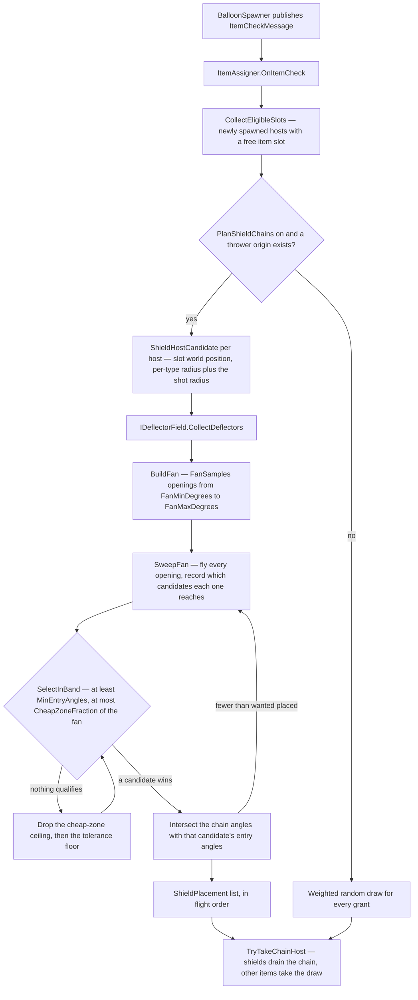
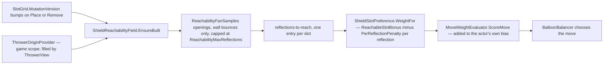

# Item

Items are game-wide collectible effects — Bomb, Laser, Lightning, Paint, Shield, and Snipe. They can appear in different contexts throughout the game: on balloons, in UI previews, in reward screens, or anywhere else an item needs to be displayed or activated. The item system is intentionally **context-independent** — it knows how to display and activate items, but does not know or care what is hosting them.

## Contents

### Display

| File | What it does |
|---|---|
| `IItem` | Base interface — `ItemType Type` |
| `IBalloonItem` | Balloon-hosted activation adapter — `UniTask Activate(ItemActivationContext)`. The context carries the popped balloon, its world position, and the projectile's travel direction at hit time. Handlers are singletons and activations can overlap (AoE items trigger several in one frame; chain/splash effects resolve over time), so all per-activation state lives in locals captured by the activation, never in handler fields |
| `ItemActivationContext` | Readonly struct passed to `Activate` — `Balloon`, `WorldPosition`, `ProjectileDirection`, `DamageContext`. `ItemActivator` builds it from the `ActorHitMessage` (forwarding the hit's `DamageContext`) so handlers can inspect hit flags (e.g. `DirectHit`) and direction-aware items (Paint) can orient their effect |
| `IItemView` | Contract for per-type visual components — `Activate(Color)`, `Deactivate()`, `ApplySortingOrder(int)` |
| `ItemDisplayService` | Plain MonoBehaviour on the host's item container (a serialized reference on `BalloonView` — no DI). `Bind()` bridges the host's reactive properties (`Item`, color name, slot index) to a pooled visual's lifecycle: gets the `ItemVisualView` for `ItemSettings.VisualPrefab` from `PoolManager.GetOrRegister()`, reparents it under itself, recolors immediately when the host's color changes (a **rainbow** host flips PaintBlob-shaded sprites to their radial palette rings via `ItemVisualView.SetRainbow`, matching the flung blobs), re-sorts on slot changes, and exposes the active visual's `ITransformCapture` (the laser's rotating body) to the host |
| `ItemVisualView` | MonoBehaviour on each item visual prefab (PU_Bomb, PU_Laser, etc.) — implements `IItemView` and `IPoolable`; `Activate(color)` shows and colors, `SetColor(color)` recolors without toggling visibility, `Deactivate()` hides. Sorting managed via `ApplySortingOrder(int)` |
| `SimplePoolChannel<ItemVisualView>` | `PoolChannel<ItemVisualView>` — one channel per visual prefab, keyed by prefab name. Managed by `ItemDisplayService` via `PoolManager.GetOrRegister()` |
| `LaserItemRotation` | MonoBehaviour on the laser body child — continuous Z-axis rotation at `_rotationSpeed`; resets angle and stops on `OnEnable` or `Stop()`. Implements `ITransformCapture` so the host can snapshot the rotation at hit time |
| `ITransformCapture` / `TransformSnapshot` | Capture contract for item visuals whose transform matters at hit time — `CaptureSnapshot()` returns position/rotation/scale. `BalloonController` snapshots the hit balloon's capture component and publishes `TransformCapturedMessage` (in `Shared/Messages/`) |
| `ItemEffectPlayer` | Plain C# — plays an item's one-shot activation effect: pulls the `EffectView` for `ItemSettings.ActivationEffectPrefab` from the pool, tints it by the popped balloon's color, returns it on completion. Shared by bomb/laser/shield; chain/splash effects drive their own two-phase setup |
| `BalloonOverlapQuery` | Plain C# — shared physics setup for AoE items (bomb, laser): a balloon-layer `ContactFilter2D` plus `TryResolveBalloon()` that maps a hit collider to a live balloon model, skipping recycled views and the popped balloon itself |

### Assignment

| File | What it does |
|---|---|
| `ItemAssigner` | `IStartable` — subscribes to `ItemCheckMessage`. On the initial board fill (`IsInitialSpawn`) it rolls `InitialItemCountWeights`; on a cadence turn (`TurnCount % ItemCadence == 0`) it rolls `ItemCountWeights`. Each is an `AnimationCurve` weighted distribution (X = item count 0,1,2…, Y = weight) sampled fresh **per turn** via `SampleCount`, so the count is a random draw, not a per-level constant. It then grants that many items across distinct newly-spawned `IHasWriteableItemSlot` balloons (capped by how many are eligible), re-picking a weighted type per grant and tracking the running per-type count so `MaximumAllowed` holds within the batch. Balloons without `IHasWriteableItemSlot` (e.g. `ToughBalloonModel`) or already holding an item are excluded. Cap counting pattern-matches grid actors on the same `IHasItemSlot` capability eligibility uses — counting a concrete model type would silently break the cap. **Shields skip the weighted draw** while `IRunConfig.PlanShieldChains` is on: see *Shield chains* below |

### Activation

| File | What it does |
|---|---|
| `ItemActivator` | `IStartable` + `IDisposable` — subscribes to `ActorHitMessage`; when the hit actor is a balloon carrying an item, finds the matching `IBalloonItem` handler by type, builds an `ItemActivationContext(balloon, worldPosition, projectileDirection, damageContext)` and calls `await Activate(context)`, then publishes `ItemActivatedMessage`. Yields one frame before activation (cancelled on scope teardown) to let all synchronous `ActorHitMessage` subscribers finish first |
| `Bomb/BombItemHandler` | Area explosion — non-alloc `Physics2D.OverlapCircle` via `BalloonOverlapQuery`; dispatches a hit for every balloon in radius via `IHitDispatcher` and publishes a `Shockwave` `NudgeMessage` for survivors. Direct hex neighbors of the bomb always receive **piercing** damage (the blast core guarantees a kill); everything else gets `ItemSettings.Damage`. A **rainbow** host (`RainbowBlast` + `ConvertAfterDelay`): classifies balloons once at detonation by *centre* distance — every balloon within `Radius` is piercing-killed regardless of colour; balloons in the ring beyond it (up to `Radius + RainbowConversionRange`, `0` disables) are collected and **converted to rainbow** at *half the effect duration* (held refs, no re-query). `RainbowEffectScale` scales the activation-effect transform for a bigger-looking blast — visual only, kill radius unchanged. Plays its effect via `ItemEffectPlayer`; stamps `DisturbanceFieldService.Stamp()` on detonation with the `Bomb` profile |
| `Laser/LaserItemHandler` | Cross beam — 4× non-alloc `Physics2D.CircleCast` in rotated directions; reads the captured rotation from `TransformCapturedMessage` (keyed per balloon, consumed once on activation). Passes `ItemSettings.Damage` into each dispatched hit. A **rainbow** holder additionally converts the survivors bordering the beam (`ConvertBorderingNeighbors`): every surviving hex neighbour of a hit balloon (i.e. not itself taken by the beam) is recoloured to rainbow; the beam itself glows iridescent, lerping its wired renderers through the palette's colours (`LaserView.SetCycleColors`, `LaserSettings.ColorCycles`). Plays its effect via `ItemEffectPlayer`; stamps `DisturbanceFieldService.Stamp()` along beam segments with the `Laser` profile |
| `Lightning/LightningItemHandler` | Chain lightning — queries `SlotGrid` for all same-color balloons, sorts by distance nearest-first, spawns the chain effect via `SimplePoolChannel<EffectView>` and configures it through `IChainEffect.PrepareDisplay(positions, settings, onTargetHit)`. Resolves the chain's colour via `IGamePalette` and passes it as the effect tint. Hits are dispatched per jump as the bolt advances (`onTargetHit` callback), each with `ItemSettings.Damage`. A **rainbow** holder instead **converts** a whole colour group to rainbow (never destroys) — the colour chosen by the last loaded projectile (tracked via `ProjectileLoadedMessage`), falling back to the nearest concrete colour on the grid (`SlotGrid.FindNearestColorId`) when that projectile's colour is empty or itself rainbow, so it seeds a combo rather than clearing the board. Per-activation target lists live in locals — a second activation mid-chain must not touch them |
| `Lightning/IChainEffect` | Interface a pooled chain effect implements so the handler can configure it without downcasting to the concrete view |
| `Lightning/ChainLightningGeometry` | `internal static` bolt math — `BuildBoltBuffers` (fractal **midpoint displacement** via `PathHelper.MidpointDisplacement` with configurable `FractalDecay`) and `BuildGlowPath` (smooth **Catmull-Rom path** through per-jump centroids). Shared with the editor preview (single source of truth). Uses `VectorMathExtensions.Centroid`/`BoundingRadius` and `PathHelper.ResampleLinear`/`PrefixSum` |
| `Lightning/ChainLightningView` | `EffectView` subclass implementing `IChainEffect` — multiple `LineRenderer`s + a `SpriteRenderer` glow. `Play()` starts `async UniTaskVoid` that grows forward jump-by-jump then retracts; glow position is interpolated per-frame along the smooth path via `PathHelper.SampleAt`. Glow colour: `SetGlowColors(colors, cycles)` lerps through the colour set `cycles` full loops over the anim's duration (a single colour is static; falls back to `Play`'s `tint`); scaled by serialized `_glowColorIntensity` (0–4; <1 darkens, >1 overdrives for bloom), keeping the sprite's designed alpha. The handler feeds the palette's colours for a rainbow chain (iridescent, via the shared `ColorCycle.Sample`) and the single chain colour otherwise |
| `Shield/ShieldItemHandler` | Shield grant — increments `ShieldsRemaining` on the active projectile (tracked via `ProjectileLoadedMessage`), publishes `ShieldGainedMessage` with the balloon's slot index, and plays its activation effect via `ItemEffectPlayer`. Does not deal damage. A **rainbow** holder additionally applies a `ProjectileBuff` with `ProjectileBuffId.RainbowShield` via `IProjectileBuffs.Apply` (see `Projectile/Buffs/`): the projectile turns iridescent, scores colour-agnostically, and rainbow-converts popped balloons' neighbours — it does not itself make a non-piercing shot plow through tough balloons; the buff ends when the granted shield is consumed on a wall bounce. | N/A — no damage dealt |
| `Snipe/SnipeItemHandler` | Snipe — arms the active projectile as a piercing lance on ANY pop of its host, direct hit or AoE/item damage alike: sets `IsPiercing` so it plows through balloons like a cruise-earned pierce, but **without** entering cruise (`ProjectileView.TryEnterCruise` bars an already-piercing shot), so it never collects cruise-bounce taps. It can still earn *Sweep* taps and speed up that way — taps accrue regardless of pierce state, a wall hit being a wall hit. There is deliberately no `DamageFlags.DirectHit` gate — a bomb/laser/lightning/paint pop of a Snipe-carrying balloon arms the lance exactly like a direct hit (José's ruling: the lance is recoverable off an AoE pop, not only a direct one). Grants a single, **non-stacking** multiplicative `ProjectileBuffId.Speed` buff (multiplier from `SnipeSettings.SpeedBuffMultiplier`) via `IProjectileBuffs.Apply` (see `Projectile/Buffs/`) — the speed never compounds. A pickup landing on an **already-piercing** shot is **banked** instead of applied: two pierces can't overlap, so the whole grant (pierce, speed and rainbow) is saved as a charge on `ProjectileFlightState.BankedPierceCharges` (rainbow hosts bank to `BankedRainbowPierceCharges`, which spend first) and activates at the discharge that spends the running pierce — `ProjectileModelExtensions.SpendPierce` keeps `IsPiercing` armed across that discharge while still ending the cruise that fed it, and the handler's `PierceDischargedMessage` subscription re-applies the grant. Charges accumulate, one spent per discharge, and a shot that dies at the discharge wall loses whatever is left (they re-arm only while it still has shields). Keeping the flag from dipping is load-bearing: `LevelController` releases its level-up hold on the falling edge, so a dip would fire the ceremony mid-flight. A rainbow host additionally arms the shared `RainbowShield` buff (see Shield's row above), captured at grant time so the lance reads iridescent for the rest of the pierce. That grant is applied **unguarded**, unlike the speed buff: `RainbowShield` is a flag (value 0) so duplicate instances can't compound, whereas skipping it when one was already riding left the lance on whatever grant landed first — and a rainbow *Shield* item's is ended by any plain wall bounce (`WallBounceEndCondition`), which clipped the iridescence long before the pierce it belonged to. `AddBuff` dedupes by instance and `RemoveBuff` removes only that instance, so the two coexist and the pierce-tied one keeps `HasBuff` true after the wall-ended one expires (and vice versa, so picking up a rainbow Shield mid-pierce is safe too). Both buffs are ended by `PierceEndedEndCondition`, which fires when the pierce ends. The plow-then-shatter itself is a **shared pierce mechanic** living in `ProjectileHitResolver` (records each plowed tough/unbreakable balloon + its strike position instead of popping it) and `ProjectileMotionResolver` (wall-discharge branch: at the next surviving wall bounce after any tough plow, the pierce ends and `ProjectileHitResolver.DischargePending` pops every recorded tough at its strike position). A shot that dies with toughs still pending flushes them the same way. The discharge publishes a `PierceDischargedMessage` (centre of the plowed line, tough count, rainbow flag) so the discharge feel can play off it. A rainbow lance's discharge also **blooms** a colour conversion of nearby paintable balloons around the shattered line — scaled by how many toughs it ate — via `SnipeDischargeBloom` (subscribes to that message); the toughs themselves are never converted (armor isn't paintable, it's the fuel). With no tough contact the lance just pierces until it runs out of shields. Non-damaging: no shield change |
| `Paint/PaintItemHandler` | Splatoon-style color spread — lays a `PaintTriangle` region out along the projectile's travel direction, circle-packs it with paint-blob VFX flung from the hit point via `ISplashEffect.PrepareDisplay`, and — as each blob lands — recolours every paintable (`IPaintable`) different-colour balloon **within a blob's radius** to the popped balloon's colour. Painting tracks the visible splash coverage (balloons in gaps between blobs are left alone), not grid neighbours; each balloon is bucketed to its nearest covering blob so it paints when that blob arrives. For a **rainbow** holder the flung blobs glow iridescent — each draws scrolling radial rings of the level's palette (the shared global rainbow bands the rainbow balloon uses), via `ISplashEffect.SetRainbow` toggling the PaintBlob shader's `_RainbowEnabled`. Stamps `DisturbanceFieldService.Stamp()` per painted balloon with the `Paint` profile |
| `Paint/PaintTriangle` | Readonly struct — the splash's target region: an isosceles triangle whose median runs along the travel direction (apex at hit + `SpreadOffset`, reaching signed `SpreadLength`, fanning to `SpreadBaseWidth`). `PackBlobs` hex-packs circles of `SpreadBlobRadius` to decide blob count/positions; those blobs' radii also gate which balloons get painted. Shared by the handler and the editor preview |
| `Paint/ISplashEffect` | Interface a pooled splash effect implements so the handler can configure blob flights without downcasting to the concrete view |
| `Paint/PaintSplashView` | `EffectView` subclass — animates `ColorableRenderer` blobs along arc paths; spawns fire-and-forget splash particles via `ParticlePoolChannel` on landing. `PrepareDisplay` takes `ItemSettings` directly. The serialized `_blobRenderers` are seeds; when packed density needs more, the view clones the first seed into a grow-only pool (reused across plays since the view is itself pooled). `ComputeBlobFlight` and `ApplyBlobMaterial` are `internal static` — shared with editor preview (single source of truth for position, scale, and MPB math). Returns `BlobFlightSnapshot` struct. Blobs spin during flight at `PaintBlobSpinSpeed`. `SetRainbow` flips the blobs to radial palette rings via the `_RainbowEnabled` MPB toggle (rainbow holder); the ring colours are the global rainbow bands (`_RainbowBandColor0..3`/`_RainbowBandCount`) set per level, resolved in the shared `Include/RainbowBand.cginc` (also used by the rainbow balloon). Each blob gets a unique `sortingOrder` to prevent transparent sprite flickering. Renderer is found via `GetComponentInChildren<Renderer>()` to support `CompositeColorableRenderer` hierarchies |
| `Paint/PaintBlobRenderer` | MonoBehaviour on each blob child — assigns a random `_TimeOffset` to the PaintBlob shader via `MaterialPropertyBlock` so each blob's animation phase differs. GPU instancing is disabled on `PaintBlob` and `PaintFlyingBlob` materials because `_TimeOffset` is set per-instance via MPB (see `Assets/Shaders/BalloonParty/README.md`) |

### Effects

A config-free, Physics2D-free selection layer (`Effects/`) shared between the live game and the shot
solver (@ref plan_shot_solver_accuracy Phase C), so an item's kill/paint/chain geometry is written
once instead of twice.

| File | What it does |
|---|---|
| `IEffectBoard` | The seam — `Occupants` (an `IReadOnlyList<EffectOccupant>`) plus `TryGetOccupantAt(slot)`. An item core reads only this; it never touches a `SlotGrid`, a view, or Physics2D directly |
| `EffectOccupant` | One board actor as a core sees it — `Handle` (an index into `Occupants`, stable only for one selection pass), `Slot`, `Position` (live/time-evaluated centre), `SlotPosition` (lattice home), `Radius`, `ColorId`, `IsPaintable`, `ResistsPaint`. Deliberately not durability-capable — a core only selects and emits hits; it never mutates |
| `EffectHit` | What a core emits against a selected `Handle` — `Damage`, `PiercingDamage` (always pops, unbreakables included), or `Recolor` (never pops). The caller applies it |
| `ItemEffectParams` | Per-item config-free scalar snapshots (`BombEffectParams`, `LaserEffectParams`, `LightningEffectParams`, `PaintEffectParams`) — mirror only the geometry fields each core needs off `IItemConfiguration`, never the presentation ones |
| `Bomb/BombBlast`, `Laser/LaserCross`, `Lightning/LightningChain`, `Paint/PaintSpread` | The pure per-item selection cores — each mirrors its live handler's own selection exactly (kill radius, cast geometry, same-colour chain walk, triangle/blob bucketing) and runs identically over either `IEffectBoard` adapter |

Two adapters implement `IEffectBoard`: `GridEffectBoard` (`Effects/`) wraps a real `SlotGrid`, reading
positions from `IndexToWorldPosition`/live models rather than view transforms so it stays
EditMode-testable, and `ShotSimEffectBoard` (`Solver/`) wraps the shot solver's own working set. Only
the sim is repointed onto the pure cores today — the live handlers listed above still run their
original `Physics2D`/`SlotGrid` queries; repointing them onto `GridEffectBoard` + the shared cores is
a live behaviour change gated behind PlayMode equivalence tests (`BombActivationPlayModeTests` et al.)
per the plan, so `GridEffectBoard` currently backs only the cross-board mirror-fidelity tests
(`EffectBoardMirrorTests`), not gameplay.

### Range preview (`Preview/`)

The aim-time telegraph (@ref plan_item_range_preview): while the prediction line of sight crosses a
balloon hosting an item, that item's affected area is drawn on the board by ribbon "pens" streaming
out of the host. Borrows the technique from the score-trail formations (`Game/Score/Behaviours/`) —
heads dragging `TrailRenderer` ribbons trace a figure — but these are flat, board-space, and anchored
to a balloon rather than 3D polyhedra flying at a UI bar.

| File | What it does |
|---|---|
| `IItemRangePreview` | The seam — `ItemType Type` plus `BuildShape(in context, shape)`. One implementation per item type, resolved by `Type` exactly as `ItemActivator` resolves `IBalloonItem`, so a new item ships its preview beside its handler with no dispatch table to edit. `BuildShape` is **pure geometry**: it appends points and never touches a renderer, the pool, or `Time` — which is what keeps every figure edit-mode testable and lets one driver animate all of them. An implementation with an existing config-free core for its shape (`PaintTriangle`, `LightningChain`, `BombBlast`, `LaserCross`) must build on it rather than re-derive, or the telegraph drifts from the effect it advertises |
| `ItemPreviewShape` / `ItemPreviewStroke` | The shared vocabulary: a figure is a set of **strokes** (polylines), each a range into one flat point list. A circle is one closed stroke, a plus two open ones, lightning one per arc. Reused across rebuilds (cleared, never reallocated). `AddCircle`/`AddSegment` cover the common cases; a stroke of fewer than two points is discarded rather than recorded, since it has no arc length for a pen to travel |
| `ItemPreviewContext` | Readonly struct — the per-crossing inputs (`Origin`, `Slot`, `AimDirection`, `TracePoints`, `HostColorId`). The services a preview needs are constructor-injected into the preview itself, since they never change between crossings |
| `ItemRangePreviewController` | `IStartable`/`ILateTickable`, plain C# — decides which host the aim is sighted on (most central crossing wins, via `TraceHitGeometry`) and drives the one visible figure. Plain C# rather than a component on the balloon, because it needs DI singletons a pooled item visual would have to be hand-threaded, and because only one preview shows at a time — a global arbitration a per-balloon component cannot make. Gated on `PredictionTraceProvider.Version`, so a held aim re-walks nothing |
| `ItemPreviewTicker` | `ILateTickable` — drives the pens closed-form off one clock, no tweens or coroutines, mirroring `ShapeFormationTicker`'s zero-allocation constraints. A pen's position is one formula, not a phase handoff: every frame it computes its **shape position** — the dash-sweep position it would have with no bloom at all, already running from the moment the pen appears — then **warps** that position around the host origin by a bloom clock that decays to identity (full rotation and zero scale at t = 0, no rotation and full scale at t = 1). So a pen starts sitting at the host centre and drifts smoothly into its place in the figure, with the shape's own motion already under way the whole time — no velocity discontinuity where a separate outward launch would have handed off to tracing. `Show` distinguishes a new host (bloom clock restarts) from the same host re-fitted (keep pen phase), so nudging the aim doesn't restart every pen. Each pen also carries its own evenly-spaced angular phase, added to the shared sweep so it decays away with it — the set fans out radially on launch instead of rotating as one rigid stick, with every pen still landing exactly on its shape position at t = 1 |
| `HighlightTrail` | The pooled pen view — a head sprite dragging a `TrailRenderer`, positioned entirely from the ticker. Deliberately not `UI/Score/FlyingTrail`: that one owns its own DOTween flight, motion-curve table and flight gradients and lives on the UI sorting layer, none of which applies here |
| `IItemPreviewConfig` / `ItemPreviewConfig` | The tuning surface (interface in `Shared/`, SO in `Configuration/`, per the config convention). Shared knobs — dash length/spacing, the pen cap, trace speed, bloom duration/sweep/curve, whether the ribbon draws during the bloom — plus an `[EnumIndexed(typeof(ItemType))]` array of per-item overrides. Unassigned on `GameLifetimeScope` it degrades to a default instance, so the telegraph works before anyone authors an asset |
| `IItemPreviewStyle` | One item's overrides, all opt-in: a ribbon lifetime and whether the outward bloom draws (`ItemPreviewBloomDraw.Inherit`/`Draw`/`Hide` — a tri-state because a plain bool has no "unset"). **0 means "use the shared value"** on `RibbonSeconds`, so an unauthored entry can't silently win. Deliberately carries **no colour**: every figure draws with the pen prefab's own material, so the telegraph reads as one system and there is no runtime tint path to keep in step with it |
| `IShieldPreviewSettings` | Shield's own figure params (its stub length) as a nested block on the config, mirroring how `ItemSettings` nests `Bomb`/`Laser`/`Paint` — a number only one figure reads has no business on the shared per-item style. The pattern to copy when another figure needs its own tuning |
| `IBombPreviewSettings` | Bomb's own figure params (`RadiusOffset`, world units added to `BombSettings.Radius` purely for display, default 0). No `[Min]` on purpose — a negative offset legitimately draws tighter than the true radius. The drawn circle is the blast's *footprint* alone, while `BombBlast` actually catches an occupant whose centre lies within the radius plus that occupant's own radius, so the real catchment is meaningfully larger than the circle at the bare radius — a small positive offset therefore reads *closer* to what the blast actually takes, not further from it |
| `IPaintPreviewSettings` | Paint's own figure params: `Scale`, a display-only multiplier applied to both `PaintSettings.SpreadLength` and `SpreadBaseWidth` (default 1, `[Min(0)]` unlike Bomb's `RadiusOffset` since a negative multiplier would mirror the triangle rather than draw it tighter). Scales about the triangle's own axis midpoint rather than its apex — `PaintRangePreview` shifts the apex it hands to `PaintTriangle.Build` by half the length lost, so the figure shrinks in place instead of sliding toward the host |

| `IHostsSpinningItem` (in `Item/`) | Lets the controller read a Laser's live angle off an `ISlotActorView` without naming `BalloonView`, keeping the dependency pointing Balloon → Item. Hands back `ISpinningItemVisual`, never `ITransformCapture`, whose `CaptureSnapshot` is destructive — a telegraph must not perturb what it telegraphs |

The figures, and what each reuses:

| Item | Figure | Geometry source |
|---|---|---|
| Shield | a stub of the **wall** bounce the aim line ends on | `PredictionTraceEnd`, the contact the trace calculator already solved to stop there. It has no board range, so it shows the *consequence*: where the shot carries on after surviving that hit. Walls only — a shield is spent on a wall and nothing else (`ProjectileMotionResolver.Step` decrements `ShieldsRemaining` on a wall reflection, its `Deflect` never does), so a balloon deflection costs the shot nothing and there is no consequence to advertise |
| Bomb | circle at the blast radius | `BombSettings.Radius`, the same field `BombBlast` selects with — deliberately not `RainbowEffectScale`, which scales only the VFX — plus `IBombPreviewSettings.RadiusOffset`, a display-only nudge on top of it |
| Snipe | line from the host to the wall | `WallLimits.TryFindCrossing` along the aim. Traced fresh rather than copied from the aim polyline past its pierce marker, since that stops at the telegraph's segment budget, not the wall |
| Laser | two crossing rectangles | the four `LaserCross` arms share two corridors; `CircleCastRadius` × `RaycastDistance`, rotated by the icon's live spin |
| Paint | the spread triangle | `PaintTriangle.Build` itself — the same call the handler and the solver make — with `SpreadLength`/`SpreadBaseWidth` scaled by `IPaintPreviewSettings.Scale`, a display-only nudge on top of it, applied about the triangle's own centre so it shrinks in place |
| Lightning | an arc per chain jump | `LightningChain` over a live `GridEffectBoard`, so the chain visits exactly the balloons the effect would, in the same order |

Bomb's circle, Laser's rectangles and Paint's triangle are all the effect's own *footprint*, not its
exact catchment — each core also catches an occupant by its own radius, so a balloon straddling an
edge is still caught. The outline reads as intent; that is the deliberate simplification.

Registered in `GameScopeRegistration.RegisterItemRangePreviews`; the pen prefab and the config asset
are serialized fields on `GameLifetimeScope`. Leaving the prefab unassigned disables the telegraph
rather than failing startup; leaving the config unassigned falls back to working defaults.

**Ribbon lifetime is the knob that decides how much of a figure you can see at once.** A pen paints
`TraceSpeed × ribbon seconds` of world length before its tail fades, so the figures need very
different values to read as complete shapes: the Laser's corridors are tens of units long, a Bomb
circle only a few units around. That is why `IItemPreviewStyle.RibbonSeconds` is per-item and why the
pen prefab's own authored value is only the fallback.

**Dashing is the one drawing style, not a per-item opt-in.** `DashLength` and `DashSpacing` are shared
across every figure — a Bomb circle dashes at the same size as Shield's stub. Each stroke *derives*
its own dash count from its own length rather than being told a count: with `stride = DashLength +
DashSpacing`, a stroke gets `max(1, round(strokeLength / stride))` dashes. A long stroke naturally
gets more dashes than a short one, and that count *is* the pen count for the stroke — one pen draws
one dash, and the dashed line is the pens sitting side by side. Ask for a stroke three strides long
and you get three pens, each owning a third of it; a two-armed figure with unequal arm lengths
legitimately gets a different dash count on each arm, which is the point.

**A pen cap bounds the total.** Laser's two ~40-unit corridors sum to roughly 160 units of combined
perimeter, which at the authored stride would derive around 320 pens — 320 pooled `TrailRenderer`s
for one figure. `MaxPens` caps the total summed across a figure's strokes: past it, the stride is
inflated once by `desiredTotal / MaxPens` and every stroke's count is recomputed with the inflated
stride. A big figure's dashes come out sparser and longer-spaced rather than any part of it going
undrawn.

**Zero spacing reproduces a solid line — there is no separate continuous mode.** With
`DashSpacing = 0`, `stride` collapses to `DashLength`, so a pen's slot equals exactly the length it
paints; adjacent dashes touch with no gap and the stroke reads as one unbroken ribbon. This is why
the old `DashCount = 0` continuous branch was deleted rather than kept alongside dash mode — the
zero-spacing case already produces its output with no separate code path to keep in sync.

**A pen sweeps its dash — a → b, then b → a, forever.** It never jumps, which is the whole trick:
there is no restart to flicker, no discontinuity to hide, and **no pen-up at all**. The spacing
between dashes is simply arc that no pen ever visits, because `DashLength` is shorter than the slot
its pen owns.

> Three wrong turns worth not repeating, all of them attempts to make the gaps by interrupting the
> pen rather than by bounding where it travels. **`ClearRibbon` cannot make the gaps** — clearing
> wipes every dash already painted, collapsing the figure into one short stroke sliding along it.
> **A pen must not tour the whole stroke** leaving dashes behind it: that reads as trails travelling
> from one end to the other, not as a dashed shape. And **a pen must not snap back to its dash start**
> to repeat — each snap ends one ribbon and begins another, so the ribbon lifetime decides how many
> stale copies pile up, which is what a hard strobe with far too much alpha actually is.

**A figure far from its host needs its approach hidden.** The blend that carries a pen from the host
centre into its place in the figure is drawn by default, which suits a figure centred on the host
(Bomb's circle barely moves during the blend). Shield's stub sits over at a wall, so a drawn approach
is a long spoke across the board that buries the stub it was meant to introduce — set that item's
`BloomDraw` to `Hide`.

## Architecture

The item display system is a self-contained, DI-free unit: an `ItemDisplayService` MonoBehaviour on the host's item container, plus pooled `ItemVisualView` prefabs (one per `ItemType`, referenced from `ItemSettings.VisualPrefab`). The host owns the wiring — it holds a serialized reference to the service and passes every dependency (configs, palette, pool manager) through `Bind()`, so pooled hosts need no per-instance scope.

### Design principle: items are not balloons

The `Item/` folder's display side has no dependency on `Balloon/`. `ItemDisplayService.Bind()` accepts individual reactive properties — it does not know whether the caller is a balloon, a UI panel, or a reward screen. Future contexts (shop previews, inventory, tutorial highlights) can host items by adding an `ItemDisplayService` to their hierarchy and calling `Bind()` with appropriate reactive properties.

`IBalloonItem` exists only as a thin adapter for the balloon-hosted activation flow. It is the balloon system's way of interacting with items, not the item system's knowledge of balloons.

### Display flow

1. A host (e.g. `BalloonView.Bind()`) calls `ItemDisplayService.Bind(item, colorName, slotIndex, …)` with the reactive properties plus the config/palette/pool dependencies and sorting inputs
2. `ItemDisplayService` subscribes to the model's `Item` reactive property and `colorName`
3. When the item type changes to non-None, `ItemDisplayService` gets a `ItemVisualView` instance from `PoolManager.GetOrRegister()` keyed by the visual prefab name, reparents it, and calls `Activate(color)`
4. When `colorName` changes while a visual is active, `ItemDisplayService` calls `SetColor()` on the active visual — the item display always matches the host's current color
5. When `Unbind()` is called or the item changes back to None, the active visual is returned to its pool via `PoolManager.Return()`
6. Sorting order updates flow through `ItemDisplayService` → `ItemVisualView.ApplySortingOrder()` on the active instance
   - The item icon pool (`SimplePoolChannel`) does **not** DI-inject its views, so any visual needing a scoped service is handed it here. `Bind()` takes an optional `SceneLightFieldService`; when the spawned visual is a `LaserItemRotation`, `ItemDisplayService` calls `ConfigureLightField()` on it so the idle laser can register its telegraph light (it can't `[Inject]`)
7. A host that has renderers which must sit *above* the item passes them nothing directly — instead it reads `ItemDisplayService.ActiveItemSortingCount` (the item's slot span, `0` when none) and re-layers its own renderers on top. Because the host can't otherwise know when the item's footprint changes, `Bind()` takes an optional `onSortingFootprintChanged` callback that fires whenever an item is added/removed; the host re-applies its above-item sorting from there (and on slot moves via its own subscription). `BalloonView._aboveItemRenderers` is the first user

### Activation flow

1. `ProjectileView.OnTriggerEnter2D` hands the hit to `ProjectileHitResolver`, which evaluates the outcome (always `Damage = 1`) and dispatches an `ActorHitMessage` through `IHitDispatcher` (`Game/HitPipeline`) — score stage first, then the owning `BalloonController`, then the broadcast
2. The hit balloon's `BalloonController` snapshots any `ITransformCapture` child (publishing `TransformCapturedMessage` for the laser), calls `_view.Hide()` (disables collider and renderers), and waits for `ItemActivatedMessage` before returning to pool
3. `ItemActivator` receives the broadcast `ActorHitMessage`, yields one frame, then calls `await Activate(context)` (an `ItemActivationContext` carrying the hit's `DamageContext`) on the matching handler
4. The handler runs its effect (may be async, e.g. lightning), dispatching an `ActorHitMessage` for each secondary balloon with `Damage = settings.Damage`
5. `ItemActivator` publishes `ItemActivatedMessage` — `BalloonController` receives it and returns the item balloon to pool

## Item types

| Type | Visual | Activation effect | Damage |
|---|---|---|---|
| **Bomb** | Bomb icon, tinted to host color | Area-of-effect explosion — destroys nearby balloons in a radius with exponential nudge falloff (a rainbow host kills all colours in-radius, scales the blast visual, and converts an outer ring to rainbow mid-effect) | Configurable — set to 2 to instantly pop tough balloons |
| **Laser** | Rotating cross, tinted to host color | Cross-shaped beam — destroys balloons along four rotated axes; rotation is captured from `LaserItemRotation` at hit time (a rainbow holder converts the survivors bordering the beam to rainbow) | Configurable |
| **Lightning** | Lightning icon, tinted to host color | Chain lightning — hits all same-color balloons sequentially with a growing/retracting `LineRenderer` effect (a rainbow holder instead converts the last-projectile colour group to rainbow) | Configurable |
| **Paint** | Paint blob, tinted to host color | Splatoon-style color spread — flings packed blobs into a triangular region aimed along the projectile's travel direction; paintable different-color balloons inside the triangle adopt the popped balloon's color as blobs land | N/A — no damage dealt |
| **Shield** | Shield icon, tinted to host color | Grants the active projectile +1 bounce shield; a rainbow holder also buffs it iridescent, granting wildcard scoring and side-neighbour rainbow conversion until the next wall bounce, but not automatic piercing | N/A — no damage dealt |
| **Snipe** | Snipe icon, tinted to host color | Arms the active projectile as a piercing lance on any pop of its host — a direct projectile hit or an AoE/item pop (bomb, laser, lightning, paint) arms it identically; there's no direct-hit requirement. The lance plows through tough/unbreakable balloons instead of popping them, recording each; shortly after the last one, the shot slows once to base speed and shatters the whole recorded line at once. Also grants a single non-stacking speed boost while the lance holds (multiplier via `SnipeSettings`). Picking up another Snipe while the lance is already out isn't wasted — it's saved and fires as a fresh lance the moment the current one shatters its line (a rainbow holder still shatters the plowed toughs but converts nearby paintable balloons to rainbow, in a radius scaled by how many toughs it ate) | N/A — no damage dealt |

## Damage

Each damaging item reads `ItemSettings.Damage` (configured per item in `ItemConfiguration`) and passes it inside the `DamageContext` of the dispatched `ActorHitMessage` (along with `DamageFlags` and the source color). The outcome is pre-computed by `ActorHitMessage.From`, which calls `EvaluateHit(context)` on the hit actor — `BalloonController` reads `msg.Outcome` and routes accordingly. Setting `Damage = 1` (the default) reproduces normal one-hit behaviour. Setting it higher on Bomb, for example, allows a single blast to pop tough balloons that would otherwise survive.

Non-damaging items (Paint, Shield, Snipe) do not use the `Damage` field — the `ItemSettingsDrawer` hides it for those types.

> **Unbreakable balloons** — `UnbreakableBalloonModel` returns `Deflect` from `EvaluateHit` regardless of damage. Only `DamageFlags.Piercing` (e.g. the bomb's direct-neighbor blast core) forces a `Pop`.

## Interactions

- **Any host view** — calls `ItemDisplayService.Bind()`/`Unbind()` to connect/disconnect item display
- **BalloonController** — defers balloon pool return until `ItemActivatedMessage` arrives; snapshots `ITransformCapture` children and publishes `TransformCapturedMessage`; routes on `msg.Outcome` switch (`PassThrough`/`Deflect`/`Pop`)
- **ItemActivator** — central orchestrator; routes activation to the correct handler after yielding one frame
- **IHitDispatcher (`Game/HitPipeline`)** — all handler hits are dispatched through it, never published to the broker directly
- **SlotGrid** — `LightningItemHandler` queries all balloons of a given color; `PaintItemHandler` enumerates occupied slots via `SlotGrid.IndexToWorldPosition` and paints those inside its `PaintTriangle`
- **PoolManager** — item visual lifecycle via `SimplePoolChannel<ItemVisualView>`; activation effect lifecycle via `SimplePoolChannel<EffectView>` (`ItemEffectPlayer` for one-shot effects)
- **IEffect / EffectView** — `ChainLightningView` extends `EffectView`; all item activation effects that need async Play/Stop extend `EffectView`
- **IGamePalette / IItemConfiguration** — color lookup, item settings (radius, nudge values, laser cast params, lightning timing/segments/randomness/glow subdivisions/fractal decay, paint flight duration/arc curve/scale curve/shadow scale curve/sprite scale curve/spin speed/spread offset/length/base width/blob radius, damage)
- **ColorableRenderer** — `PaintSplashView` uses `ColorableRenderer` blobs so they participate in the standard color pipeline
- **SceneLightFieldService** — Bomb, Laser, and Lightning register temporary lights (see below)

## Lights Cast by Items

Damaging items cast local lights into the scene light field (@ref arch_light_field) for the duration
of their activation effect. Each handler creates a reactive `Light` model, registers it with
`SceneLightFieldService.RegisterLight(Light) → IDisposable`, and disposes the registration when the
effect expires (async timeout). The field re-renders only when a registered light changes — idle
items add no GPU cost.

| Item | Light type | Count | Duration | Colour | Config location |
|---|---|---|---|---|---|
| **Bomb** | Point (disc) | 1 | Effect duration | Source balloon | `ItemSettings.Bomb` (`BlastLightRadiusScale`, `BlastLightIntensity`, `BlastLightFallbackSeconds`) |
| **Laser** | Capsule (segment) | 2 (H + V beams) | Effect duration | Source balloon | `ItemSettings.Laser` (`BeamLightHalfWidth`, `BeamLightIntensity`, `BeamLightFalloff`, `BeamLightFallbackSeconds`) |
| **Lightning** | Capsule (segment) | 1 per chain arc | `PopLightSeconds` | Matched target colour | `ItemSettings.Lightning` (`PopLightRadius` = beam half-width, `PopLightIntensity`, `PopLightSeconds`) |

All lights are tagged with a palette index (the source/matched colour) for local colour casting via
the field's A channel. Untagged regions fall back to the global `_SceneLightColor`. The field's
palette-decode include (`SceneLightTintAt`) gives consumers a smooth colour glow driven by the
bilinear magnitude — no per-item shader work needed.

**Area lights (Laser, Lightning):** Beam lights use `Light.Segment(start, end, halfWidth, …)` — a
capsule shape where falloff decays from the segment axis to the sides. Laser casts one along each
beam; Lightning casts one along each arc the bolt travels as it jumps. Point lights
(`start == end`) are a degenerate capsule (a disc).

**Rainbow bomb scaling:** A rainbow-triggered bomb scales the light radius visually (via
`RainbowEffectScale`) for a bigger-looking blast glow, but the kill radius is unchanged.

**Idle laser telegraph (experimental):** `LaserItemRotation` can optionally register a spinning
cross telegraph light while the item is held (not yet activated). Controlled by per-item-settings
toggle (`TelegraphLightEnabled`) and tuned via `TelegraphLightHalfLength`, `TelegraphLightHalfWidth`,
`TelegraphLightIntensity` in `ItemSettings.Laser`. Off by default.

## Shield chains

Shields placed by the plain weighted draw scatter, and a scattered shield extends nothing — the
player picks it up on a flight that was already going to end safely. `ShieldChainPlanner` instead
places them along a flight the thrower can actually fly: each shield is what buys the wall bounce
that reaches the next, so shield *n* makes shield *n+1* reachable. `ItemAssigner` plans the chain
once per fill and then hands shields out in flight order.

The narrowing loop (`Narrow` feeding back into `Sweep`) is the "a chain is one flight" guarantee — the
least obvious thing in `ShieldChainPlanner`. Each round keeps only the fan angles that still reach
*every* shield placed so far, not just the one just added, so two shields reachable from unrelated
angles can never masquerade as a chain.

It plans against a **fan** of opening angles rather than one, so a chain has several ways in, and
keeps only slots reached by enough of the fan — but not by so much of it that the player sweeps
them for free. Both bounds, and the fan itself, are authored on `RunConfig` under `ShieldChain`
(`IShieldChainSettings`): `FanSamples`, `FanMinDegrees`/`FanMaxDegrees`, `MinEntryAngles`,
`CheapZoneFraction`. They are balance knobs retuned against playtests, which is why they live on
the asset; the planner keeps only the guards that stop it looping (surface epsilon, leg cap).

A chain planned at spawn decays as the board settles, so `ShieldReachabilityField` re-sweeps a
coarser fan on every grid mutation and records the fewest reflections any sampled shot needs to
cross each slot. `ShieldSlotPreference` turns that into a small balance bias — full bonus for a
straight-shot slot, less per reflection — which the balancer adds to the actor's own bias rather
than obeying, so a shield drifts toward reachable slots without hovering in defiance of the board.
`ReachabilityFanSamples`, `ReachabilityMaxReflections`, `ReachableSlotBonus` and
`PerReflectionPenalty` tune it, on the same `ShieldChain` block.

"Wall bounces only" is the current truth, and is deliberately in tension with the deflector step in
the shield-chain planning diagram above — the reachability sweep injects `IDeflectorField` but never
consults what it collects, an unresolved gap rather than a design choice.

`IRunConfig.PlanShieldChains` turns the whole thing off, restoring the weighted draw.
`Tools ▸ BalloonParty ▸ Shield Chains` (editor) counts how many openings collect the board's
shields and draws one path at a time — the only practical way to see whether a level holds a chain,
since the shields still look like items on a hex lattice either way.
