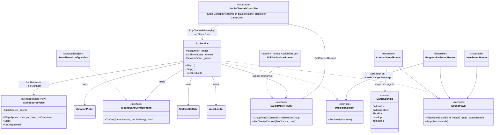
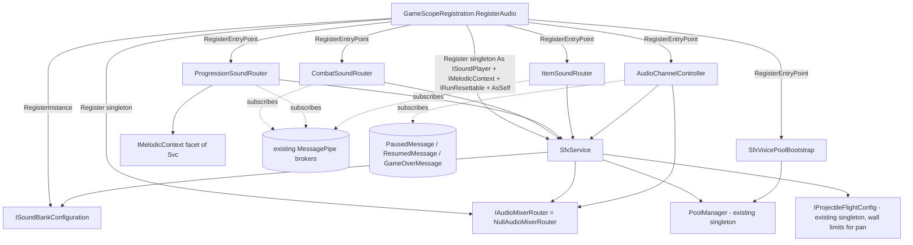
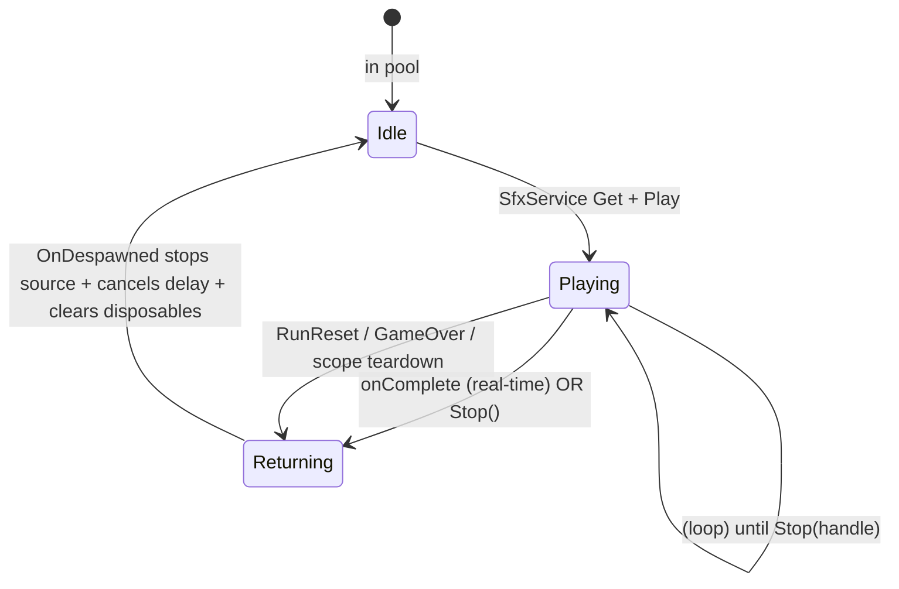

@page plan_audio Audio / SFX

# Audio / SFX

Give gameplay a voice — trigger sound effects at every key moment (pops, shots, shields,
items, streaks, level-up, game-over) by passively consuming the game's existing
MessagePipe event stream. The design goal is an *easy* handler: adding a new sound is one
enum value, one subscription line, and an authored clip — no plumbing.

---

## Principles

- **Native Unity audio, no middleware.** `AudioSource` + `AudioMixer` + pooled voices.
  No FMOD/Wwise: the variation, pooling, and voice-limiting we'd adopt middleware *for*
  are the ~200 lines we write anyway, and middleware adds licensing, a native plugin, and
  URP-upgrade friction a solo mobile project doesn't need. Revisit only if audio scope
  explodes into adaptive/interactive music.
- **Subscriber-only.** The audio system introduces **zero new message types**. It is a
  pure consumer of the existing event stream, mirroring `GameplayTelemetryService`. If a
  moment needs a signal that doesn't exist, add a message gameplay would plausibly want
  anyway — don't publish from audio.
- **Trivial to add a sound.** New moment = add a `GameSoundId`, subscribe one message in
  the relevant router, author the `SfxEntry`. No new types, no DI changes, no producer
  edits.
- **MVC-clean.** Routers and the service are plain C# (no `MonoBehaviour`, no `transform`).
  The pooled `AudioSourceVoice` View is the **only** type that touches a Unity audio API.
- **Data-driven, config behind a read-only interface.** All clips and tuning live in a
  `SoundBankConfiguration` ScriptableObject exposed as `ISoundBankConfiguration`. Nothing
  hardcoded, nothing duplicated via `[SerializeField]` on consumers.
- **Time-based throttling, never frame-based.** The single most important rule for this
  target. Coalescing/cooldown windows are in **wall-clock seconds**, and voices return via
  a real-time delay — never a per-frame `isPlaying` poll. A frame-based window fires twice
  as often at 120 Hz device as it did in a 60 Hz editor (the disturbance-field /
  GenerateMips over-pumping trap this repo has hit three times).
- **Decomposed internals.** The service delegates to focused plain-C# helpers
  (voice-limiter, throttle gate, variation picker) — each testable without VContainer or
  Unity.

---

## Architecture

### Folder structure

```
Assets/Source/Audio/
├── GameSoundId.cs                 ← semantic sound identity (enum), decoupled from messages
├── ISoundPlayer.cs                ← Play(GameSoundId, Vector3?) → SoundHandle; Stop(SoundHandle)
├── SoundHandle.cs                 ← readonly struct; only way to stop a loop
├── IMelodicContext.cs             ← narrow SfxService facet: SetStreak(int) feeds the pop scale-walk
├── IAudioMixerRouter.cs           ← seam to the mixer: GroupFor(channel), SetChannelDucked(channel, bool)
├── NullAudioMixerRouter.cs        ← stand-in impl until a real AudioMixer is wired (see Deferred)
├── SfxService.cs                  ← Controller: resolve → select → throttle → cap → play
├── AudioChannelController.cs      ← IStartable: Paused/Resumed duck the Gameplay channel; GameOver stops it
├── VoiceLimiter.cs                ← per-id + global voice accounting, priority steal/drop
├── SfxThrottleGate.cs             ← wall-clock cooldown + burst coalescing per id
├── VariationPicker.cs             ← clip round-robin (no immediate repeat) + pitch/volume RNG (plain or melodic)
├── VoicePlayback.cs               ← readonly struct: resolved clip/pitch/volume/pan/semitone for one play
├── PickContext.cs                 ← readonly struct: picker inputs (streak, current semitone, burst index, pan)
├── SoundIds.cs                    ← cached GameSoundId enum length; sizes the per-id ordinal arrays above
├── AudioPoolKeys.cs               ← PoolManager key for the voice pool
├── SfxVoicePoolBootstrap.cs       ← IStartable: register + pre-warm the voice pool
├── View/
│   └── AudioSourceVoice.cs        ← View (MonoBehaviour): the only Unity-audio type; poolable
├── Routing/
│   ├── CombatSoundRouter.cs       ← hit/deflect/absorb/fire/reload/cruise/shield/pierce
│   ├── ProgressionSoundRouter.cs  ← streak/score-chime/level-up/transition/board-clear/game-over
│   └── ItemSoundRouter.cs         ← per-ItemType activation, overflow, spawn-blocked
├── Configuration/
│   ├── ISoundBankConfiguration.cs ← read-only interface (TryGet(id, out entry), GlobalVoiceCap, MelodicScale/Root)
│   ├── SoundBankConfiguration.cs  ← ScriptableObject catalog — [EnumIndexed] entries, self-heals on OnValidate
│   ├── SfxEntry.cs                ← [Serializable] clips[] + pitch/vol ranges + cap + cooldown + channel + melodic mode
│   └── SfxChannel.cs             ← enum: Gameplay / UI / Stinger (→ AudioMixerGroup)
└── README.md
```

`MusicalPitchExtensions` (semitone ↔ pitch-multiplier math) lives in `Shared/Extensions/` —
it is generic equal-temperament math, not audio-specific, so it follows the "extension
methods in `Shared/Extensions/`" convention rather than living in this folder.

**Namespace:** `BalloonParty.Audio` (routing `BalloonParty.Audio.Routing`, view
`BalloonParty.Audio.View`, config `BalloonParty.Audio.Configuration`).

### Class diagram



### Sequence diagram — event to sound

```mermaid
sequenceDiagram
    participant Bus as MessagePipe
    participant R as CombatSoundRouter
    participant Svc as SfxService
    participant Gate as ThrottleGate + VoiceLimiter
    participant Pool as PoolManager
    participant V as AudioSourceVoice

    Bus->>R: ActorHitMessage (Outcome=Pop)
    R->>Svc: Play(GameSoundId.BalloonPop, worldPos)
    Svc->>Gate: allowed? (cooldown + per-id cap + global cap)
    alt throttled / capped
        Gate-->>Svc: drop (or coalesce into pitch-spread chord)
    else allowed
        Gate-->>Svc: ok; picker → clip + pitch + volume + pan
        Svc->>Pool: Get<AudioSourceVoice>("SfxVoice")
        Pool-->>Svc: voice
        Svc->>V: Play(clip, vol, pitch, pan, loop=false, onComplete)
        V->>V: AudioSource.Play (channel = SfxEntry.channel mixer group)
        V-->>Svc: onComplete after clip.length / |pitch| (real-time, ignoreTimeScale)
        Svc->>Pool: Return("SfxVoice", voice)
    end
```

### Dependency graph — VContainer wiring



`SfxService` is deliberately **bus-free** — it never injects `ISubscriber<T>` or
`PauseService` itself. Pause/duck/game-over reactions live entirely in
`AudioChannelController`, which calls `SfxService.StopChannel` and
`IAudioMixerRouter.SetChannelDucked` from the outside. This keeps the orchestrator a pure
`Play`/`Stop` surface and the pause policy independently swappable.

### Voice lifecycle



### Responsibility map

| Type | Layer | Does | Does NOT | Depends on (injected) | Lifetime |
|---|---|---|---|---|---|
| `GameSoundId` | Model | Semantic sound identity, decoupled from message types | Reference clips or Unity | — | (type) |
| `SoundHandle` | Model | `readonly struct` referencing an active voice; the only way to stop a loop | Touch Unity | — | (type) |
| `SfxEntry` | Model/config | `AudioClip[]` variations, pitch/volume ranges, `cooldownSeconds`, `maxConcurrentVoices`, `priority`, `channel`, `loop`, 2D pan flag, `MelodicMode` + tension semitones, editor-only fetch prompt | Play anything | — | (serializable) |
| `SoundBankConfiguration` → `ISoundBankConfiguration` | Model/config | `[EnumIndexed(typeof(GameSoundId))]` entries (one slot per id, no per-entry id field, no duplicates possible); `TryGet`; `MelodicScale`/`MelodicRootSemitone`; `GlobalVoiceCap`; `OnValidate` self-heals the entry array when a `GameSoundId` is appended | Touch runtime state | — | `RegisterInstance` |
| `IMelodicContext` | Model-facing interface | Narrow facet of `SfxService` — `SetStreak(int)` | Anything else on `SfxService` | — | (interface, implemented by `SfxService`) |
| `IAudioMixerRouter` → `NullAudioMixerRouter` | Controller/config seam | `GroupFor(channel)` resolves an `AudioMixerGroup`; `SetChannelDucked(channel, bool)` applies (or, in the null stand-in, no-ops) the duck | Own pause/game-over policy | — | `Register` singleton |
| `SfxService : ISoundPlayer, IMelodicContext, IRunResettable` | **Controller** | Resolve id → entry, pick variation, enforce cooldown + per-id + global voice cap + priority, `Get()`/`Return()` pooled voice, own loop `SoundHandle`s, remember current melodic semitone/streak, flush all voices on `ResetRun` | Touch `AudioSource`; subscribe to any message; know about pause | `ISoundBankConfiguration`, `PoolManager`, `IAudioMixerRouter`, `IProjectileFlightConfig` (wall limits, for X→pan), `VoiceLimiter`, `SfxThrottleGate`, `VariationPicker` | `Register` singleton |
| `AudioChannelController` | Controller (IStartable) | Subscribes `PausedMessage`/`ResumedMessage` → duck/un-duck the `Gameplay` channel; `GameOverMessage` → `SfxService.StopChannel(Gameplay)` | Touch `UI`/`Stinger` channels; pick sounds | `ISubscriber<…>`, `IAudioMixerRouter`, `SfxService` | `RegisterEntryPoint` |
| `VoiceLimiter` | Controller | Per-id + global active-voice accounting; priority steal/drop | Selection, pooling | — | owned field |
| `SfxThrottleGate` | Controller | Wall-clock cooldown per id; coalesce a burst into N pitch-spread voices | — | — | owned field |
| `VariationPicker` | Controller | Clip round-robin (no immediate repeat) + pitch/volume RNG, or melodic scale-walk/tension semitone resolution | Throttle, pooling | — | owned field |
| `*SoundRouter` (×3) | Controller (IStartable) | Translate messages → `(GameSoundId, position)` and call `ISoundPlayer` (`ProgressionSoundRouter` also forwards the streak to `IMelodicContext`) | Pick clips, compute volume, throttle | `ISubscriber<…>`, `ISoundPlayer` (`ProgressionSoundRouter` also: `IMelodicContext`) | `RegisterEntryPoint` |
| `AudioSourceVoice` | **View** | Wrap one `AudioSource`; `Play`/`Stop`; schedule own real-time return; `OnDespawned` cleanup | Selection, throttle, subscribe | — (no `[Inject]`) | pooled |
| `SfxVoicePoolBootstrap` | Controller (IStartable) | Register `SimplePoolChannel<AudioSourceVoice>` and pre-warm N voices | Play anything | `PoolManager`, voice prefab | `RegisterEntryPoint` |

`AudioSourceVoice` has **no `[Inject]` fields**, so it uses `SimplePoolChannel<AudioSourceVoice>`
(the no-DI case), not `InjectingPoolChannel`. It is modeled on `EffectView`
(`Shared/Pool/EffectView.cs`) — reuse its cached `_selfReturn` delegate + `OnComplete` +
`OnDespawned()` cleanup shape to stay zero-alloc on the hot path.

---

## Channels (the pause / context answer)

Every `SfxEntry` names an `SfxChannel`, which maps to an `AudioMixerGroup` on one shared
`AudioMixer`. Freeze/pause behavior is then **per-channel**, not a blunt
`AudioListener.pause`:

| Channel | Mixer group | On gameplay freeze (`PausedMessage`) | On `GameOverMessage` |
|---|---|---|---|
| `Gameplay` | Gameplay | **Ducked** — pops, shots, shields, items stop bleeding over the ceremony | **Stopped outright** (every active `Gameplay` voice) |
| `UI` | UI | Keeps playing — button taps, confirms | Keeps playing |
| `Stinger` | Stinger/Music | Keeps playing — the level-up fanfare, game-over sting play through | Keeps playing |

Because audio ignores `Time.timeScale`, this is explicit: `AudioChannelController` — a small,
dedicated `IStartable`, not `SfxService` itself — subscribes to `PausedMessage`/
`ResumedMessage` and calls `IAudioMixerRouter.SetChannelDucked(Gameplay, …)`, and subscribes
to `GameOverMessage` to call `SfxService.StopChannel(Gameplay)`. Keeping this policy off
`SfxService` means the orchestrator stays a pure `Play`/`Stop` surface with no bus
dependency, and the duck/stop policy is swappable independently. `IAudioMixerRouter` is
currently `NullAudioMixerRouter` (see *Deferred*), so today the duck call is a no-op and
`Gameplay` audio simply keeps playing through a pause — only the `GameOver` stop is live
end-to-end. The mixer also gives us a master-volume control and a music-under-stinger duck
seam for free later, without a refactor.

---

## Spatialization

Default **2D with a subtle stereo pan derived from world-X** (`AudioSource.panStereo`
mapped from the sound's horizontal position relative to the camera). `spatialBlend = 0`
(no distance rolloff). Routers pass a `Vector3?` position; the voice converts X → pan.
This gives directional feel for a 2D arcade board without the moving-listener fiddliness
that full 3D would introduce during the camera-down loss transition and level-up pan.
Full spatial 3D is out of scope (see Deferred).

---

## SFX moment inventory

Every row is an **existing** publish — the router subscribes, no producer edits. All
brokers are already registered at `Game/GameScopeRegistration.cs:59-94`.

| Moment | Message | Publish site | `GameSoundId` | Router | Notes |
|---|---|---|---|---|---|
| Balloon pop | `ActorHitMessage` (Outcome `Pop`) | `Game/HitPipeline.cs:34` | `BalloonPop` | Combat | **Hottest path.** Bomb/laser/pierce pop dozens/frame → voice-cap + coalesce mandatory. Carries `WorldPosition`, `Actor` (color → variation). |
| Deflect | `ActorHitMessage` (`Deflect`) | `HitPipeline.cs:34` | `BalloonDeflect` | Combat | Branch on `Outcome`; prefer the single `ActorHitMessage` sub over `BalloonDeflectedMessage`. |
| Absorb / pass-through | `ActorHitMessage` (`Absorb`/`PassThrough`) | `HitPipeline.cs:34` | `BalloonResist` | Combat | Distinguish via `HitOutcome` flags (`Slots/Capabilities/HitOutcome.cs`). |
| Shot fired | `ProjectileFiredMessage` | `Projectile/View/ProjectileView.cs:561` | `ShotFired` | Combat | Muzzle pos + heading. |
| Reload | `ProjectileLoadedMessage` | `Thrower/ThrowerController.cs:194` | `ShotReload` | Combat | "cock" sound. |
| Cruise start/end | `ProjectileCruiseStarted/EndedMessage` | `ProjectileView.cs:753`/`:758` | `CruiseLoopStart`/`Stop` | Combat | **Loop** — start returns `SoundHandle`, end calls `Stop(handle)`. |
| Doomed start/end | `ProjectileDoomedStarted/EndedMessage` | `ProjectileView.cs:921`/`:925` | `DoomedWarn` | Combat | Optional tension cue. |
| Pierce discharge | `PierceDischargedMessage` | `Projectile/Controller/ProjectileHitResolver.cs:111` | `PierceDischarge` | Combat | `isRainbow` → variant. |
| Shield gained | `ShieldGainedMessage` | `ProjectileHitResolver.cs:175`, `Item/Shield/ShieldItemHandler.cs:81` | `ShieldGained` | Combat | Two sites, one sub. |
| Shield lost | `ShieldLostMessage` | `ProjectileView.cs:463` | `ShieldLost` | Combat | Bounce point. |
| Item activated | `ItemActivatedMessage` | `Item/ItemActivator.cs:90` | `ItemBomb`/`ItemLaser`/`ItemLightning`/`ItemPaint`/`ItemSnipe`/`ItemShield` | Item | Type discovery — see Open Questions. |
| Streak changed | `StreakChangedMessage` | `Game/Score/ColorStreakTracker.cs:94` | `StreakStep` | Progression | Rising pitch keyed to `Streak`; throttle. |
| Score trail arrived | `ScoreTrailArrivedMessage` | `Game/Score/ScoreTrailService.cs:198` | `ScoreChime` | Progression | Per-color pitch; frequent → throttle. |
| Level up | `ScoreLevelUpMessage` | `Game/Level/LevelController.cs:324` | `LevelUp` | Progression | Fanfare; **high priority**, `Stinger` channel. |
| Level-up glow trails | `LevelUpGlowTrailsMessage` | `UI/LevelUp/LevelUpPopUp.cs:106` | `LevelUpGlow` | Progression | Sparkle bed. |
| Level-up dismissed | `LevelUpDismissedMessage` | `UI/LevelUp/LevelUpPopUp.cs:180` | `UiConfirm` | Progression | `UI` channel. |
| Level transition done | `LevelTransitionCompletedMessage` | `Game/Level/LevelTransitionController.cs:155` | `LevelTransition` | Progression | |
| Board clear | `BoardClearMessage` | `Game/Run/BoardClearController.cs:20` | `BoardClear` | Progression | |
| Game over | `GameOverMessage` | `Game/Run/RunController.cs:96` | `GameOver` | Progression | Loss sting; high priority; stops loops; `Stinger`. |
| Game over dismissed | `GameOverDismissedMessage` | `UI/GameOver/GameOverScreen.cs:65` | `UiConfirm` | Progression | `UI` channel. |
| Overflow heart (danger) | `OverflowHeartRequestedMessage` | `Balloon/Spawner/RejectedBalloonEffect.cs:254` | `HeartDrain` | Item/Prog | Danger beat. |
| Spawn blocked | `SpawnBlockedMessage` | `RejectedBalloonEffect.cs:147,:255` | `OverflowThud` | Item | Column-keyed; throttle. |
| Run reset | `RunResetMessage` | `Game/Run/RunController.cs:120` | *(control)* | — | **Flush all voices + stop loops**, no sound. |
| Pause / resume | `PausedMessage`/`ResumedMessage` | `Shared/Pause/PauseService.cs:50,:65` | *(control)* | — | Channel duck/pause policy hook. |
| Nudge | `NudgeMessage` | `Balloon/Controller/BalloonController.cs:208`, `Item/Bomb/BombItemHandler.cs:76` | **none** | — | Deliberately silent — per-jostle spam. |

---

## Melodic pops (streak-driven scale)

The simple-balloon pop is not a fixed sound — it **walks up a musical scale as the streak
climbs**. Rather than randomized pitch, the `BalloonPop` variation for simple balloons
maps the current streak multiplier to a scale degree: in C major, successive pops play
C → D → E → F → G → … . A hot streak becomes a rising phrase; a streak break resets to the
root. This is the melodic-combo game-feel trick (a la many puzzle games) and it turns the
most-repeated sound in the game into a reward.

The organizing principle: **consonance is reward, dissonance is tension.** The positive
walk deliberately avoids semitones so it can never sound "wrong"; the semitone is reserved
as an expressive tool for the *negative* events (deflect, wall hit) so a bad outcome is
heard before it's parsed.

**Design shape:**
- **Simple balloons only.** Special/item/tough balloons keep their own distinct sound — a
  flag on the `SfxEntry` (or a dedicated `GameSoundId.BalloonPopMelodic`) selects the
  scale-walk behavior so it doesn't apply to every pop.
- **Positive walk is semitone-free.** The pop scale is **pentatonic** (or whole-tone) —
  no adjacent half-steps, so consecutive pops sound consonant in any order or at any burst
  speed. This replaces the earlier "C major vs pentatonic" open question: pentatonic wins
  because the reward sound must never land a clash.
- **Scale-degree source is the streak, not random.** `VariationPicker` gains a melodic
  mode: instead of pitch RNG, it computes `semitone = scale[streak mod scale.Length]`
  (with octave rollover as the streak exceeds the scale length) and sets the voice pitch
  from that. **Shipped as designed:** the streak arrives via `StreakChangedMessage`
  (`Game/Score/ColorStreakTracker.cs:94`); `ProgressionSoundRouter` forwards it to
  `SfxService` through the narrow `IMelodicContext.SetStreak(int)` facet on every change, and
  `SfxService` remembers the resulting semitone so a same-frame `Tension` entry (deflect/wall
  hit) can react against it.
- **Negative events lean into the semitone — with distinct tension notes per event.**
  `BalloonDeflect` and the wall-hit / shield loss on bounce (`ShieldLostMessage`,
  `ProjectileView.cs:463`) each play a *different* dissonant interval against the current
  pop key, so the two failures are audibly distinguishable, not one generic "wrong" buzz.
  E.g. deflect = a minor-2nd rub above the current degree (a near-miss "so close" bite);
  wall hit = a flat/downward step below the root (a heavier "dropped it" thud). This is
  the *purpose* of the semitone, not a defect to tune out.
- **Scale is config, not hardcoded.** The key + the positive scale (pentatonic default)
  plus a per-event tension interval (deflect's rub, wall hit's drop) all live on the
  `SoundBankConfiguration` as semitone offsets, so key/mode and each dissonance flavor are
  tunable (per-level key possible later).
- **Reset on streak break.** Degree returns to the root when the streak resets, so the
  phrase restarts cleanly rather than jumping mid-scale.

**Open feel questions (device audition):** octave-rollover vs cap at the top of the scale;
the exact intervals for deflect vs wall hit (they're distinct — just which two land best);
whether per-color streaks each get their own voice/register. Slot: Phase 2 (the pop itself
ships in Phase 1 with plain variation; the melodic walk + tension notes layer on once the
core loop feels right).

---

## Phase 1 — Core loop, no message changes — SHIPPED (Steps 1-6)

Ships the spine plus the first-pass core sounds. Everything uses signals already on the
bus; the only gameplay-code change is the `RegisterAudio` line. All six steps below are
code-complete, reviewed, and committed:

1. **Foundation + config layer** — `GameSoundId`, `SoundHandle`, `SfxEntry`,
   `SoundBankConfiguration`/`ISoundBankConfiguration`, `SfxChannel`.
2. **Variation/limiting/throttle helpers** — `VariationPicker`, `VoiceLimiter`,
   `SfxThrottleGate`.
3. **Pooled voice** — `AudioSourceVoice` + `SfxVoicePoolBootstrap`.
4. **Orchestrator + channel controller** — `SfxService`, `AudioChannelController`,
   `IAudioMixerRouter`/`NullAudioMixerRouter`, `IMelodicContext`.
5. **Routers + wiring** — `CombatSoundRouter`, `ProgressionSoundRouter`, `ItemSoundRouter`,
   `RegisterAudio` in `GameScopeRegistration`, called from `GameLifetimeScope.Configure`
   after `RegisterPresentation()`.
6. **Registration guard-branch coverage** — `RegisterAudioTests` (null-prefab / null-bank
   fallback paths).

**Still open (not part of the code deliverable):** a real `AudioMixer` asset with
`Gameplay`/`UI`/`Stinger` groups — `IAudioMixerRouter` is `NullAudioMixerRouter` until that
asset exists and a real router implementation is wired in — and authoring the actual
`SfxEntry` clips on the `SoundBankConfiguration` asset (an editor/content task; every id
plays silently until its entry has clips). See *Deferred* in the README and below.

### First-pass sounds to author

`BalloonPop` (hot path), `ShotFired`, `ShotReload`, `ShieldGained`, `ShieldLost`,
per-item (×6), `StreakStep`, `LevelUp`, `GameOver`. The rest are enum entries authored
later. (The enum, routing, and playback machinery for all of these already ship in code —
this list is purely the content/authoring backlog against the `SoundBankConfiguration`
asset.)

### Voice management

- **Per-id cap** (e.g. 3–4 concurrent pops) **and** a **global cap** (~16, well under
  Android's ~32 real voices; set Project Settings → Audio *Max Real Voices* deliberately).
- **Priority** so `LevelUp`/`GameOver` (`Stinger`) can't be starved by pop spam.
- **Burst coalescing** collapses a same-id burst within a wall-clock window into a few
  voices with a pitch spread ("chord", not 30 clicks), with diminishing-returns volume.

### Return scheduling

`AudioSourceVoice` schedules its own return via `UniTask.Delay(clip.length / |pitch|,
ignoreTimeScale: true)` — O(1) per voice, no per-frame poll, identical at 60/120 Hz.
`ignoreTimeScale` is mandatory or voices leak during a `timeScale = 0` level-up freeze.
If profiling shows pressure, migrate to a single central due-time ticker (still not
per-voice polling) — mirrors the `BalloonMotionTicker` central-ticker precedent.

### Teardown

`OnDespawned()` must `_source.Stop()`, null the clip (a held `AudioClip` pins memory),
null the completion callback, and cancel the pending-return `CancellationTokenSource`.
The voice holds no UniRx subscriptions, so there is no `CompositeDisposable` to clear (the
pooled-view `AddTo(this)`-never-fires rule only applies when a pooled view subscribes).
`SfxService` implements `IRunResettable` (`ResetOrder = RunResetOrder.Quiesce`, the earliest
stage) so `RunController.RestartRun` flushes every active voice and loop before any other
system resets — a dropped `Stop` from the previous run can't strand a loop into the next one.
`GameOverMessage` is handled separately, by `AudioChannelController`, which only stops the
`Gameplay` channel (see *Channels*) — it does not touch `UI`/`Stinger` voices or reset the
picker/throttle state the way a full run reset does.

### Clip import settings (device)

Short SFX → **ADPCM + Decompress On Load** (near-zero decode CPU, no per-play hitch — the
right choice for pops/impacts). Very short stingers → PCM. Long music/ambience (later) →
Vorbis + Streaming. Downsample SFX to ~22 kHz where transparent. Keep clips out of
`Resources/`. Pre-warm the voice pool in the existing async preload window to avoid a
first-play hitch.

### GC / hot-path

Zero steady-state allocation on `BalloonPop`: pooled voices, `readonly struct
SoundHandle`, enum keying that avoids boxing (`int`-keyed table or a custom comparer — a
raw `Dictionary<GameSoundId,…>` boxes the enum key), no LINQ in `Play`, cached return
delegate (no per-call closure), pass settings by `in`.

---

## Phase 2 — Fill-out + optional signals

- Author the remaining inventory sounds (cruise/doomed loops, pierce, board-clear, level
  transition, overflow, score chime, UI confirms).
- **Melodic pops** — layer the streak-driven scale walk onto simple-balloon `BalloonPop`
  (see the *Melodic pops* section). Config-driven key/scale; reset on streak break.
- **Optional message tweak:** add an `ItemType` field to `ItemActivatedMessage` if we'd
  rather the item router read the type directly than downcast the balloon (Open Q1).
- **Audio metrics via telemetry** (piggyback `PLAN-GameplayTelemetry`, subscriber-only):
  peak concurrent voices, voice-steal count, coalesced-burst count, dropped-sound count
  per id (a high drop rate on a *meaningful* sound means the throttle is eating feedback
  the player needs). Dev-build only, flush at level boundary.

---

## Phase 3 — Deferred

- **Automated SFX asset fetching.** An **editor-only** `ISfxProvider` seam fills empty
  clip slots at author time from a per-`SfxEntry` description prompt. The runtime stays
  fully independent. Provider candidates: an internal library, a Freesound-style API, or a
  text-to-SFX API (e.g. ElevenLabs). **Licensing must be cleared before any fetched or
  generated audio ships in a commercial build** — this is the gating concern, not the
  integration.
- **Full spatial 3D** (`spatialBlend = 1` + rolloff), if the board ever needs distance
  cues.
- **Launcher-scene SFX** (menu button taps). This design is scoped to `GameLifetimeScope`;
  if the Launcher needs audio, promote the service to a shared/persistent scope.
- **Music / ambience bus** beyond the `Stinger` channel already reserved.

---

## Test strategy

Shipped, per `Assets/Tests/README.md`:

```
Assets/Tests/EditMode/Audio/
├── SoundHandleTests.cs             ← equality/validity on (voiceId, generation)
├── SoundBankConfigurationTests.cs  ← TryGet: authored/empty/unauthored/None/out-of-range id
├── VariationPickerTests.cs         ← plain range, ScaleWalk/Tension semitone math, burst spread, no-repeat
├── VoiceLimiterTests.cs            ← per-id + global cap, priority steal/drop, release accounting
├── SfxThrottleGateTests.cs         ← wall-clock cooldown, burst coalescing (injected clock)
├── AudioSourceVoiceTests.cs        ← null-clip synchronous-completion guard (EditMode-safe slice only)
├── MusicalPitchExtensionsTests.cs  ← semitone ↔ pitch-multiplier math (Shared/Extensions)
├── CombatSoundRouterTests.cs       ← ActorHitMessage/fired/loaded/cruise → (GameSoundId, position)
├── ProgressionSoundRouterTests.cs  ← streak → IMelodicContext + StreakStep
└── ItemSoundRouterTests.cs         ← per-ItemType id mapping, non-item-slot guard

Assets/Tests/EditMode/Game/
└── RegisterAudioTests.cs           ← RegisterAudio null-prefab / null-bank guard branches

Assets/Tests/PlayMode/
└── SfxServiceGenerationGuardPlayModeTests.cs  ← Stop(stale handle) after a slot steal is a no-op
```

- **Routers are unit-tested without an `AudioSource`:** publish a message, assert the
  `(GameSoundId, position)` call on a mocked `ISoundPlayer`.
- **`VoiceLimiter` / `SfxThrottleGate` / `VariationPicker` are pure plain C#** with an
  injected `Func<float>` clock (throttle gate) or `System.Random` (picker) →
  deterministic, no wall-clock or Unity dependency.
- **The slot-generation guard is a PlayMode test**, not EditMode: reaching the
  "steal a slot in place" branch needs a real, non-null-clip `AudioSourceVoice.Play()` so
  the voice doesn't complete synchronously — real `AudioSource.Play()` needs the player loop.
- Actual audio behavior — Android latency (AAudio/OpenSL), voice-cap feel, coalescing
  tuning, pan — **requires an on-device (Pixel 9) playtest**; `dotnet build` and the
  editor cannot validate it. Bias DSP buffer toward *Good/Best Latency* and measure.

---

## Open questions

1. **Item type discovery.** `ItemActivatedMessage` (`Item/ItemActivator.cs:90`) carries
   only `msg.Balloon`. The item router can downcast it to `IHasItemSlot` and read
   `.Item.Value` (keeps audio a pure consumer, no producer edit) **or** we add an
   `ItemType` field to the message (cleaner read, wider blast radius). Default: downcast;
   decide at implementation.
2. **Burst policy for pops.** Hard cap-and-drop vs coalesce into a pitched chord — a feel
   call needing device audition. Default: coalesce.
3. **Loops.** Cruise/doomed as sustained loops (adds `SoundHandle` bookkeeping) or
   one-shots? Default: cruise loops, doomed one-shot.
4. **Channel duck vs hard-pause on freeze.** Snapshot-duck the `Gameplay` group or fully
   pause it during level-up/game-over? Default: duck.
