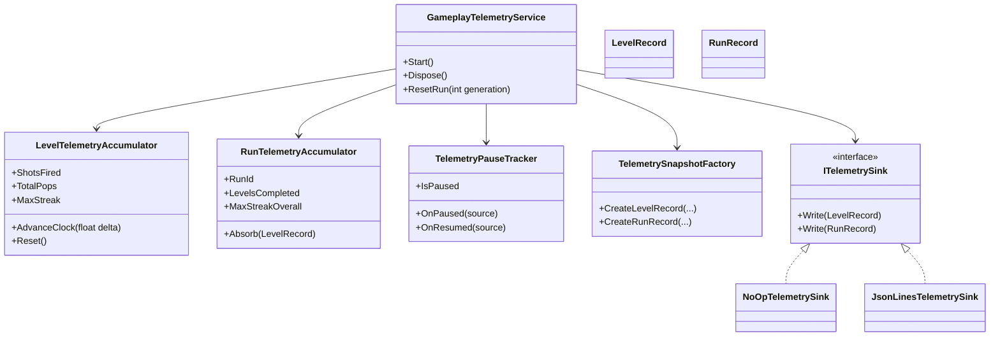
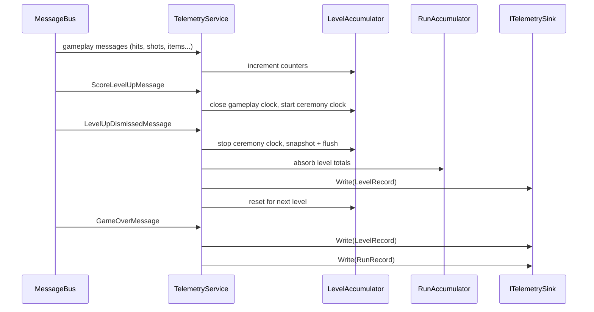
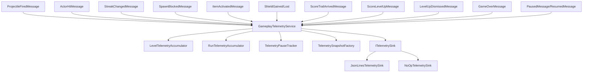

@page plan_gameplay_telemetry Gameplay Telemetry

# Gameplay Telemetry

Answer balance and pacing questions from real play data — how long levels take, where
runs die, which items get used, how streaks behave — by passively listening to the
game's internal event stream and writing structured records to a local log file.

---

## Principles

- **Gameplay only.** No PII, no device fingerprinting, no session identity beyond a
  monotonic run counter.
- **Subscriber-only collection.** The telemetry service consumes existing MessagePipe
  messages. It never publishes. If a stat needs a signal that doesn't exist, add a
  message that gameplay would plausibly want anyway (Phase 2).
- **Aggregate in memory, flush at boundaries.** Per-level and per-run accumulators,
  flushed as one record when the level transition fully completes (on
  `LevelUpDismissedMessage`) or at game-over. No per-pop I/O or allocation during bursts.
- **Sink behind an interface.** `ITelemetrySink` abstracts the destination; the first
  implementation writes JSON Lines to disk. A `NoOpTelemetrySink` is always registered
  in release builds so the service never null-checks before writing. A network sink is a
  future drop-in, not a redesign.
- **Decomposed internals.** The service delegates to focused helpers (accumulators, pause
  tracker, snapshot factory). Each helper is a plain C# class — testable in isolation
  without VContainer or Unity.

---

## Architecture

### Folder structure

```
Assets/Source/Game/Telemetry/
├── GameplayTelemetryService.cs      ← VContainer entry point (orchestrator)
├── LevelTelemetryAccumulator.cs     ← mutable counters/timers for one level
├── RunTelemetryAccumulator.cs       ← run totals, bests, metadata
├── TelemetryPauseTracker.cs         ← per-source pause depth tracking
├── TelemetryStopwatch.cs            ← deterministic timer (Advance/Pause/Resume/Reset)
├── TelemetrySnapshotFactory.cs      ← converts accumulators → immutable DTOs
├── LevelRecord.cs                   ← sealed DTO, per-level snapshot
├── RunRecord.cs                     ← sealed DTO, per-run summary
├── ColorPopCount.cs                 ← typed breakdown entry (color + count)
├── ItemActivationCount.cs           ← typed breakdown entry (item type + count)
├── ITelemetrySink.cs                ← write interface
├── NoOpTelemetrySink.cs             ← always-registered release-build sink
├── JsonLinesTelemetrySink.cs        ← local-file sink (dev builds only)
└── README.md
```

**Namespace:** `BalloonParty.Game.Telemetry`

### Class diagram



### Sequence diagram — level flush



### Dependency graph



### Service

`GameplayTelemetryService` — plain C# class registered as an entry point. Orchestrates
the internal helpers; owns no mutable counting state itself.

| Interface | Purpose |
|---|---|
| `IStartable` | Subscribe to messages via `CompositeDisposable` |
| `IDisposable` | Dispose `CompositeDisposable` for teardown |
| `IRunResettable` | Full reset on `RunResetMessage` (stage: after counters) |

Constructor receives all helpers and the sink via **constructor injection** (no
`[Inject]` methods) so the service can be instantiated in tests without VContainer.

**Registration:** `GameScopeRegistration.RegisterGameplaySystems`, after `SpaceDanger`.

### Internal helpers

| Type | Responsibility |
|---|---|
| `LevelTelemetryAccumulator` | Mutable counters and `TelemetryStopwatch` instances for the current level. Exposes `Reset()` for reuse across levels without reallocation. Pre-sizes collections in the constructor. |
| `RunTelemetryAccumulator` | Run-wide totals and bests. `Absorb(LevelRecord)` folds each flushed level into the run. |
| `TelemetryPauseTracker` | Tracks pause depth (incremented by `OnPaused(source)`, decremented by `OnResumed(source)`). `IsPaused` is true when depth > 0. Handles nested pauses correctly. |
| `TelemetryStopwatch` | Pure C# timer. Methods: `Advance(float delta)`, `Pause()`, `Resume()`, `Reset()`, property `Elapsed`. Tests call `Advance` directly — no wall-clock dependency. |
| `TelemetrySnapshotFactory` | Converts accumulator state into immutable `LevelRecord` / `RunRecord` DTOs. Reads `CheatState` flags at snapshot time. |

### Sink

`ITelemetrySink` — one method per record type (`Write(LevelRecord)`,
`Write(RunRecord)`).

**Always-registered pattern:** In dev builds, `JsonLinesTelemetrySink` is registered as
a Singleton. In release builds, `NoOpTelemetrySink` (empty method bodies) is registered
instead. The service always calls `sink.Write(...)` unconditionally — no null-checks, no
`#if` guards at the call site.

---

## Phase 1 — Passive Counters (no message changes)

Everything in this phase uses signals already on the bus. No gameplay code is modified
beyond adding the telemetry registration line.

### Flush boundaries

The level record flush happens on **`LevelUpDismissedMessage`**, not on
`ScoreLevelUpMessage`. Rationale: the level record includes `CeremonyDurationSeconds`
(time between level-up trigger and player dismissal) and late-arriving score trails that
complete during the transition. `LevelUpDismissedMessage` is the latest safe point before
the next level begins.

On `ScoreLevelUpMessage` the service stops the gameplay clock and starts the ceremony
clock. On `LevelUpDismissedMessage` the service stops the ceremony clock, creates the
snapshot, writes it, absorbs it into the run accumulator, and resets the level
accumulator for the next level.

On `GameOverMessage` the service flushes whatever the current level accumulator holds
(partial level) plus the run record.

### LevelRecord fields

| Field | Type | Source |
|---|---|---|
| `LevelIndex` | `int` | Incremented on `ScoreLevelUpMessage` |
| `DurationSeconds` | `float` | Gameplay timer (excludes pause + ceremony) |
| `WallDurationSeconds` | `float` | Wall timer (excludes pause only) |
| `ShotsFired` | `int` | `ProjectileFiredMessage` |
| `TotalPops` | `int` | `ActorHitMessage` where Outcome == Pop |
| `PopsByColor` | `IReadOnlyList<ColorPopCount>` | Same, broken down by color |
| `Deflects` | `int` | `ActorHitMessage` where Outcome == Deflect |
| `MaxStreak` | `int` | `StreakChangedMessage` — running max |
| `PointsBanked` | `int` | `ScoreTrailArrivedMessage` — sum of Points |
| `OverflowCount` | `int` | `SpawnBlockedMessage` count |
| `ShieldsGained` | `int` | `ShieldGainedMessage` |
| `ShieldsSpent` | `int` | `ShieldLostMessage` |
| `ItemsActivated` | `IReadOnlyList<ItemActivationCount>` | `ItemActivatedMessage` |
| `CeremonyDurationSeconds` | `float` | Time between `ScoreLevelUpMessage` and `LevelUpDismissedMessage` |
| `CheatActive` | `bool` | Any `CheatState` flag active at flush time |

#### Typed breakdown entries

```csharp
// Replaces Dictionary<string, int>
public readonly struct ColorPopCount
{
    public string ColorName { get; }
    public int Count { get; }
}

// Replaces Dictionary<ItemType, int>
public readonly struct ItemActivationCount
{
    public ItemType ItemType { get; }
    public int Count { get; }
}
```

### RunRecord fields

| Field | Type | Source |
|---|---|---|
| `RunId` | `int` | Monotonic counter (not persisted; resets on app restart) |
| `LevelsCompleted` | `int` | Count of flushed LevelRecords this run |
| `TotalDurationSeconds` | `float` | Sum of LevelRecord wall durations |
| `TotalScore` | `int` | Final score at game-over |
| `EndCause` | `LossCause` | Hardcoded `HealthDepleted` in Phase 1 |
| `TotalShotsFired` | `int` | Accumulated across levels |
| `TotalPops` | `int` | Accumulated across levels |
| `MaxStreakOverall` | `int` | Best streak in the entire run |
| `CheatActive` | `bool` | Any cheat active during any level |
| `Timestamp` | `string` | ISO 8601 UTC at flush time |

### Message subscriptions

| Message | Accumulator effect |
|---|---|
| `ProjectileFiredMessage` | `ShotsFired++` |
| `ActorHitMessage` (Pop) | `TotalPops++`, color pop count incremented |
| `ActorHitMessage` (Deflect) | `Deflects++` |
| `StreakChangedMessage` | `MaxStreak = max(MaxStreak, msg.Streak)` |
| `ScoreTrailArrivedMessage` | `PointsBanked += msg.Points` |
| `SpawnBlockedMessage` | `OverflowCount++` |
| `ItemActivatedMessage` | Item activation count incremented by type |
| `ShieldGainedMessage` | `ShieldsGained++` |
| `ShieldLostMessage` | `ShieldsSpent++` |
| `ScoreLevelUpMessage` | Close gameplay clock, start ceremony clock, increment level index |
| `LevelUpDismissedMessage` | Stop ceremony clock → snapshot → write → absorb → reset |
| `GameOverMessage` | Flush final `LevelRecord` + `RunRecord` |
| `RunResetMessage` | Full reset via `IRunResettable` |
| `PausedMessage` | `TelemetryPauseTracker.OnPaused(source)` → pause stopwatches if depth crosses 0→1 |
| `ResumedMessage` | `TelemetryPauseTracker.OnResumed(source)` → resume stopwatches if depth crosses 1→0 |

### Time tracking

Timers use **timestamp-delta** strategy: record `Time.realtimeSinceStartup` on resume,
diff on pause/flush. Zero per-frame cost — no `ITickable` needed.

Internally this is wrapped in `TelemetryStopwatch`, which exposes `Advance(float)` for
test determinism. In production the service calls `Advance(currentTime - lastTimestamp)`
at pause/flush boundaries. A `Func<float>` clock source is injected so tests can supply
a fake clock.

| Timer | Starts | Pauses on | Resumes on |
|---|---|---|---|
| **Gameplay** | Game entry | `PausedMessage` (depth 0→1), `ScoreLevelUpMessage` | `ResumedMessage` (depth 1→0), `LevelUpDismissedMessage` |
| **Wall** | Game entry | `PausedMessage` (depth 0→1) | `ResumedMessage` (depth 1→0) |

### Pause semantics

`PausedMessage` and `ResumedMessage` are per-source edges. Multiple systems can pause
independently (e.g. settings menu + ad overlay). A naive toggle would resume too early.

`TelemetryPauseTracker` maintains a **pause depth counter**:
- `OnPaused(source)` → depth++. If depth was 0, timers pause.
- `OnResumed(source)` → depth--. If depth reaches 0, timers resume.
- Clamped at zero (a spurious resume never goes negative).

### Performance notes

- **Pre-size `PopsByColor`** from palette color count in constructor. No resize during
  gameplay.
- **Use `int[]` indexed by `(int)ItemType`** in `LevelTelemetryAccumulator` instead of a
  dictionary — avoids enum boxing on every item activation. The snapshot factory converts
  to `IReadOnlyList<ItemActivationCount>` at flush time.
- **`CompositeDisposable`** collects all MessagePipe subscriptions for one-call teardown.
- **No record pooling** — flush frequency (~30–120 s) makes allocation negligible.
- **Synchronous file I/O** — flush happens during the ceremony state (player is watching
  an animation), not during burst gameplay.
- Plain field increments (`ShotsFired++`) are zero-alloc. MessagePipe subscriptions are
  one-time setup. Both fine.

### JsonLinesTelemetrySink

| Aspect | Detail |
|---|---|
| Path | `Application.persistentDataPath + "/telemetry/"` |
| File naming | `telemetry_YYYYMMDD_HHmmss.jsonl` — one file per app session |
| Line format | JSON object with `"type": "level"` or `"type": "run"` plus all record fields |
| Rotation | On `Start()`, scan directory, keep the 20 most recent files, delete the rest |
| Build guard | `#if UNITY_EDITOR \|\| DEVELOPMENT_BUILD` (registration only — call sites are guard-free) |

### Cheat tagging

At flush time, `TelemetrySnapshotFactory` inspects `CheatState` flags. If any are
active, it sets `CheatActive = true` on the record. Records are never dropped — tagged
for filtering during analysis.

---

## Phase 2 — Minimal Message Additions

Small, justified additions to the message bus that benefit systems beyond telemetry.

### New types

| Type | Where | Purpose |
|---|---|---|
| `LossCause` enum | `Game/Health/` or message file | `HealthDepleted` (only value for now; extensible) |
| `HealthChangedMessage` | `Game/Health/` | `Previous` (int), `Current` (int) — published by `PlayerHealthController` on every HP change |

### Telemetry additions

- `EndCause` on `RunRecord` populated from `GameOverMessage.LossCause` instead of
  hardcode.
- Track HP minimum per level (via `HealthChangedMessage`).
- Track max danger level per level (via `IDangerLevel` injection, sampled on overflow).

### Registration

Register `HealthChangedMessage` broker in `GameScopeRegistration.RegisterMessages`
alongside the existing health-related messages.

---

## Phase 3 — Deferred

Items parked for future sessions; no design work needed now.

- Streak-break reason decomposition (what ended the streak)
- Burst-rate summaries (pops-per-second peaks)
- Time-to-first-pop per level
- Accuracy ratio (pops / shots)
- Editor window (`Tools > BalloonParty > Telemetry Viewer`)
- Remote/network sink implementation
- Run-counter persistence across app restarts (PlayerPrefs or file)

---

## Test Strategy

### File structure

```
Assets/Tests/EditMode/Game/Telemetry/
├── GameplayTelemetryServiceTests.cs   (~18 tests: flush, reset, boundaries)
├── TelemetryStopwatchTests.cs         (~10 tests: pause/resume state machine)
└── TelemetrySerializationTests.cs     (~4 tests: JSON round-trip)
```

### TDD candidates (write before implementation)

1. **`TelemetryStopwatch`** — pure state machine, fully deterministic via `Advance`.
   Covers: elapsed accumulates only while running, pause is idempotent, reset zeroes.
2. **Flush boundary logic** — "snapshot then reset" ordering; verify accumulator is zero
   after flush, verify record captured correct values.
3. **Cheat tagging** — "read at flush time" contract; cheat enabled mid-level appears on
   record, cheat disabled before flush does not.
4. **`TelemetryPauseTracker`** — double-pause then single-resume stays paused; second
   resume unpauses; spurious resume at zero depth is no-op.

### Testability design decisions

- **Constructor injection** on all types — instantiate in NUnit without VContainer.
- **`Func<float>` clock source** injected into the service — tests supply a lambda that
  returns controlled timestamps.
- **`NoOpTelemetrySink`** eliminates null-check branching in tests and production alike.
- **`TelemetryStopwatch.Advance(float)`** — tests drive time forward explicitly; no
  real-time dependency.

---

## Analytics Notes

### Minimum viable fields

Five fields answer ~80% of balance questions: **level index**, **active gameplay
duration**, **shots fired**, **total pops**, **overflow count**. Phase 1 captures all
five plus many more — but these are the priority for early analysis.

### Key analyses enabled

| Question | Fields used |
|---|---|
| Which levels are too hard / too easy? | OverflowCount by LevelIndex |
| Are levels too long or too short? | DurationSeconds percentiles by LevelIndex |
| Is the player shooting enough? | ShotsFired vs TotalPops (accuracy proxy) |
| Where do runs end? | LevelsCompleted distribution on RunRecords |
| Are items impactful? | ItemsActivated frequency vs level outcomes |

### Sample-size guidance

- ~400 runs per level to detect large problems (>10% failure-rate shift)
- ~1,000 runs per level for tuning-level confidence (5% shifts)
- Segment by skill proxy (best level reached in session, or total runs) rather than
  global averages — a new player's level-3 data and a veteran's are different populations.

---

## Open Questions

1. **Run-counter persistence.** Monotonic across app restarts (PlayerPrefs) or reset each
   launch? Phase 1 resets; Phase 3 may persist if cross-session analysis matters.
2. **Accuracy tracking.** `ProjectileFiredMessage` counts shots, but absorbed projectiles
   (hit an `AbsorberActorModel`) aren't pops or deflects — track separately?
3. **`LevelTransitionCompletedMessage`?** Currently flushing on `LevelUpDismissedMessage`
   as the latest safe point. If a dedicated transition-completed signal is added later,
   the flush point should migrate there.
