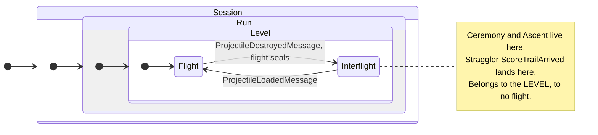
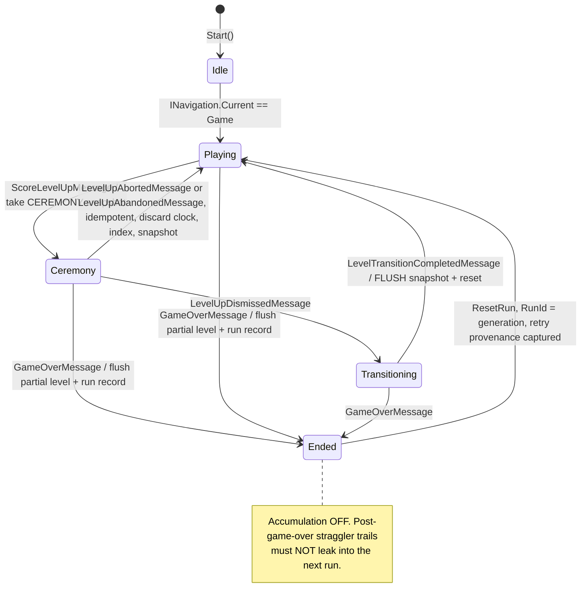
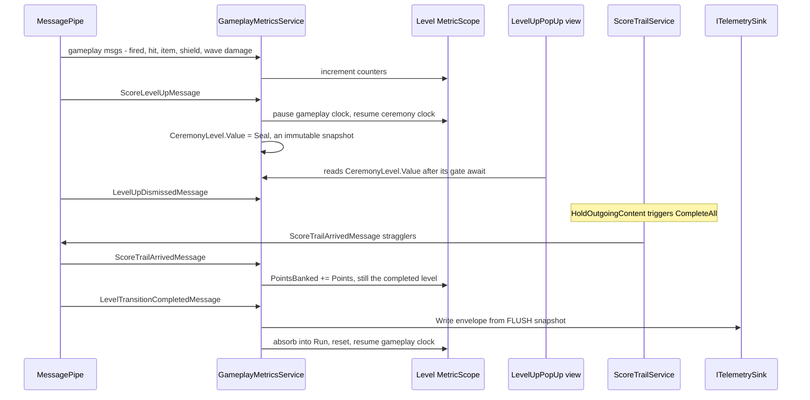
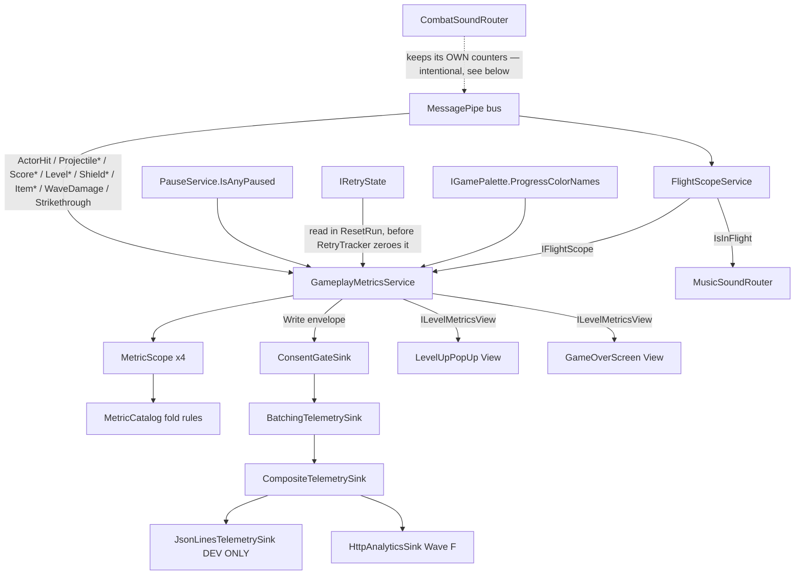
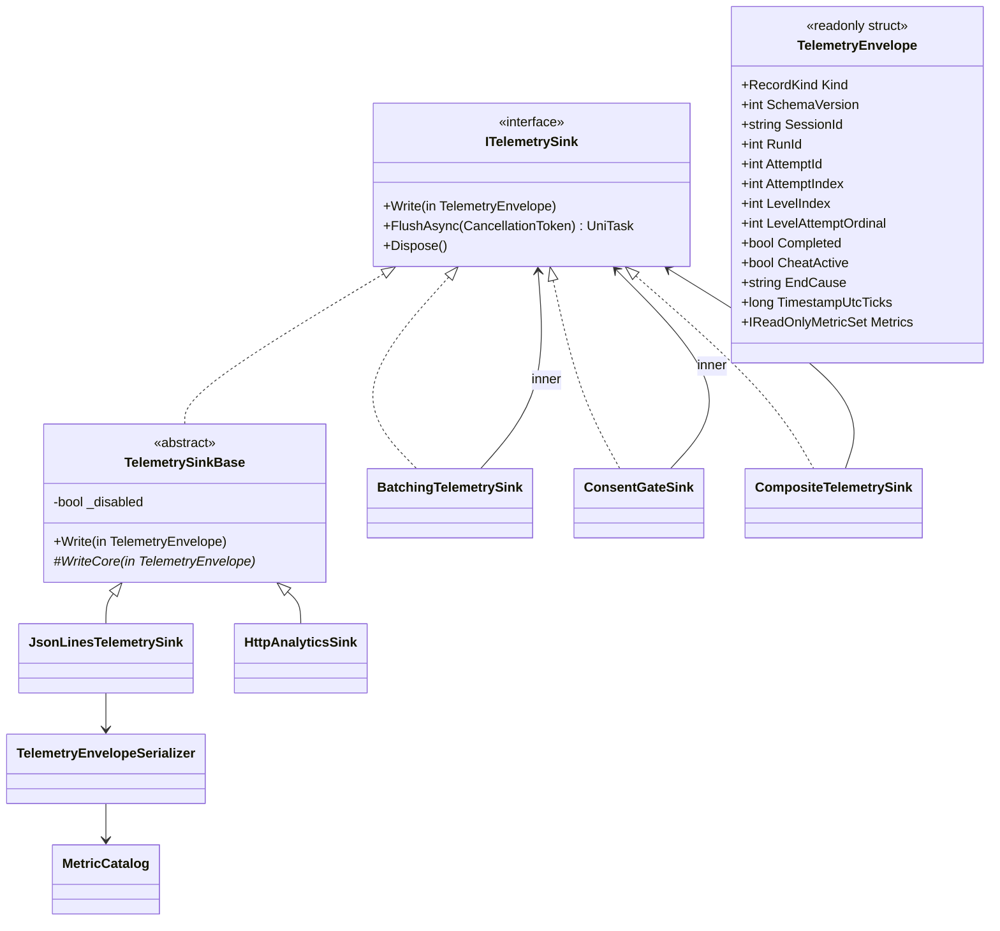
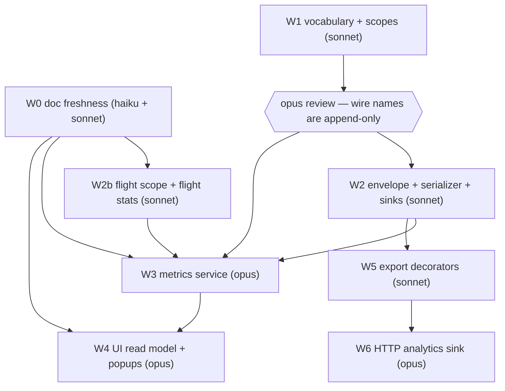

@page plan_gameplay_telemetry Gameplay Telemetry

# Gameplay Metrics & Telemetry

One subsystem that counts what happens during play, at four nested scopes, and serves
those counts to three consumers:

1. **In-game surfaces** — the level-up and game-over popups, redesigned to show what the
   player just did: score breakdown, accuracy, streaks, items used, mechanics triggered.
2. **External analytics** — a batched, consent-gated export to a third-party service.
3. **Balance work** — the original goal: how long levels take, where runs die, which
   items get used, how streaks behave.

The read model comes first. A logger that nobody reads is a logger nobody maintains;
a metrics system the game itself renders is one that stays correct because a wrong
number is visible on screen.

> **Revision note.** Revised 2026-08-01 after an architecture study on generalizing the
> metrics vocabulary (triggered by the observation that `CombatSoundRouter` already
> aggregates the same events at a finer scope). The previous revision was audited against
> source on 2026-07-26; everything that survives from it was re-verified. **Section
> *Superseded decisions* lists what to unlearn** — it exists because the previous
> revision was written to be followed literally and parts of it are now wrong.

---

## Goals

| # | Goal | Consequence for the design |
|---|---|---|
| G1 | Level-up and game-over popups render per-level statistics | The counting core **ships in release builds**. It is no longer a dev-only subsystem. |
| G2 | Metrics export to an external analytics service | The sink is a real seam: uniform record envelope, batching, consent gate, schema version, offline queue. |
| G3 | Answer balance/pacing questions from real play data | Per-level and per-run records, flushed at boundaries, filterable by cheat/retry provenance. |
| G4 | Adding a metric is cheap | A new counter costs two files and one line, not six files and a test suite. |

---

## Codebase delta since the 2026-07-26 audit

Everything below landed after the previous revision was verified. Each row is a
requirement change, not a note.

| Change | Where | Impact |
|---|---|---|
| **Retry system** | `Game/Run/RetryTracker.cs`, `IRetryState.cs`, `UI/GameOver/GameOverScreen.cs:75-79` | A retry restarts at the **death level** through the ordinary `ResetRun` cascade with `_generation++` (`RunController.cs:105`), and the score carries over (`ScoreController.cs:94-98`) — so a retry is a *continuation of one run*, while the generation counter says otherwise. The previous revision assumed every run starts at level 1 and that non-game-over restarts were cheat-only. Treating a retry as a fresh run corrupts every levels-reached distribution — the headline analysis. See **R14–R14c** and *Run identity and retries*. |
| **`LevelUpAbandonedMessage`** | `Game/Level/LevelController.cs:517` | A third ceremony exit the five-state machine does not model: the ceremony leaves `Completing` without presenting because the run is ending or restarting. Without it the gameplay clock wedges exactly as it would without `LevelUpAbortedMessage`. See **R8**. |
| **Line-based health** | `Shared/Messages/WaveDamageMessage.cs`, `Game/Health/`, `UI/Health/HeartTrailController.cs` | Partially patched already. `WaveDamageMessage` carries `HeartsLost`, `BlockedSlots`, `RowLength` — three metrics, not one, and `OverflowCount` is now a misnomer. New signals: `StrikethroughArrivedMessage`, `ILossForecast.LossImminent`, `IDangerLevel.HeartsAtRisk`. See **R10**. |
| **Hold-to-speed-up** | `Projectile/Controller/HoldSpeedUpController.cs` | New player-agency mechanic with zero coverage. Clocks sample `Time.unscaledTime`, so a level the player fast-forwarded reads identical to one they did not — the duration metric silently loses the mechanic. See **R11**. |
| **Sweep + speed taps** | `Shared/Messages/SpeedTapMintedMessage.cs`, `Projectile/Model/IProjectileFlightState.cs` | `IProjectileFlightState` is *itself* a per-flight metrics record (`TotalCruiseTaps`, `ConsecutiveSweeps`, `SegmentPopCount`, `ConsecutiveWallBounces`) — the second ad-hoc per-flight aggregator in the codebase. |
| **`Tougher` variant** | `Balloon/Type/BalloonType.cs` | `BalloonType` now has 8 values. The previous revision breaks pops down by **color only**, while `CombatSoundRouter` already buckets by variant. Balloon type is a required second axis. See **R5**. |
| **Rainbow streak carry** | `Game/Score/ColorStreakTracker.cs` | Streak is no longer color-scoped in the way `MaxStreak` assumed; the carry across color changes is itself worth measuring. |
| **`BoardDepletedMessage`** | `Balloon/Controller/BalloonControllerRegistry.cs` | Organic board clear — a level-outcome signal (cleared vs timed out) the records do not capture. |
| **`ScorePointsGroupMessage.Multiplier`** | `Shared/Messages/ScorePointsGroupMessage.cs` | Score breakdown by multiplier tier is available on the bus. The popups want exactly this. |

**Still true and re-verified:** `LevelTransitionCompletedMessage` is published in
`TransitionAsync`'s `finally`; `GameOverMessage(FinalLevel, FinalScore)` is published by
`RunController.EndRun` (`:96`); `PauseService.IsAnyPaused` is the reset-safe pause signal;
`CheatState.AnyCheatUsed` **does not exist yet**; the registration site at the end of
`RegisterGameplaySystems` (after `PierceDischargeEffects`, `GameScopeRegistration.cs:204`)
is still the safe spot; `RegisterGameplaySystems` runs before `RegisterAudioRouters`
(`GameLifetimeScope.cs:70,73`).

---

## Principles

- **Gameplay only.** No PII, no device fingerprinting. The session id is a `Guid`
  generated per app launch and **never persisted** — persisting it would make it a
  device fingerprint.
- **Telemetry is never client profile data.** Records exist to leave the device (or the
  dev log file); they are never written into the player's saved profile and never read
  back to drive gameplay, progression, or UI defaults. Profile/progression state is a
  different subsystem with a different owner (`RunMeta` today) — the two must not
  converge. A metric that someone wants to persist for the player has stopped being a
  metric and become progression; move it, don't extend the sink.
- **Zero new *message* types, and metrics never publishes.** The subsystem consumes the
  existing bus. Subscribing to `ActorHitMessage` as an order-independent observer is
  explicitly sanctioned (`Assets/Source/README.md`, hit-routing section); never touch
  `IHitDispatcher`. This is what keeps metrics from becoming a gameplay dependency.

  **Read interfaces on existing controllers are fair game** — `IHoldSpeedUpState`
  (**R11**), `IFlightStats`, `IRetryState`. They add no bus traffic, no ordering coupling
  and no publish path, and they are how a metric reaches state that was never worth a
  message. Sanctioned non-message additions are listed per wave; the two gameplay-code
  touches in scope are `CheatState.AnyCheatUsed` and `IHoldSpeedUpState`.
- **Aggregate in memory, snapshot at boundaries.** Per-flight/level/run accumulators;
  immutable snapshots at ceremony entry and at flush. No per-pop I/O.
- **Immutable across the read boundary.** Views never see a mutable accumulator.
- **Never throw at a flush boundary.** MessagePipe runs handlers synchronously on the
  publisher's stack with no exception isolation, and both flush points publish before
  releasing critical state (`LevelUpPopUp` publishes the dismissal *then* releases the
  time scale and pause; `RunController.EndRun` publishes *then* transitions navigation).
  An escaping exception freezes the game. Metrics data is never worth a soft-lock.
- **Decomposed internals.** Counting, boundary detection, snapshotting, serialization and
  transport are separate plain-C# types, each testable without VContainer or Unity.
- **Wire names are append-only.** Once a metric's wire name ships to an external
  warehouse it is never renamed or reordered — the same discipline `GameSoundId` carries.

---

## Requirements

Numbered so task specs can cite them. Each is testable.

### Scopes and boundaries

- **R1** — Metrics are collected at four nested scopes: **Session ⊃ Run ⊃ Level ⊃ Flight**.
- **R2** — A **Flight** opens on `ProjectileLoadedMessage` (`Thrower/ThrowerController.cs:232`)
  and **seals** on `ProjectileDestroyedMessage` (`Projectile/View/ProjectileView.cs:406`).
  The `[Destroyed, next Loaded)` window is *interflight*: increments there belong to the
  Level and to no flight. This deliberately differs from `CombatSoundRouter`'s boundary
  (which clears only on `Loaded`, so its "flight" straddles the ceremony); the metrics
  definition is chosen so that **Σ flights ⊆ level** holds.
- **R3** — A **Level** flushes on `LevelTransitionCompletedMessage` (not on
  `LevelUpDismissedMessage` — straggler trail points land in between and would be charged
  to the next level). A **Run** flushes on `GameOverMessage`.
- **R4** — Roll-up Flight → Level → Run → Session is **mechanical**, driven by a declared
  fold rule per metric, not by hand-written accumulate code.

### Vocabulary

- **R5** — Counters are addressed by a `MetricId` enum over dense `int[]` storage, with
  three fixed dimension axes: **Color**, **BalloonType**, **ItemType**. A fourth axis is
  out of scope; if one is ever needed, that is the moment to revisit the whole shape.
- **R6** — A static `MetricCatalog` is the single browsable table mapping each `MetricId`
  to its wire name, unit, and fold rule (`Sum` / `Max` / `Last`). Adding a metric =
  one enum value + one catalog row + one `Increment` call site.
- **R7** — "Mechanic triggered" events use the same vocabulary as gameplay counters:
  pierce discharges, speed taps minted, sweeps, shields gained/lost, strikethroughs,
  overflow hearts lost, items activated. No parallel mechanism.

### State machine

- **R8** — The Level state machine has five states (`Idle`/`Playing`/`Ceremony`/
  `Transitioning`/`Ended`). Ceremony exits:
  - `LevelUpDismissedMessage` → `Transitioning`.
  - `LevelUpAbortedMessage` → `Playing`, discarding the ceremony clock, the captured level
    index **and the ceremony snapshot**.
  - `LevelUpAbandonedMessage` → `Playing`, same discards, **idempotent** — never `Ended`.
  - `GameOverMessage` → `Ended`. **This message alone owns the terminal transition.**
- **R8a** — `LevelUpAbandonedMessage` is a **nested re-publish**, not an independent
  event, and the plan's earlier "per the run's fate" reading was unimplementable *and*
  actively harmful. `LevelController.AbandonCeremony` (`Game/Level/LevelController.cs:506`)
  is reached from four sites and publishes synchronously **inside** whatever triggered it:
  - From the `LevelUpAbortedMessage` handler (`:419`) — metrics therefore receives
    **Abandoned before Aborted**. Had Abandoned entered `Ended`, R9's early-return would
    swallow the Aborted and the gameplay clock would never resume — every later level
    recording ≈ 0 duration, which is guardrail #5's exact failure mode.
  - From the `GameOverMessage` handler (`:142`) — nested inside
    `RunController.EndRun`'s publish. Had Abandoned entered `Ended`, the outer
    `GameOverMessage` would then hit the gate and early-return, so **no run record would
    ever be written for a lost run**.

  The message carries no reason (`Shared/Messages/LevelUpAbandonedMessage.cs` is an empty
  struct) and none is needed: `AbandonCeremony` unconditionally sets
  `_phase = LevelUpPhase.Playing`, so Abandoned always means "the ceremony is over",
  never "the run is over". Do **not** add a payload.
- **R9** — While in `Ended`, every handler early-returns. The loss cinematic completes
  straggler score trails *after* `GameOverMessage`; without the gate those arrivals
  corrupt the next run. The gate is entered by `GameOverMessage` only (**R8**).

### Fields and derivation

- **R10** — `WaveDamageMessage` contributes three metrics, not one: `HeartsLost`
  (rename `OverflowCount` → `HeartsLost`), `BlockedSlots`, and a derived
  hearts-lost-per-wave max. `RowLength` is context, not a metric.
- **R11** — Hold-to-speed-up is measured explicitly: `hold_seconds` per level and
  `hold_speed_up_flights`. Duration metrics stay on `Time.unscaledTime` (see *Time
  tracking*) — the hold metric is what makes a fast-forwarded level distinguishable from a
  slow one. `HoldSpeedUpController` publishes nothing and samples `Input.GetMouseButton(0)`
  inside its own `Tick()`, so this requires a **sanctioned read interface**:
  `internal interface IHoldSpeedUpState { bool IsHolding { get; } }` implemented by
  `HoldSpeedUpController`, registered `AsImplementedInterfaces()`. No new message type; no
  polling on the metrics side (**R30**) — the service samples it on the frame boundaries it
  already observes.
- **R12** — Pops break down by **both** color and balloon type. Unknown color ids
  (rainbow, paint-converted) and actors without `IHasColor` fall into a trailing
  *other* bucket and must never throw or index out of range.
- **R13** — Accuracy uses `DirectHitPops` (`ActorHitMessage` with
  `(Context.Flags & DamageFlags.DirectHit) != 0`), never `ShotsFired / TotalPops` —
  total pops includes item-, cheat- and board-driven pops.
- **R14** — Run identity is **three ids, not one** (see *Run identity and retries*):
  `RunId` (the run chain — stable across retries), `AttemptId` (the `RunController`
  generation), and `AttemptIndex` (0 for the original, 1..N for retries within the
  chain). The service derives all three itself from `IRetryState.RetryLevel` at reset
  time — no new gameplay state. Read it **before** `RetryTracker` zeroes it (see **R21**).
- **R14a** — Every level record carries `LevelAttemptOrdinal`: how many times *this level
  index* has been played in this chain. `AttemptIndex` alone is wrong per level — after a
  retry at level 7, levels 8+ carry `AttemptIndex = 1` but are first attempts. Only the
  ordinal answers "how many tries did this level take".
- **R14b** — `RunRecord.TotalScore` comes from `GameOverMessage.FinalScore` and is
  **never** summed from level records. Score carries across a retry
  (`ScoreController.ClearRunState` restores `_levelStartScore` when `RetryLevel > 0`), so
  a chain with a replayed level has two records for that level and summing them
  double-counts.
- **R14c** — Attempt history is **export-only**. The UI read model exposes the current
  attempt; the popups show the try that succeeded, and prior attempts are irrelevant to
  them. Per-level history lives in the envelope stream, not in `ILevelMetricsView`.
- **R15** — Level outcome distinguishes *cleared* (`BoardDepletedMessage`) from
  *progressed on score* from *partial at game over*.

### Read model (in-game consumption)

- **R16** — Views consume metrics through a narrow read-only interface,
  `ILevelMetricsView`, exposing an `IReadOnlyReactiveProperty<LevelMetricsSnapshot>`.
  Payloads are immutable. Views read `.Value` at render time; the subsystem publishes
  no message and the View never triggers a snapshot.
- **R17** — **Two snapshots per level.** The *ceremony* snapshot is taken on
  `ScoreLevelUpMessage` and is what the level-up popup renders. The *flush* snapshot is
  taken on `LevelTransitionCompletedMessage` and is what the sink receives and what folds
  into the run. Both are logged; the divergence is data (a large gap means the ceremony
  fires too early), not a bug to hide.
- **R18** — The popup shows **projected** points, not banked. `ScoreController` already
  snaps `TotalScore` to `_projectedTotal` on level-up so the popup never shows a stale
  low number while trails sit frozen; the stats block must adopt the same convention or
  it will contradict the score number beside it on the same popup.
- **R19** — `GameOverScreen` reads the run snapshot **after** its presentation-gate
  `await`, never inside its `GameOverMessage` handler — otherwise it depends on
  MessagePipe subscriber order.
- **R20** — Only `BalloonParty.UI.*` types may inject `ILevelMetricsView`, and every
  consumer must render correctly against an empty/default snapshot. Metrics must never
  become load-bearing for gameplay.

### Lifecycle and registration

- **R21** — The service is `IRunResettable` with `ResetOrder => RunResetOrder.Quiesce`
  (0), which must stay **below** `RetryTracker`'s 110 (`RunResetOrder.Score + 10`) so it
  reads `IRetryState.RetryLevel` before that tracker zeroes it. Pin the inequality with a
  unit test. **Do not also subscribe `RunResetMessage`** — `RunController` invokes
  `ResetRun` directly, so both would double-reset.
- **R22** — Session state (`SessionTelemetryContext`: session id, schema version, launch
  timestamp) registers in **`AppLifetimeScope`**, not `GameLifetimeScope`, so it survives
  scene reloads.
- **R23** — Clocks do not start in `Start()` — entry points start during the Launcher's
  additive preload, long before the player taps Play. Enter `Playing` on
  `INavigation.Current == NavigationState.Game`.

### Export

- **R24** — One uniform record: `ITelemetrySink.Write(in TelemetryEnvelope)` with a
  `RecordKind` discriminator, `SchemaVersion`, `SessionId`, `RunId`, `LevelIndex`,
  timestamp, and the metric set. **Not** an overload per record type — that makes every
  sink change when a record kind is added, which would have made the promised network
  sink a redesign rather than a drop-in.
- **R25** — The never-throw guard (`try/catch` → `Log.Warn` → permanent `_disabled`
  latch for the session) lives in an abstract `TelemetrySinkBase` template method, not in
  any single sink. A future HTTP sink that throws at a flush boundary soft-locks the game
  exactly like a file sink would.
- **R26** — Cross-cutting concerns are decorators over `ITelemetrySink`: consent gate →
  batcher → composite fan-out. Consent is **never** an `if` inside the service.
- **R27** — Serialization is hand-rolled and reflection-free (see *Serialization*), a
  single loop over `MetricCatalog`, one reused `StringBuilder`, every numeric and date
  append through `CultureInfo.InvariantCulture`.
- **R28** — Build gating is **three tiers**, not one `#if` (see *Gating tiers*). Split so
  each wave owns exactly one:
  - **R28a** (W2) — the dev-only tier: `JsonLinesTelemetrySink` and the viewer window are
    wrapped in `#if UNITY_EDITOR || DEVELOPMENT_BUILD`.
  - **R28b** (W5) — the export tier: the decorator chain registers unconditionally and is
    inert until consent. When no leaf sink is registered, `CompositeTelemetrySink` holds an
    empty array and `Write` is an empty loop — do **not** add a `NullTelemetrySink`.
  - **R28c** (W3) — the cheat-read tier: the triple guard
    `#if UNITY_EDITOR || DEVELOPMENT_BUILD || CHEATS_IN_RELEASE` **with an `#else`
    defaulting `cheatActive = false`**, verified by a rebuild with `UNITY_EDITOR` stripped.

### Performance

- **R29** — Hot-path handlers allocate nothing: no string interpolation, no LINQ, no
  `Log.Info` in the `ActorHitMessage` / `StreakChangedMessage` / `ScoreTrailArrivedMessage`
  paths. Increments are `_counters[(int)id]++` and `_axis[i]++`. Measured worst case is
  ~10–25 `ActorHitMessage` in one frame (bomb/laser/lightning resolve synchronously) plus
  tens of `ScoreTrailArrivedMessage` in the transition frame; peak is low hundreds of
  invocations per second.
- **R30** — **No pooling, no buffering, no `ITickable`** anywhere in the counting core.
  Snapshot allocation at ceremony and flush (~30–120 s apart) is negligible.
- **R30a** (W5) — `BatchingTelemetrySink` reuses one `List<TelemetryEnvelope>` rather than
  allocating per batch.

---

## Architecture

### Folder structure

```
Assets/Source/Game/Telemetry/
├── MetricId.cs                      ← counter vocabulary (dense, append-only)
├── TimerId.cs                       ← clock vocabulary (Gameplay/Ceremony/Wall/Hold)
├── MetricAxis.cs                    ← Color | BalloonType | ItemType
├── MetricCatalog.cs                 ← id → wire name, unit, fold rule (static)
├── FoldRule.cs                      ← Sum | Max | Min | Last
├── RecordKind.cs                    ← Flight | Level | Run | Session
├── MetricSet.cs / IReadOnlyMetricSet.cs   ← dense int[] counters + axis tables
├── MetricScope.cs                   ← one scope's set + timers + Seal()/Reset()
├── TelemetryStopwatch.cs            ← clock-owning timer (Pause/Resume/Elapsed/Reset)
├── LevelMetricsSnapshot.cs          ← sealed immutable per-level read surface
├── RunMetricsSnapshot.cs            ← sealed immutable per-run read surface
├── ColorCount.cs / BalloonTypeCount.cs / ItemActivationCount.cs
├── ILevelMetricsView.cs             ← the UI read seam
├── GameplayMetricsService.cs        ← entry point: state machine + routing + snapshots
├── SessionTelemetryContext.cs       ← session id, schema version (App scope)
├── TelemetryEnvelope.cs             ← uniform wire record (readonly struct)
├── TelemetryEnvelopeSerializer.cs   ← hand-rolled JSON, catalog-driven
├── ITelemetrySink.cs / TelemetrySinkBase.cs
├── CompositeTelemetrySink.cs / BatchingTelemetrySink.cs / ConsentGateSink.cs
├── ITelemetryConsent.cs
├── JsonLinesTelemetrySink.cs        ← dev-only local file sink
├── HttpAnalyticsSink.cs             ← W6
└── README.md

Assets/Source/Game/Flight/          ← gameplay service, NOT part of telemetry (W2b)
├── IFlightScope.cs                  ← IsLoaded / IsAirborne / FlightIndex
├── IFlightStats.cs                  ← read seam (audio + metrics)
├── IFlightStatsWriter.cs            ← write seam (HitPipeline only)
├── FlightStatsService.cs
└── README.md

Assets/Source/Configuration/Telemetry/   ← config lives with config, not with the feature (W5)
├── TelemetrySettings.cs             ← ScriptableObject
└── ITelemetrySettings.cs            ← the read-only interface consumers inject
```

**Visibility: every type introduced by this plan is `internal`.** None needs cross-assembly
exposure — match `ScoreController`, `GameSoundId`, `ClipPickMode`. CLAUDE.md's "prefer
`internal` over `public`" applies without exception here, including the enums, the
catalog, the snapshots and every interface. The EditMode assembly already has
`InternalsVisibleTo`, so tests are unaffected.

**Member ordering applies to every one of these types**, not just the ones where it is
called out later: fields in the seven-tier order, then **properties in the top block
before the constructor**, then constructors, then methods. `style_audit.py` blocks the
commit otherwise, and the highest-risk types here are the property-heavy ones —
`TelemetryEnvelope` (a 7-property `readonly struct`), both snapshots, and `MetricScope`.

**Namespaces** mirror folders: `BalloonParty.Game.Telemetry`,
`BalloonParty.Game.Flight`, `BalloonParty.Configuration.Telemetry`. The telemetry
namespace is unchanged from the previous revision — the folder, the README and the
`Plans.md` `@subpage` registration all point there; renaming to `.Metrics` is churn
without payoff.

### Scope hierarchy


```mermaid
stateDiagram-v2
    direction LR
    [*] --> Session
    state Session {
        [*] --> Run
        state Run {
            [*] --> Level
            state Level {
                [*] --> Flight
                Flight --> Interflight : ProjectileDestroyedMessage, flight seals
                Interflight --> Flight : ProjectileLoadedMessage
                note right of Interflight
                    Ceremony and Ascent live here.
                    Straggler ScoreTrailArrived lands here.
                    Belongs to the LEVEL, to no flight.
                end note
            }
        }
    }
```

| Scope | Opens on | Closes on | Boundary owner |
|---|---|---|---|
| Session | `AppLifetimeScope` build | process exit | `SessionTelemetryContext` |
| Run | first `NavigationState.Game`, then `ResetRun(generation)` | `GameOverMessage` | `RunController` |
| Level | run start / `LevelTransitionCompletedMessage` | `LevelTransitionCompletedMessage`, or `GameOverMessage` (partial) | `LevelController` phase machine |
| Flight | `ProjectileLoadedMessage` | `ProjectileDestroyedMessage` | `ThrowerController` + `ProjectileView` |

### Level flush state machine


```mermaid
stateDiagram-v2
    [*] --> Idle : Start()
    Idle --> Playing : INavigation.Current == Game
    Playing --> Ceremony : ScoreLevelUpMessage / take CEREMONY snapshot
    Ceremony --> Transitioning : LevelUpDismissedMessage
    Ceremony --> Playing : LevelUpAbortedMessage or LevelUpAbandonedMessage, idempotent, discard clock, index, snapshot
    Ceremony --> Ended : GameOverMessage / flush partial level + run record
    Transitioning --> Playing : LevelTransitionCompletedMessage / FLUSH snapshot + reset
    Playing --> Ended : GameOverMessage / flush partial level + run record
    Transitioning --> Ended : GameOverMessage
    Ended --> Playing : ResetRun, RunId = generation, retry provenance captured
    note right of Ended
        Accumulation OFF. Post-game-over straggler trails
        must NOT leak into the next run.
    end note
```

### Level flush sequence


```mermaid
sequenceDiagram
    participant Bus as MessagePipe
    participant Svc as GameplayMetricsService
    participant Lvl as Level MetricScope
    participant Popup as LevelUpPopUp view
    participant Trails as ScoreTrailService
    participant Sink as ITelemetrySink

    Bus->>Svc: gameplay msgs - fired, hit, item, shield, wave damage
    Svc->>Lvl: increment counters
    Bus->>Svc: ScoreLevelUpMessage
    Svc->>Lvl: pause gameplay clock, resume ceremony clock
    Svc->>Svc: CeremonyLevel.Value = Seal, an immutable snapshot
    Popup->>Svc: reads CeremonyLevel.Value after its gate await
    Bus->>Svc: LevelUpDismissedMessage
    Note over Trails: HoldOutgoingContent triggers CompleteAll
    Trails->>Bus: ScoreTrailArrivedMessage stragglers
    Bus->>Svc: ScoreTrailArrivedMessage
    Svc->>Lvl: PointsBanked += Points, still the completed level
    Bus->>Svc: LevelTransitionCompletedMessage
    Svc->>Sink: Write envelope from FLUSH snapshot
    Svc->>Lvl: absorb into Run, reset, resume gameplay clock
```

### Dependency graph


```mermaid
graph TD
    Bus[MessagePipe bus] -->|ActorHit / Projectile* / Score* / Level* / Shield* / Item* / WaveDamage / Strikethrough| Svc[GameplayMetricsService]
    Bus --> FS[FlightScopeService]
    FS -->|IFlightScope| Svc
    FS -->|IsInFlight| Music[MusicSoundRouter]
    Pause[PauseService.IsAnyPaused] --> Svc
    Retry[IRetryState] -->|read in ResetRun, before RetryTracker zeroes it| Svc
    Palette[IGamePalette.ProgressColorNames] --> Svc
    Svc --> Scopes[MetricScope x4]
    Scopes --> Cat[MetricCatalog fold rules]
    Svc -->|Write envelope| Consent[ConsentGateSink] --> Batch[BatchingTelemetrySink] --> Comp[CompositeTelemetrySink]
    Comp --> Json[JsonLinesTelemetrySink DEV ONLY]
    Comp --> Http[HttpAnalyticsSink Wave F]
    Svc -->|ILevelMetricsView| Popup[LevelUpPopUp View]
    Svc -->|ILevelMetricsView| GO[GameOverScreen View]
    Combat[CombatSoundRouter] -.->|keeps its OWN counters — intentional, see below| Bus
```

### Metric vocabulary — why a registry, not named fields

The decisive argument is the **fold rule**, not the hot path — both layouts are
allocation-free.

| Criterion | Named fields per record | Enum registry (chosen) |
|---|---|---|
| Adding one metric | 6 files: DTO + level accumulator + snapshot + serializer + run fold + tests | 2 files + 1 line |
| Level→Run roll-up | hand-written `Absorb` that silently drifts from the DTO | one loop over declared fold rules |
| Serialization | one change per field | one loop, zeros skipped |
| Hot path | `_pops++` | `_counters[(int)id]++` — one bounds check, zero alloc |
| Discoverability | best | **the one real cost** — mitigated by `MetricCatalog` being a single browsable table |

Rejected: `Dictionary<MetricId,int>` (hash per hit and resize allocations during
10–25-hit frames — not for boxing, which would not occur), and a generic
N-dimensional metric cube (YAGNI, and it destroys the catalog's discoverability,
which is the registry's only real cost and its only real defence).

### The catalog

**This table is W1's specification.** Implement exactly these ids, in this order, with
these wire names. Do not invent, rename, reorder, or "improve" them — wire names are the
external contract (**R6**, guardrail 14) and are append-only once shipped. If a metric you
expect is missing, it was left out deliberately; add it in a later wave rather than
guessing here.

**Naming convention:** enum members are `PascalCase`, wire names are `snake_case`. The
split is deliberate — the C# identifier stays free to be renamed for readability while the
wire name stays frozen for the warehouse.

**Scope** is where the metric is *counted*. Everything folds upward to Level, Run and
Session by its fold rule (**R4**); Flight-scope metrics are additionally sealed per shot.

```csharp
internal enum FoldRule { Sum, Max, Last }
```

**`Scope` is part of the catalog row, not decoration.** `Absorb` must skip any metric whose
declared scope sits above the child being folded. `Sum` and `Max` tolerate folding a zero
(it is their identity), but `Last` does not: `RetriesUsed` is `Last` at Run scope, so
folding a Level child's zero into it would report **zero retries on every run record**.
Transcribe the column into the catalog entry.

#### Counters — `MetricId`

| Enum member | Wire name | Unit | Fold | Source | Axis | Scope |
|---|---|---|---|---|---|---|
| `ShotsFired` | `shots_fired` | count | Sum | `ProjectileFiredMessage` | — | Level |
| `FlightsStarted` | `flights_started` | count | Sum | `ProjectileLoadedMessage` | — | Level |
| `Pops` | `pops` | count | Sum | `ActorHitMessage`, `Outcome == Pop` | Color, BalloonType | Flight |
| `DirectHitPops` | `direct_hit_pops` | count | Sum | as above **and** `(Context.Flags & DamageFlags.DirectHit) != 0` | — | Flight |
| `Deflects` | `deflects` | count | Sum | `ActorHitMessage`, `Outcome == Deflect` | BalloonType | Flight |
| `Absorbs` | `absorbs` | count | Sum | `ActorHitMessage`, `Outcome == Absorb \| PassThrough` | — | Flight |
| `WallBounces` | `wall_bounces` | count | Sum | `WallHitMessage` | — | Flight |
| `PierceDischarges` | `pierce_discharges` | count | Sum | `PierceDischargedMessage` | — | Flight |
| `PierceToughsCleared` | `pierce_toughs_cleared` | count | Sum | `PierceDischargedMessage.ToughCount` | — | Flight |
| `RainbowPierceDischarges` | `rainbow_pierce_discharges` | count | Sum | `PierceDischargedMessage.IsRainbow` | — | Flight |
| `SpeedTapsMinted` | `speed_taps_minted` | count | Sum | `SpeedTapMintedMessage` | — | Flight |
| `MaxWallBouncesInFlight` | `max_wall_bounces_in_flight` | count | Max | `WallBounces` at flight seal | — | Level |
| `MaxSpeedTapsInFlight` | `max_speed_taps_in_flight` | count | Max | `SpeedTapMintedMessage.TotalTaps` | — | Level |
| `HoldSpeedUpFlights` | `hold_speed_up_flights` | count | Sum | `IHoldSpeedUpState` — flights where hold engaged (**R11**) | — | Level |
| `PointsBanked` | `points_banked` | points | Sum | `ScoreTrailArrivedMessage.Points` | Color | Level |
| `PointsProjected` | `points_projected` | points | Last | `IRunScore.TotalScore` read at ceremony snapshot (**R18**) | — | Level |
| `MaxMultiplier` | `max_multiplier` | multiplier | Max | `ScorePointsGroupMessage.Multiplier` | — | Level |
| `MaxStreak` | `max_streak` | count | Max | `StreakChangedMessage.Streak` | — | Level |
| `StreakBreaks` | `streak_breaks` | count | Sum | `StreakChangedMessage` where `Streak == 0` | — | Level |
| `HeartsLost` | `hearts_lost` | hearts | Sum | `WaveDamageMessage.HeartsLost` (**R10**) | — | Level |
| `MaxHeartsLostInWave` | `max_hearts_lost_in_wave` | hearts | Max | `WaveDamageMessage.HeartsLost` | — | Level |
| `BlockedSlots` | `blocked_slots` | count | Sum | `WaveDamageMessage.BlockedSlots` (**R10**) | — | Level |
| `Strikethroughs` | `strikethroughs` | count | Sum | `StrikethroughArrivedMessage` | — | Level |
| `ShieldsGained` | `shields_gained` | count | Sum | `ShieldGainedMessage` | — | Level |
| `ShieldsSpent` | `shields_spent` | count | Sum | `ShieldLostMessage` | — | Level |
| `ItemsActivated` | `items_activated` | count | Sum | `ItemActivatedMessage` | ItemType | Level |
| `MaxDangerLevel` | `max_danger_level` | level | Max | `IDangerLevel.Level` | — | Level |
| `BoardCleared` | `board_cleared` | count | Max | `BoardDepletedMessage` — 1 if the board emptied organically (**R15**) | — | Level |
| `LevelsCompleted` | `levels_completed` | count | Sum | derived: absorbed level with `Completed == true` | — | Run |
| `RetriesUsed` | `retries_used` | count | Last | `IRetryState` at reset (**R14**) | — | Run |

`Absorbs` uses `!=` against a combined mask because it is the one outcome family where two
values share a metric; every other filter is `==` per the repo idiom.

#### Timers — `TimerId`

| Enum member | Wire name | Runs while | Pause-gated |
|---|---|---|---|
| `Gameplay` | `gameplay_seconds` | state == `Playing` | **yes** |
| `Ceremony` | `ceremony_seconds` | state == `Ceremony` | no — the ceremony *is* a pause |
| `Wall` | `wall_seconds` | state ∉ {`Idle`, `Ended`} | no |
| `Hold` | `hold_seconds` | hold-to-speed-up engaged (**R11**) | no — only runs in flight |

**Dropped deliberately — do not re-add.** `min_health` (lowest HP reached in a level) is not
a metric: health only ever decreases within a level, since the only recovery is level-up, so
the minimum is just the level's end value and is already implied by `hearts_lost`. It was the
sole user of a `Min` fold, which is why `FoldRule` has three members and not four. If a
genuine minimum is ever needed, restoring `Min` is two lines — but it needs a real unset
sentinel, because a zero-initialised counter makes every `RecordMin` of a non-negative value
a silent no-op.

#### Axis storage

The catalog tags five `(MetricId, axis)` pairs. **Storage is keyed by the pair, not by the
axis alone** — one array per axis kind would make `Deflects` and `Pops` share a
`BalloonType` table, and `PointsBanked` (points) share a Color table with `Pops` (counts),
summing two different units into one meaningless number.

`MetricCatalog` assigns each pair a dense `AxisSlot` at static init and exposes
`SlotOf(MetricId, MetricAxis)` plus `AllSlots`. `MetricSet` holds one `int[]` per slot; the
write API is `IncrementAxis(MetricId id, MetricAxis axis, int bucket)`. `Absorb` and
`CopyState` then loop `AllSlots` instead of hand-unrolling one block per axis, so an
axis-bearing metric costs the same two files as any other.

Five arrays of ≤ 8 entries per scope, four scopes. The cost is nothing; the alternative is a
wire name that ships permanently attached to the wrong numbers.

#### Not metrics

These live on the envelope as identity/context, never in `MetricSet`: `SchemaVersion`,
`SessionId`, `RunId`, `AttemptId`, `AttemptIndex`, `LevelIndex`, `LevelAttemptOrdinal`,
`Completed`, `CheatActive`, `EndCause`, `RecordKind`, `TimestampUtcTicks`.

```csharp
internal enum RecordKind { Flight, Level, Run, Session }
```

`Session` is reserved: the scope accumulates (**R1**) but nothing flushes it in the waves
below, so no `Session` envelope is emitted yet and there is no `SessionMetricsSnapshot`.
Do not build one speculatively.

### Flight stats: extract the boundary *and* the type counters; the colour ramp stays

`CombatSoundRouter` keeps nine per-flight counters (`:40-52`) and uses them as musical
pitch ramps. **Eight of the nine are gameplay facts wearing an audio costume** — "how many
Toughs died this flight" is not a sound concern — and they move to a gameplay-owned
`FlightStatsService`. One stays.

#### The single-writer rule

The reason a naive merge fails is real and unchanged: the router reads the count, plays
the note, *then* increments (`:127-131`, and the `PopSemitoneOffset`/`IncrementPopCounter`
pair at `:300-339`). Two independent bus subscribers would make the pitch depend on
MessagePipe subscription order, and every ramp would come out a whole tone sharp.

That argument constrains **where the write goes**, not whether the counters move.
`HitPipeline.cs:14` holds the **only** `IPublisher<ActorHitMessage>` in the repo — all
nine `IHitDispatcher.Dispatch` call sites (projectile, bomb, laser, lightning, three
cheats) funnel through it. Recording there, *before* the publish, fixes the count before
any subscriber runs:

```csharp
_score.OnActorHit(msg);
_balloonRegistry.Route(msg);
_flightStats.Record(msg);
_hitPublisher.Publish(msg);
```

The hazard is dissolved by construction rather than mitigated — there is no longer an
order to depend on. Audio reads the post-increment value and subtracts one, so every
played `semitoneOffset` is byte-identical to today. This is in character for
`HitPipeline`, whose stated job is *"the order-dependent part of hit resolution,
explicitly"*; the dangerous design is the one that avoids it.

**Audio must not be the writer.** Inverting it — `CombatSoundRouter` calling `Record` —
makes a cosmetic subsystem the source of truth for analytical data, and the melodic
machinery currently ships dormant. One future early-return for a muted state silently
zeroes the metrics.

#### What moves, and what does not

The deciding fact, which neither the original study nor an earlier revision of this plan
noticed: **audio's two axes are mutually exclusive.** `OnActorHit` branches at `:124` — a
pop takes the colour path **or** the type path, never both.

Where that costs something is **silver and gold**. `Tough`/`Tougher` (`ToughBalloonModel`)
and `Unbreakable` are colourless — they do not implement `IHasColor` — and `Rainbow` is a
wildcard carrying the `__rainbow__` sentinel rather than a palette colour, so for those the
fork discards nothing. But `SimpleSilver` and `SimpleGold` are ordinary coloured balloons:
`BalloonTypeExtensions.IsSimpleFamily()` groups them with `Simple`, they participate in
colour streaks, and **the only thing that distinguishes them is the score they award**. They
still resolve to a dedicated pop id, so **a gold balloon increments the Gold counter and its
colour is never counted**.

Audio's colour dictionary therefore counts plain `Simple` pops only — it is not "pops per
colour this flight", which is exactly what **R12** requires on every pop. The two quantities
are genuinely different, and the divergence is confined to one field.

| Field | Verdict | Why |
|---|---|---|
| six per-type pop counters (`:46-50`) | **move** | `PopSoundFor` (`:170-182`) is a 1:1 map from `BalloonType`; each counter *is* `PopsByBalloonType[T]` for the flight |
| `_unbreakableDeflectsThisFlight` (`:51`) | **move** | `UnbreakableBalloonModel` has no `IHasDurability`, so the branch is unconditional — becomes `DeflectsByBalloonType[Unbreakable]` |
| `_pierceDischargesThisFlight` (`:52`) | **move** | unconditional increment on `PierceDischargedMessage`; zero musical conditioning |
| `_bounceCount` (`:44`) | **move, with a test** | now a clean gameplay fact, but it resets on `ProjectileFiredMessage` (`:198`) while the rest reset on `ProjectileLoadedMessage` (`:204-212`). Moving it to the `[Loaded, Destroyed)` boundary is behaviourally identical *only because* no `WallHitMessage` can occur before launch — assert that, do not assume it |
| `_colorPopsThisFlight` (`:40`) | **stays private** | cleared on both `Loaded` (`:212`) **and** `StreakChangedMessage(0)` (`:269`), so its scope is `[max(flight start, last streak break), now)` — not a flight counter at all, and it counts only generic-`BalloonPop` pops. It is a pitch cursor, not a statistic |

Moving the colour dictionary would reintroduce the whole-tone-sharp regression through a
different door: under a shared `PopsByColor` — which counts every pop of that colour,
including the silver and gold ones audio routes elsewhere — a red gold balloon followed by
a red Simple plays the Simple at step 1 instead of step 0.

#### Ownership — beside telemetry, not inside it

`FlightStatsService` is a **gameplay** service with two readers, one of which is metrics.
Putting it inside `Game/Telemetry` would break **R20** and the subscriber-only principle
outright, because audio is a shipping feature and metrics would become load-bearing for
it. Folder `Assets/Source/Game/Flight/`, namespace `BalloonParty.Game.Flight`, Controller
layer (plain C#, `IStartable`/`IDisposable`), registered in `RegisterGameplaySystems`
before `LevelController`.

```csharp
internal interface IFlightScope
{
    int FlightIndex { get; }
    IReadOnlyReactiveProperty<bool> IsLoaded { get; }    // [Loaded, Destroyed)
    IReadOnlyReactiveProperty<bool> IsAirborne { get; }  // [Fired, Destroyed)
}

internal interface IFlightStats
{
    int PopsOf(BalloonType type);
    int DeflectsOf(BalloonType type);
    int PierceDischarges { get; }
    int WallBounces { get; }
}

// Write seam — HitPipeline only. Segregated so no reader can mutate.
internal interface IFlightStatsWriter
{
    void Record(in ActorHitMessage msg);
}
```

Two flags, not one: the five existing flight trackers use three different boundaries.
`MusicSoundRouter` sets `_inFlight` on **Fired** (`MusicSoundRouter.cs:145`) and uses it
to duck (`:192`), so migrating it to a `[Loaded, Destroyed)` flag would duck the music
while the player is *aiming* — permanently, between shots. `IsAirborne` is the flag it
and `HoldSpeedUpController` take; `IsLoaded` is what R2's Σ-flights ⊆ level needs.

#### The acceptance gate is free

Every played `semitoneOffset` is unchanged by this refactor, so
`Assets/Tests/EditMode/Audio/CombatSoundRouterTests.cs` **must pass entirely unmodified**.
That converts an ear-only regression risk into a red/green gate — which is what makes this
wave safe to hand to a cheaper model.

Note for the implementer: cheat-driven dispatches (`AwardScorePopCheat`,
`BalloonRemoverCheat`, `ScoreCheatHelper`) now feed the shared stats too. Harmless —
those runs are cheat-tagged for filtering — but say so in the README or someone will
"fix" it.

### Run identity and retries

`RunController._generation` increments on **every** reset, retry included
(`RunController.cs:105`) — so it is an *attempt* counter, and using it as run identity
corrupts every levels-reached distribution. The rest of the game already disagrees with
that reading: on a retry `ScoreController.ClearRunState` restores the score to
`_levelStartScore` rather than zero (`:94-98`), and `RunMeta.RecordRun` runs on the
retried attempt too — the domain treats a retry as a **continuation of one run**.

| Id | Increments when | Meaning |
|---|---|---|
| `RunId` (chain) | a reset arrives with `RetryLevel == 0` | one player run, score-continuous, matches the player's mental model |
| `AttemptId` | every reset | `RunController` generation, as-is |
| `AttemptIndex` | every retry within the chain | 0 = original, 1..N = retries |
| `LevelAttemptOrdinal` | per level index, within the chain | **the per-level number** — see below |

The service derives the first three from `IRetryState.RetryLevel`, read at
`RunResetOrder.Quiesce` before `RetryTracker` zeroes it (**R21**). No gameplay-side change.
`LevelAttemptOrdinal` additionally needs the level index — `RetryLevel` does not supply it.

**Three values an implementer would otherwise guess:**
- `RunId` starts at **1** for the first run of the session, before any reset arrives.
- `AttemptIndex` starts at **0**; `AttemptId` mirrors `RunController`'s generation, which
  also starts at 1.
- `LevelAttemptOrdinal` increments **when the level opens**, not at flush — so a level
  abandoned at game over still records the attempt it was.

**Why `AttemptIndex` is not a per-level answer.** Retries restart at the death level
(`GameOverScreen.cs:76` → `LevelController.cs:312`), so a chain that dies at level 7 and
retries produces records for 1…7, then 7, 8, 9…. All of the second attempt's records
carry `AttemptIndex = 1`, but only level 7 was actually replayed — levels 8+ are first
attempts that merely happened during the second attempt. Segmenting level difficulty by
`AttemptIndex` would wrongly mark level 9 as retried. `LevelAttemptOrdinal` (a small
`Dictionary<int,int>` at chain scope, cleared only on a fresh chain) stamps level 7 with
2 and levels 8+ with 1, which is what "how many tries did this level take" actually means.

**Persistence: none, by design.** Level records live in memory for the duration of their
scope, are snapshotted, handed to the sink, and reset. Nothing is written to the player's
profile — telemetry leaves the device (or lands in the dev log) and is done. This is a
constraint, not a missing feature: the moment a metric is persisted client-side it stops
being telemetry and becomes progression, which is `RunMeta`'s job, not this subsystem's.

The only cross-session state in the game today is `RunMeta`'s two PlayerPrefs ints
(`BestLevel`, `BestScore`) — which, note for analytics, are **retry-inclusive**, since
`EndRun` records them on retried attempts too.

### Read model

```csharp
internal interface ILevelMetricsView
{
    IReadOnlyReactiveProperty<LevelMetricsSnapshot> CeremonyLevel { get; }
    LevelMetricsSnapshot LastFlushedLevel { get; }
    RunMetricsSnapshot Run { get; }
}
```

`LevelMetricsSnapshot` is a `sealed` immutable class: `int this[MetricId]`,
`float this[TimerId]`, `IReadOnlyList<ColorCount> PopsByColor`,
`IReadOnlyList<ColorCount> PointsByColor`,
`IReadOnlyList<BalloonTypeCount> DeflectsByBalloonType`,
`IReadOnlyList<BalloonTypeCount> PopsByBalloonType`,
`IReadOnlyList<ItemActivationCount> ItemsActivated`, `int LevelIndex`, `bool Completed`.

**Snapshots implement `IReadOnlyMetricSet`.** `TelemetryEnvelope` carries one (**R24**), and
the only other implementer is the live, reset-in-place `MetricSet` — aliasing that into an
envelope would break "immutable across the read boundary" outright, and is unsafe given the
sink's deferred one-frame game-over write, where the scope is reset before serialization
runs. `CopyState` already clones the axis arrays to build the breakdown lists; keeping them
costs no extra allocation and makes the envelope's contract satisfiable by an immutable value.

**Every scope runs its own clocks, and `Absorb` never folds timers.** A `TimerId` names a
clock; each scope holds its own instance of each one, measuring its own window. The service
drives them together — pausing the gameplay clock is one loop over the scopes, not one call
per scope per timer — so there is no lockstep contract to miss and no roll-up to perform.

**Folding timers would double-count**: a Run scope's `Gameplay` stopwatch has already measured
the whole run, so adding each Level's elapsed on top doubles it. `Absorb` handles counters and
axes only. (An earlier revision specified the fold; it was wrong, and the reasoning behind it
assumed the service would drive each scope's clocks from separate call sites.)

**Scope: the current attempt only.** The popups show the try that succeeded; earlier
attempts at the same level are irrelevant to them (**R14c**). The read model therefore
holds no history and the retry ids are carried for the export stream's benefit, not the
UI's. If a future surface wants "you cleared this on try 3", that is one extra field on
the snapshot, not a retained record set.

Rejected alternatives: **publishing a `LevelStatsReadyMessage`** (two subscribers of
`ScoreLevelUpMessage` with unenforced order race the popup's async show, and it breaks
the subscriber-only principle); **an injected `Snapshot()` the View calls** (hands the
View the ability to snapshot mid-burst). The chosen shape is also the established repo
idiom — `GameOverScreen` already injects `IRunMeta` and reads `BestLevel.Value` at render
time; `IPlayerHealth.Current`, `IDangerLevel.Level` and `IColorStreak` are the same shape.

### Export layer


```mermaid
classDiagram
    class ITelemetrySink {
        <<interface>>
        +Write(in TelemetryEnvelope)
        +FlushAsync(CancellationToken) UniTask
        +Dispose()
    }
    class TelemetrySinkBase {
        <<abstract>>
        -bool _disabled
        +Write(in TelemetryEnvelope)
        #WriteCore(in TelemetryEnvelope)*
    }
    class TelemetryEnvelope {
        <<readonly struct>>
        +RecordKind Kind
        +int SchemaVersion
        +string SessionId
        +int RunId
        +int AttemptId
        +int AttemptIndex
        +int LevelIndex
        +int LevelAttemptOrdinal
        +bool Completed
        +bool CheatActive
        +string EndCause
        +long TimestampUtcTicks
        +IReadOnlyMetricSet Metrics
    }
    ITelemetrySink <|.. TelemetrySinkBase
    TelemetrySinkBase <|-- JsonLinesTelemetrySink
    TelemetrySinkBase <|-- HttpAnalyticsSink
    ITelemetrySink <|.. BatchingTelemetrySink
    ITelemetrySink <|.. ConsentGateSink
    ITelemetrySink <|.. CompositeTelemetrySink
    BatchingTelemetrySink --> ITelemetrySink : inner
    ConsentGateSink --> ITelemetrySink : inner
    CompositeTelemetrySink --> ITelemetrySink : fan-out
    JsonLinesTelemetrySink --> TelemetryEnvelopeSerializer
    TelemetryEnvelopeSerializer --> MetricCatalog
```

| In the interface | In the base | In a decorator |
|---|---|---|
| `Write(in TelemetryEnvelope)`, `FlushAsync`, `Dispose` | never-throw guard, `_disabled` latch, re-entrancy guard, `WriteCore` hook | batching, consent, fan-out, offline queue/retry |

`JsonLinesTelemetrySink` (dev only) keeps the previously-verified policy: path
`Application.persistentDataPath + "/telemetry/"`; file
`telemetry_yyyyMMdd_HHmmss.jsonl` formatted with `CultureInfo.InvariantCulture` (a
non-Gregorian device calendar otherwise writes year 2569); **one `StreamWriter` opened in
`Start()` and kept for the session** (the file-open on Android `persistentDataPath`
dominates the write cost and neither flush boundary is an idle frame); rotation keeps the
20 most recent files sorted **by file name**, not `File.GetLastWriteTime` (which is N
extra `stat` calls on the scope-start frame). Game-over records are snapshotted
synchronously and the write deferred one frame (`UniTask.Yield` + guarded `.Forget()`) —
`GameOverMessage` lands on the first frame of the loss push-in. The deferred write owns
the immutable snapshots, never the live scopes.

### Gating tiers

| Tier | Contents | Gate | Ships? |
|---|---|---|---|
| **Core** | vocabulary, catalog, `MetricSet`, `MetricScope`, `TelemetryStopwatch`, `FlightScopeService`, `GameplayMetricsService`, snapshots, `ILevelMetricsView` | none | **yes** — the popups need it |
| **Export** | envelope, serializer, sink base, batching/consent/composite, HTTP sink | runtime consent + config, not `#if` | **yes**, inert until consent |
| **Dev-only** | `JsonLinesTelemetrySink`, telemetry viewer window | `#if UNITY_EDITOR \|\| DEVELOPMENT_BUILD` | no |
| **Cheat read** | `CheatState.*` read at flush | `#if UNITY_EDITOR \|\| DEVELOPMENT_BUILD \|\| CHEATS_IN_RELEASE` **with an `#else` defaulting false** | no |

The double guard and the triple guard are different on purpose — **do not harmonise
them.** `dotnet build` defines `UNITY_EDITOR`, so a missing `#else` compiles locally and
breaks only the real release build.

The release cost of shipping Core is ~6 int increments per `ActorHitMessage`, peak low
hundreds per second. That is the honest price of stats in the popup.

### Serialization

Hand-rolled, no reflection. Neither library option works, and this is not a style
preference:

- **Newtonsoft is unreachable.** `BalloonParty.Runtime.asmdef` sets
  `"overrideReferences": true` with `"precompiledReferences": ["DOTween.dll"]` only; the
  Newtonsoft DLL is referenced solely by the editor-only audio asmdef.
- **`JsonUtility` fails silently.** It serializes only Unity-serializable public *fields* —
  never properties, never `readonly` fields, never `IReadOnlyList<T>`. Fed these types it
  returns `{}` with no error, and cannot emit the `"type"` discriminator.

`TelemetryEnvelopeSerializer` builds each line into a **single reused `StringBuilder`**
field by looping `MetricCatalog`. **Every numeric and date append passes
`CultureInfo.InvariantCulture`** — on a comma-decimal locale `float.ToString()` emits
`12,5` and the whole log becomes unparseable. Timestamp:
`DateTime.UtcNow.ToString("o", CultureInfo.InvariantCulture)`. (Only two
`InvariantCulture` call sites exist in the repo today — this will not be caught by
imitation.)

Member ordering per CLAUDE.md: **properties in the top block, before the constructor** —
`style_audit.py` blocks the commit otherwise.

### Time tracking

Clocks sample **`Time.unscaledTime`** — not `Time.realtimeSinceStartup`. Nothing in the
project observes app backgrounding (no `OnApplicationPause`/`OnApplicationFocus` anywhere
in `Assets/Source`), so a pocket-suspend would silently inflate
`realtimeSinceStartup`-based durations by the full background time. `unscaledTime`
advances only on ticked frames, clamped by `Time.maximumDeltaTime` (0.333 s default,
unmodified here), so a suspend of any length costs at most one clamped frame. It is also
`timeScale`-independent, which the slow-mo cinematics **and hold-to-speed-up** require.
The clock is injected as `Func<float>` (precedent: `SfxThrottleGate`'s registration,
`() => Time.unscaledTime`).

`TelemetryStopwatch` **owns its clock** — constructed with a `Func<float>`, keeps
`_lastSample` internally, folds `clock() - _lastSample` into `Elapsed` on
`Pause()`/`Resume()`/`Elapsed` reads. No `Advance()` in the public API and no
"call at every boundary" contract; miss-a-boundary bugs are structurally impossible.

| Clock | Runs while | Pause-gated by `IsAnyPaused`? |
|---|---|---|
| **Gameplay** | state == `Playing` | **Yes** |
| **Ceremony** | state == `Ceremony` | **No — deliberately.** The ceremony *is* a pause: `LevelUpCinematic` holds `PauseSource.Cinematic` and `LevelUpPopUp` holds `PauseSource.LevelUp` for its whole duration. A pause-gated ceremony clock would read ≈ 0. |
| **Wall** | state != `Idle`/`Ended` | **No** — total elapsed including ceremony and transition |
| **Hold** (new, **R11**) | hold-to-speed-up engaged | **No** — it only runs in flight |

Every `PauseSource` that exists today (`Cinematic`, `LevelUp`, `Overflow`,
`LevelTransition`, `Cheat`) is gameplay- or ceremony-owned, not a user interruption —
gating the wall clock on `IsAnyPaused` would collapse it toward the gameplay duration on
every level. If a genuine user-interruption source (settings menu, ad overlay) is ever
added, that is the moment to introduce a source filter.

### Pause semantics

**Subscribe, don't recount.** `PauseService` is already reference-counted per source and
exposes `IReadOnlyReactiveProperty<bool> IsAnyPaused`. **Inject the concrete
`PauseService`** — it has no read interface and is registered `AsSelf()`. This is a
deliberate exception to CLAUDE.md's "inject the read-only interface" rule, not an
oversight; do not invent an `IPauseState`. Subscribe to `IsAnyPaused`; do **not** count
`PausedMessage`/`ResumedMessage` edges.

Load-bearing, not stylistic: `PauseService.ResetRun` clears its source stack **without
publishing `ResumedMessage`**. Any message-edge counter therefore leaks depth permanently
on the loss path — `GameOverLossCinematic` pauses, `RestartRun` clears the stack silently,
the cinematic pauses/resumes again — netting +1 per loss and freezing every subsequent
level's timers at zero. `IsAnyPaused` is reset to `false` by the same method, so it cannot
leak. (`PausedMessage`/`ResumedMessage` live in `BalloonParty.Shared.Pause`, not
`Shared.Messages`, and are not subscribed in this design.)

### Color and item derivation

`ActorHitMessage` carries **no color** — it carries `ISlotActor Actor`:

```csharp
if (msg.Actor is IHasColor colored)
{
    var index = ColorIndex(colored.Color.Value);
    _popsByColor[index]++;
}
```

Index from `IGamePalette.ProgressColorNames` plus a trailing *other* bucket, with a
`Dictionary<string,int>` name→index map built once in the constructor. Use
`ProgressColorNames`, **not** `ColorNames` — the latter includes presentation-only tints
that never appear on a balloon. `string` color identity matches the repo; do not invent a
`ColorId`.

`ItemActivatedMessage` carries **no item type** — it carries `IBalloonModel Balloon`.
Derive it with the same guarded cast `ItemSoundRouter` uses:

```csharp
if (message.Balloon is IHasItemSlot slot)
{
    _itemCounts[(int)slot.Item.Value]++;
}
```

Non-item-eligible balloons (e.g. `ToughBalloonModel`) must no-op, not throw. Size the axis
with `Enum.GetValues(typeof(ItemType)).Length`, not a literal. The message is published
*after* `handler.Activate` completes, so bucket `ItemType.None` like any other value.
(Known fragility, do not "fix": reading the slot off a popped balloon works because models
are constructed per spawn and the slot is never cleared. If balloon *models* are ever
pooled this silently becomes all-`None`; the fix then is an `ItemType` field on the
message.)

Balloon type comes from `IBalloonModel.TypeName` (`BalloonType`), the same cast
`CombatSoundRouter` uses.

### Cheat tagging

`CheatState` is compiled out of release builds. The read site needs the **triple** guard
with an `#else` branch defaulting `cheatActive = false` (same shape as
`RunController.EndRun`).

"Any flag active" is insufficient as-is: `StartLevel` and `TimeOfDaySpeedScale` default to
1 (not 0), and one-shot cheats (`AwardScorePopCheat`, `TriggerLevelUpCheat`,
`AddShieldCheat`, …) leave no trace. One line of gameplay code is therefore in scope: add
`public static bool AnyCheatUsed;` to `CheatState` (reset in `ResetOnPlay`), set `true`
when the cheat console opens (`CheatConsoleView`) — every cheat except the pacing window
goes through the console, and the pacing window already writes `StartLevel`. Then:

```csharp
cheatActive = CheatState.AnyCheatUsed
    || CheatState.BlockLevelUp
    || CheatState.InstantScoreTrails
    || CheatState.StartLevel != 1
    || !Mathf.Approximately(CheatState.TimeOfDaySpeedScale, 1f);
```

Evaluated at flush time. The run flag is sticky: once any level is tagged, the run stays
tagged. Records are never dropped — tagged for filtering.

---

## Superseded decisions

Things the previous revision states that are now **wrong**. Listed explicitly because
that revision was written to be followed literally.

| Previously | Now |
|---|---|
| "Dev-only subsystem… release builds pay nothing… there is no `NoOpTelemetrySink`" | Core ships in release (G1). Three gating tiers. Still no null sink — an empty composite covers it. |
| `ITelemetrySink.Write(LevelRecord)` + `Write(RunRecord)` overloads | One `Write(in TelemetryEnvelope)` with a `RecordKind` discriminator (**R24**). |
| Never-throw guard inside `JsonLinesTelemetrySink` | In `TelemetrySinkBase` (**R25**). |
| `LevelRecord`/`RunRecord` with hand-written named fields; `RunTelemetryAccumulator.Absorb` | `MetricSet` + `MetricCatalog` fold rules (**R4–R6**). |
| `LevelTelemetryAccumulator` / `RunTelemetryAccumulator` as distinct types | One `MetricScope` type, four instances. |
| `OverflowCount` | `HeartsLost` + `BlockedSlots` (**R10**). |
| Pops broken down by color only | Color **and** balloon type (**R12**). |
| Three ceremony exits | Four — `LevelUpAbandonedMessage` added (**R8**). |
| `RunId` = `RunController` generation, full stop | Three ids — chain / attempt / attempt index — plus a per-level attempt ordinal (**R14–R14c**). The generation is an *attempt* counter. |
| `LevelUpAbandonedMessage` → `Ended` (or "per the run's fate") | → `Playing`, idempotent, never terminal. It is a nested re-publish; the old reading dropped every run record and wedged the clock on abort (**R8a**). |
| Audio keeps all nine per-flight counters | Eight move to `FlightStatsService` under `HitPipeline`'s single-writer rule; only `_colorPopsThisFlight` stays. |
| Write-only; no UI consumer | `ILevelMetricsView` read model, two snapshots per level (**R16–R19**). |
| Phase 2 "track HP minimum / max danger level" | Absorbed into the registry as ordinary `MetricId`s with `Fold.Max`. |

---

## Task plan

Sizes: S ≤ half a day · M ≈ 1–2 days · L ≈ 3+ days. Agent assignments follow the
established split: **opus** for quality-critical/judgment work, **sonnet** for
well-specified implementation, **haiku** for mechanical tasks; Fable investigates
handoffs, reviews, commits. Each task below is scoped so its spec can be written once and
handed over; the requirement numbers are the acceptance criteria.

### Dependency graph


```mermaid
graph TD
    W0["W0 doc freshness (haiku + sonnet)"] --> W2b
    W0 --> W3
    W0 --> W4
    W1["W1 vocabulary + scopes (sonnet)"] --> W1R{{"opus review — wire names are append-only"}}
    W1R --> W2["W2 envelope + serializer + sinks (sonnet)"]
    W1R --> W3
    W2 --> W3
    W2 --> W5["W5 export decorators (sonnet)"]
    W2b["W2b flight scope + flight stats (sonnet)"] --> W3["W3 metrics service (opus)"]
    W3 --> W4["W4 UI read model + popups (opus)"]
    W5 --> W6["W6 HTTP analytics sink (opus)"]
```

**Parallelism, precisely:** only **W0 ∥ W1 ∥ W2b** is real. W1 → W2 is a hard edge (the
serializer loops `MetricCatalog`, and `TelemetryEnvelope` carries `IReadOnlyMetricSet`);
W2 → W5 is a hard edge (the decorators implement `ITelemetrySink` and extend
`TelemetrySinkBase`, both W2 artifacts). W5 does **not** depend on W3.

### W0 — Doc freshness · **P0 · S**
Blocker for W2b/W3/W4: two READMEs describe code that no longer matches.
- `Audio/README.md` — **sonnet, not haiku.** (a) `MusicSoundRouter` is described as
  launch-music only; it now also runs the day/night gameplay crossfade, ducks on
  `_inFlight`, and pitches down with danger. (b) The *Melodic pops* section documents only
  the `IMelodicContext.SetStreak` path and **never mentions** `CombatSoundRouter`'s
  per-flight semitone ramp — including the read-before-write shape and the colour/type
  XOR at `:124`. That mechanism is what the whole flight-stats decision rests on; document
  it wrong and the README *justifies* moving the colour dictionary.
- `Game/Run/README.md` — **haiku.** Contents table omits `RetryTracker`, `IRetryState`,
  `GameOverPresentationGate`, and gives `IBoardResettable` no row. Pure transcription.

### W1 — Vocabulary, scopes, timers · **P0 · M · sonnet → opus review**
`MetricId`, `TimerId`, `MetricAxis`, `FoldRule`, `RecordKind`, `MetricCatalog`, `MetricSet` /
`IReadOnlyMetricSet`, `MetricScope`, `TelemetryStopwatch`, `LevelMetricsSnapshot`,
`RunMetricsSnapshot`, the three breakdown structs, **`ILevelMetricsView`** (interface only —
it depends on nothing but the snapshots, and W3 must implement it), plus EditMode tests.
Pure C# — no Unity, no VContainer, no DI. Table-driven tests.

Implement *The catalog* exactly as tabulated — this wave is mechanical **because** that
table exists; nothing here is a design decision. Acceptance: **R1, R4–R7, R12, R29–R30**.

**Opus review gate before W2 consumes it.** Wire names are append-only (**R6**), so an
error here is permanent and silently mixes historical data. This is the one review that
cannot be deferred.

### W2 — Envelope, serializer, sinks · **P0 · M · sonnet**
`TelemetryEnvelope`, `TelemetryEnvelopeSerializer` (catalog-driven loop, reused
`StringBuilder`, `InvariantCulture` throughout), `ITelemetrySink`, `TelemetrySinkBase`,
**`CompositeTelemetrySink`**, `JsonLinesTelemetrySink`, `RecordingTelemetrySink` (test
fake), plus tests asserting on the emitted string.

`CompositeTelemetrySink` lands here rather than in W5 because **W3 must resolve
`ITelemetrySink` two waves before the decorators exist**. It is ~20 lines and depends on
neither consent nor batching. Register `ITelemetrySink` → composite in this wave; the
composite wraps `{ JsonLinesTelemetrySink }` under the dev guard and an empty array
otherwise, which is exactly the no-sink behaviour **R28b** describes.

Mechanical — the constraints are fully written out above. Acceptance:
**R24, R25, R27, R28a**.

**Write `TelemetrySinkBaseTests` first (TDD).** The never-throw guard is the mitigation
for the plan's only soft-lock risk (**RK-5**) and had zero coverage before this revision.

### W2b — Flight scope + flight stats · **P0 · M · sonnet, opus review**
Independent of W1 and W2; can run alongside them. New folder
`Assets/Source/Game/Flight/` (namespace `BalloonParty.Game.Flight`):
`IFlightScope`, `IFlightStats`, `IFlightStatsWriter`, `FlightStatsService`, `README.md`.

- One `Record(msg)` line in `HitPipeline.Dispatch`, **before** the publish. `HitPipeline`
  is the only writer, forever.
- `CombatSoundRouter`: delete the eight moved counters, `PopSemitoneOffset` and
  `IncrementPopCounter`; read post-increment counts and subtract one. **Keep
  `_colorPopsThisFlight` exactly as it is.**
- `MusicSoundRouter` and `HoldSpeedUpController` migrate to `IFlightScope.IsAirborne`
  (**not** `IsLoaded` — see *Flight stats*).
- Registration in `RegisterGameplaySystems` before `LevelController`.

**Hard gate:** `Assets/Tests/EditMode/Audio/CombatSoundRouterTests.cs` must pass
**entirely unmodified** — every played `semitoneOffset` is unchanged by this refactor. Add
one new test asserting no `WallHitMessage` can arrive before `ProjectileFiredMessage`
(the `_bounceCount` boundary move depends on it). Sonnet is safe here *because* of that
gate; without it this would be opus. Acceptance: **R2** (Flight scope), plus no audio
behaviour change.

### W3 — Metrics service and state machine · **P0 · L · opus**
`GameplayMetricsService` (state machine, ~14 subscriptions, boundaries, both snapshots,
`IRunResettable` + the three-id retry derivation, cheat tagging), `SessionTelemetryContext`
in `AppLifetimeScope`, registration at the end of `RegisterGameplaySystems`,
`CheatState.AnyCheatUsed`, and `IHoldSpeedUpState` on `HoldSpeedUpController` (**R11**).

Reads `IFlightStats` at flight seal rather than maintaining a parallel flight scope — so
R2's Σ-flights ⊆ level is a property of one owner, not an invariant two owners must
independently respect.

All ~14 subscriptions are collected in **one `readonly CompositeDisposable`** and disposed
as a unit — not 14 individually-named fields. (`ScoreController` disposes two named
subscriptions; that shape does not scale to fourteen and would fight the field-ordering
rule.)

**Judgment task — every trap in *Implementer guardrails* lives here.** Requires an
in-editor playtest **and** a rebuild with `UNITY_EDITOR` stripped (for the `#else` cheat
branch); `dotnet build` cannot verify the state machine. Acceptance:
**R2, R3, R8, R8a, R9–R11, R13–R17, R21–R23, R28c**.

### W4 — UI read model and popups · **P1 · M–L · opus**
`LevelUpPopUp` and `GameOverScreen` consumption of `ILevelMetricsView` (the interface
itself ships in W1, the implementation in W3), the ceremony-vs-flush divergence, the
projected-vs-banked convention, the read-after-gate contract in `UI/GameOver/README.md`.

**Do not start before the popup content is decided** (*Open decisions* #1) — *what* the
popups show is a design call this wave cannot invent. *When* they read it is a correctness
one. Playtest required. Acceptance: **R18–R20**.

### W5 — Export decorators · **P1 · M · sonnet**
`BatchingTelemetrySink`, `ConsentGateSink`, `ITelemetryConsent`, and
`Configuration/Telemetry/TelemetrySettings.cs` behind `ITelemetrySettings` — injected as
the **read-only interface**, never the concrete SO, per CLAUDE.md.
(`CompositeTelemetrySink` already shipped in W2.)

`ITelemetrySettings` members and defaults, so they are not invented: `string Endpoint`
(empty), `int BatchSize` (20), `float FlushIntervalSeconds` (30), `bool Enabled` (false).
Asset path `Assets/Configuration/TelemetrySettings.asset`, matching its siblings.

**The `Enabled` flag is checked by `ConsentGateSink`**, alongside consent — never inline
in `GameplayMetricsService`. It is a build/ops kill-switch, a different concern from player
consent, but it belongs at the same seam so there is exactly one place a record can be
dropped (**R26**).

**Do not start before the consent policy is decided** (*Open decisions* #2). Each decorator
is one concern with an obvious test matrix. Acceptance: **R26, R28b, R30a**.

### W6 — HTTP analytics sink · **P2 · M–L · opus**
`HttpAnalyticsSink`, persistent envelope queue, retry/backoff, schema governance doc.
Judgment: offline semantics, backpressure, cancellation, and the project's first outbound
network I/O. **Do not start before an analytics provider is chosen.**

### The review loop — every wave, without exception

No wave is done when its code compiles. Each one runs this loop before the next starts:

1. **Implement** — at the model the wave specifies.
2. **Review.** `reviewer` runs on **every** wave. `architect` and `test-everything` join
   only at **milestones** — a wave that establishes a foundation others build on,
   introduces new architecture, crosses a subsystem boundary, or reworks something an
   earlier review flagged. On this plan that means **W1b, W2b, W3 and W4**; W0, W2, W5 and
   W6 get the reviewer alone. Docs-only waves swap in `caveman` for comprehension —
   `test-everything` and `architect` have nothing to grip on prose.
   Give each agent a distinct lens, and tell it what has already been verified so it does
   not spend its budget re-deriving that.
3. **Curate** — reconcile the three reports into one: deduplicate, resolve conflicts
   (and say which agent was wrong), order by what blocks progress, and verify any claim
   that would change the design before acting on it.
4. **Quick fixes** — apply the small and uncontroversial findings.
5. **Author sign-off** — the last review is the human's, on curated work that has already
   survived a pass. Raw agent output never goes upward.

Nothing is committed before step 5.

### Cross-cutting
Every wave: `.meta` files for new `.cs`/`.md` (mirror a sibling's format);
`dotnet build BalloonParty.Runtime.csproj` + `dotnet build BalloonParty.Tests.EditMode.csproj`
+ `python3 Tools/style_audit.py`; `node Tools/validate-mermaid.mjs` if any `.md` gained a
diagram; feature README updated. W3/W4 additionally need a build with `UNITY_EDITOR`
stripped (for the `#else` cheat branch) and an in-editor playtest — say so, do not claim
verified. Tests compile here but **cannot be run** (no Unity runtime): never report them
as passing.

---

## Implementer guardrails

The traps here all *compile and run*; they fail only in the data, on device, or by ear.
In rough order of cost-to-discover.

1. **`HitPipeline` is the only writer of `FlightStatsService`, and `_colorPopsThisFlight`
   never moves.** Audio reads the post-increment count and subtracts one. If audio (or a
   second bus subscriber) writes instead, the pitch becomes subscription-order dependent
   and every ramp comes out a whole tone sharp. The colour dictionary is streak-scoped,
   not flight-scoped — moving it breaks the ramp a different way.
2. **Do not use `JsonUtility` or Newtonsoft** — `JsonUtility` emits `{}` for these types
   with no error; Newtonsoft is unreachable from the runtime asmdef.
3. **Do not count `PausedMessage`/`ResumedMessage`** — the counter leaks on every loss;
   subscribe `PauseService.IsAnyPaused`.
4. **Do not flush on `LevelUpDismissedMessage`** — straggler trail points land after it.
5. **Do not forget `LevelUpAbortedMessage` or `LevelUpAbandonedMessage`** — either
   omission wedges the gameplay clock and every subsequent level records ≈ 0 duration.
   Abort must also clear the ceremony snapshot, or the next popup can show stale numbers.
6. **Do not read `CheatState` without the triple `#if` guard + `#else`** — `dotnet build`
   defines `UNITY_EDITOR`, so this compiles locally and breaks only the real release build.
7. **Do not use `Time.realtimeSinceStartup`** — pocket-suspends inflate it and nothing
   publishes a pause for backgrounding.
8. **Do not let a sink exception escape** — MessagePipe handlers run on the publisher's
   stack; a throw at either flush boundary soft-locks the game. Guard in the base *and*
   in the service (defense in depth on both sides of the interface).
9. **Do not subscribe `RunResetMessage`** — `IRunResettable.ResetRun` is invoked directly;
   subscribing both double-resets.
10. **Do not read `IRetryState` after `RetryTracker` resets** — it zeroes `RetryLevel` at
    `ResetOrder` 110; metrics reads at 0. Pin the inequality with a test.
11. **Do not let `GameOverScreen` read metrics in its message handler** — read after the
    presentation-gate `await`, or it depends on subscriber order.
12. **Do not open the log file per flush** — one `StreamWriter` per session.
13. **Every numeric/date `ToString` takes `InvariantCulture`.**
14. **Do not rename or reorder a shipped `MetricCatalog` wire name** — append only.
15. New `.cs`/`.md` files need Unity `.meta` files.

**Note on `_bounceCount`.** It *was* dead — zeroed on every `OnFired` and incremented only
inside `if (_bounceCount > 0)`, a branch that could never be entered — so the descending
bounce ramp never played. Fixed in the same commit that revised this plan; `OnWallHit` now
reads-then-increments unconditionally with a clamp. Do not "restore" the guard. The
counter moves to `FlightStatsService` in W2b, and its reset boundary changes from
`ProjectileFiredMessage` to `ProjectileLoadedMessage` — behaviourally identical only
because no `WallHitMessage` can arrive before launch, which W2b asserts with a test rather
than assuming.

---

## Risk register

| ID | Risk | Trigger | Mitigation |
|---|---|---|---|
| RK-1 | Audio pitch ramp shifts a whole tone, silently | Anything but `HitPipeline` writing `FlightStatsService`, or audio forgetting the `- 1` on the post-increment read | Single-writer rule; `CombatSoundRouterTests` must pass unmodified |
| RK-2 | The colour ramp breaks after a streak break, or a coloured special type (silver/gold/rainbow) offsets the next Simple of the same colour | Moving `_colorPopsThisFlight` into the shared stats — it is streak-scoped and counts only generic-`BalloonPop` pops | It stays private to `CombatSoundRouter`. Worst failure mode here — silent and ear-only |
| RK-2a | Two answers to "how many Toughs popped" drift apart | Leaving the type counters private and recounting them in metrics — adding a `BalloonType` then requires lockstep edits in `PopSoundFor`, `PopSemitoneOffset`, `IncrementPopCounter` *and* metrics | Single owner: `FlightStatsService` |
| RK-3 | Levels-reached distribution corrupted by retries | Treating the run generation as run identity | **R14** — chain / attempt / attempt-index split |
| RK-3a | Level difficulty analysis blames levels that were never retried | Segmenting by `AttemptIndex` instead of `LevelAttemptOrdinal` | **R14a** |
| RK-3b | Run totals double-count a replayed level | Summing `PointsBanked` across level records in a chain | **R14b** — take `TotalScore` from `GameOverMessage` |
| RK-4 | Metrics reset reads a zeroed `RetryLevel` | Anyone changes `ResetOrder` on either side of 0 vs 110 | **R21** + unit test on the inequality |
| RK-5 | Soft-lock at a flush boundary | Sink throws; MessagePipe has no exception isolation | **R25** + service-side guard |
| RK-6 | Popup stats contradict the score beside them | Showing banked instead of projected points | **R18** |
| RK-7 | Heisenbug on the game-over screen | Reading in the handler instead of after the gate | **R19** |
| RK-8 | Post-game-over stragglers corrupt the next run | Loss cinematic completes trails after `GameOverMessage` | The `Ended` gate, **R9** |
| RK-9 | Stale ceremony snapshot after an aborted ceremony | Abort not clearing `CeremonyLevel` | **R8** + test |
| RK-10 | Release build breaks while `dotnet build` stays green | Missing `#else` on the triple cheat guard | Rebuild with `UNITY_EDITOR` stripped in W3 |
| RK-11 | Wire-name drift breaks the external warehouse | Renaming a catalog entry | Append-only; consider a test pinning the id→name map |
| RK-12 | Metrics becomes load-bearing gameplay | A gameplay system injects `ILevelMetricsView` | **R20**, enforced by README contract |
| RK-13 | Consent checks scattered through the service | Implementing consent as an `if` | `ConsentGateSink`, **R26** |
| RK-14 | Session id becomes a device fingerprint | Persisting the GUID to `PlayerPrefs` | Explicit non-goal — regenerate per launch |

---

## Test strategy

Flat in `Assets/Tests/EditMode/Game/` (that folder has no subfolders — do not introduce
one), namespace `BalloonParty.Tests.Game`. No asmdef changes: `AssemblyInfo.cs` already
grants `InternalsVisibleTo` for the EditMode assembly, which already references
`BalloonParty.Runtime`, MessagePipe and VContainer.

```
MetricSetTests.cs                   (W1, TDD-first)
MetricCatalogFoldTests.cs           (W1, TDD-first — every MetricId has a fold rule + a unique wire name)
MetricScopeTests.cs                 (W1, TDD-first — see "the three that constrain everything")
TelemetryStopwatchTests.cs          (W1, TDD-first)
TelemetrySinkBaseTests.cs           (W2, TDD-first — the never-throw guard)
TelemetryEnvelopeSerializerTests.cs (W2 — string-shape assertions)
CompositeTelemetrySinkTests.cs      (W2 — empty array is a no-op; fan-out reaches every leaf)
FlightStatsServiceTests.cs          (W2b — plus CombatSoundRouterTests must pass UNMODIFIED)
RunIdentityTests.cs                 (W3, TDD-first — retry provenance, no bus wiring needed)
GameplayMetricsServiceTests.cs      (W3 — orchestration / boundaries)
BatchingTelemetrySinkTests.cs       (W5)
ConsentGateSinkTests.cs             (W5 — consent off and Enabled=false both drop)
RetryTrackerTests.cs                (W3 — pre-existing code with no test; R14 depends on it)
```

**The three that constrain everything downstream.** Write these first, in this order —
they are the mechanism that keeps a later wave's model (which has no memory of the
earlier ones) honest:

1. `MetricScopeTests` — absorb a `Sum` metric and a `Max` metric across a scope boundary.
   Pins the mechanical roll-up (**R4**, **R6**) so W3 cannot reinvent a hand-written
   `Absorb`, which is exactly what the *Superseded decisions* table forbids.
2. `RunIdentityTests` — feed `ResetRun` a scripted `RetryLevel` sequence
   (`0` → fresh, `7` → retry, `0` → fresh) and assert `RunId` holds across the retry,
   `AttemptId` increments every call, `AttemptIndex` goes 0→1→0. Needs no bus wiring, so
   it can drive the implementation directly. Protects **RK-3/3a/3b**.
3. `TelemetrySinkBaseTests` — `WriteCore` throws once ⇒ latched off, never rethrows.
   The only *soft-lock* risk in the plan (**RK-5**).

**Template:** `ScoreControllerTests.cs` — specifically its subscriber-capture pattern
(NSubstitute `ISubscriber<T>` whose `Subscribe` captures the `IMessageHandler<T>` via
`Arg.Do`, so tests fire messages by invoking the captured handler). The service test needs
one capture per subscribed message wired in a `BuildService()` helper, `Start()`ed in
`SetUp`, `Dispose()`d in `TearDown`. The sink is a hand-written `RecordingTelemetrySink`.

**Repo gotchas, non-negotiable:**
- Every `[Test]` method must be **`public`** — NUnit here silently skips non-public test
  methods (this has produced false green in this repo before).
- Any test touching `CheatState` statics must restore them in `TearDown` (same rule as
  `PlayerPrefs`).
- Time control: service tests drive the injected `Func<float>` (a mutable `_now` field
  bumped between handler invocations). **Do not add a test-only `AdvanceForTest` seam** —
  the clock func is the single seam.
- Culture: the serializer test sets a comma-decimal `CultureInfo.CurrentCulture` and
  restores it in `TearDown`.
- **NSubstitute returns `0` for `IRetryState.RetryLevel` by default** — so every retry test
  that forgets `.RetryLevel.Returns(7)` silently exercises the *fresh-run* branch and
  passes green. The single most likely source of a false-green test in this feature.
- Construct real message values (`new GameOverMessage(3, 1200)`), never `default(T)` — a
  defaulted struct yields `FinalLevel == 0`, a level that does not exist in game, changing
  the scenario with no compiler complaint.
- Cross-check the count of wired subscriber captures in `BuildService()` against the
  subscription list — an under-wired capture compiles, asserts nothing, and passes.
- `JsonLinesTelemetrySink` tests do real file I/O; clean the directory in `SetUp`/
  `TearDown` the same way `PlayerPrefs` tests restore state.
- The test fake `RecordingTelemetrySink` needs a `.meta` file like any other new `.cs`.

**Cases that must exist** (beyond one-per-counter increments):
- Fold: `MaxStreak` takes the running maximum, not the last value; a completed level
  increments `LevelsCompleted`, a partial one does not; cheat flag is sticky.
- Boundaries: straggler points arriving between dismissal and transition-completed are
  charged to the **completed** level; transition-completed without a prior
  `ScoreLevelUpMessage` does not double-flush; game-over immediately after
  transition-completed emits no phantom empty record; post-game-over messages mutate
  nothing.
- Abort/abandon (**R8a**, the nested re-publish): gameplay clock resumes, no flush,
  ceremony snapshot cleared, and the *next* flush records the correct level index.
  Specifically required:
  - `Abandoned` **then** `Aborted` (the real order on the abort path) leaves `Playing`
    exactly once and resumes the clock — the idempotency case.
  - `GameOverMessage` during `Ceremony` still flushes **both** the partial level record and
    the run record, despite the nested `Abandoned` arriving first.
- Level index comes from `ScoreLevelUpMessage.NewLevel - 1`, fired cold with `NewLevel: 5`
  → flushed index 4 (never an internal counter — `CheatState.StartLevel` lets dev runs
  start anywhere and a counter drifts). **The partial record at game over has no
  `ScoreLevelUpMessage` to read**, so it takes `GameOverMessage.FinalLevel - 1`; assert
  both paths agree on a clean flush.
- Retry provenance (**R14–R14c**): `RunId` constant across a retry, `AttemptIndex` 0→1→0,
  `LevelAttemptOrdinal` = 2 for the replayed level and 1 for the levels after it,
  `TotalScore` taken from `GameOverMessage` and **not** summed across level records.
- Read model (**R16–R17**): the ceremony snapshot is immutable and does not change when
  later stragglers arrive; the flush snapshot differs from it by exactly those stragglers;
  `LevelUpAbortedMessage` clears `CeremonyLevel`.
- Sink (**R25**): a throwing `WriteCore` latches the sink off and never rethrows past
  `Write`; a second write after the latch is a silent no-op.
- Pause: `IsAnyPaused == true` pauses the gameplay clock and **not** the ceremony clock.
- Derivation: unknown color and actor-without-`IHasColor` land in *other* without
  throwing; every `ItemType` value indexes without throwing; a non-item-eligible balloon
  no-ops.
- Ordering: `GameplayMetricsService.ResetOrder < RetryTracker.ResetOrder`.
- Reset: `ResetRun` mid-level clears silently (no flush, no throw) and sets the run id;
  `Dispose` unsubscribes and nothing mutates afterward.

---

## Open decisions

Not blockers for W0–W3; needed before W4 and W5 respectively.

1. **What the popups actually show.** Which metrics, in what order, with what visual
   treatment. A design call, not an engineering one. The read model serves whatever is
   chosen; W4 cannot be specified without it.
2. **Consent policy.** Opt-in, opt-out, or region-dependent; where the toggle lives; what
   happens to records buffered before a decision. One line, but it gates W5's default.
3. **Analytics provider.** Gates W6 entirely. Until chosen, the JSONL sink is the only
   implementation and the decorator chain has one leaf.

---

## Analytics notes

### Minimum viable fields

Five answer ~80% of balance questions: **level index**, **active gameplay duration**,
**shots fired**, **total pops**, **hearts lost**. W1–W3 capture all five plus many more —
but these are the priority for early analysis.

### Key analyses enabled

| Question | Fields used |
|---|---|
| Which levels are too hard / too easy? | `HeartsLost` by level index |
| Are levels too long or too short? | Gameplay-duration percentiles by level index |
| Is the player shooting well? | `ShotsFired` vs **`DirectHitPops`** (true accuracy) |
| Where do runs end? | `LevelsCompleted` distribution, **segmented by retry provenance** |
| Are items impactful? | `ItemsActivated` frequency vs level outcome |
| Does the ceremony fire too early? | Ceremony-snapshot vs flush-snapshot point gap (**R17**) |
| Do players use hold-to-speed-up? | Hold seconds / hold-engaged flight count per level (**R11**) |
| Which mechanics actually trigger? | Pierce discharges, speed taps, sweeps, strikethroughs per level |

### Sample-size guidance

- ~400 runs per level to detect large problems (>10% failure-rate shift)
- ~1,000 runs per level for tuning-level confidence (5% shifts)
- Segment by skill proxy (best level reached in session, or total runs) rather than global
  averages — a new player's level-3 data and a veteran's are different populations. Filter
  out cheat-tagged records; segment retry continuations separately.

---

## Deferred

- Streak-break reason decomposition (what ended the streak)
- Burst-rate summaries (pops-per-second peaks); time-to-first-pop per level
- Editor window (`Tools > BalloonParty > Telemetry Viewer`)
- Run-counter persistence across app restarts (session id stays non-persistent — **RK-14**)
- ~~Cross-session level performance~~ — **not deferred, out of scope.** "Your best time on
  level 7" is a progression feature: it belongs beside `RunMeta`, owned by whatever
  persists player state, and must not be built by teaching a sink to write locally. The
  analytics warehouse answers the same question from the export stream without touching
  the device.
- Flush-on-background (`OnApplicationPause`) — needs a MonoBehaviour seam; not worth the
  MVC exception today
- Record a run on cheat-restart (`ForceRestartCheat`/`StartFromLevelCheat` bypass
  `GameOverMessage`, so those dev runs currently vanish; an `EndCause = "Abandoned"` flush
  from `ResetRun` would capture them)
- Audio metrics piggybacking this subsystem (peak concurrent voices, voice-steal count,
  coalesced-burst count, dropped-sound count per id) — see `PLAN-Audio` Phase 2. Dev-build
  only; they are ordinary `MetricId`s once W1 lands.
- A fourth dimension axis. If one is genuinely needed, revisit the whole vocabulary shape
  rather than bolting it on.
