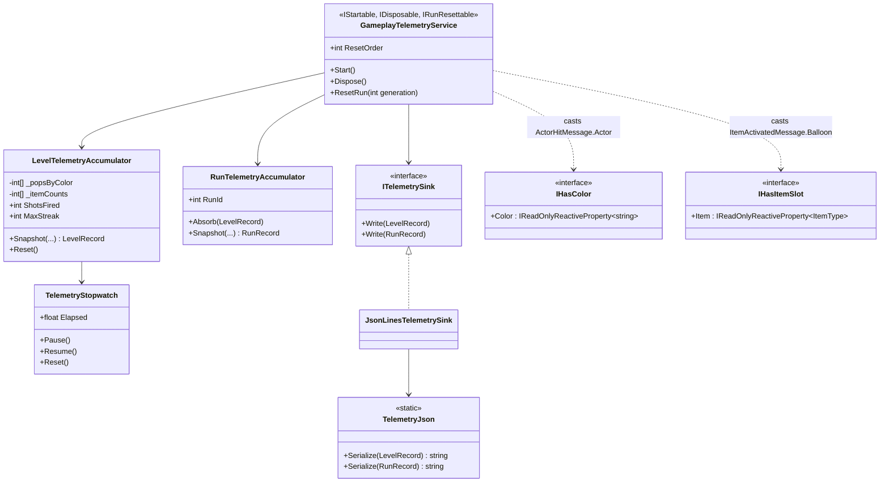
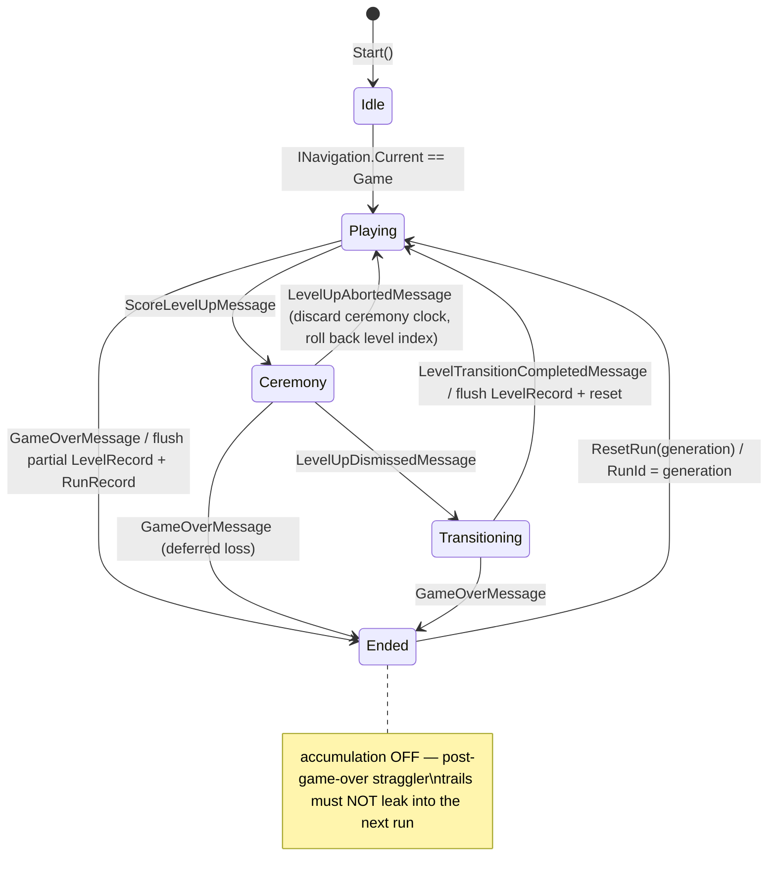

@page plan_gameplay_telemetry Gameplay Telemetry

# Gameplay Telemetry

Answer balance and pacing questions from real play data — how long levels take, where
runs die, which items get used, how streaks behave — by passively listening to the
game's internal event stream and writing structured records to a local log file.

> **Handoff note.** This plan was audited against the codebase (architect + test +
> performance review, 2026-07-26). Every message shape, cast, and registration idiom
> below was verified against source. Where the plan says "do not", it is because the
> obvious alternative compiles and runs but silently records wrong or empty data.
> Follow the plan literally; the *Implementer guardrails* section lists the traps.

---

## Principles

- **Gameplay only.** No PII, no device fingerprinting, no session identity beyond the
  run generation counter.
- **Subscriber-only collection.** The telemetry service consumes existing MessagePipe
  messages. It never publishes. Subscribing to `ActorHitMessage` as an order-independent
  observer is explicitly sanctioned (`Assets/Source/README.md`, hit-routing section);
  never touch `IHitDispatcher`.
- **Aggregate in memory, flush at boundaries.** Per-level and per-run accumulators,
  flushed as one record when the level transition fully completes
  (`LevelTransitionCompletedMessage`) or at game-over. No per-pop I/O or allocation
  during bursts.
- **Dev-only subsystem.** The entire subsystem (service + sink) is registered under
  `#if UNITY_EDITOR || DEVELOPMENT_BUILD`. Release builds pay nothing — no
  subscriptions, no increments. There is no `NoOpTelemetrySink`; tests use a
  `RecordingTelemetrySink` fake they can assert against. If release telemetry ever
  becomes a goal, that is the moment to revisit (a network sink behind `ITelemetrySink`
  is a drop-in, not a redesign).
- **Decomposed internals.** The service delegates to focused helpers (accumulators,
  stopwatch, JSON writer). Each helper is a plain C# class — testable in isolation
  without VContainer or Unity.
- **Never throw at a flush boundary.** Both flush points publish before releasing
  critical state (`LevelUpPopUp` publishes the dismissal *then* releases the time scale
  and pause; `RunController.EndRun` publishes *then* transitions navigation). MessagePipe
  runs handlers synchronously on the publisher's stack with no exception isolation, so
  an escaping exception freezes the game. Telemetry data is never worth a soft-lock.

---

## Architecture

### Folder structure

```
Assets/Source/Game/Telemetry/
├── GameplayTelemetryService.cs      ← VContainer entry point (orchestrator + state machine)
├── LevelTelemetryAccumulator.cs     ← mutable counters/timers for one level + Snapshot()
├── RunTelemetryAccumulator.cs       ← run totals, bests + Snapshot()
├── TelemetryStopwatch.cs            ← clock-owning timer (Pause/Resume/Elapsed/Reset)
├── LevelRecord.cs                   ← sealed DTO, per-level snapshot
├── RunRecord.cs                     ← sealed DTO, per-run summary
├── ColorPopCount.cs                 ← typed breakdown entry (color + count)
├── ItemActivationCount.cs           ← typed breakdown entry (item type + count)
├── ITelemetrySink.cs                ← write interface
├── JsonLinesTelemetrySink.cs        ← local-file sink (dev builds only)
├── TelemetryJson.cs                 ← hand-rolled JSON writer (static, StringBuilder-based)
└── README.md
```

Deleted from the original design: `TelemetryPauseTracker` (replaced by subscribing
`PauseService.IsAnyPaused` — see *Pause semantics*), `TelemetrySnapshotFactory`
(replaced by `Snapshot()` methods on the accumulators — a cross-object factory would
force both accumulators to expose their whole mutable interior), and
`NoOpTelemetrySink` (subsystem is dev-only; see *Principles*).

**Namespace:** `BalloonParty.Game.Telemetry`

### Class diagram


```mermaid
classDiagram
    class GameplayTelemetryService {
      <<IStartable, IDisposable, IRunResettable>>
      +int ResetOrder
      +Start()
      +Dispose()
      +ResetRun(int generation)
    }
    class LevelTelemetryAccumulator {
      -int[] _popsByColor
      -int[] _itemCounts
      +int ShotsFired
      +int MaxStreak
      +Snapshot(...) LevelRecord
      +Reset()
    }
    class RunTelemetryAccumulator {
      +int RunId
      +Absorb(LevelRecord)
      +Snapshot(...) RunRecord
    }
    class TelemetryStopwatch {
      +float Elapsed
      +Pause()
      +Resume()
      +Reset()
    }
    class ITelemetrySink {
      <<interface>>
      +Write(LevelRecord)
      +Write(RunRecord)
    }
    class JsonLinesTelemetrySink
    class TelemetryJson {
      <<static>>
      +Serialize(LevelRecord) string
      +Serialize(RunRecord) string
    }
    class IHasColor {
      <<interface>>
      +Color : IReadOnlyReactiveProperty~string~
    }
    class IHasItemSlot {
      <<interface>>
      +Item : IReadOnlyReactiveProperty~ItemType~
    }

    GameplayTelemetryService --> LevelTelemetryAccumulator
    GameplayTelemetryService --> RunTelemetryAccumulator
    GameplayTelemetryService --> ITelemetrySink
    GameplayTelemetryService ..> IHasColor : casts ActorHitMessage.Actor
    GameplayTelemetryService ..> IHasItemSlot : casts ItemActivatedMessage.Balloon
    LevelTelemetryAccumulator --> TelemetryStopwatch
    ITelemetrySink <|.. JsonLinesTelemetrySink
    JsonLinesTelemetrySink --> TelemetryJson
```

### Flush state machine

The service is an explicit five-state machine. This is what makes the abort edge and
the post-game-over straggler leak ordinary transitions instead of playtest bugs.


```mermaid
stateDiagram-v2
    [*] --> Idle : Start()
    Idle --> Playing : INavigation.Current == Game
    Playing --> Ceremony : ScoreLevelUpMessage
    Ceremony --> Transitioning : LevelUpDismissedMessage
    Ceremony --> Playing : LevelUpAbortedMessage (discard ceremony clock, roll back level index)
    Transitioning --> Playing : LevelTransitionCompletedMessage / flush LevelRecord + reset
    Playing --> Ended : GameOverMessage / flush partial LevelRecord + RunRecord
    Ceremony --> Ended : GameOverMessage (deferred loss)
    Transitioning --> Ended : GameOverMessage
    Ended --> Playing : ResetRun(generation) / RunId = generation
    note right of Ended : accumulation OFF — post-game-over straggler\ntrails must NOT leak into the next run
```

While in `Ended`, all message handlers early-return. The loss cinematic completes
straggler score trails *after* `GameOverMessage`
(`GameOverLossCinematic.HoldOutgoingContent` → `ScoreTrailService` → `CompleteAll`);
without the `Ended` gate those arrivals corrupt the next run's accumulator.

### Sequence diagram — level flush

```mermaid
sequenceDiagram
    participant Bus as MessagePipe
    participant Svc as TelemetryService
    participant Lvl as LevelAccumulator
    participant Trails as ScoreTrailService
    participant Sink as ITelemetrySink

    Bus->>Svc: gameplay msgs (fired / hit / item / shield / blocked)
    Svc->>Lvl: increment counters
    Bus->>Svc: ScoreLevelUpMessage (NewLevel)
    Svc->>Lvl: gameplay clock -> Pause, ceremony clock -> Resume
    Bus->>Svc: LevelUpDismissedMessage
    Svc->>Lvl: ceremony clock -> Pause
    Note over Trails: LevelTransitionController.HoldOutgoingContent -> CompleteAll
    Trails->>Bus: ScoreTrailArrivedMessage (stragglers)
    Bus->>Svc: ScoreTrailArrivedMessage
    Svc->>Lvl: PointsBanked += Points (STILL the completed level)
    Bus->>Svc: LevelTransitionCompletedMessage
    Svc->>Sink: Write(LevelRecord)
    Svc->>Lvl: Reset(); gameplay clock -> Resume
```

### Service

`GameplayTelemetryService` — plain C# class registered as an entry point. Orchestrates
the helpers and owns the state machine; owns no counting state itself.

| Interface | Purpose |
|---|---|
| `IStartable` | Subscribe to messages via `CompositeDisposable` |
| `IDisposable` | Dispose `CompositeDisposable`; close the sink |
| `IRunResettable` | `ResetOrder => RunResetOrder.Quiesce` — see below |

**`IRunResettable`, precisely:** `RunController` invokes `ResetRun(generation)`
*directly* on registered `IRunResettable`s in ascending `ResetOrder`
(`Game/Run/RunController.cs`). `RunResetMessage` is a separate broadcast for views
outside that graph — **do not also subscribe to it** (that would double-reset). Use
`RunResetOrder.Quiesce` (0), same as `ScoreTrailService` and `SfxService`. On reset:
silently clear both accumulators (no flush — the game-over path already flushed;
cheat-restart paths are dev-only), set `RunId = generation`. `RunId` initialises to 1,
matching `RunController`'s generation counter — do not keep a second counter.

Constructor receives all dependencies via **constructor injection** (a bare `public`/
`internal` ctor resolves fine in VContainer; `[Inject]` on the ctor is also idiomatic
here — either passes review). Subscribe with **method groups**, not lambdas
(`.Subscribe(OnActorHit)`; for payload-less messages `Subscribe(_ => OnFoo())` matches
`ColorStreakTracker`). Collect subscriptions in a `CompositeDisposable` via
`.AddTo(_subscriptions)` (`ItemSoundRouter` is the copyable shape).

**Clock start:** entry points `Start()` during the Launcher's additive preload, long
before the player taps Play. Do not start clocks in `Start()` — subscribe
`INavigation.Current` and enter `Playing` on `NavigationState.Game`
(`RunController` shows the idiom).

**Registration:** append at the **end** of `GameScopeRegistration.RegisterGameplaySystems`
(after `PierceDischargeEffects`) — the method is annotated "Do not reorder or split",
and telemetry has no start-order dependency, so the end is the safe spot. Wrap the
service *and* sink registrations in `#if UNITY_EDITOR || DEVELOPMENT_BUILD` (precedent:
the `RegisterCheats` guard and the `IThermalSource` swap in the same file).

### Internal helpers

| Type | Responsibility |
|---|---|
| `LevelTelemetryAccumulator` | Mutable counters and `TelemetryStopwatch` instances for the current level. `Snapshot(...)` produces a `LevelRecord`; `Reset()` reuses the instance across levels without reallocation. Pre-sizes all collections in the constructor. |
| `RunTelemetryAccumulator` | Run-wide totals and bests. `Absorb(LevelRecord)` folds each flushed level into the run; increments `LevelsCompleted` **only when `record.Completed` is true**. `Snapshot(...)` produces the `RunRecord`. |
| `TelemetryStopwatch` | Pure C# timer that **owns its clock**: constructed with a `Func<float> clock`, keeps `_lastSample` internally, and folds `clock() - _lastSample` into `Elapsed` on `Pause()` / `Resume()` / `Elapsed` reads. No `Advance()` in the public API and no "call at every boundary" contract — miss-a-boundary bugs are structurally impossible. Tests inject a mutable fake clock. |
| `TelemetryJson` | Static serializer: `Serialize(LevelRecord)` / `Serialize(RunRecord)` → one JSON line. See *Serialization*. |

### Sink

`ITelemetrySink` — one method per record type (`Write(LevelRecord)`,
`Write(RunRecord)`), plus `Dispose()`.

`JsonLinesTelemetrySink` (the only production implementation, dev builds only):

| Aspect | Detail |
|---|---|
| Path | `Application.persistentDataPath + "/telemetry/"` |
| File naming | `telemetry_yyyyMMdd_HHmmss.jsonl` — one file per app session; format the name with `CultureInfo.InvariantCulture` (a non-Gregorian device calendar otherwise writes year 2569) |
| Stream | **Open one `StreamWriter` in `Start()` (after rotation) and keep it for the session**; append + `Flush()` per record; close in `Dispose()`. Do not open/append/close per flush — the file-open on Android `persistentDataPath` dominates the write cost, and neither flush boundary is an idle frame. |
| Rotation | On start, keep the 20 most recent files, delete the rest. Sort by **file name** (lexicographically ordered by construction) — not `File.GetLastWriteTime`, which is N extra `stat` calls on the scope-start frame. |
| Robustness | Every public method body wrapped in `try/catch (Exception e) { Log.Warn(...); _disabled = true; }`. A sink that has thrown once stops attempting writes for the session. This is the project's **first runtime file I/O** — there is no precedent to copy, and an unhandled `IOException` at a flush boundary soft-locks the game (see *Principles*). |
| Game-over write | Snapshot the records **synchronously** on `GameOverMessage`, then defer the actual write one frame (`UniTask.Yield` + `.Forget()`, guarded) — `GameOverMessage` lands on the first frame of the loss push-in, not an idle frame. The deferred write must own the immutable snapshots, never the live accumulators (`RestartRun` may run before it completes). |

The service also wraps its own flush calls in the same guard — defense in depth on
both sides of the interface.

### Serialization

**Hand-rolled, no reflection. This is not a style preference; neither library option
works:**

- **Newtonsoft is unreachable.** `BalloonParty.Runtime.asmdef` sets
  `"overrideReferences": true` with `"precompiledReferences": ["DOTween.dll"]` only.
  The Newtonsoft DLL is referenced solely by the editor-only audio asmdef.
- **`JsonUtility` fails silently.** It serializes only Unity-serializable public
  *fields* — never properties, never `readonly` fields, never `IReadOnlyList<T>`. Fed
  these DTOs it returns `{}` with no error, and it cannot emit the `"type"`
  discriminator.

`TelemetryJson` builds each line into a **single reused `StringBuilder`** field
(cleared per record, never reallocated):
`{"type":"level","levelIndex":3,...}` / `{"type":"run",...}`.
**Every numeric and date append passes `CultureInfo.InvariantCulture`** — on a
comma-decimal locale `float.ToString()` emits `12,5` and the whole log becomes
unparseable. Timestamp: `DateTime.UtcNow.ToString("o", CultureInfo.InvariantCulture)`.
(Only two `InvariantCulture` call sites exist in the repo today — this will not be
caught by imitation.)

Because serialization is hand-rolled, the DTOs keep their intended shape: `sealed`
classes / `readonly struct`s with get-only properties, `IReadOnlyList<T>` breakdowns.
Member ordering per CLAUDE.md: **properties in the top block, before the constructor** —
`style_audit.py` blocks the commit otherwise.

---

## Phase 1 — Passive Counters

Everything in this phase uses signals already on the bus. Gameplay-code edits are
limited to: the registration lines, and the one-line `CheatState.AnyCheatUsed` addition
(see *Cheat tagging*).

### Flush boundaries

The level record flushes on **`LevelTransitionCompletedMessage`**, not on
`LevelUpDismissedMessage`. The dismissal is published *before* the surviving score
trails resolve: `LevelUpPopUp` publishes it, and the survivors are only completed later
inside the Ascent (`LevelTransitionController.HoldOutgoingContent` →
`ScoreTrailService`'s `CompleteAll`). Flushing on dismissal would charge those arrivals
to the *next* level's `PointsBanked`. `LevelTransitionCompletedMessage` already exists,
is already registered, and is published in `TransitionAsync`'s `finally` — it fires on
every path including cancellation.

Boundary roles:

- `ScoreLevelUpMessage` → enter `Ceremony`: pause gameplay clock, resume ceremony
  clock, capture `LevelIndex = msg.NewLevel - 1` (the level just completed — do **not**
  keep an internal counter; `CheatState.StartLevel` lets dev runs start at arbitrary
  levels and a counter drifts).
- `LevelUpDismissedMessage` → enter `Transitioning`: pause ceremony clock. No flush yet.
- **`LevelUpAbortedMessage`** → back to `Playing`: zero the ceremony clock, resume the
  gameplay clock, discard the captured level index, do **not** flush. The ceremony can
  bail without ever reaching a dismissal (`LevelUpCinematic.AbortSession` →
  `LevelController` returns `Pending → Playing` directly). Without this subscription the
  gameplay clock stays paused forever and every subsequent level records
  `DurationSeconds ≈ 0`.
- `LevelTransitionCompletedMessage` → back to `Playing`: snapshot (with
  `Completed = true`), write, absorb into the run accumulator, reset the level
  accumulator, resume the gameplay clock.
- `GameOverMessage` → enter `Ended`: snapshot the partial level (with
  `Completed = false`, `LevelIndex` from `msg.FinalLevel`) plus the run record
  (`TotalScore` from `msg.FinalScore`), hand both to the sink (deferred write, see
  *Sink*). All handlers early-return until `ResetRun`.

### LevelRecord fields

| Field | Type | Source |
|---|---|---|
| `LevelIndex` | `int` | `ScoreLevelUpMessage.NewLevel - 1`; on game-over partial: `GameOverMessage.FinalLevel` |
| `Completed` | `bool` | `true` on transition-completed flush, `false` on game-over partial flush |
| `DurationSeconds` | `float` | Gameplay clock (excludes pause + ceremony + transition) |
| `WallDurationSeconds` | `float` | Wall clock — see *Time tracking* |
| `ShotsFired` | `int` | `ProjectileFiredMessage` |
| `TotalPops` | `int` | `ActorHitMessage` where `Outcome == HitOutcome.Pop` |
| `DirectHitPops` | `int` | Same, and `(msg.Context.Flags & DamageFlags.DirectHit) != 0` — the true accuracy numerator |
| `PopsByColor` | `IReadOnlyList<ColorPopCount>` | Pop outcomes broken down by color; see *Color derivation* |
| `Deflects` | `int` | `ActorHitMessage` where `Outcome == HitOutcome.Deflect` |
| `MaxStreak` | `int` | `StreakChangedMessage.Streak` — running max |
| `PointsBanked` | `int` | `ScoreTrailArrivedMessage.Points` — sum (`Points` is the delta; `Score` is the running total — don't sum `Score`) |
| `OverflowCount` | `int` | `SpawnBlockedMessage` count |
| `ShieldsGained` | `int` | `ShieldGainedMessage` |
| `ShieldsSpent` | `int` | `ShieldLostMessage` |
| `ItemsActivated` | `IReadOnlyList<ItemActivationCount>` | `ItemActivatedMessage`; see *Item derivation* |
| `CeremonyDurationSeconds` | `float` | Ceremony clock (trigger → dismissal) |
| `CheatActive` | `bool` | See *Cheat tagging* |

`TotalPops` includes item-driven and cheat-driven pops (`BombItemHandler`,
`LightningChain`, `AwardScorePopCheat` all dispatch hits) — that is why
`ShotsFired / TotalPops` is **not** an accuracy proxy and `DirectHitPops` exists.

#### Typed breakdown entries

```csharp
public readonly struct ColorPopCount
{
    public string ColorName { get; }
    public int Count { get; }
}

public readonly struct ItemActivationCount
{
    public ItemType ItemType { get; }
    public int Count { get; }
}
```

(`string` color identity matches the repo — `IHasColor.Color` and
`IGamePalette.ProgressColorNames` are both string-keyed; do not invent a `ColorId`.)

### RunRecord fields

| Field | Type | Source |
|---|---|---|
| `RunId` | `int` | `RunController` generation — init 1, updated in `ResetRun(generation)` |
| `LevelsCompleted` | `int` | Count of absorbed records with `Completed == true` |
| `TotalDurationSeconds` | `float` | Sum of LevelRecord wall durations |
| `TotalScore` | `int` | `GameOverMessage.FinalScore` |
| `EndCause` | `string` | Constant `"HealthDepleted"` — only loss path today; revisit when a second cause exists |
| `TotalShotsFired` | `int` | Accumulated across levels |
| `TotalPops` | `int` | Accumulated across levels |
| `MaxStreakOverall` | `int` | Best streak in the entire run (max across absorbed levels, not last) |
| `CheatActive` | `bool` | True if any absorbed level was tagged (never overwritten back to false) |
| `Timestamp` | `string` | ISO 8601 UTC (`"o"` format, InvariantCulture) at flush time |

### Message subscriptions

| Message | Effect (all handlers early-return in `Ended`) |
|---|---|
| `ProjectileFiredMessage` | `ShotsFired++` |
| `ActorHitMessage` | `Outcome == Pop` → `TotalPops++`, color bucket++, DirectHit check; `Outcome == Deflect` → `Deflects++`. Filter with `==`, not `HasFlag` — every `EvaluateHit` returns a single value and equality is the repo idiom (`ScoreController`, `BalloonSpawner`) |
| `StreakChangedMessage` | `MaxStreak = max(MaxStreak, msg.Streak)` |
| `ScoreTrailArrivedMessage` | `PointsBanked += msg.Points` |
| `SpawnBlockedMessage` | `OverflowCount++` |
| `ItemActivatedMessage` | Item bucket++ — see *Item derivation* |
| `ShieldGainedMessage` | `ShieldsGained++` |
| `ShieldLostMessage` | `ShieldsSpent++` |
| `ScoreLevelUpMessage` | State → `Ceremony` (see *Flush boundaries*) |
| `LevelUpDismissedMessage` | State → `Transitioning` |
| `LevelUpAbortedMessage` | State → `Playing`, ceremony discarded |
| `LevelTransitionCompletedMessage` | Flush + reset, state → `Playing` |
| `GameOverMessage` | Flush partial + run record, state → `Ended` |
| `PauseService.IsAnyPaused` (ReactiveProperty, **not** a message) | Gate the gameplay clock — see *Pause semantics* |

Notes for the implementer:
- `PausedMessage` / `ResumedMessage` live in namespace `BalloonParty.Shared.Pause`
  (not `Shared.Messages`) and are **not subscribed** in this design.
- `ProjectileFiredMessage` and `LevelUpAbortedMessage` are `internal` — fine, same
  assembly.

### Color derivation

`ActorHitMessage` carries **no color** — it carries `ISlotActor Actor`. Derive it:

```csharp
if (msg.Actor is IHasColor colored) { /* colored.Color.Value is the palette string */ }
```

(Precedents: `ProjectileHitResolver`, `ScoreController`.) Accumulate in an
`int[] _popsByColor` sized from `IGamePalette.ProgressColorNames.Count` **plus one
trailing "other" bucket**, with a `Dictionary<string,int>` name→index map built once in
the constructor from the same list. Use `ProgressColorNames`, **not** `ColorNames` —
the latter includes presentation-only tints that never appear on a balloon
(`ScoreController` does the same). Unknown ids (rainbow — `GamePalette.RainbowColorId` —
or paint-converted) and actors without `IHasColor` (statics, gatekeepers) fall into the
"other" bucket and must never throw or index out of range. `ColorPopCount[]` is
materialised only at flush.

### Item derivation

`ItemActivatedMessage` carries **no item type** — it carries `IBalloonModel Balloon`.
Derive it with the same guarded cast `ItemSoundRouter` uses:

```csharp
if (message.Balloon is IHasItemSlot slot) { _itemCounts[(int)slot.Item.Value]++; }
```

Non-item-eligible balloons (e.g. `ToughBalloonModel`) must no-op, not throw. Size the
array with `Enum.GetValues(typeof(ItemType)).Length` (currently 7, `None`=0,
contiguous), not a hardcoded literal. The message is published *after*
`handler.Activate` completes, so bucket `ItemType.None` like any other value rather
than assuming it can't happen. (Known fragility, do not "fix": reading the slot off a
popped balloon works because models are constructed per spawn and the slot is never
cleared — the same assumption `ItemSoundRouter` makes. If balloon *models* are ever
pooled, this silently becomes all-`None`; the fix then is an `ItemType` field on the
message.)

### Time tracking

Clocks sample **`Time.unscaledTime`** — not `Time.realtimeSinceStartup`. Nothing in
the project observes app backgrounding (no `OnApplicationPause`/`OnApplicationFocus`
anywhere in `Assets/Source`), so a pocket-suspend would silently inflate
`realtimeSinceStartup`-based durations by the full background time. `unscaledTime`
advances only on ticked frames, clamped by `Time.maximumDeltaTime` (0.333 s default,
unmodified in this project), so a suspend of any length costs at most one clamped
frame. It is also `timeScale`-independent, which the slow-mo cinematics require. The
clock is injected as `Func<float>` — precedent: `SfxThrottleGate`'s registration
(`GameScopeRegistration`, `() => Time.unscaledTime`).

`TelemetryStopwatch` owns the clock (see *Internal helpers*) — there is no `Advance()`
call the service can forget to make.

| Clock | Runs while | Pause-gated by `IsAnyPaused`? |
|---|---|---|
| **Gameplay** | State == `Playing` | **Yes** |
| **Ceremony** | State == `Ceremony` | **No — deliberately.** The ceremony *is* a pause: `LevelUpCinematic` holds `PauseSource.Cinematic` and `LevelUpPopUp` holds `PauseSource.LevelUp` for its whole duration. A pause-gated ceremony clock would read ≈ 0. |
| **Wall** | State != `Idle`/`Ended` (level start → flush) | **No** — see below |

**`WallDurationSeconds` definition:** total elapsed time for the level including
ceremony and transition, ungated. Every `PauseSource` that exists today (`Cinematic`,
`LevelUp`, `Overflow`, `LevelTransition`, `Cheat`) is gameplay-/ceremony-owned, not a
user interruption — gating the wall clock on `IsAnyPaused` would collapse it toward
`DurationSeconds` on every level. If a genuine user-interruption source (settings menu,
ad overlay) is ever added, that is the moment to introduce a source filter. A
`PauseSource.Cheat` pause (dev console open) does inflate wall time; those records are
`CheatActive`-tagged anyway.

### Pause semantics

**Subscribe, don't recount.** `PauseService` is already reference-counted per source
and exposes `IReadOnlyReactiveProperty<bool> IsAnyPaused`. Inject `PauseService` and
subscribe to `IsAnyPaused`; do **not** count `PausedMessage`/`ResumedMessage` edges.

This is load-bearing, not stylistic: `PauseService.ResetRun` clears its source stack
**without publishing `ResumedMessage`** ("Drop all sources outright; live systems only
gate on IsAnyPaused"). Any message-edge counter therefore leaks depth permanently on
the loss path — `GameOverLossCinematic` pauses, `RestartRun` clears the stack
silently, the cinematic pauses/resumes again — netting +1 per loss and freezing every
subsequent level's timers at zero. `IsAnyPaused` is reset to `false` by the same
method, so it cannot leak.

### Cheat tagging

`CheatState` is compiled out of release builds — the whole file sits under
`#if UNITY_EDITOR || DEVELOPMENT_BUILD || CHEATS_IN_RELEASE`. The read site in the
service needs the **identical triple guard** with an `#else` branch defaulting
`cheatActive = false` (same shape as `RunController.EndRun`). Note the sink's guard is
the *double* guard and the cheat guard is the *triple* one — they are different on
purpose; do not harmonise them. `dotnet build` defines `UNITY_EDITOR`, so a missing
guard here compiles locally and **breaks only the real release build**.

"Any flag active" is insufficient as-is: `StartLevel` and `TimeOfDaySpeedScale` default
to 1 (not 0), and one-shot cheats (`AwardScorePopCheat`, `TriggerLevelUpCheat`,
`AddShieldCheat`, …) leave no trace. Phase 1 therefore includes one line of gameplay
code: add `public static bool AnyCheatUsed;` to `CheatState` (reset in `ResetOnPlay`),
set `true` when the cheat console opens (`CheatConsoleView`) — every cheat except the
pacing window goes through the console, and the pacing window already writes
`StartLevel`. Then:

```csharp
cheatActive = CheatState.AnyCheatUsed
    || CheatState.BlockLevelUp
    || CheatState.InstantScoreTrails
    || CheatState.StartLevel != 1
    || !Mathf.Approximately(CheatState.TimeOfDaySpeedScale, 1f);
```

Evaluated at flush time ("read at flush time" contract — a cheat toggled off before
flush does not tag the record). The run record's flag is sticky: once any level is
tagged, the run stays tagged. Records are never dropped — tagged for filtering.

### Performance notes

Measured worst case: ~10–25 `ActorHitMessage` in a single frame (bomb/laser/lightning
resolve synchronously), plus tens of `ScoreTrailArrivedMessage` in the transition
frame (`CompleteAll` fires every in-flight arrival at once — one per *point*, not per
pop). Every handler is an `int` add or an array increment; peak ≈ low hundreds of
invocations/second. **This design needs no pooling, no buffering, no `ITickable` — do
not add any.** (`BoardPopWave` is scoreless by design — it publishes no
`ActorHitMessage` and contributes zero handler invocations.)

- Hot-path handlers must allocate nothing: no string interpolation, no LINQ, no
  `Log.Info` in the `ActorHitMessage` / `StreakChangedMessage` /
  `ScoreTrailArrivedMessage` paths. Color ids are palette-authored strings passed by
  reference — the dictionary lookup + `int[]` increment allocates zero.
- `int[]` for items and colors; DTO lists materialise only at flush. (For the record:
  `Dictionary<ItemType,int>` would *not* box — `EqualityComparer<TEnum>.Default` is
  specialised — the `int[]` is preferred for simplicity, not to avoid boxing.)
- `CompositeDisposable` for one-call teardown.
- No record pooling — flush frequency (~30–120 s) makes allocation negligible.
- Flush-time costs (record allocation, ISO timestamp, list materialisation) are fine;
  the file-stream policy is what matters — see *Sink*.

---

## Phase 2 — Small Extensions

Trimmed from the original plan after review:

- ~~`HealthChangedMessage`~~ — **cut.** `IPlayerHealth.Current` is already an
  `IReadOnlyReactiveProperty<int>`; min-HP-per-level is one `Subscribe`. Adding a bus
  message no other system wants violates this plan's own principles.
- ~~`LossCause` enum + `GameOverMessage` change~~ — **cut** until a second loss cause
  exists. `RunRecord.EndCause` ships in Phase 1 as a constant string.
- Track HP minimum per level (inject `IPlayerHealth`, subscribe `Current`).
- Track max danger level per level (inject `IDangerLevel`, sample `Level.Value` on
  overflow).

---

## Phase 3 — Deferred

- Streak-break reason decomposition (what ended the streak)
- Burst-rate summaries (pops-per-second peaks)
- Time-to-first-pop per level
- Editor window (`Tools > BalloonParty > Telemetry Viewer`)
- Remote/network sink implementation
- Run-counter persistence across app restarts
- Flush-on-background (`OnApplicationPause`) — would need a MonoBehaviour seam; not
  worth the MVC exception today
- Record a run on cheat-restart (`ForceRestartCheat`/`StartFromLevelCheat` bypass
  `GameOverMessage`, so those dev runs currently vanish; an `EndCause = "Abandoned"`
  flush from `ResetRun` would capture them)

---

## Test Strategy

### File structure

Flat in `Assets/Tests/EditMode/Game/` (the existing `Game` test folder has no
subfolders — do not introduce one), namespace `BalloonParty.Tests.Game`. No asmdef
changes needed: `AssemblyInfo.cs` already grants `InternalsVisibleTo` for the EditMode
assembly, which already references `BalloonParty.Runtime`, MessagePipe, and VContainer.

```
Assets/Tests/EditMode/Game/
├── TelemetryStopwatchTests.cs         (TDD-first)
├── LevelTelemetryAccumulatorTests.cs  (TDD-first)
├── RunTelemetryAccumulatorTests.cs
├── GameplayTelemetryServiceTests.cs   (orchestration / flush boundaries)
└── TelemetryJsonTests.cs              (string-shape assertions)
```

**Template:** `ScoreControllerTests.cs` — specifically its subscriber-capture pattern
(NSubstitute `ISubscriber<T>` whose `Subscribe` call captures the `IMessageHandler<T>`
via `Arg.Do`, so the test fires messages by invoking the captured handler directly).
`GameplayTelemetryServiceTests` needs one capture per subscribed message, wired in a
`BuildService()` helper, `Start()`ed in `SetUp`, `Dispose()`d in `TearDown`. The sink
is a hand-written `RecordingTelemetrySink` (captures written records into lists) — a
no-op sink cannot be asserted against.

**Repo gotchas, non-negotiable:**
- Every `[Test]` method must be **`public`** — NUnit here silently skips non-public
  test methods (this has produced false green in this repo before).
- Any test touching `CheatState` statics must restore them in `TearDown` (same rule as
  `PlayerPrefs`).
- Time control: service tests drive the injected `Func<float>` (a mutable `_now` field
  bumped between handler invocations) and assert on the durations in the records the
  fake sink captured. Stopwatch tests drive the stopwatch's own injected fake clock.
  **Do not add a test-only `AdvanceForTest` seam to the service** — the clock func is
  the single seam.

### Named test cases

`TelemetryStopwatchTests` (TDD-first):
- `Elapsed_WhileRunning_AccumulatesClockDelta`
- `Elapsed_WhilePaused_DoesNotAccumulate`
- `Pause_CalledTwice_IsIdempotent`
- `Resume_WithoutPause_IsIdempotent`
- `Resume_AfterPause_ResumesAccumulating`
- `Reset_ZeroesElapsed_AndDefinesRunningState` (spec the post-reset state explicitly:
  reset returns the stopwatch to **paused**; callers resume it deliberately)
- `Elapsed_ClockGoesBackward_ClampsAtZeroDelta` (negative delta from a clock glitch
  must not corrupt `Elapsed`)
- `Elapsed_ReadTwiceWithoutClockAdvance_IsStable`

`LevelTelemetryAccumulatorTests` (TDD-first):
- `MaxStreak_TracksRunningMaximum_NotLastValue`
- `PointsBanked_SumsAcrossArrivals`
- `PopsByColor_KnownColor_IncrementsThatBucket`
- `PopsByColor_UnknownColor_FallsIntoOtherBucket_NoThrow` (rainbow / paint-converted)
- `PopsByColor_ActorWithoutColor_FallsIntoOtherBucket_NoThrow`
- `PopsByColor_BuiltFromProgressColorNames_NotAllColorNames`
- `ItemCounts_AllItemTypeValues_IndexWithoutThrowing` (walk `Enum.GetValues`)
- `Reset_ZeroesAllCounters`
- `Snapshot_ProducesRecordMatchingCounters`

`RunTelemetryAccumulatorTests`:
- `Absorb_CompletedLevel_IncrementsLevelsCompleted`
- `Absorb_PartialLevel_DoesNotIncrementLevelsCompleted`
- `Absorb_SumsShotsAndPopsAcrossLevels`
- `MaxStreakOverall_MaxAcrossLevels_NotLastLevel`
- `CheatActive_StickyOnceTagged_NotOverwrittenByCleanLevel`
- `TotalDurationSeconds_SumsWallDurations`

`GameplayTelemetryServiceTests`:
- One increment test per simple subscription (shots, pops+color, deflects, streak,
  points, overflow, shields ×2)
- `OnItemActivated_NonItemEligibleBalloon_NoOp_NoThrow`
- `OnActorHit_DirectHitFlag_IncrementsDirectHitPops`
- `OnScoreLevelUp_StopsGameplayClock_StartsCeremonyClock`
- `OnLevelTransitionCompleted_FlushesCompletedRecord_ResetsAccumulator`
- `OnLevelTransitionCompleted_StragglerTrailPointsArriveBeforeFlush_CountedInCompletedLevel`
- `OnLevelUpAborted_DiscardsCeremony_ResumesGameplayClock_NoFlush`
- `OnLevelUpAborted_NextFlushRecordsCorrectLevelIndex`
- `OnGameOver_FlushesPartialLevelWithCompletedFalse_PlusRunRecord`
- `OnGameOver_ThenStragglerMessages_DoNotMutateAnything` (the `Ended` gate)
- `OnGameOver_ImmediatelyAfterTransitionCompleted_NoPhantomEmptyRecord`
- `OnTransitionCompleted_WithoutPriorScoreLevelUp_NoDoubleFlush`
- `IsAnyPausedTrue_GameplayClockPauses_CeremonyClockDoesNot`
- `LevelIndex_FromScoreLevelUpNewLevel_NotInternalCounter` (fire `NewLevel: 5` cold;
  expect flushed index 4)
- `CheatActiveAtFlush_TagsRecord` / `CheatDisabledBeforeFlush_DoesNotTag` (restore
  `CheatState` in `TearDown`)
- `ResetRun_MidLevel_ClearsSilently_NoFlush_NoThrow` and sets `RunId = generation`
- `Dispose_UnsubscribesAll_NoMutationAfterDispose`

`TelemetryJsonTests` (assert on the emitted string — the EditMode assembly has no JSON
parser, so no parse-based round-trip):
- `Serialize_LevelRecord_EmitsTypeDiscriminatorAndAllFields`
- `Serialize_RunRecord_EmitsTypeDiscriminatorAndAllFields`
- `Serialize_FloatFields_UseInvariantCulture` (set a comma-decimal
  `CultureInfo.CurrentCulture` in the test, restore in `TearDown`)
- `Serialize_ColorAndItemBreakdowns_EmitEachEntry`
- `Serialize_ReusedBuilder_SecondRecordNotContaminatedByFirst`

---

## Implementer guardrails

The traps in this feature all *compile and run*; they fail only in the data or on
device. In rough order of cost-to-discover:

1. **Do not use `JsonUtility` or Newtonsoft** — see *Serialization*. `JsonUtility`
   emits `{}` for these DTOs with no error.
2. **Do not count `PausedMessage`/`ResumedMessage`** — the counter leaks on every loss;
   subscribe `PauseService.IsAnyPaused`.
3. **Do not flush on `LevelUpDismissedMessage`** — straggler trail points land after it.
4. **Do not forget `LevelUpAbortedMessage`** — or the gameplay clock wedges forever on
   the first aborted ceremony.
5. **Do not read `CheatState` without the triple `#if` guard + `#else`** —
   `dotnet build` will not catch it; only a real release build breaks.
6. **Do not use `Time.realtimeSinceStartup`** — pocket-suspends inflate it and nothing
   publishes a pause for backgrounding.
7. **Do not let a sink exception escape** — MessagePipe handlers run on the publisher's
   stack; a throw at either flush boundary soft-locks the game.
8. **Do not subscribe `RunResetMessage`** — `IRunResettable.ResetRun` is invoked
   directly; subscribing both double-resets.
9. **Do not open the log file per flush** — one `StreamWriter` per session.
10. **Every numeric/date `ToString` in the sink takes `InvariantCulture`.**
11. New `.cs`/`.md` files need Unity `.meta` files (mirror a sibling's format).
12. After implementation: `dotnet build BalloonParty.Runtime.csproj` +
    `python3 Tools/style_audit.py`; behavior needs an in-editor playtest — say so,
    don't claim verified.

---

## Analytics Notes

### Minimum viable fields

Five fields answer ~80% of balance questions: **level index**, **active gameplay
duration**, **shots fired**, **total pops**, **overflow count**. Phase 1 captures all
five plus many more — but these are the priority for early analysis.

### Key analyses enabled

| Question | Fields used |
|---|---|
| Which levels are too hard / too easy? | OverflowCount by LevelIndex |
| Are levels too long or too short? | DurationSeconds percentiles by LevelIndex |
| Is the player shooting enough? | ShotsFired vs **DirectHitPops** (true accuracy; TotalPops includes item/cheat pops) |
| Where do runs end? | LevelsCompleted distribution on RunRecords (partial levels excluded via `Completed`) |
| Are items impactful? | ItemsActivated frequency vs level outcomes |

### Sample-size guidance

- ~400 runs per level to detect large problems (>10% failure-rate shift)
- ~1,000 runs per level for tuning-level confidence (5% shifts)
- Segment by skill proxy (best level reached in session, or total runs) rather than
  global averages — a new player's level-3 data and a veteran's are different
  populations.

---

## Resolved questions (from the original draft)

1. **Run-counter persistence** — dissolved: `RunId` is the `RunController` generation,
   per-session-monotonic by construction. Cross-session persistence stays Phase 3.
2. **Accuracy tracking** — resolved by `DirectHitPops` (gated on
   `DamageFlags.DirectHit`), which excludes item/cheat pops and absorbed projectiles
   in one stroke.
3. **`LevelTransitionCompletedMessage`** — it already existed; the flush lives there.
