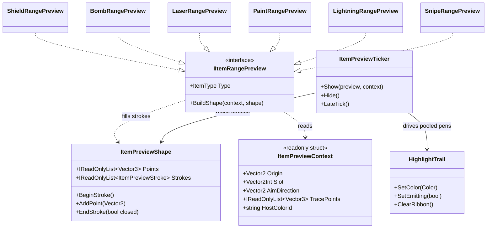
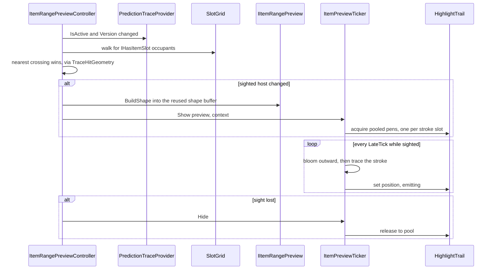

@page plan_item_range_preview Item Range Preview

# Item Range Preview

> Working plan for the aim-time telegraph that draws an item's affected area on the board
> with ribbon trails, when the prediction line of sight crosses the balloon hosting it.

---

## Orientation

Today the aim telegraph tells the player *where the shot goes*. It says nothing about what
an item along that path would **do** — the player has to know each item's range from
memory. This feature draws that range, live, while aiming: sight an item, see its shape
painted on the board by trails that stream out of the host balloon.

The look is borrowed from the score-trail **formations** (`Game/Score/Behaviours/`), where
"pens" — small glowing heads dragging `TrailRenderer` ribbons — orbit a shape's edges and
leave the drawn figure behind them. That system already proved the technique; this reuses
the *idea*, not the code: score formations tumble 3D polyhedra toward a UI bar, while these
are flat, board-space, and anchored to a balloon.

Every item type draws a different figure, so the shape is the part that varies:

| Item | Figure |
|---|---|
| Shield | plus sign at the end of the prediction line — no board range of its own |
| Bomb | circle at the blast radius |
| Laser | two thick rectangles, along the beam cross at its current spin |
| Paint | the spread triangle, over the balloons it would repaint |
| Lightning | arcs from the host to each chain target, then onward between same-colour targets |
| Snipe | a line from the host to the wall — the pierce corridor |

---

## The seam

One interface, one implementation per item type, resolved by `ItemType`. This mirrors
`IBalloonItem` / `ItemActivator` exactly — VContainer registers every implementation, the
consumer takes `IEnumerable<IItemRangePreview>` and builds a `Dictionary<ItemType, ...>`
once in `Start`. A new item ships its preview beside its handler and needs no change here.

The shared vocabulary is a **stroke**: one polyline the pens trace. Every figure above
decomposes into strokes — a circle is one closed stroke, the plus is two open ones, the
laser is two closed rectangles, lightning is one stroke per arc. Nothing in the driver
knows what an item *is*, only how many strokes it drew and where their points are.



`BuildShape` is **pure geometry** — it appends points and never touches a renderer, a
pool, or `Time`. That keeps every figure edit-mode testable the way `TraceHitGeometry` and
`PaintTriangle` already are, and it is why the driver can be written once.

Each preview constructor-injects whatever it needs to compute its own figure —
`IItemConfiguration` for the tuned radii, `SlotGrid` for the occupants Lightning chains
through or Paint covers, `IProjectileFlightConfig` for the walls Snipe runs to. The
context carries only what changes per crossing.

**Reuse the existing cores where they already exist.** `PaintTriangle.Build`,
`LightningChain`, `BombBlast` and `LaserCross` are already config-free pure geometry shared
by the live handlers and the shot solver. A preview that re-derives its own shape would
drift from the effect it advertises — the same failure `CircleContact` exists to prevent
for the aim line. Where a core selects *targets* rather than an outline, the preview calls
it for the target set and draws the outline around that result.

---

## Driving the pens



A pen lives two phases, closed-form off one clock — no tweens, no coroutines, matching
`ShapeFormationTicker`'s design constraint that N pens cost one `LateTick` and zero
allocations:

- **Bloom** (`t` 0 → 1) — leaves the host in a circular outward sweep to its stroke entry
  point. Angle lerps from the host-relative launch angle to the entry angle *plus* an extra
  sweep so the path arcs rather than shooting straight, radius eases 0 → entry radius. This
  is the motion the first milestone is about.
- **Trace** — walks the stroke's points at a constant arc-length rate, wrapping at the end
  (closed strokes rejoin point 0, open ones ping-pong). The ribbon is what draws the figure.

Pens are distributed round-robin across strokes, so a 2-stroke plus sign with 6 pens puts 3
on each arm, and the count stays a tuning knob rather than a per-item decision.

---

## Where the trigger lives

The controller is **plain C#** (`ILateTickable`), not a `SightReaction` on the balloon
prefab. Two reasons:

1. It needs `SlotGrid`, `IItemConfiguration` and the pool — all DI singletons. Pooled item
   visuals are not resolver-spawned (`ItemDisplayService` hand-threads what they need), so
   a view-side trigger would mean hand-threading four more services through that seam.
2. Only **one** preview shows at a time. That is a global arbitration — which host the aim
   is most centrally on — and a per-balloon component cannot make it without every instance
   knowing about every other.

It reuses `TraceHitGeometry.TryFindSurfaceHit` (the same test `PredictionSightProbe` runs
per-actor) against each item host's view circle, and gates the whole grid walk on
`PredictionTraceProvider.Version` so an unchanged aim costs nothing.

> **Note on the existing probe.** `PredictionSightProbe` stays exactly as it is — it drives
> the per-item *reactions* (glitter, fade, drift) on the visual itself. This controller
> answers a different question (which single host owns the board-level telegraph) and the
> two are deliberately independent.

---

## Phases

```
1  Infrastructure       — ItemPreviewShape/Stroke, IItemRangePreview, ItemPreviewContext,
                          HighlightTrail + prefab, ItemPreviewTicker, ItemRangePreviewController,
                          settings; Snipe + Bomb + Shield previews (line, circle, plus)
2  Remaining figures    — Laser rectangles, Paint triangle, Lightning arcs — each reusing its
                          existing core for target selection
3  Visual pass          — material, ribbon width/lifetime, bloom curve, per-item colour,
                          pen counts; the "tuned later" work
4  Polish               — pause/level-up gating, run-reset teardown, pooling prewarm,
                          telemetry if it earns it
```

**Milestone 1 is the vertical slice**: put the line of sight on an item and watch trails
leave the host in a circular outward motion toward the figure they will draw. Shape
fidelity and looks come after that reads right.

---

## Open questions

- **Does the figure track a moving host?** Balloons drift while the board settles. Either
  the shape rebuilds each frame (correct, costs a rebuild) or it anchors to the host
  transform and rides along (cheap, but a Lightning chain's targets would lie). Start with
  a rebuild gated on the trace version and revisit if it shows up in a profile.
- **Shield has no board range.** The plus sign at the prediction line's end is a
  placeholder for "this helps the shot, not the board". If it reads as a range it may be
  worse than nothing.
- **Laser spin.** The beam's rotation at contact time is extrapolated live
  (`ItemSpinDegrees + rate * tHit`). The preview cannot know `tHit` while aiming — draw it
  at the item's current visual rotation and accept the drift, or draw the swept annulus
  instead.
