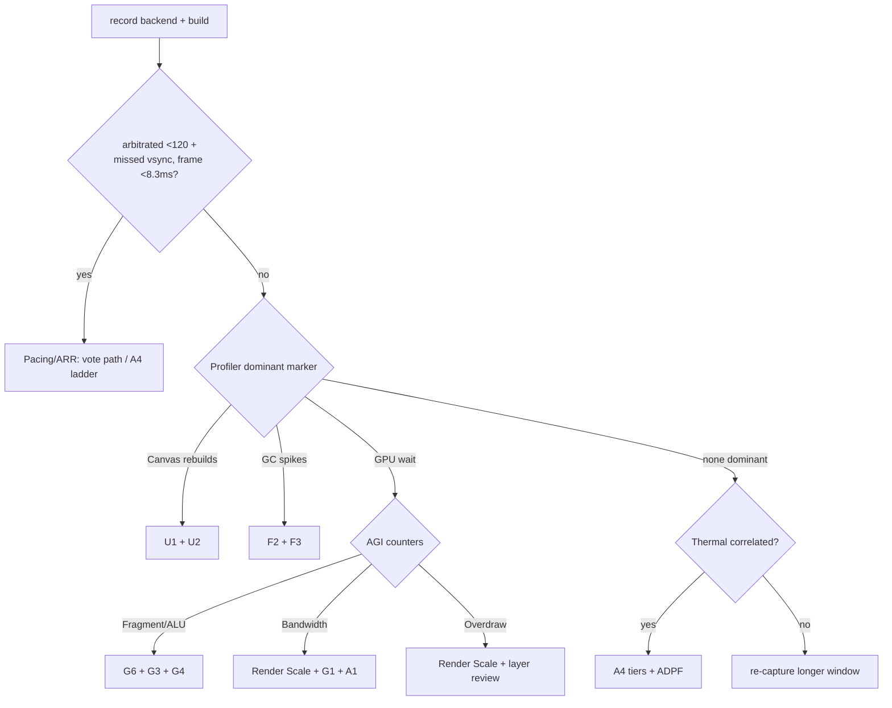

@page plan_performance_recovery Performance Recovery

# Performance Recovery Plan — BalloonParty (Phase 2, revised 2026-07-23)

**Status**: Phase 1 complete (merged to main). Phase 2 re-audited 2026-07-23 by a
four-agent challenge (optimizer / reviewer / researcher / scribe), then expanded the same
day with two architect deep-spec passes (CPU/UI + GPU/architectural) and a per-task model
delegation matrix. Each item below carries an implementation-ready spec; subagents should
be able to execute without further investigation.

**Problem**: Game sits at ~80 FPS on device where 120 FPS was previously reached, after
a wave of new visual features (wall nets, shared cloud field, painting field, velocity
stamps, cruise specks). Target is stable, smooth frame delivery at the highest rate the
device sustains.

**Target device (corrected)**: Google Pixel 9 — Tensor G4, **Arm Mali-G715 MP7 @ 940 MHz**
(Valhall Gen 4, tile-based, native 2× fp16 throughput, no HW ray tracing). The previous
"Pixel 10 (Adreno 750)" line was wrong twice over: Adreno 750 is Snapdragon 8 Gen 3 and
has never shipped in a Pixel, and Pixel 10 is Tensor G5 with an Imagination PowerVR GPU.
Mali-specific reasoning below does **not** transfer to a Pixel 10 test device.

**Graphics backend**: Android is **Vulkan-first, GLES3 fallback**
(`ProjectSettings.asset` `m_APIs: 150000000b000000`, verified 2026-07-23 — a transient
GLES3-only edit was reverted). F4's variant capture and AGI counter reads depend on which
backend is live; always confirm at runtime (Step 0 §0).

**Root cause (revised)**: The prior claim of "8-10 unmerged render passes every frame" is
stale. After the 2026-07-18 sweep, all five field services are cadence- or dirty-gated and
the GI smear chain re-runs only when the scene capture refreshes. Worst-case coincidence is
still ~9 off-graph blits (phase offsets are one-time and drift; `ScreenSpaceLightService`
is not registered with the coordinator at all), but typical frames are far lighter. The
sustained-80 problem is therefore **unattributed until Step 0 runs**. Candidate causes, in
rough likelihood order: main-pass fill rate/overdraw from the new features, the score-
arrival UI canvas-rebuild storm, frame pacing/ARR arbitration, thermal throttling, blit
coincidence spikes. Note the suspicious arithmetic: 80 = 120 × ⅔ — the exact cadence of
missing every third vsync, and also a plausible ARR-arbitration artifact (the ARR echo-loop
fix was validated on different hardware than the Pixel 9).

**Unity version**: 6000.3.15f1 (Unity 6.3) — URP 2D Renderer, Render Graph is the default
pipeline.

---

## Execution model & delegation matrix

Orchestration contract: the main loop (Fable) runs **review and investigation only** —
Step 0, per-wave reviewer/optimizer passes, consensus, and commits. All implementation is
delegated by task shape (haiku = checklist sweeps, sonnet = anchored implementation with
an exact spec, opus = design-heavy or judgment-sensitive work). José owns everything
requiring the Unity Editor or the device: prefab/asset wiring, playtests, visual A/Bs,
on-device captures.

| Task | Executor | Why |
|------|----------|-----|
| Step 0 diagnosis | **fable** (+ José on device) | Investigation by definition |
| F2 FlyingTrail resize | sonnet | 1-line delete + comment, exact spec below |
| F3 RollingTextAnimator | haiku | 4-site mechanical conversion, interactions pre-verified |
| F4 shader warmup | sonnet | New Launcher MonoBehaviour, exact shape below; SVC capture = José |
| C1 + C3 projectile | sonnet (one session) | Same file — must not be parallelized |
| U1 progress-bar pulse | **opus** | Feel-sensitive de-Animator redesign; prefab implications |
| U2 notice reparenting | sonnet | Exact spec, but touches shared pool code → mandatory fable review sweep after |
| G6 + G3 smear shader | **opus** (one session) | Same file/commit; precision judgment + banding fallbacks mid-flight |
| G4 bake octave skip | sonnet | Exact edits below incl. renormalization |
| G1 blit budget | **opus** | Contract redesign across 6 services + registration ordering |
| G5 gradient skip | **opus**, deferred | Two-shader temporal-coupling change (see spec — riskier than it looks) |
| A4 quality tiers + ADPF | **opus** | New subsystem, package integration |
| A1 RG prototype | **opus** | Novel RenderGraph interop, go/no-go experiment |
| A2 capture feature | parked | Behind A1 evidence |
| Per-wave review | **fable** (reviewer + optimizer agents) | User mandate |
| Docs per wave | scribe agent | Existing pipeline |
| Tests (G1 `IBlitBudget` is pure C# — unit-testable) | test-everything agent | Existing pipeline |

Every shader task additionally requires José's in-editor compile + on-device visual check
(`dotnet build` cannot validate HLSL).

---

## Phase 1 — Completed ✅ (spot-checked 2026-07-23: all commits exist and match)

| # | Fix | Commit | Impact |
|---|-----|--------|--------|
| 1A | Batch SetPositions in FlyingTrail | `7c027bb8` | ~1.5ms CPU during BigScore |
| 1B | BackgroundFieldService cadence gate | `7c027bb8` | 1 tile flush eliminated 50-75% of frames |
| 1C | SceneCaptureService manual GenerateMips | `7c027bb8` | ~0.3ms GPU per capture |
| 2A | Pre-multiplied alpha on PuffCloud + BackgroundCloud | `75bb57ee` | 1 ROP multiply per pixel saved |
| 2B | Light warp early-out in PuffCloud | `75bb57ee` | 2 NoiseOctave taps saved when no local light |
| 4A | Slerp → NormalizedLerp in pen orbit | `8b5ffeae` | ~0.4ms CPU during BigScore |
| 4B | Pool LightRegistrationHandle (no closure) | `8f2bfa1d` | 2 fewer GC objects per light |
| 4C | Inline .Where() in PierceEndedEndCondition | `8f2bfa1d` | 2 fewer GC objects per projectile |
| 3A | EffectCadenceCoordinator — phase-offset all services | `e7e64712` | Prevents 10+ tile flush spikes |
| — | Merge SceneLight Fill into Accumulate shader | `b252b9e4` | 1 tile flush per light-field render saved |
| — | Smear shader tap reduction on mobile (41→16) | `1480d00b` | ~0.5ms GPU per smear rebuild |
| — | `_LOW_QUALITY_CLOUD` for PuffCloud (20→12 taps) | `6f738ca8` | ~40% fragment cost reduction |
| — | `_LOW_QUALITY_CLOUD` for BackgroundCloud | `1094b867` | ~4 fewer taps per fragment |
| — | Bypass cadence during transitions | `83a91af6` | Fixes visible lag during ascend/descent |

The 2026-07-18 sweep (separate arc, see memory) additionally shipped: light-field cadence
cap + stamp-batch absorption (`9e994225`/`d01c2799`), smear gated to capture refreshes
(`12df3c37`) with the temporal path deleted (`4f6fab33`), half-res smear + covered-fragment
shadow skip (`90234423`), zero-alloc counters (`323cf79f`/`6b664409`), particle stop
callbacks (`c68827a5`), static-state write retirement (`5268c991`). Several original
Phase 2 items were partially or fully subsumed by that sweep — reflected below.

---

## Step 0: Diagnose before optimizing (mandatory, do first)

Everything below is a hypothesis until this attributes the sustained-80. All device steps
are read-only except an optional one-line backend log.

### 0. Preconditions — record backend and build type

```bash
adb logcat -d | grep -iE "GfxDevice|Vulkan|OpenGL ES|graphicsDeviceType"
adb shell pm list packages | grep -i balloon     # get the package name
```
Unity logs the selected device at startup. Record Vulkan vs GLES3 — F4's SVC capture and
AGI counter interpretation depend on it. Optionally add a one-line
`Debug.Log($"[Gfx] {SystemInfo.graphicsDeviceType} / {SystemInfo.graphicsDeviceName}")`
next to the `[FrameRateSettings]` boot logs. Build must be a **Development Build** with
profiler autoconnect for §2.

### 1. Pacing / ARR check

While the game reads ~80 FPS:
```bash
adb shell dumpsys display | grep -iE "mActiveModeId|refreshRate|fps|FrameRateOverride"
adb shell dumpsys SurfaceFlinger | grep -iE "refresh|present|mode|Scheduler|frame rate"
adb logcat -d | grep "\[FrameRateSettings\]"
# Frame timing (CORRECTED 2026-07-23: dumpsys gfxinfo tracks HWUI only — it reports
# 0 frames for Unity's SurfaceView. Use SurfaceFlinger frame latency instead):
adb shell dumpsys SurfaceFlinger --list | grep -i balloon   # get the BLAST layer name
adb shell "dumpsys SurfaceFlinger --latency '<layer name>'"
# line 1 = vsync period (ns); rows = desiredPresent/actualPresent/frameReady triples for
# the last ~64 frames. Present-to-present deltas of column 2 = delivered frame cadence.
```
Read: `mActiveModeId` → is the panel in a 120 Hz mode? SurfaceFlinger Scheduler → the
app's **arbitrated** frame rate (the unverified ARR path on Pixel 9). Cross-check the
`[FrameRateSettings]` request/settle lines (`FrameRateSettings.cs:79,96,105,127`).

**Signature**: targetFrameRate logs 120, frame time < 8.3 ms, but arbitrated rate ~80 with
high missed-vsync → **pacing/ARR artifact**; route to the FrameRateSettings vote path /
A4 ladder — no shader or UI code will fix it.

### 2. CPU vs GPU classification

Unity Profiler (Timeline view, Deep Profile OFF), two windows: **A** normal play,
**B** BigScore burst (~50 arrivals/s on the bars). Route by dominant main-thread marker:

| Dominant marker | Meaning | Route |
|---|---|---|
| `Canvas.SendWillRenderCanvases` / `BuildBatch` | UI rebuild storm | **U1 + U2** |
| `GC.Collect` / `GC.Alloc` in trail/text/notice paths | GC hitch | **F2 + F3** |
| `Gfx.WaitForPresentOnGfxThread` | GPU-bound | **§4 AGI** |
| Render-thread waits + high blit count | Blit coincidence | **G1**, re-check §3 |
| None dominant, frame < 8.3 ms, FPS < 120 | Pacing | **§1 / A4** |

### 3. Overdraw look (editor)

Rendering Debugger → Overdraw view during a busy frame: count stacked fullscreen-ish
transparent layers (wall nets, BackgroundCloud, danger gradient, PuffCloud, specks). Run
`Tools > BalloonParty > Dump Frame Debugger` on a normal frame and a BigScore frame; diff
for blit counts and fullscreen transparent passes. If fill rate dominates, **URP Render
Scale is the lever** (feeds A4) — no other plan item addresses raw fill rate.

### 4. AGI — Mali fragment vs bandwidth

Android GPU Inspector system profile during a burst:

| Counters | Reading | Classification → route |
|---|---|---|
| Fragment vs non-fragment active cycles | Fragment ≈ GPU active | Fragment-bound → **G6, G3, G4** |
| External memory read/write stall cycles | High stall, low ALU util | Bandwidth-bound → Render Scale, **G1, A1/A2** |
| Fragments per pixel, tile buffer writes | High | Overdraw → Render Scale + layer review |

### 5. Thermal baseline

```bash
adb shell dumpsys thermalservice | grep -iE "Temperature|status"
```
Play from cold; log FPS at 0/2/5/10/15 min. 120→80 correlating with thermal status →
**A4** (thermal-driven tiers). 80 from a cold first frame → not thermal, return to §2/§4.

### Findings — first pass, 2026-07-23 (cool device, release build, live gameplay)

- Panel in the 120 Hz mode (`mActiveModeId=3`, 960×2142@120); SurfaceFlinger arbitrated
  the app to **renderRate = 120 Hz** — no ARR echo-loop in this session.
- **The Pixel 9 panel natively supports 80.0 Hz** (`supportedRefreshRates` includes
  80.000015). New leading hypothesis for "occasions on the 80fps": Android's display-mode
  director downshifting the render rate to the 80 Hz mode (thermal/power policy), not the
  game plateauing at a GPU-bound 80. **Re-run the §1 dumpsys sequence the moment the 80
  state reproduces** — if `renderRate` reads 80, it's arbitration, and the fix is the
  vote path / A4 ladder, not shader work.
- Frame delivery on a cool device: locked ~120 (62/63 frames = exactly 1 vsync), with
  occasional single 2-vsync frames (16.7 ms) — the burst-spike tail for U1/U2/F2 to eat.
- Thermal status 0 at session start; the 15-min heat-soak measurement is still pending.
- **Incidental**: `[SlotGrid] ComputePath` warnings spam logcat with full stack traces
  during gameplay bursts (3 in 2 ms observed) on the release build — `Debug.LogWarning`
  is not stripped and Android stack capture is expensive. Gate or demote it.
- Still pending: backend confirmation from a fresh launch's `GfxDevice` log line (buffer
  was cleared), heat-soak repro, and the §2 profiler classification (needs a
  **Development Build + Autoconnect Profiler** — not yet installed; current device build
  is release, which is fine for §1/§5 and more representative for delivery cadence).

### Findings — second pass, 2026-07-23 evening (90s perfetto capture during live play)

Headless perfetto (frametimeline + sched + freq, streamed to file — ring buffers wrap in
seconds with atrace gfx on a Unity game; see scratchpad recipe) classified ~9,870 frames:

- **Gameplay is a locked ~120 fps and 99.9% jank-free on a warm device**: in the pure-
  gameplay window, 7,696 frames with **8 janky**. Across the whole capture: 98.1% clean,
  168 buffer-stuffing frames (167 of them in ONE post-interruption catch-up episode),
  and 9 "App Deadline Missed".
- **The worst hitches were not the game**: around the 135ms and 22-24ms misses, Unity
  threads had ZERO scheduler slices — SystemUI/system_server/OomAdjuster owned the CPU
  (notification/shade/gesture interruptions). Only two misses (~14ms, ~12ms — one vsync
  each) happened with UnityMain actually saturated, during a burst.
- **The GPU is loafing**: ~490-560 MHz of a 950 MHz ceiling during gameplay (avg 392
  across the capture). **Not GPU-bound — G1/A1/A2 and further shader micro-opts cannot
  move the sustained number.**
- **UnityMain is the constraint**: ~80% of one core sustained (~6.6ms of the 8.33ms
  budget per frame). This is the cliff: a thermal clock drop of ~25% pushes it past the
  vsync deadline → and the panel has a native 80Hz mode to fall to.
- **Thermal confirmed moving**: status 0 at session start → **status 2 (MODERATE) after
  this play session**. The 120→80 story is: heat → big-core clock drop → UnityMain
  misses deadline → arbitration lands on the 80Hz panel mode. A4 (thermal tiers) + CPU
  work are the levers; catching the actual 80fps state live remains the final proof.

### Findings — third pass, 2026-07-23 night (20-min longitudinal monitor, 15s cadence)

CSV columns: thermal status, arbitrated render rate, panel mode, PSS/Java/native/graphics
memory, frame pacing (recipe: scratchpad `monitor.sh`). Verdict on the "hard to recover
after a drop" question:

- **Thermal throttling is THE degradation mechanism, and it tracks perfectly**: status 0
  (first ~2.5 min) → avg ~9-11ms frames; status 1 (from ~2.5 min!) → 11-16ms; status 2
  (from ~10 min, never recovered while playing) → 12-22ms with growing 3-vsync stalls.
  Frame time degrades monotonically with thermal status and does not recover while play
  continues — that IS the "can't get back to launch smoothness" feeling. Tensor G4
  starts pulling clocks at status 1, far earlier than expected.
- **NO ARR latch**: `renderRate` stayed 120.00 and the panel never left mode 3 for the
  entire 20 minutes, through all the degradation. The "80fps" perception in this session
  = 120Hz with every-other-frame vsync misses (juddery 8.3/16.7ms mix), not a mode
  switch. (A latched-80 session may still exist — re-check if ever observed — but it is
  not required to explain the symptom.)
- **NO leak**: Java heap flat at 9MB for 20 minutes; native 42-48MB; graphics 156-164MB;
  PSS 677→750MB with one ~50MB step (content load) then flat. Memory is exonerated.
- **Design consequence for A4**: degradation starts at thermal status 1 after ~2.5 min
  of play, so a status-triggered tier ladder would fire very early — use thermal
  HEADROOM + hysteresis, and consider that a deliberate switch to the panel's stable
  80Hz mode under sustained throttle would look SMOOTHER than juddery half-missed 120
  (16.7/8.3 mix). The lever pair remains: A4 tiers + UnityMain CPU reduction (~6.6ms/
  frame today; every ms of headroom delays the judder onset under throttle).

### Findings — fourth pass, 2026-07-23 night (simpleperf callstacks, dev build)

60s / 129k samples during heavy play (recipe: `simpleperf record --app <pkg>` on a
debuggable build; symbolize host-side with Unity's NDK simpleperf + the build-id-matched
`Library/Bee/artifacts/objcopy_*/libil2cpp.dbg.so`). UnityMain decomposition:

- **No hot spot exists.** libunity 46.7% (largest single symbols 1-3%: render-loop draw
  dispatch, job-queue pumping, shader property lookup, RectTransform updates); libil2cpp
  36.6% with **no C# function above ~0.5%** (top entries: RectMask2D clipping, TMP
  rebuilds, DOTween TweenManager 0.3%, RenderGraph record); libc ~15% (present/vsync
  syscall paths). `GC_mark_from` at 0.29% — steady-state GC pressure is effectively gone;
  the zero-alloc program worked.
- ~6-7% of this build was profiler/debug instrumentation (MethodEnter/Exit, sequence
  points — Script Debugging was enabled; disable it for future captures).
- **Implication**: main-thread CPU reduction means reducing WORK COUNTS (draw calls,
  canvas element counts, live tween counts, active behaviours) — there is no function to
  optimize. Combined with the thermal verdict, **A4 is the lever**; count-reduction items
  need their own discovery pass and are secondary.
- Burst-frame costs (balance-tween allocation) average away in a flat 60s profile —
  judging that item still needs a windowed capture around a spawn moment or a Unity
  profiler marker session.

### Decision tree



---

## Tier 0: Free / Near-Free Wins

### F2 — Remove the shrink `Array.Resize` in `TransformRibbon` · **sonnet**

`FlyingTrail.cs`: the static scratch `_ribbonScratch` (line 42) grows to
`NextPowerOfTwo(count)` when small (:249-252) but is then **shrunk back to exactly `count`
via `Array.Resize` on every call** (:278-281). Pens have differing `positionCount`, so
consecutive calls thrash → a fresh `Vector3[]` on nearly every call, up to ~100 pens/frame
during formations. **Top GC item.**

The defensive comment ("SetPositions reads array.Length") is wrong, and the repo proves
it: `ChainLightningView.cs:267-270` and `PredictionTraceView.cs:35-36` already pass
oversized buffers after setting `positionCount` and render correctly. `positionCount` is
read-only; `SetPositions` clamps to it.

**Change**: delete the resize block (:278-281), replace the stale comment with one stating
the clamp guarantee. Keep the grow path — the static settles at the largest ribbon seen
and stops allocating.

**Verify**: Profiler — `GC.Alloc` in `TransformRibbon` → ~0 during a formation. In-editor
ghost-tail check (José): trigger a tumbling, shrinking formation (the delta≠identity +
scaleRatio≠1 branch at :269-273); ink must stay glued to the figure, no stray tail points.

### F3 — `SetCharArray` in `RollingTextAnimator` · **haiku**

Four sites build a heap string from the reused `_formattingBuffer`:
`RollingTextAnimator.cs:81` (hot — per frame while an odometer rolls), plus cold :114,
:267, :285. Replace each `_text.text = new string(_formattingBuffer, 0, len)` with
`_text.SetCharArray(_formattingBuffer, 0, len)`. This finishes the `323cf79f` zero-alloc
conversion that skipped this file.

Pre-verified interactions (no further checks needed): `SetCharArray` runs the same
rich-text parser, so the `<mspace=…>` prefix in the buffer still parses as a tag; it
populates `textInfo` identically, so the following `ForceMeshUpdate()` +
`CopyMeshInfoVertexData()` calls keep working — **keep them**; TMP copies the span, so
buffer reuse is safe; len ≥ 1 always (`FormatThousands` writes '0' for zero).

**Verify**: `dotnet build`; in-editor — identical digit spin, mspace column alignment,
thousands separators (test 12,345 with monospace on and off).

### F4 — Shader variant warmup · **sonnet** (capture = José)

No SVC asset or warmup call exists today. The warmup window is the **Launcher scene**
while `SceneTransition.Preload()` loads the Game scene additively (`SceneTransition.cs:
67-99`) — before `ActivatePreloadedScene` (:107-112).

**Change**: new MonoBehaviour on the Launcher canvas with
`[SerializeField] ShaderVariantCollection _variants`; in `Start`, fire-and-forget a
UniTask loop over **`WarmUpProgressively(8)`** (returns `IEnumerator`; `MoveNext()` +
`await UniTask.Yield(destroyCancellationToken)` per step). Progressive, not blocking
`WarmUp()` — a single call concentrates all PSO builds in one frame and stalls the
concurrent preload. (`WarmupAllShaders()` does not exist on SVC — the old plan's API was
wrong.)

**Capture (José, on device)**: backend is **Vulkan-first** — PSOs key on vertex layout /
blend / RT formats / backend, so capture from a real Vulkan device session (Project
Settings → Graphics → "Save to asset…" after exercising every effect: fields, level-up,
laser/lightning/pierce, wall nets, specks). Let Unity generate the `.meta`. Re-capture
when shader keywords change. If the team ever drops to GLES3-only, re-capture — not
interchangeable.

Scope note: fixes first-use hitches, not sustained-80. Sequence late.

### C1 + C3 — Projectile cleanups · **sonnet, one session** (same file)

**C1**: `TryFindToughAhead` (`ProjectileView.cs:817-843`, CircleCast at :828) is called
from `Update` (:131, light telegraph) and again in `TickPierceSpiral` (:692) in the same
frame during pierce fade-in. Compute once at the top of `Update` gated on
`_model.IsPiercing.Value`, pass `(bool toughAhead, Vector3 toughPos)` into
`TickPierceSpiral` (signature change; one caller at :151). Position is stable across
`Update` reads (movement is FixedUpdate), so behavior is identical. No FPS claim.

**C3**: `SweepPierceMisses` (:862-898) uses allocating `Physics2D.CircleCastAll` (:872),
fired per wall-bounce while piercing. Copy the `LaserItemHandler` pattern
(`LaserItemHandler.cs:37,228`): add `private readonly List<RaycastHit2D>
_pierceCastResults = new(8);` + a `ContactFilter2D _pierceFilter` built in `Awake` right
after `BalloonsLayer` resolves (:99-101) — `SetLayerMask(1 << BalloonsLayer)`,
`useTriggers = true` (balloons are trigger colliders; reproduces `CircleCastAll`'s
default). Replace the cast + loop with the filter overload; hit order is irrelevant
(dedup via `AlreadyPlowed`).

**Verify**: pierce telegraph + spiral ramp unchanged; fast piercing shot through several
toughs still discharges all of them; array alloc gone from the profiler.

---

## Tier 1: UI arrival storm — **RESOLVED 2026-07-23: U1 reverted, U2 kept**

**José's correction, verified in the prefab**: each color bar is its own Canvas
(`ColorProgress.prefab` — 1 Canvas, 8 GameObjects), so bar-triggered rebuilds are scoped
to ~8 elements, and during bursts the notices animate every frame anyway (that canvas is
dirty regardless). The `Canvas.SendWillRenderCanvases` marker in the original capture
**aggregates all dirty canvases** — Tier 1 pattern-matched it to the bar pulse without
knowing which canvas was actually burning.

- **U1 (pulse/Completed de-Animator): REVERTED** (`4e3e0c40` undoes `9cde7513`,
  `e6bcd4ab`, `28d29139`). Only 4 bars on tiny canvases → negligible overhead, and the
  Animator's clip-restart-on-SetTrigger is the wanted feel. Per-frame trigger coalescing
  is also unnecessary: repeated SetTrigger within a frame is consumed once by design.
  Do not re-propose without profiler evidence naming these canvases.
- **U2 (notice pool homed under the bar): KEPT** (`0adf8140`) — fixed a real
  DontDestroyOnLoad leak + ~150 cross-canvas hierarchy ops/s; behavior-preserving.
- **No further UI scrap-hunting** until the dev-build 250-burst A/B identifies the
  actually-dominant canvas (top bar? aggregate of many small canvases? nothing?).

### U1 — De-Animator the progress-bar hit pulse · **opus**

**Path**: `ColorProgressBar.OnTrailArrived` (:348-369) fires
`_animator.SetTrigger(TrailHitTrigger)` per arrival (:357), up to ~50/s. The
`ScoreTrailHit.anim` clip animates `localScale` 1→3→1 over 0.333 s on `Slider/Outline` +
`Slider/Background`, plus color/PPU/anchoredPosition/sizeDelta — **then sits flat until
t=1.0 s while still writing constants every frame**. Under a sustained stream the state is
perpetually re-entered → the HUD canvas rebuilds every frame. Trigger-coalescing alone
would NOT fix this — the running clip's per-frame writes and the 0.67 s dead tail are the
dominant cost. **Decision: replace the Animator pulse with a coalesced DOTween punch.**

**Change** (in `ColorProgressBar.cs`):
- New serialized fields: `RectTransform _pulseOutline`, `_pulseBackground`;
  `float _pulseScale = 3f`, `_pulseDuration = 0.333f`; mutable `bool _pulseQueued`.
- Replace :357 with `_pulseQueued = true;`.
- Drain once per frame in `LateUpdate`: if queued → clear flag →
  `DOKill()` + reset `localScale = one` + `DOPunchScale(one * (_pulseScale - 1f),
  _pulseDuration, vibrato: 0, elasticity: 0f).SetUpdate(true).SetLink(gameObject)` on both
  targets. Unscaled matches the retired clip's UnscaledTime; `DOKill`+reset prevents scale
  drift on overlap; `SetLink` handles teardown.
- Keep the `Completed` bool path (:307, :367) — separate state, not the storm. Delete the
  now-unused `TrailHitTrigger` (:23). Drop the sizeDelta/PPU micro-bulge — dominated by
  the 3× punch; José confirms in the feel check.
- Level-up safety: `OnTrailArrived` early-returns during `LevelUpInProgress` (:352), so no
  pulses queue behind the popup.

**Structural complement (José, in-editor)**: put the two pulsed transforms (or a small
wrapper) on a **nested Canvas** so punch rebuilds are isolated from the whole score HUD —
the largest remaining win here.

**Verify**: canvas-rebuild ms during a 250-point burst, before/after; feel check — single
arrival still pops visibly, a burst reads lively (≤1 pulse/frame by construction); tune
`_pulseScale`/`_pulseDuration` against the old clip.

### U2 — Eliminate `ProgressNotice` reparenting · **sonnet** (+ mandatory fable review of pool consumers)

**Worse than first audited — three `SetParent` per lifecycle, two cross-canvas**: the pool
container lives under `[Pool]` (DontDestroyOnLoad, no canvas) via `PoolManager.Register`
(`PoolManager.cs:48-51`), so each spawn does `[Pool]`→bar (`ProgressNotice.cs:106-109`),
then a redundant same-parent `SetParent` via the presenter (`ProgressNoticePresenter.cs:59`
→ `ProgressNotice.cs:120-124`), and each return goes bar→`[Pool]`
(`PoolChannel.cs:73-76`). ~150 canvas-dirtying reparents/s during streaks.

**Change** (three coordinated edits):
1. **`PoolManager`**: additive overload `Register<TItem>(string key, PoolChannel<TItem>
   channel, Transform container)` that uses the caller's parent instead of creating one
   under `[Pool]`. `ProgressNoticePresenter.RegisterChannel` (:96-102) passes `_parent`
   (the bar RectTransform) — notices are created and prewarmed under the bar and never
   leave.
2. **Spawn path**: `ProgressNotice.OnSpawned` keeps only the state resets (drop the
   reparent); presenter drops `notice.SetParent(_parent)` in `SpawnPointNotice` (:59) and
   `ShowStreak` (:80); delete the now-unused `ProgressNotice.SetParent` + `_parent` field.
3. **Return path**: guard `PoolChannel.Return` (:73-76) and `PushWarm` (:112-115) with
   `item.transform.parent != Container` before reparenting — behavior-preserving (items
   genuinely moved while active still snap back).

**Edge cases**: draw order — notices now sit at fixed sibling positions; José verifies
point/streak numbers render **above** the bar fill (fix once at prewarm via sibling index
or the U1 nested canvas if not). Lifetime — notices no longer persist under `[Pool]`
across reloads; they're re-prewarmed by `ColorProgressBar.Start` (:177-180); this also
removes a per-run DontDestroyOnLoad leak. `GetOrRegister` fallback stays (channel is
always pre-registered synchronously at the top of `PrewarmAsync` before any spawn).

**Blast radius warning**: the `PoolChannel` guard touches **every pooled type**. Land U2
independently (own commit) and run a fable regression review over pooled consumers
(trails, VFX, particles) — items reparented while active must still snap back (they do:
`parent != Container`).

---

## Tier 2: GPU / Shader (re-prioritized for Mali-G715)

### G6 — fp16 in `ScreenSpaceLightSmear.shader` · **opus, same session as G3**

Valhall Gen4 does 2× fp16 (512 vs 256 ops/cy) — top shader lever on the actual device.
RTs are tiny (capture÷SmearDownscale, e.g. ~135×60) and output is ARGB32 (8-bit), so
accumulation only has to resolve ~1/256.

**Precision discipline (the spec)**:
- → `half`: the small uniforms (`_TapStepScale/_TapAspect/_TapDecay/_TapStart/
  _SecondaryWeight/_CloudGateStrength`); fetch destinations (`half ownCoverage`,
  `half4 occluder`, `half4 lit`) — the main win, Mali fetches into fp16 registers
  natively; weights/decay (`w`, `dw`, `dirWeights[4]`, `half2 dirs[4]`); accumulators
  (`shadowAcc/shadowWeightSum`, `half3 bounceAcc`, `bounceWeightSum` — bounded ≤ ~8,
  fp16 resolves ~0.004 there ≈ the output's 1/256 step).
- → **stay `float`**: ALL sample coordinates and UV offsets (`worldPos`, `stepBase`,
  `IN.uv ± stepBase*offset` — one texel ≈ 0.0074 on a 135-wide RT, fp16 resolves ~0.0005
  near 1.0: borderline, the classic fp16 trap); ALL lod args (`maxMip`, `shadowMip`,
  `mip` — half lod snaps to integer mips on some drivers); `_MipSpread`/`_ShadowMipSpread`
  (feed log2/lod); `_MainTex_TexelSize`.
- Banding fallback: if the A/B shows banding, promote **only the two weight-sum divisors**
  back to float and re-test.
- Don't touch the `_LOW_QUALITY_SMEAR` keyword logic. Pass 1 converts alongside G3
  (`half4 acc`; `texel` stays float).

**Verify (José)**: A/B BOTH variants — the `_LOW_QUALITY_SMEAR` variant is the device
one (`ScreenSpaceLightService.cs:175-179` enables it mobile-only). Watch shadow gradients
on a dense cluster + a lone light for stair-stepping. On device: smear-pass GPU time on
capture-refresh frames should drop ~30-40% ALU (texture/bandwidth won't halve).

**fp16 candidate list after this ships** (same rules): 1. `PuffCloud.shader` (overdrawn
noise, best next), 2. `BackgroundCloud.shader`, 3. `WallNet`/`SpeckField` after Step 0
confirms fill-bound. Skip the tiny SceneLight field shaders.

### G3 — 4-tap bilinear blur (Pass 1) · with G6

Pass 1 (:144-172) is an unrolled 9-tap 3×3 flat box. **Correction to the old plan: 4
bilinear taps CANNOT reproduce a flat 1/9 box** — taps at ±0.5-texel diagonal offsets
produce the [1 2 1]⊗[1 2 1]/16 **tent**. That's a slightly softer, better-centered blur —
arguably preferable for a pass whose job is smear-streak removal + upsample filtering, but
it is a visible output change requiring sign-off, not a free swap.

Sampler requirement verified: both smear RTs are `FilterMode.Bilinear`
(`ScreenSpaceLightService.cs:291`) — the trick is valid.

**Change**: replace the 9-tap loop with 4 samples at
`texel * (±0.5, ±0.5)`, `return acc * 0.25`. `acc` → `half4` (G6), `texel` stays float.

**Verify (José)**: visual A/B of light-buffer softness; sign off the tent look.

### G4 — BackgroundField bake fine-octave skip · **SHIPPED THEN REVERTED 2026-07-23**

Implemented in `143a9057`, reverted in `76e36d3c` after José's device check: the clouds
visibly lost detail — the fine octave carries far more of the look than its 0.2 blend
weight suggests. **Do not re-propose.** Half-weighting is not an alternative (the cost
is *computing* the octave — one tap + noise math — not blending it, so half weight pays
full cost for a diluted look). The bake is cadence-gated, so the forfeited win was
modest. Original spec kept below for the record.

`BackgroundGenRawNoise` (`BackgroundFieldGen.cginc:49-62`) unconditionally sums base
×0.50 + detail ×0.30 + fine ×0.20; the display shaders already gate their fine work via
`_LOW_QUALITY_CLOUD` but the bake (`BackgroundFieldDensity.shader`) does not.

**Change** (b0f9ad83-safe pattern, mandatory):
1. `BackgroundFieldDensity.shader`: add `#pragma multi_compile_local _ _LOW_QUALITY_CLOUD`.
2. `BackgroundFieldGen.cginc`: under the keyword, drop the fine octave **and renormalize
   the two survivors to sum to 1** (×0.625 / ×0.375) — without renorm the density DC
   shifts and the `smoothstep(_EdgeLow,_EdgeHigh,…)` cloud coverage visibly changes. Skip
   computing `pFine` under the keyword.
3. `BackgroundFieldService.Start` (:63-68): it already enables the keyword on the display
   material mobile-only — add the same **per-material `EnableKeyword`** on
   `_settings.DensityMaterial`. Never `Shader.EnableKeyword` (global) — that is the
   b0f9ad83 release crash. (A4 later relocates these enable sites into the tier system.)

**Verify (José)**: cloud coverage/silhouette unchanged, only fine wisps lost; bake-pass
GPU time on bake frames ~-25%. Note: bake is cadence-gated, so absolute win is modest.

**Coordination**: José currently has uncommitted edits in `BackgroundField.cginc`
(display include — different file, same feature). Sync before starting.

### G1 — Blit budget controller · **opus**, after Step 0 confirms spikes matter

Today the coordinator is a one-shot phase assigner; effects self-decide in their own
`Tick`/`LateUpdate`, offsets drift, and `ScreenSpaceLightService` (2 blits,
`ScreenSpaceLightService.cs:112-113`) isn't registered at all
(`GameScopeRegistration.cs:195` lacks `.As<ICadencedEffect>()`). Worst-case coincidence
~9 weighted blits.

**Design — pull-based permits, not coordinator-driven rendering** (least invasive;
cadence stays the effects' own):
- New `IBlitBudget` (plain C#, `Shared/Cadence/`): `BeginFrame()`,
  `TryAcquire(int weight, ICadencedEffect effect)`. Cap from a small config value
  (default 4, matching the ≤4 checkpoint). Per-effect starve counter; at
  `starve >= MaxDeferFrames` (≈2) the acquire force-grants regardless of cap —
  **starvation guarantee**.
- `ICadencedEffect` gains `bool WantsToRender()` (each effect's existing due/dirty check,
  ~3 lines each). Coordinator becomes `IStartable + ITickable`: `Start` keeps the phase
  offsets; `Tick` does `BeginFrame` → poll wanters → sort by (starve desc, weight desc) →
  grant in priority order → effects check their granted flag at the blit site.
- **Transition bypass preserved** (`83a91af6`): transitioning effects are treated as
  starve-maxed (always granted).
- `ScreenSpaceLightService` registers as `ICadencedEffect` (weight 2);
  `WantsToRender()` = ContentVersion advanced. Budget layers ON TOP of its capture-version
  gate — it never renders without a fresh capture (wasteful), and if deferred it simply
  smears a fresher capture next grant (one-frame staleness already tolerated).
- Accumulators are untouched on defer (services already clamp to one interval) — no lost
  work, only delay. Cadence decides *if*; budget decides *whether this frame or next*.

**Ordering risk**: coordinator's `Tick` must precede effect ticks — VContainer `ITickable`
order = registration order; register the coordinator first and assert frame order in dev.
`Tick` must stay zero-alloc (no LINQ; reusable sort list).

**Tests**: `IBlitBudget` is pure C# — unit-test grants/deferrals/starvation
(test-everything agent).

**Verify**: Frame Debugger dump — force a coincidence (spawn burst + moving light +
transition); no frame exceeds cap except transition force-grants. Measure spike P99, not
P50 — **this smooths spikes; it will not fix a sustained 80**.

**Blast radius**: `ICadencedEffect`, coordinator, new budget, `GameScopeRegistration`,
+ ~3 lines in each of 6 effect services.

### G5 — Gradient-skip · **DEFERRED — riskier than it looks** (opus if ever done)

Architect finding that invalidates the naive skip: `SceneLightAccumulate.shader:121`
hardcodes GB = 0.5 (neutral direction) every accumulate and **depends on the Gradient
pass to reconstruct direction from grad(R)** — skipping Gradient after an Accumulate
flattens all local-light direction bending. A safe G5 needs: (1) the accumulate shader to
pass through the previous GB (`tex2D(_MainTex, uv).gb`) instead of neutral, and (2) the
service to split `BatchUnchanged` (:308-345) into ShapeChanged (position/radius/falloff/
color → full path) vs MagnitudeOnlyChanged (accumulate only, skip gradient). Even then the
fringe weight `saturate(R * _DirectionResponse)` (`SceneLightGradient.shader:77`) lags one
render during fades — needs a visual A/B for shimmer.

All that machinery saves **one blit on a ~135×60 RT**. Do this only if Step 0 shows the
light-field chain hot, and never ship the naive skip.

---

## Tier 3: Architectural (gated on Step 0 evidence)

### A4 — Quality tiers + ADPF · **opus** — required for ship, promoted earlier

Sustained raw 120 on Tensor G4 is thermally unrealistic (~59% GPU stress stability).
Package status: the adaptiveperformance module is present, but the **Google Android
provider (`com.unity.adaptiveperformance.google.android`) is NOT in the manifest** — add
via Package Manager (José, in-editor).

**Architecture** (new `Shared/Quality/`):
- `QualityTierService` (plain C#, `IStartable + ITickable`, RegisterEntryPoint in
  `GameLifetimeScope`): polls an `IThermalSource` adapter — a Ports-and-Adapters wrapper
  over `AdaptivePerformance.Holder.Instance` so game code never touches the package type
  and it stubs in editor/tests. Publishes `ReactiveProperty<QualityTier>` (High/Mid/Low).
  **Thermal-driven, never FPS-driven** (thermal precedes the drop). Hysteresis: short
  down-timer (headroom < 0.15), long up-timer (headroom > 0.40), minimum dwell — prevents
  RT-reallocation thrash.
- `IRuntimeQualityKnobs` facade (the never-duplicate-config seam): combines base config
  (injected read-only interfaces) × the active tier's **scales/deltas** from a new
  `QualityTierConfiguration` SO (stores scales and the fps ladder, never copies of base
  values). Consumers read the facade instead of raw config:

| Knob | Consumer change |
|---|---|
| `SmearDownscale` | `ScreenSpaceLightService.EnsureTargets` (:215) reads `_knobs` |
| Field/bake intervals | the 5 field services' `X/60f` lines × `FieldIntervalScale` |
| Speck count | `SpeckField` cap |
| URP `renderScale` | written by the service on tier change — the fill-rate lever |
| `Application.targetFrameRate` | 120→90→60 ladder (confirm actual Pixel 9 panel modes; don't assume vsync divisors) |
| `_LOW_QUALITY_*` keywords | the per-material EnableKeyword sites (currently `ScreenSpaceLightService.cs:175`, `BackgroundFieldService.cs:63`, +G4's) relocate here, re-applied on tier change |

- Editor/dev override: `_forceTierInEditor` + forced tier on the SO
  (`#if UNITY_EDITOR || DEVELOPMENT_BUILD`), plus a cheat to cycle tiers on device.
- No provider (editor / non-Google device) → default High, honor override, no crash path.

**Verify (José)**: 15-min continuous play — tier steps down *before* frame time degrades;
tier-residency histogram stable (no oscillation); cheat-cycle each tier and confirm every
knob propagates (smear RT size, speck count, target rate, render scale, keyword state).

### A1 — Render Graph prototype · **opus** — go/no-go, only on Step-0 GPU evidence

**Prototype on `BackgroundFieldService` ONLY**: the simplest chain (single
`Graphics.Blit`, :137, no ping-pong, no capture dependency) whose output is globally
sampled — it proves the import-external-RT pattern the others would need.

**Shape**: `FieldBlitRendererFeature : ScriptableRendererFeature` on the 2D renderer data
asset (asset edit — José). Service keeps deciding (cadence + transition in `Tick`) but
sets a request flag + material on the feature instead of blitting; `AddRenderPasses`
enqueues only when flagged, then clears. `RecordRenderGraph`: `ImportTexture` the
persistent RT (cross-frame external — RG must never own it),
`SetRenderAttachment`, **`LoadAction.DontCare`** (the bake overwrites every texel — this
is the entire win), `StoreAction.Store`, `Blitter.BlitTexture`. Global binding unchanged
(same RT instance). Guard `AddRenderPasses` to the main game camera only (2D Renderer runs
it per-camera — capture camera + scene view would multi-bake).

**Go/no-go measurement**: AGI tile load/store cost on the density RT, before vs after. The
RT is small — the delta may be within noise; if so, **do not migrate the rest** — the
effort goes to A4 + overdraw instead. Reminder of the audit: RG pass *merging* can never
apply here (different-sized persistent RTs); DontCare/scheduling is the only prize.

### A2 — SceneCapture → Renderer Feature · **parked** behind A1

Still a second full camera render per cadence tick (weight 3, heaviest consumer;
`12df3c37` only gated the downstream smear). A feature pass on the main camera would reuse
the main cull but must: re-issue the capture-layer draws into the small RT (the draw cost
stays), reproduce the alpha-0 coverage clear + live background tint (:92-93, :149-156),
conditionally enqueue to preserve cadence, satisfy the RG depth-attachment requirement
(Display/README.md), reconcile capture vs main culling masks, and relocate manual
`GenerateMips` (:73). Strictly harder than A1 with the same caveats — pursue only if A1
proves the interop AND the second camera's cull shows up in Step-0 captures.

---

## Quality vetoes — 2026-07-23 device pass (José)

After seeing the first build containing the shader work, José vetoed every change with a
visible quality cost. The standing principle: **visual quality beats modest GPU savings
in this game; any quality-reducing shader change needs his on-device A/B *before* it
ships, not after.**

- **G4** (bake fine octave) — reverted `76e36d3c` (see its section).
- **G3** (tent blur in smear Pass 1) — reverted `cb712a1b`; the box look is the wanted
  one. **G6's fp16 stays** — Pass 0 is where the ALU win lives and it passed his eye.
- **Display `_LOW_QUALITY_CLOUD` gates** (PuffCloud 20→12 taps from `6f738ca8`,
  BackgroundCloud simplified lighting from `1094b867` — Phase 1 table rows now
  historical) — disabled at the source in `6bff4d9a` (both device-only `EnableKeyword`
  sites removed; shader variants left dormant for a possible A4 tier decision). The
  gradient-normal lighting interacts with the scene-light direction for shadows and
  noise normal-mapping — it's part of the look, not overhead. Note these variants likely
  never engaged in release builds before `b0f9ad83` fixed the keyword mechanism, so
  their "shipped impact" rows were partly theoretical.
- Bonus refactor from the investigation: `2597da4c` extracts the duplicated cloud-noise
  octave sampler into `Include/CloudNoise.cginc` (the copies had drifted quality gates
  apart — the root of this whole incident). Blends deliberately not unified.

## Dropped in the 2026-07-23 revision

- **F1 (Native RenderPass toggle)** — confirmed irrelevant on Unity 6.3 (Render Graph
  default); already struck in the prior revision, kept struck.
- **G2 (vertex stepBase pre-computation)** — INVALIDATED. The per-fragment march direction
  is the *feature*: local lights bend all four GI directions around them (shader header
  says so; 2026-07-14 light-field work). Hoisting to the vertex shader makes direction
  uniform across the quad and regresses local-light bending. The "2-3× on Adreno" claim was
  also wrong-GPU reasoning — on Mali the real mechanism (varying-time prefetch) is worth
  single-digit percent at best. Revisit only as a field-off fast-path variant if a profiler
  shows the smear hot with zero local lights.
- **C2 (guard projectile-light ReactiveProperty writes)** — mechanism was wrong. UniRx
  `ReactiveProperty` short-circuits equal writes (no subscription traversal), and
  `Position` changes every frame on a moving shot so the field's dirty flag is set
  regardless — the fix could never reduce blits. Adopt the `UnbreakableBalloonVariant`
  write-once pattern for consistency if touching the file, but it is not a perf item.
- **C4 (ProjectileShieldView dirty flag)** — one shield instance, springs rarely converged
  mid-flight; sub-microsecond win for added state complexity. Only revisit if a profiler
  names this renderer.
- **A3 (procedural mesh trails)** — stale premise. The "58 TrailRenderers" catalog no
  longer exists (yarn-ball/torus catalog, ≤100 short-ribbon pens, ~250 spawns); trail
  materials are already plain/batchable; the profiler blames canvas rebuilds, not trails.
- **A6 (Burst+Jobs for TransformRibbon)** — retired by design (short ribbons after the
  legibility pass) and by the plan's own admission that the bottleneck isn't CPU math.
  Job-scheduling overhead for ≤100 small point sets would eat the win. F2 captures the
  real cost for one line.
- **A5 (merge Disturbance + Painting RTs)** — deferred indefinitely: texel-density
  mismatch (8 vs 16/unit) + structurally different math (diffusion PDE vs local decay);
  not a channel-packing change. Only if Step 0 shows both fields hot in the same frames.

## Investigated and Skipped (carried over)

- **Dithered transparency** — No TAA to integrate patterns; visible artifacts on mobile.
- **SceneLightTintAt 4-tap → 1-tap** — tiny cache-resident texture; marginal.
- **Overlay fullscreen field sample** — SceneLightTex is cache-resident; not a bottleneck.
- **Half-res PuffCloud RT** — needs a custom Layer (TagManager edit forbidden). Deferred.
- **Vector4 "allocation" in ProjectileShieldView** — value type, false positive.
- **Unbreakable balloon light writes** — 1-3 active, guarded; negligible (and further
  fixed by `5268c991`).

---

## Dependency map & execution waves

```mermaid
graph TD
    S0[Step 0] --> G1
    S0 --> A1
    S0 -.priority.-> G5
    G6 --- G3
    A1 --> A2
    A4 -.absorbs keyword sites.-> G4
    A4 -.drives SmearDownscale.-> G6
    G1 -.GameScopeRegistration.-> A4
    A1 -.BackgroundFieldService.Tick.-> G4
```

- **Same file ⇒ same session**: G6+G3 (`ScreenSpaceLightSmear.shader`, one commit);
  C1+C3 (`ProjectileView.cs`).
- **Serialize**: G4 → A1 → A4 all touch `BackgroundFieldService` (G4 `Start` keyword;
  A1 `Tick` blit→feature; A4 relocates keyword sites — G4 before A4 or the site lands
  where A4 moves it). G1 → A4 both edit `GameScopeRegistration` + multiple services.
- **Independent**: F2, F3, F4, U1 (disjoint files). U2 lands in its own commit (shared
  pool code, regression review). José's in-flight `BackgroundField.cginc` edits — sync
  before G4.
- **Waves**: (1) F2+F3 · (2) U1+U2 with joint A/B · (3) G6+G3, then G4 · (4) re-profile ·
  (5) G1 if spikes matter · (6) F4 · (7) A4 · (8) A1 go/no-go → A2 only on evidence.
  G5 stays deferred.

---

## Verification Protocol

**All shader changes need on-device visual verification** (dotnet build does not compile
shaders): G6 banding, G3 tent softness sign-off, G4 cloud coverage.

**Profiling checkpoints** (Pixel 9, after each wave):
- P50 frame time < 8.33 ms (120 FPS)
- P99 frame time < 11.11 ms (allows 1-frame dips to 90 FPS — the previous "12 ms = 90 FPS"
  was arithmetically wrong; 12 ms ≈ 83 FPS)
- Off-graph blit count: ≤ 4 weighted per frame worst case (Frame Debugger dump / AGI)
- Thermal: 15 min continuous play without dropping a tier (once A4 exists, tier residency
  is the metric — sustained raw 120 is not achievable on this SoC without tiers)

**Percentile sources**: `adb shell dumpsys gfxinfo <package>` gives P50/P90/P95/P99 +
missed-vsync with zero code (Step 0 §1). `FPSCounter` remains rolling-average only —
extend with a histogram only if gfxinfo/Perfetto prove insufficient.
