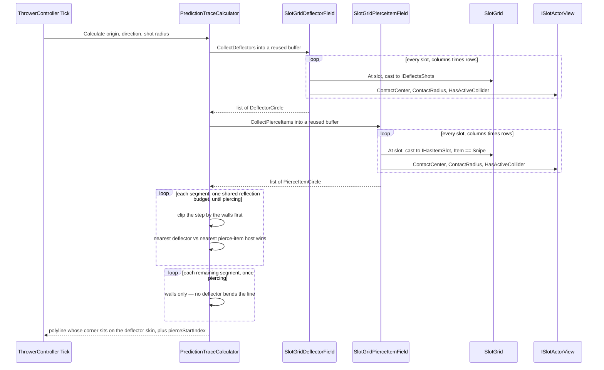

# Prediction

Prediction trace system — draws a dotted line showing the projectile's predicted trajectory while the player is aiming.

## Architecture

### PredictionTraceCalculator

Pure C# class (no MonoBehaviour) that takes an origin, direction, and reusable `List<Vector3>`, then fills it with world-space trace points by stepping forward and reflecting off walls **and off balloons that would deflect the shot**. Bounces off all four limits (from `LimitsClockwise`) exactly the way `ProjectileMotionResolver` reflects the live shot off the same rectangle — every wall, top included, spends the shared reflection budget the same way a deflection does; none of the four is special-cased to end the trace.

**Deflections come from `IDeflectorField`** (implemented by `SlotGridDeflectorField`, which walks the grid). An actor qualifies when it is `IDeflectsShots` and `DeflectsOrdinaryHit` — Tough with more than one hit left, Unbreakable, the static Deflector, a Gatekeeper with hits left — and its view still has an active collider and a non-zero `ContactRadius`, so an actor mid-despawn, or a static with no collider authored, never deflects the line.

The field walks the grid rather than the balloon registry because deflecting is a capability, not a family: statics deflect too, and the grid is the one place holding every actor regardless of type. A new deflecting archetype needs no change to the field.

The **drawn** corner sits on the deflector's own skin, while the flight continues from the combined-radius contact where the shot's centre really turns. Those differ by the shot's radius, and a line whose corner floats short of the balloon reads as a bend that happened too early — the leg after it is offset by that same radius, which is invisible over its length. Only the polyline moves: `PredictionTraceProvider` (and so `TraceHitMarker`) still receives the true contacts.

The geometry is the **view's** `ContactCenter` and `ContactRadius` (both on `ISlotActorView`), not the slot's, because that is what `BalloonController.Deflect` hands the real projectile: balloons drift between slots while the board settles, and that is exactly when a player is lining a shot up. `ContactCenter` is the collider, not the pivot, so an offset collider deflects where it actually sits. Both the trace and the real deflection call `Shared/CircleContact.TryFindEntry` — one analytic ray-circle solver, so the drawn line cannot drift from the flight it predicts.

Walls and deflections share **one budget** (`IPredictionTraceConfig.MaxReflections`, currently 1). They cost the shot differently — a wall spends a shield and a deflection does not, since `ProjectileMotionResolver` decrements only on a wall — but this budget is about how much the telegraph gives away, not about what the shot can afford, and to the player both are the same event: the line turned.

The leg *leaving* the last allowed reflection is still drawn; the one after it is not. So at 1 the player sees where the shot turns once and where that takes it, and works the rest out. Expected to rise with progression.

Within a step the nearest deflector wins, and the test runs against the step *already clipped by any wall*, so a balloon beyond a wall cannot steal a bounce the wall reaches first. The contact is clamped inside the walls for the same reason the real deflection clamps it: an edge-column balloon can sit within its own radius of a wall.

> **Accuracy caveat.** A circle deflection is very sensitive to where it is struck, so near a balloon's edge a pixel of aim movement swings the outgoing leg hard — the dispersion `ProjectileMotionResolver` already warns about, where error amplifies ×10-20 per deflection. The line is truthful; whether it reads as *precise* or as *jittery* is a playtest question. If it reads badly, draw the post-deflection leg differently (shorter, dimmer, dashed) rather than making it lie.

**Pierce-item hosts stop deflections applying.** Once the path crosses a balloon hosting a pierce-arming item (Snipe — the only one today), every deflector *after* that point is ignored: the line just continues straight through subsequent toughs, matching what a piercing shot actually does, rather than showing a bounce that wouldn't happen. **Pierce-item hosts come from `IPierceItemField`** (implemented by `SlotGridPierceItemField`, which walks the grid the same way `SlotGridDeflectorField` does) — an actor qualifies when it's `IHasItemSlot` with `Item.Value == ItemType.Snipe`, under the same active-collider/non-zero-`ContactRadius` guards. If a second pierce-arming item ever ships, that grid walk's own check is the one place to widen.

Within one step, the nearer of the two — the deflector or the pierce-item host — governs: a *different*, farther deflector is skipped outright once the nearer pierce point arms (`ResolveStepEvent`'s `PiercedThrough`), while the *same* host (a Tough that itself carries Snipe) still deflects at that exact contact (`PiercedAndDeflected`) — live, the item's activation lands a frame after the bounce it was hit on, so only what the shot meets *after* this contact is piercing, not this contact itself. `Calculate`'s `out PredictionTraceEnd end` carries a `PierceStartIndex` reporting which point in the polyline this happened at (-1 if it never does), inserted into the line even when nothing bends there (a normal 1-hit balloon hosting Snipe just gets a vertex on an otherwise-straight run) — so a view can style the trailing "piercing" run differently without recomputing anything.

The per-frame grid walk is deliberate and must not be cached, because the geometry is read from views
that drift as the board settles. `SlotGridDeflectorField`'s own XML doc explains why — point at it
rather than repeating it here.

### PredictionTraceView

MonoBehaviour with a `LineRenderer`. Call `SetTrace(points)` to update, `SetColor(color)` to tint it, or `Clear()` to hide. Attach to the Thrower prefab alongside a `LineRenderer`. For the smoke + glitter look, use the `BalloonParty/Display/TraceGlitterLine` material shader (SightSmoke's drifting-noise alpha eat plus GlitterSwirl's orbiting specks in one pass) and set the LineRenderer's texture mode to **Tile** so the pattern density stays constant over any aim length — the config-driven trace colour reaches the shader through the renderer's vertex colours.

**One `LineRenderer` per leg, not one shared multi-point line.** With `numCornerVertices` at 0 (the authored setting), Unity draws a sharp shared-vertex bend visibly thin/pinched right at the corner — every reflection or deflection in the polyline is exactly such a bend. A straight two-point segment has no bend inside it to pinch, so `SetTrace` decomposes the polyline into `points.Count - 1` two-point segments instead, each its own `LineRenderer`, eating the cost of one renderer per leg to buy a clean corner. The required `LineRenderer` component is the **template**: `Awake` caches its authored alpha keys, then every leg beyond the first is a plain child `GameObject` holding a fresh `LineRenderer` with the template's render settings copied onto it once at creation (never `Instantiate(_template.gameObject)`, which would also clone this MonoBehaviour itself onto every new leg). Segments are grown, never shrunk or pooled back — bounded by `IPredictionTraceConfig.MaxReflections + 1`, a small fixed ceiling, so the one-time cost of growing to that count is paid once per session at most. All but the **last** active segment render at flat full alpha; only the last carries the authored fade toward the tip (the same alpha keys the single line used to fade over its whole length), so the line still reads as one continuous taper despite being drawn as several independent quads. `Clear()` and a shrinking trace both hide the unused tail by setting `positionCount` back to 0 rather than destroying anything.

Splitting into independent segments trades the old thin-corner artifact for a new one: two flat-capped rectangles meeting at an angle leave a small notch uncovered on the corner's outer side, since each cap is perpendicular to its OWN segment rather than to the other one. `BuildSegmentEndpoints` fixes this not by relocating the shared vertex to some off-axis miter point (which would bend each segment's own rendered direction slightly away from its true heading just to reach it), but by extending each segment past its own logical endpoint **straight along its own existing direction** — the segment ending at a joint reaches a little past it, and the segment starting there reaches a little before it. `JoinExtension` computes that length as `halfWidth * tan(turnAngle / 2)`, the exact distance that lands a segment's notch-side corner right on the other segment's boundary, clamped two ways: to a `MiterLimit` of 4 (SVG's own default) so a joint approaching a full reversal (where `tan` blows up) doesn't stretch a whisker out past the corner, and to `MaxJoinFraction` (0.3) of either adjacent segment's own length — because the alpha fade this same extension drives (below) has to span it exactly, an uncapped extension could eat most of a short leg between two sharp bends, so a segment always keeps at least `1 - 2 * MaxJoinFraction` of its own length fully opaque in the middle, at the cost of an imperfect corner close on that rare short-and-sharp case. Neither segment's direction is ever touched, only its length — the endpoints (launch, tip) are never touched either, and a joint that's nearly straight or nearly a full reversal is left alone too, since both are degenerate for the formula and neither has a notch to fill in the first place.

Two segments genuinely overlapping through a joint (rather than merely touching) is correct for coverage, but at full solid alpha it reads as two crossing flags instead of one clean corner. `ApplySegmentRender` fades each extended tip back toward transparent over exactly the span it overshoots by — a segment whose end was pushed forward fades OUT to 0 over that span, and the next segment, whose start was pushed back by the same amount, fades IN from 0 over its own matching span, so the two blend through the joint instead of visibly stacking.

**A `LineRenderer`'s `colorGradient` is only ever sampled at each actual vertex position** — it does not re-evaluate the gradient at points in between; Unity just linearly interpolates the resulting per-vertex *colours* across the mesh. A plain 2-point segment therefore only ever shows a straight ramp between the gradient's value at its one start vertex and its one end vertex; a 3-or-4-key gradient meant to hold a "stay fully opaque" plateau in the middle does nothing on a 2-point segment, since there's no vertex there to carry that value — with both ends fading toward 0, the whole segment instead reads as uniformly faint, never showing the plateau at all. This bit the tapered (last) segment's own tip fade too, not just a join blend: the authored curve holds near-full alpha for most of its length and only drops sharply right at the very end, and a plain 2-point segment collapsed that into a flat linear ramp across the whole leg instead. `ApplyFlatFade`/`ApplyTaperedSegment` place a real vertex at every breakpoint the relevant gradient's keys land on, not just at the segment's own start/end — still exactly collinear with the segment's own centreline (a 0° turn pinches nothing, so this doesn't reintroduce the corner artifact the per-leg split exists to avoid), but now with an actual mesh vertex for the gradient to be sampled at, so the intended shape genuinely renders. `ApplyTaperedSegment` always takes this path for the last segment — whether or not a preceding joint also needs a fade-in blended onto the front of it — since its own tip taper needs the same treatment regardless; when there's no fade-in to blend, the authored keys are used completely unchanged (no copy, no remap), just with a vertex placed at each one instead of only at the segment's ends. When there IS a fade-in, the authored keys are linearly remapped from their native `[0,1]` span into `[startFraction,1]` so the taper's shape is preserved, just compressed to start after the fade-in instead of at the segment's true (now offset) beginning. Every gradient (and its matching set of vertex positions) is written into a small set of reused scratch arrays sized once in `Awake` (`_colorKeyScratch`, `_flatOneFadeScratch`, `_flatBothFadeScratch`, `_taperedFadeInScratch`) rather than allocated per segment per frame — `SetTrace` runs every `Tick` while aiming, so a fresh array per segment there would be steady per-frame garbage. A flat (non-last) segment with nothing to fade (the common case for a straight run) skips all of this and reuses the plain cached `_flatGradient` directly on a 2-point segment, same as before this existed.

`SetColor` deliberately does **not** set `startColor`/`endColor` — those replace the whole `colorGradient` with a flat, alpha-less 2-key gradient. RGB comes from `color` (flat across the line, same as `startColor`/`endColor` used to give); alpha is recovered from the prefab-authored gradient's own keys, cached once in `Awake` before anything can overwrite them — so the line still fades however the prefab was authored (e.g. toward transparent near the tip) instead of losing that shape to a flat override.

### PredictionTraceProvider

Plain C# game-scope singleton (registered in `GameScopeRegistration.RegisterCoreServices`) that mirrors the same-frame trace for readers outside the Thrower's own view chain — the house pattern is `ProjectilePositionProvider` (`Projectile/`). `SetTrace(points, end)` always sets `IsActive`, but only copies into the internal preallocated `List<Vector3>` (never aliases the caller's mutable buffer), stores the `PredictionTraceEnd`, and bumps `int Version` when the incoming trace actually differs from what's currently published — point-for-point (count, then each point's `sqrMagnitude` delta against a sub-millimetre epsilon² constant, absorbing float jitter from transform reads without quantising real movement) and end-for-end (`PierceStartIndex`, `Kind` exactly, `Normal` against the same epsilon). `Clear()` is symmetric: it resets the end to `OpenAir`, sets `IsActive` false, and bumps `Version` only if it was actually active, so repeated clears can't churn it. Readers poll `IsActive`/`Version`/`Points`/`End` instead of subscribing, so many pooled readers can cheaply skip work on frames where nothing changed.

`ThrowerController` calls `SetTrace` every `Tick` while aiming, whether or not the aim actually moved — so `Version` only earns its keep because the provider itself gates the bump on a real change, rather than trusting the caller to call it conditionally. (This used to bump unconditionally, which meant `Version` changed every frame regardless of whether the trace did, silently defeating the skip on every reader below — `ItemRangePreviewController`'s sighted-host search, `PredictionSightProbe`'s per-probe surface-hit test, and `TraceHitMarker` which just inherits the probe's result. The gate now works, so a genuinely held aim costs those readers nothing. One caveat: a host that drifts under a *motionless* aim no longer refreshes `ItemRangePreviewController`'s search, since the published trace itself is unchanged — already documented, accepted behaviour there. `PredictionSightProbe` is unaffected, since it separately compares its own target's position.)

### PredictionTraceEnd

Everything about a finished trace beyond its polyline: `PierceStartIndex` (where piercing began, or -1), a `PredictionTraceEndKind` (`OpenAir`/`Wall`/`Deflector`) and the unit `Normal` at that end contact. Returned by `Calculate` as one `out` value rather than a growing parameter list.

**The normal is reported because the calculator is the only thing that knows it** — it solved the wall crossing or the ray-circle entry in order to stop there. A consumer that re-derived it (testing the last point against the walls, or hunting a deflector circle near it) is computing a second answer to a settled question, and the two can drift. Same reasoning as `Shared/CircleContact` being the one ray-circle solver.

`Kind` then lets each consumer decide which endings it actually cares about, rather than the calculator guessing for them: `ShieldRangePreview` draws its bounce stub on `Wall` alone, because a shield is spent on a wall and nothing else (`ProjectileMotionResolver.Step` decrements `ShieldsRemaining` there, its `Deflect` never does).

`OpenAir` means the line simply ran out of segments, so there is no contact and nothing to draw a bounce from.

### PredictionSightProbe

MonoBehaviour that owns the polyline-vs-circle trace test — "is the aim sighted on this target, and how centrally" — run once per `LateUpdate` and skipped entirely whenever neither the trace's `IProjectileFacingSource.PredictionVersion` nor the target's position has moved past a small epsilon since the last evaluation, via `TraceHitGeometry.TryFindSurfaceHit` (line-circle intersection scored by centrality — the segment whose perpendicular foot is closest to the centre wins, not necessarily the first in travel order; this matters near wall bounces where a pre-bounce segment can graze the circle while the post-bounce segment strikes dead-centre; pure, allocation-free, edit-mode tested in `Assets/Tests/EditMode/Prediction/TraceHitGeometryTests.cs`). Exposes the raw per-frame result (`HasHit`, `SightPoint`, `SightDirection`, the continuous `Sight` centrality) and a hysteretic `IsSighted` latch (enter/exit thresholds, so a graze at the radius edge can't chatter an enter/exit-triggered reaction). Pooled/non-DI — the host hands it an `IProjectileFacingSource` via `Configure` — because it must work equally on a pooled item visual (`Item/ItemDisplayService`, which isn't resolver-spawned) and on a balloon (`Balloon/View/BalloonView`, which is DI-injected and just forwards its own `IProjectileFacingSource` in `Awake`). One probe instance serves every composed consumer that finds it: `TraceHitMarker` (a sibling on the same GameObject) and any item `Item/SightReaction` subclass (`GetComponentInParent` when its own `_probe` field is left unset) — so a balloon with an item runs the crossing test once, not once per consumer.

### TraceHitMarker

MonoBehaviour view for a circular actor (e.g. a balloon) that shows a marker where the aim trace crosses its circle. Sits beside a `PredictionSightProbe` on the same GameObject (auto-found via `GetComponent` if `_probe` is left unset) and only turns its signal into presentation: the marker is positioned at `origin + hitDirection * _markerOffset`, where `hitDirection` is the *radial* direction from the actor's own centre to `_probe.SightPoint` — not the probe's `SightDirection`, which is the trace's travel direction and points along the shot, not outward — translated only, never rotated or scaled. Optionally (assign `_markerRenderer`), the sprite's alpha scales with the crossing's **centrality** (1 = line through the centre, 0 = tangential one-touch graze): direct aims read strong, grazes fade toward `_minIntensity`, under the sprite's authored alpha as the ceiling; its RGB mirrors the trace line's configured colour. Visibility toggles the marker GameObject only on change, not every frame. `OnEnable` force-hides, since pooled instances are reused by toggling the whole prefab's GameObject (`PoolChannel<T>.Get`/`Return`) rather than by any dedicated reset callback — the probe's own `OnDisable` handles invalidating its cache.

### Integration

`ThrowerController` owns a `PredictionTraceCalculator`; `ThrowerView` finds the `PredictionTraceView` via `GetComponentInChildren` in `Awake` and exposes `SetTrace`/`SetTraceColor`/`ClearTrace`. Each `Tick`, while the player is aiming and the projectile hasn't been fired, the controller calculates the trace, pushes it through the view, mirrors it into `PredictionTraceProvider` for any `IProjectileFacingSource`/`PredictionSightProbe` readers, and mirrors it into `PredictionTraceLights` (see below). On fire, release, or reload, the view, the provider, and the lights are all cleared. The line's color comes from `IPredictionTraceConfig.LineColor`, pushed once in `ThrowerController.Start`.

### PredictionTraceLights (optional)

The line can also cast capsule scene-lights, one per trace leg, gated by `IPredictionTraceConfig.LightingEnabled` — **off by default**. An earlier attempt at this shipped, then was pulled: an aim telegraph relighting the actors it crosses read as noise, not as a helpful glow (the light-field prototypes from that era live on branch `backup/gi-normals-spherize`). The toggle exists so it can be tried again per-config — e.g. for a testing pass, or a future accessibility mode — without deleting the (otherwise-unused-here) capsule-light machinery.

When on, `PredictionTraceLights` (owned by `ThrowerController`) registers one `Light.Segment` (`Shared/SceneLight/`) per leg via `SceneLightFieldService`, mirroring the polyline exactly — the calculator emits corner points only (launch, each wall bounce, each deflection, the final tip wherever the trace stops), so the lights bend where the line does. `IPredictionTraceConfig.LightHalfWidth`/`LightIntensity`/`LightFalloffPower` set the base capsule, and `LightFadeCurve`/`LightWidthCurve` taper intensity and width from launch (t=0) to tip (t=1) — both sampled by the trace's **total arc-length fraction**, not per-leg: fade at each leg's midpoint, width at each leg's endpoints so adjacent legs share their boundary value and the taper is continuous through every bend rather than stepping. Both default to a straight linear decrease, deliberately not eased: with legs of very unequal length (a short post-bounce leg beside a long straight one), an S-curve's flat plateaus at each end squeeze the whole visible transition into whichever leg happens to straddle its steep middle — one leg reads strong/full-width and near-uniform, the other reads weak/thin and near-uniform, with a hard jump at the join instead of a smooth change. Linear spreads it evenly across distance travelled regardless of how the legs are split. The glow tints via the palette's presentation-only `GamePalette.PredictionColorId` ("Prediction") entry, independent of the shot's own colour. Lights mutate in place per aim update and only rebuild when the leg count changes (a rotating aim crosses a bounce threshold); every `SetTrace`/`Clear` call is a no-op while the toggle is off, so `ThrowerController` wires it in unconditionally rather than branching on the config at each call site.

## Unity Setup

1. Add a child GameObject to the Thrower prefab
2. Add `LineRenderer` + `PredictionTraceView` components
3. Configure the `LineRenderer` material and width; color is driven at runtime from `IPredictionTraceConfig.LineColor`
4. For a hit marker on a circular actor prefab (e.g. a balloon): add a `PredictionSightProbe` and a `TraceHitMarker` to the actor's root (both find each other automatically if left unwired), set the probe's `_hitRadius` to the actor's world-unit circle radius, add a small child sprite (e.g. "HitMarker") and assign it to the marker's `_marker`, and set `_markerOffset` (distance from the actor origin the marker sits at)

