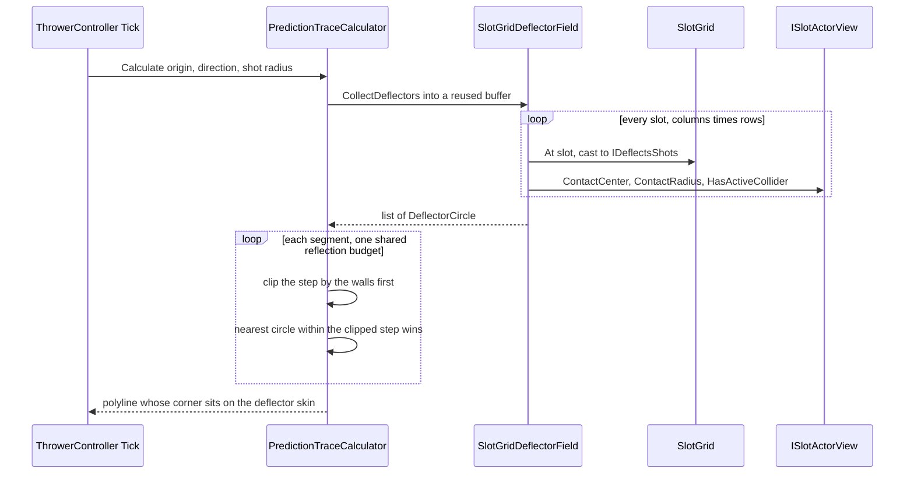

# Prediction

Prediction trace system — draws a dotted line showing the projectile's predicted trajectory while the player is aiming.

## Architecture

### PredictionTraceCalculator

Pure C# class (no MonoBehaviour) that takes an origin, direction, and reusable `List<Vector3>`, then fills it with world-space trace points by stepping forward and reflecting off walls **and off balloons that would deflect the shot**. Bounces off left, right, and top limits (from `LimitsClockwise`). A top-wall hit terminates further bounces.

**Deflections come from `IDeflectorField`** (implemented by `SlotGridDeflectorField`, which walks the grid). An actor qualifies when it is `IDeflectsShots` and `DeflectsOrdinaryHit` — Tough with more than one hit left, Unbreakable, the static Deflector, a Gatekeeper with hits left — and its view still has an active collider and a non-zero `ContactRadius`, so an actor mid-despawn, or a static with no collider authored, never deflects the line.

The field walks the grid rather than the balloon registry because deflecting is a capability, not a family: statics deflect too, and the grid is the one place holding every actor regardless of type. A new deflecting archetype needs no change to the field.

The **drawn** corner sits on the deflector's own skin, while the flight continues from the combined-radius contact where the shot's centre really turns. Those differ by the shot's radius, and a line whose corner floats short of the balloon reads as a bend that happened too early — the leg after it is offset by that same radius, which is invisible over its length. Only the polyline moves: `PredictionTraceProvider` (and so `TraceHitMarker`) still receives the true contacts.

The geometry is the **view's** `ContactCenter` and `ContactRadius` (both on `ISlotActorView`), not the slot's, because that is what `BalloonController.Deflect` hands the real projectile: balloons drift between slots while the board settles, and that is exactly when a player is lining a shot up. `ContactCenter` is the collider, not the pivot, so an offset collider deflects where it actually sits. Both the trace and the real deflection call `Shared/CircleContact.TryFindEntry` — one analytic ray-circle solver, so the drawn line cannot drift from the flight it predicts.

Walls and deflections share **one budget** (`IPredictionTraceConfig.MaxReflections`, currently 1). They cost the shot differently — a wall spends a shield and a deflection does not, since `ProjectileMotionResolver` decrements only on a wall — but this budget is about how much the telegraph gives away, not about what the shot can afford, and to the player both are the same event: the line turned.

The leg *leaving* the last allowed reflection is still drawn; the one after it is not. So at 1 the player sees where the shot turns once and where that takes it, and works the rest out. Expected to rise with progression.

Within a step the nearest deflector wins, and the test runs against the step *already clipped by any wall*, so a balloon beyond a wall cannot steal a bounce the wall reaches first. The contact is clamped inside the walls for the same reason the real deflection clamps it: an edge-column balloon can sit within its own radius of a wall.

> **Accuracy caveat.** A circle deflection is very sensitive to where it is struck, so near a balloon's edge a pixel of aim movement swings the outgoing leg hard — the dispersion `ProjectileMotionResolver` already warns about, where error amplifies ×10-20 per deflection. The line is truthful; whether it reads as *precise* or as *jittery* is a playtest question. If it reads badly, draw the post-deflection leg differently (shorter, dimmer, dashed) rather than making it lie.

The per-frame grid walk is deliberate and must not be cached, because the geometry is read from views
that drift as the board settles. `SlotGridDeflectorField`'s own XML doc explains why — point at it
rather than repeating it here.

### PredictionTraceView

MonoBehaviour with a `LineRenderer`. Call `SetTrace(points)` to update, `SetColor(color)` to tint it, or `Clear()` to hide. Attach to the Thrower prefab alongside a `LineRenderer`. For the smoke + glitter look, use the `BalloonParty/Display/TraceGlitterLine` material shader (SightSmoke's drifting-noise alpha eat plus GlitterSwirl's orbiting specks in one pass) and set the LineRenderer's texture mode to **Tile** so the pattern density stays constant over any aim length — the config-driven trace colour reaches the shader through the renderer's vertex colours.

`SetColor` deliberately does **not** set `startColor`/`endColor` — those replace the whole `colorGradient` with a flat, alpha-less 2-key gradient. RGB comes from `color` (flat across the line, same as `startColor`/`endColor` used to give); alpha is recovered from the prefab-authored gradient's own keys, cached once in `Awake` before anything can overwrite them — so the line still fades however the prefab was authored (e.g. toward transparent near the tip) instead of losing that shape to a flat override.

### PredictionTraceProvider

Plain C# game-scope singleton (registered in `GameScopeRegistration.RegisterCoreServices`) that mirrors the same-frame trace for readers outside the Thrower's own view chain — the house pattern is `ProjectilePositionProvider` (`Projectile/`). `SetTrace(points)` copies into an internal preallocated `List<Vector3>` (never aliases the caller's mutable buffer), bumps an `int Version`, and sets `IsActive`; `Clear()` sets `IsActive` false and bumps `Version`. Readers poll `IsActive`/`Version`/`Points` instead of subscribing, so many pooled readers can cheaply skip work on frames where nothing changed.

### TraceHitMarker

MonoBehaviour view for a circular actor (e.g. a balloon) that shows a marker where the aim trace crosses its circle. Each `LateUpdate`, it reads `PredictionTraceProvider` and finds which segment of the trace polyline most directly strikes the actor's circle via `TraceHitGeometry.TryFindSurfaceHit` (line-circle intersection scored by centrality — the segment whose perpendicular foot is closest to the centre wins, not necessarily the first in travel order; this matters near wall bounces where a pre-bounce segment can graze the circle while the post-bounce segment strikes dead-centre; pure, allocation-free, edit-mode tested in `Assets/Tests/EditMode/Prediction/TraceHitGeometryTests.cs`). The marker shows only when an intersection exists; it's positioned at `origin + hitDirection * _markerOffset` with hitDirection pointing at that surface entry, translated only — never rotated or scaled. Optionally (assign `_markerRenderer`), the sprite's alpha scales with the crossing's **centrality** (1 = line through the centre, 0 = tangential one-touch graze): direct aims read strong, grazes fade toward `_minIntensity`, under the sprite's authored alpha as the ceiling; its RGB mirrors the trace line's configured colour. Work is skipped whenever the provider's `Version` is unchanged and the actor hasn't moved past a small epsilon since the last evaluation. Visibility toggles the marker GameObject only on change, not every frame. `OnEnable` force-hides and invalidates the cache, since pooled instances are reused by toggling the whole prefab's GameObject (`PoolChannel<T>.Get`/`Return`) rather than by any dedicated reset callback.

### Integration

`ThrowerController` owns a `PredictionTraceCalculator`; `ThrowerView` finds the `PredictionTraceView` via `GetComponentInChildren` in `Awake` and exposes `SetTrace`/`SetTraceColor`/`ClearTrace`. Each `Tick`, while the player is aiming and the projectile hasn't been fired, the controller calculates the trace, pushes it through the view, mirrors it into `PredictionTraceProvider` for any `TraceHitMarker` readers, and mirrors it into `PredictionTraceLights` (see below). On fire, release, or reload, the view, the provider, and the lights are all cleared. The line's color comes from `IPredictionTraceConfig.LineColor`, pushed once in `ThrowerController.Start`.

### PredictionTraceLights (optional)

The line can also cast capsule scene-lights, one per trace leg, gated by `IPredictionTraceConfig.LightingEnabled` — **off by default**. An earlier attempt at this shipped, then was pulled: an aim telegraph relighting the actors it crosses read as noise, not as a helpful glow (the light-field prototypes from that era live on branch `backup/gi-normals-spherize`). The toggle exists so it can be tried again per-config — e.g. for a testing pass, or a future accessibility mode — without deleting the (otherwise-unused-here) capsule-light machinery.

When on, `PredictionTraceLights` (owned by `ThrowerController`) registers one `Light.Segment` (`Shared/SceneLight/`) per leg via `SceneLightFieldService`, mirroring the polyline exactly — the calculator emits corner points only (launch, each wall bounce, the top-wall tip), so the lights bend where the line does. `IPredictionTraceConfig.LightHalfWidth`/`LightIntensity`/`LightFalloffPower` set the base capsule, and `LightFadeCurve`/`LightWidthCurve` taper intensity and width from launch (t=0) to tip (t=1) — both sampled by the trace's **total arc-length fraction**, not per-leg: fade at each leg's midpoint, width at each leg's endpoints so adjacent legs share their boundary value and the taper is continuous through every bend rather than stepping. Both default to a straight linear decrease, deliberately not eased: with legs of very unequal length (a short post-bounce leg beside a long straight one), an S-curve's flat plateaus at each end squeeze the whole visible transition into whichever leg happens to straddle its steep middle — one leg reads strong/full-width and near-uniform, the other reads weak/thin and near-uniform, with a hard jump at the join instead of a smooth change. Linear spreads it evenly across distance travelled regardless of how the legs are split. The glow tints via the palette's presentation-only `GamePalette.PredictionColorId` ("Prediction") entry, independent of the shot's own colour. Lights mutate in place per aim update and only rebuild when the leg count changes (a rotating aim crosses a bounce threshold); every `SetTrace`/`Clear` call is a no-op while the toggle is off, so `ThrowerController` wires it in unconditionally rather than branching on the config at each call site.

## Unity Setup

1. Add a child GameObject to the Thrower prefab
2. Add `LineRenderer` + `PredictionTraceView` components
3. Configure the `LineRenderer` material and width; color is driven at runtime from `IPredictionTraceConfig.LineColor`
4. For a hit marker on a circular actor prefab (e.g. a balloon): add a small child sprite (e.g. "HitMarker"), add `TraceHitMarker` to the actor, and assign `_marker` (the child sprite's `Transform`), `_circleRadius` (the actor's world-unit circle radius), and `_markerOffset` (distance from the actor origin the marker sits at)

