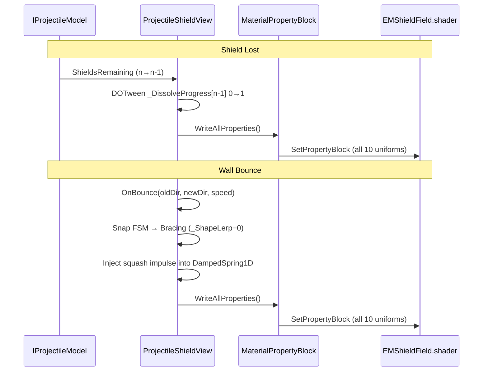

# Projectile

The projectile is the ball fired by the thrower. It travels in a straight line, bounces off walls, and pops balloons on contact.

## Gameplay

Each shot starts loaded on the thrower. When fired it moves freely across the screen, reflecting off the top, left, and right boundaries. Each bounce costs one shield. When shields are exhausted the projectile is destroyed, the grid rebalances, and the thrower reloads.

Cruise and Sweep both feed the projectile's tap system, and both are **runs** — each pays out only once the shot has strung enough of its own kind of segment together, and any segment of the other kind breaks the streak:

| | Cruise | Sweep |
|---|---|---|
| A qualifying segment | wall-to-wall with **no** balloon contact | popped at least one balloon, every contact on it a 1-HP one-shot kill, and the corridor behind it clear at the wall (backward circle-cast to `LastBouncePosition`) |
| Run counter | `ConsecutiveWallBounces` | `ConsecutiveSweeps` |
| Run length required | `CruiseWallBounceThreshold` | `SweepTapThreshold` |
| What breaks the run | any balloon contact | any wall reached without a clean clearing pass — including an empty traversal, which is cruise's business |

Sweep reuses Cruise's `SpeedGainPerTap` value, the same tap-beat easing, and the same piercing threshold. A deflect resets **both** runs (and the tap total) outright: `ProjectileView.OnBalloonDeflected` treats it as interrupting the whole flight.

**A wall hit mints at most one tap.** The two rules are two ways to *earn* one — never two. Both go through `ProjectileModelExtensions.TryGrantTap`, which stamps the `WallHitSequence` the resolver bumps on each surviving bounce and refuses a second claim on the same hit. It used to hold only because a pop cancelled the cruise in a third file — and was silently violated for armed shots, which collected both taps on one wall and compounded from there. While piercing both rules can now *legitimately* qualify on the same wall (a pop doesn't end an armed shot's cruise), so the refusal is a real first-come race with a harmless outcome: both claims are worth the same one tap. Note the currency is the *wall hit*, not the shield: shields only enter because the wall bounce is today the one place a shield is spent (`ProjectileMotionResolver` is the only `ShieldsRemaining` decrement).

**Taps never stop.** A wall hit is a wall hit, so an armed shot goes on earning them and goes on getting faster — the only thing that bounds it is the speed rail (see below). What piercing changes is *how* each tap's speed change is played:

- **Unarmed** taps play the **beat**: the shot dips to a standstill and winds back up to the new target (`CruiseTapCurve` / `CruiseTapEaseDuration`). That dip is how earning a tap reads, and it's deliberate.
- **Armed** taps play the **ramp** instead (`PierceArmRampCurve` / `PierceArmRampDuration`): the shot accelerates into the new target from the speed it is already travelling, no dip. The arming tap is the first of these; each later one simply re-anchors the ramp. Dipping an armed lance to a standstill every bounce reads as a hitch, not as power.

Each earned rung also fires `SpeedTapMintedMessage` (wall contact + the running tap count), which `CombatSoundRouter` plays as `GameSoundId.SpeedTap`. Authored as `MelodicMode.ScaleWalkUp`, the tap count *is* the scale degree, so the ladder is audible as a rising figure that restarts at the root with each new shot. The view publishes it by comparing the tap count across the whole wall-hit resolution, since the cruise tap is minted inside `Step` and the sweep tap after it returns — one message per rung either way, guaranteed by the per-wall mint guard.

Both are the same transition with different anchors (see the unified model below). On the solver's event timeline a ramp is a pure time cost, scaled by the speed gap it still has to close (`ShotCruiseConfig.ArmRampLagSeconds`).

Both are **one mechanism**, not two: a *speed transition* easing toward whatever speed the current tap count buys, differing only in where it starts (`ProjectileFlightState.SpeedTransitionKind`). A tap beat anchors at a standstill — that anchor *is* the beat, since `Lerp(0, target, curve)` is exactly "target × curve" — and an arm ramp anchors at the speed the shot was already travelling. So the ramp can never stall the shot (it blends two real speeds, and an unauthored or 0-start curve merely holds the arming speed), `0` duration disables either, and there is exactly one "how far into the current change" field rather than two that could disagree. `Flight.CurrentSpeed` carries the resolved speed for feedback that scales with velocity.

**`MaxSpeedMultiplier` is a safety rail, not a tuning knob** — and since taps accrue for the whole flight, it is what actually stops the shot. It clamps the **final** speed (buffs included, measured against unbuffed base) in both `ProjectileMotionResolver.ResolveFlightSpeed` and the solver's `CurrentSpeed`. Its job is purely that one fixed step must stay short enough to hit what it passes: at 8 base speed and a 0.02 timestep a step exceeds a balloon's chord (~0.875 wu) above ~×5.5 and the play area above ~×28, so ×5.5 is the meaningful bound. Velocity-scaled feedback normalizes against `ReachableTopSpeedMultiplier`, which is that rail.

On contact with a balloon the projectile absorbs that balloon's color. The shared `ColorStreakTracker` (`Game/Score/`) tracks consecutive same-color pops; from the second consecutive same-color pop onward (\f$\text{streak} \ge 2\f$), each pop grants the projectile an additional shield — a long same-color streak keeps awarding shields on every hit until a different color (or a scatter pop) breaks it. **`IRunConfig.StreakGrantsShields` gates this**: turn it off and items become the only source of shields (`ShieldItemHandler`), which is a balance experiment rather than a shipped mode — if it sticks, delete the flag and `Shared/StreakShieldRule` rather than leaving a dead switch behind. The condition itself lives in `StreakShieldRule.GrantsShield`, called by both `ProjectileHitResolver` and the solver's `ShotSimulator`; it used to be written out in each and drifted, so the solver went on scoring shots around shields the game had stopped granting. Neighboring balloons nudge outward from the impact point using slot-based positions (logical grid positions, not visual transform positions) to ensure consistent nudge direction regardless of in-progress animations.

When a hit returns `HitOutcome.Absorb`, `ProjectileHitResolver` dispatches `ActorHitMessage(Absorb)`, sets `model.IsFree = false`, and returns `ProjectileHitVisual.Destroyed` — the view then calls `DestroyProjectile()`. `Absorb` is produced by `AbsorberActorModel` (always absorbs, killing the projectile) — no balloon model returns it; balloon hits resolve to `Pop`, `Deflect`, or `PassThrough`.

## Turn-based flow

The game follows a turn-based animation pipeline:

1. **Projectile flight** — bounces, pops balloons, nudges neighbors. The board keeps settling during flight too: `BalloonBalancer.Tick` pulses a full rebalance every `IBalloonsConfiguration.FlightRebalanceInterval`, gated on the shot still being free (not gliding its last-shield approach, not paused) and on `HasPossibleMove()` finding an actual gap to close.
2. **Projectile death** — publishes `BalanceBalloonsMessage` (fallback) and `ProjectileDestroyedMessage`.
3. **Spawn + balance** — `BalloonSpawner` opens its spawn sequence with a pre-spawn `Balance(relocateRoamers: true)` pass, spawns new lines, then publishes `BalanceBalloonsMessage` after all lines are placed.

See @ref arch_balance_flow for the full balance algorithm and its entry points.

## Pooling

The projectile is **pooled, not destroyed**. A single instance is created via `ProjectilePoolChannel` on first load and reused across turns. On death the projectile publishes messages but does not self-destruct — `ThrowerController` returns it to the pool and immediately re-gets it.

- **`OnDespawned()`** — nulls model, resets glow, disables trail via `ProjectileTrail.Disable()`, resets shield view
- **`OnSpawned()`** — resets shield-shown flag; trail stays disabled until the projectile is fired

Trail management is handled by `ProjectileTrail`, a child component on the trail GameObject. It is **not** `IPoolable` — the projectile itself is pooled, so its children's lifecycle follows the parent. `ProjectileTrail` exposes `Enable()` / `Disable()`:

- **`Enable()`** — `async UniTaskVoid` that yields one frame (`UniTask.Yield(destroyCancellationToken)`), clears the trail, then re-enables emitting (prevents snap artifact from position change)
- **`Disable()`** — stops emitting and clears immediately

`ProjectileView` calls `Enable()` on the first `FixedUpdate` frame where `IsFree` is true (fired) and `Disable()` on death and despawn.

The shield field is hidden until the projectile is fired. `ProjectileShieldView` starts inactive on `Awake()` and is shown via `Show()` on the first `FixedUpdate` frame where `IsFree` is true.

## Shield Visuals

The projectile's shield appears as a glowing force field resembling magnetic field lines
wrapping around the ball. Each remaining shield adds a visible concentric layer (up to a
configured maximum). When a shield is gained, it appears with a wipe sweeping from the leading
tip to the tail. When lost, the outermost layer crumbles away (starting from the front).

While the ball is flying, the glow stretches into a comet shape with a tail trailing behind
it. As the ball nears a wall, the glow smoothly tucks into a circle, holds that round shape
through the bounce, then stretches back into the comet as it flies away. On impact, the circle
visually squashes against the surface — compressing along the wall normal and expanding
sideways — then springs back. This works for both flat wall bounces and angled deflector
bounces. The field also ripples faster the quicker the ball moves.

A four-state cycle (Cruising → Closing → Bracing → Opening) drives the shape transition.
The game predicts how far the next wall is; when it falls below a threshold, closing begins.
On bounce, the shield force-snaps to circle regardless of the current state.

### Implementation

`ProjectileShieldView` feeds 10 uniforms to the `EMShieldField.shader` (a single-quad
procedural shader — one draw call). All uniforms — per-layer dissolve/reveal arrays, active
layers, color, velocity factor, noise scroll direction, shape lerp, noise intensity, squash
amount, and squash axis — are written to a single `MaterialPropertyBlock` and pushed through
`WriteAllProperties()`. Both tween callbacks and the per-frame `Update()` call this method,
which writes **every** property before calling `SetPropertyBlock`. This single-push pattern
prevents split-brain overwrites where one code path's push would erase properties written by
another. Configuration lives in `IShieldFieldSettings` (injected, not serialized on the view).

All VFX (gain/lose/bounce particles) are spawned via `ParticlePoolChannel` as world-space
particles — they are not children of the projectile and survive recycling independently.

### Event Flow

See @ref plan_em_shield_field for the full shader design and phase status.

## Pierce & Discharge Feel

A piercing shot doesn't pop the tough (`hits > 1`) balloons it plows through on contact — it carries them until it **discharges** at the next wall. (The plow-then-shatter mechanic itself — driven by cruise piercing and the Snipe item — is documented in `Item/README.md`; this section covers only how the projectile *sells* it.) Two lights carry the beat:

- **Telegraph** — while a tough balloon is ahead on the shot's current straight run, its carried scene light stretches into a capsule reaching that tough, warning of the armored contact a moment before it lands. Once nothing tough is ahead, the light snaps back to a point following the shot (`ProjectileView.TryFindToughAhead` — a forward circle-cast bounded by the next wall, skipping any tough the shot has already plowed this run, so the line always points at the *next* one).
- **Spark** — every tough actually plowed pops a brief Sparks-coloured flash at the strike point (`FlashPierceSpark`), fired synchronously from `OnTriggerEnter2D` — so a tight run of several toughs plowed in one physics step each still get their own flash instead of blurring into one.

The discharge itself plays a shared shockwave-and-slow-mo beat, owned by `Controller/PierceDischargeEffects` off the `PierceDischargedMessage` the discharge publishes: a `DisturbanceField` shockwave stamp (`StampSource.PierceDischarge`) at the shattered line, and a brief real-time slow-mo dip (`TimeScaleSource.PierceDischarge`; duration/scale from `IProjectileFlightConfig.PierceDischargeTimeScale`/`PierceDischargeTimeScaleDuration`) via a serial `CancellationTokenSource` — a discharge landing mid-dip restarts the dip cleanly instead of layering, and only the dip that runs to completion releases the claim. The rainbow colour-bloom that plays on the same message is a separate effect owned by the Snipe item (`SnipeDischargeBloom`), not by the projectile.

The discharge fires at the **next wall bounce** after the shot plows at least one tough — every tough plowed on a single wall-to-wall segment is collected and shattered together when the shot hits the wall (`ProjectileMotionResolver.Step`, wall-discharge branch). If the shot dies at the wall (no shields), `DestroyProjectile` flushes pending hits as a safety net. Piercing persists indefinitely across empty-corridor walls (no toughs plowed = no discharge), so the buff only ends when the shot actually encounters a tough line.

**Tunneling safety net** — at high cruise/pierce speeds the projectile can tunnel through balloons (Unity's `OnTriggerEnter2D` fires per-fixed-step and can skip thin colliders). On every wall bounce while piercing, `SweepPierceMisses` runs a `CircleCastAll` from the segment's start to the wall hit. Any tough balloon in the swept path that wasn't already registered via trigger is added to `PendingPierceHits` before the discharge resolves — guaranteeing every tough in the flight line is shattered.

## Buffs (`Buffs/`)

A **projectile buff** is a temporary stat modifier on the active projectile following the
industry-standard *Flat / Additive / Multiplicative* stacking pattern:

\f[
\text{final} = \big(\text{base} + \sum \text{flat}\big) \times \big(1 + \sum \text{additive}\big) \times \prod \text{multiplicative}
\f]

Each buff carries four fields:
- **`ProjectileBuffId`** — which stat (`Speed`, `RainbowShield`, …).
- **`float Value`** — the numeric contribution.
- **`BuffModifierOp`** — `Flat`, `Additive`, or `Multiplicative` (determines aggregation lane).
- **`IProjectileBuffEndCondition`** — pluggable lifecycle (flips `Expired` when done).

Multiple buffs targeting the same stat stack correctly:
- All `Flat` values sum → added to base.
- All `Additive` values sum → applied as \f$\times (1 + \text{sum})\f$.
- All `Multiplicative` values multiply independently.

The two abstractions live in `Model/`, the service in `Buffs/`:

- **`ProjectileBuff`** (`Model/IProjectileBuff.cs`) — sealed class. Carries Id, Value, Op, EndCondition.
- **`BuffModifierOp`** (`Model/BuffModifierOp.cs`) — enum: `Flat`, `Additive`, `Multiplicative`.
- **`IProjectileBuffEndCondition`** (`Model/`) — the "when it ends" abstraction: exposes only `IReadOnlyReactiveProperty<bool> Expired`. An implementation encapsulates its own lifecycle logic and flips the bool once. `WallBounceEndCondition` (subscribes to `ShieldLostMessage`, ends on the first wall bounce) is the only one today; a `Timer`/`PopCount`/... end-condition is a new implementer — no context, no switch, no change to any buff.
- **`IProjectileBuffs.Apply(ProjectileBuff)`** — the activation seam, injectable anywhere. Just takes the buff; the buff already carries its end-condition.
- **`ProjectileBuffService`** — `IStartable` owning storage + lifecycle: tracks the active projectile (`ProjectileLoadedMessage`), applies buffs onto it, and drops a buff the first time its `EndCondition.Expired` fires. Knows nothing about any buff's effect or end-condition — it only observes the exposed signal.

The model stores buffs in a plain list exposed via `HasBuff(ProjectileBuffId)` (read), `ComputeBuffedValue(id, baseValue)` (aggregated stat query), and `AddBuff`/`RemoveBuff` (write); a fresh `ProjectileModel` per throw resets them for free.

## How it works

- **`ProjectilePoolChannel`** — `InjectingPoolChannel<ProjectileView>` that creates projectiles via `IObjectResolver` injection from the parent container (no child scope on the prefab). Accessed through `PoolManager`.
- **`Controller/ProjectileHitResolver`** — plain C# singleton owning the hit rules: calls `balloon.EvaluateHit(context)` for the pre-computed outcome, applies the colour-steal (projectile absorbs a popped balloon's color), increments the current-segment pop count for Sweep, tracks whether every segment contact was a 1HP one-shot, and applies the streak-shield rule (reads `ColorStreakTracker` immediately after dispatch — `IHitDispatcher` guarantees the score stage already ran). It dispatches the `ActorHitMessage` through `IHitDispatcher` and returns a `ProjectileHitVisual` for the view to play. Every contact carries `DamageFlags.DirectHit` — this is what marks the hit as projectile-struck (vs. AOE items) for `BalloonSpawner`'s pop-spawn roll — plus `Piercing` while the shot is piercing. When the projectile carries a `ProjectileBuff` with `ProjectileBuffId.RainbowShield` it also flags the hit `WildcardStreak | Piercing` (colour-agnostic scoring + plows through tough/unbreakable balloons) and rainbow-converts the popped balloon's hex neighbours via the injected `SlotGrid`.
- **`Controller/ProjectileHitVisual`** — enum result of a resolve (`None`, `Recolored`, `Destroyed`) so the view knows which feedback to play without re-deriving the rules.
- **`Controller/ProjectileTapResolver`** — plain C# singleton owning the projectile's **speed economy** end to end: who may mint a tap (`TryGrantTap`, the single funnel both grant rules come through, enforcing one tap per wall hit), the Sweep run rule (`TryAwardSweepTap`, returning a `ProjectileSweepOutcome` so a caller can drive editor visuals), the speed a tap count buys including the safety rail (`ResolveSpeed`, which also publishes `Flight.CurrentSpeed`), and the reachable ceiling velocity-scaled feedback normalizes against. Physics never reaches in: the sweep's corridor probe arrives as a `PathTrace.SegmentBlocked` delegate, so the rule is headless-testable (`ProjectileTapResolverTests` needs no `GameObject`) and an analytic tracer can be substituted. `ProjectileMotionResolver` and `ProjectileView` both depend on it rather than duplicating any of it.
- **`Controller/ProjectileMotionResolver`** — plain C# singleton owning the flight rules: advances one fixed step, wall-bounces via `WallLimits`, decrements shields, and decides destroy-vs-continue, mutating the model's direction/shields. `ProjectileView.MoveAndBounce` just applies the returned `ProjectileStep` (transform, bounce VFX, `ShieldLostMessage`, disturbance stamp); `Deflect` reflects off the balloon's ANALYTIC contact normal — the travel ray is backtracked to its exact entry into the combined-radius contact circle (`TryComputeContactNormal`), since the trigger fires at a discrete fixed step up to ~0.16 wu inside the balloon and a radial normal there would displace the reflection by up to ~30° (the balloon's world collider radius rides `BalloonDeflectedMessage.SurfaceRadius`). The wall-discharge branch also lives here — at each surviving wall bounce it checks for pending tough plows and, if any exist, spends the pierce via `ProjectileModelExtensions.SpendPierce`: a banked Snipe charge (see `Item/README.md`) re-arms the lance in place so `IsPiercing` never dips, otherwise the pierce ends. Either way the cruise that fed it ends, so a re-armed lance restarts from base speed (see [Pierce & Discharge Feel](#pierce--discharge-feel)). Because the flag can survive a discharge, `ProjectileView` triggers the shatter off the wall bounce itself rather than off the flag. Headless-testable — see `ProjectileMotionResolverTests`.
- **`Controller/HoldSpeedUpController`** — plain C# `IStartable`/`ITickable`/`IDisposable` registered as an entry point in `GameScopeRegistration`. While the projectile is in flight, holding a finger on the screen lerps `Time.timeScale` up to `IProjectileFlightConfig.HoldSpeedUpMax` (default 2×) via `TimeScaleService.Claim(TimeScaleSource.HoldSpeedUp)`; releasing or projectile death lerps back to 1×. Because TimeScaleService uses min-wins, any freeze or slow-mo from another source (e.g. level-up, pierce dip) overrides the speed-up. Exposes `ConsumedInput` — true from the moment speed-up engages until one frame after the player lifts their finger post-flight. `ThrowerController` gates its entire `Tick()` on `!ConsumedInput`, suppressing aiming until the player taps fresh — preventing the finger-lift from the speed-up hold from accidentally firing the next shot.
- **`Controller/PierceDischargeEffects`** — plain C# `IStartable`/`IDisposable` singleton subscribing to `PierceDischargedMessage`; plays the shockwave stamp and slow-mo dip described in [Pierce & Discharge Feel](#pierce--discharge-feel).
- **`Controller/ProjectileStep`** — result of one advance (`Moved` / `Bounced` / `Destroyed` + resulting position and direction) that the view presents without re-deriving the rules.
- **`IProjectileModel`** — read-only interface exposing `IReadOnlyReactiveProperty<string> ColorName`, `IReadOnlyReactiveProperty<int> ShieldsRemaining`, read-only plain properties (`Direction`, `Speed`, `IsFree`, `LastHitBalloon`), `HasBuff(ProjectileBuffId)`, and `ComputeBuffedValue(id, baseValue)` (see [Buffs](#buffs-buffs)). Used by shield UI and views that only observe state.
- **`IWriteableProjectileModel`** — mutable interface extending `IProjectileModel`; re-declares reactive properties as `ReactiveProperty<T>` (via `new` keyword), adds setters, and adds `AddBuff`/`RemoveBuff`. Used by `ProjectileView`, `ThrowerController`, the buff service, and cheats that mutate state.
- **`ProjectileModel`** — concrete class implementing `IWriteableProjectileModel`. Only referenced at creation sites (`ThrowerController.LoadProjectile`).
- **`ProjectilePositionProvider`** — singleton holding the live projectile transform for systems that need its position without a reference to the view (set on load, cleared on reload).
- **`ProjectileView`** — MonoBehaviour implementing `IPoolable`. Drives manual movement in `FixedUpdate` (skipped while `PauseService.IsAnyPaused`), checks bounds against `IProjectileFlightConfig.LimitsClockwise`, reflects direction and clamps position on bounce. Handles `OnTriggerEnter2D` — resolves the `BalloonView` via `GetComponent<BalloonView>()` on the collider (O(1) when the collider lives on the same GameObject as `BalloonView`) and hands the collision to `ProjectileHitResolver`, playing the returned `ProjectileHitVisual`. On each surviving wall hit it also evaluates Sweep beside the existing Cruise entry check: if the segment popped at least one balloon, never touched a >1HP balloon on that leg, and the backward circle-cast to `LastBouncePosition` is now clear, it awards a Sweep tap using the shared Cruise tap value and restarts the same tap-beat ease, then resets the segment state for the next leg. Publishes `ProjectileDestroyedMessage` and `BalanceBalloonsMessage` when shields reach zero, and `ShieldLostMessage` on each shield-spending wall bounce. Calls `_shieldView.OnBounce(oldDir, newDir, speed)` on wall bounces and balloon deflects to drive the shield field's squash dynamics. Neighbor nudging happens on the balloon side via `NudgeService`.
- **`ProjectileTrail`** — child MonoBehaviour on the trail GameObject. `Enable()`/`Disable()` manage `TrailRenderer` emitting state using `async UniTaskVoid` with `destroyCancellationToken`. Not `IPoolable` — lifecycle follows the pooled projectile parent.
- **`ProjectileShieldView`** — MonoBehaviour on the projectile prefab. Drives the `EMShieldField` shader via `MaterialPropertyBlock`: subscribes to `ShieldsRemaining` (reveal wipe on gain, noise dissolve on loss) and `ColorName` (tint) via UniRx. Per-frame `Update` steps the noise-scroll spring (`DampedSpring2D`) and squash spring (`DampedSpring1D`), runs the morph FSM, computes velocity-driven uniforms, and pushes all properties through the unified `WriteAllProperties()` method; tween callbacks use the same method, ensuring every `SetPropertyBlock` call writes the full property set. `OnBounce(oldDir, newDir, speed)` force-snaps to Bracing (circle), computes the impact normal as `normalize(newDir - oldDir)`, transforms it to local UV space, and injects a speed-scaled impulse into the squash spring. Spawns gain/lose/bounce VFX via `ParticlePoolChannel`.

## Interactions

- **ThrowerController** — gets/returns projectile via `PoolManager` + `ProjectilePoolChannel`; binds to a fresh `ProjectileModel`; reloads on `ProjectileDestroyedMessage`
- **SlotGrid** — queried for neighbor models to animate the nudge
- **BalloonView / BalloonModel** — collision target; color and stability state updated on hit
- **BalanceBalloonsMessage** — published on projectile death so the grid rebalances
- **ProjectileDestroyedMessage** — published on death to signal the thrower to reload
- **PoolManager** — provides `ParticlePoolChannel` for VFX and `ProjectilePoolChannel` for projectile lifecycle
- **IProjectileFlightConfig** — provides `LimitsClockwise`, `ProjectileSpeed`, `ProjectileStartingShields`, and the cruise/sweep/pierce tuning; **IProjectileVisualConfig** — provides glow, spiral, flash, and death-presentation tuning
- **DisturbanceFieldService** — `ProjectileView` injects the shared disturbance field and calls `Stamp()` in `MoveAndBounce()` after position update, using the `Projectile` stamp profile from `DisturbanceFieldSettings`. On the first free frame it also emits the muzzle-exit force (`EmitFireBurst`): a cone of `ProjectileFire` stamps marched along the fire heading — count = that profile's `Interval` (repurposed), spaced by `Spacing` (\f$\text{length} \approx \text{Spacing} \times \text{count}\f$; 0 = Radius), with the radius growing (`RadiusGrowth`) and strength fading (`StrengthFalloff`) toward the far end (`0/0` = a uniform line) — tagged the reserved `Projectile` palette colour, with specks seeded along the same line first (`SpeckSpawnRequestMessage`, `SpeckSource.ProjectileFire`) so the stamps agitate them. Only the muzzle stamp reports impact (one bush-rustle per shot). It also publishes `ProjectileFiredMessage`. Creates visible wakes through Puff clouds. `Controller/PierceDischargeEffects` stamps the same field with `StampSource.PierceDischarge` when a piercing shot's plowed toughs discharge (see [Pierce & Discharge Feel](#pierce--discharge-feel))
- **TimeScaleService** (`Shared/Pause/`) — `Controller/PierceDischargeEffects` claims a brief real-time slow-mo dip under `TimeScaleSource.PierceDischarge` on each pierce discharge; `Controller/HoldSpeedUpController` claims a speed-up ramp under `TimeScaleSource.HoldSpeedUp` while the player holds during flight

- **SceneLightFieldService** — `ProjectileView` registers a small `Light` (radius/intensity from the `Scene Light` serialized fields) on the **first free frame** (when the shot fires, alongside the muzzle burst — it's dark while still held at the thrower), updates its `Position` to the transform each `Update`, and disposes the registration in `OnDespawned`. Its `PaletteIndex` follows the shot's colour (`UpdateGlowColor` sets it via `IGamePalette.IndexOfColor`), falling back to the `Sparks` palette entry while colourless — so the bullet casts a coloured point light into the scene-light field. This same light is the one that stretches into the pierce telegraph capsule (see [Pierce & Discharge Feel](#pierce--discharge-feel)); the shield-loss and pierce-spark flashes register short-lived lights of their own.

## Editor Gizmos

- **Sweep counting gizmo** (`ProjectileView`, `#if UNITY_EDITOR`) — visualizes the current sweep RUN toward `SweepTapThreshold`. Tracking starts on the first clean clearing pass, drawing a wire sphere at each subsequent wall hit and linking them into a polyline, with a faint tail from the last marker to the shot's live position. Markers are **red** while the run is still short of the threshold and **blue** once it is reached. Because the line is the run, it clears the moment the run breaks (a wall reached without a clean pass, or a deflect) as well as on despawn/spawn — otherwise it would draw a continuous clearing streak the rule never required.
